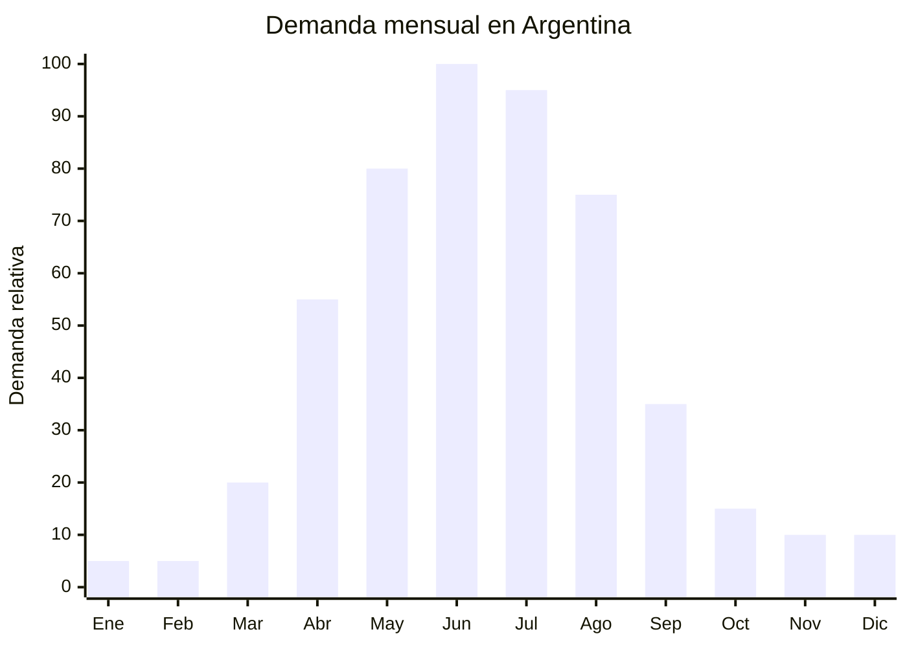

# Gorros de lana y polar para otoño

> **Capítulo NCM 65** — Sombreros y tocados | **Temporada:** Otoño (Mar–May)

## Qué es y por qué importarlo

Los gorros de lana y polar (beanies) son accesorios de abrigo para la cabeza fabricados en tejido de punto con hilados de acrílico, lana, o mezcla, generalmente con forro interior de polar (fleece) para mayor calidez. Se comercializan tanto individualmente como en sets de 2 o 3 piezas (beanie + bufanda + guantes), que es el formato que mejor se vende en Argentina.

En Argentina, la demanda de gorros de invierno crece a partir de abril y se mantiene alta hasta agosto. Los beanies son accesorios con fuerte componente de moda: los diseños lisos en colores neutros (negro, gris, beige) dominan el segmento adulto, mientras que los diseños con pompón, animales o estampados lideran el segmento infantil. En Alibaba hay más de 4,900 proveedores de beanies, lo que demuestra la amplitud de la oferta china.

Los sets (beanie + scarf + gloves) se ofrecen a FOB de USD 2.94-5.80 por set completo, mientras que en Argentina se venden entre ARS 8,000 y ARS 25,000. Sin antidumping vigente para sombreros y accesorios del capítulo 65, la barrera de entrada es baja y los márgenes son atractivos (150-350%).

## Datos clave

| Dato | Valor |
|------|-------|
| **Posiciones NCM típicas** | 6505.00.10 (gorros de punto), 6505.00.90 (demás sombreros y tocados de punto) |
| **Derecho de importación** | 20% (DIE) + 3% tasa estadística |
| **Rango FOB típico** | USD 0.80 — USD 2.50/gorro individual; USD 2.94 — USD 5.80/set (beanie+scarf+gloves) |
| **Precio de venta en Argentina** | ARS 4.000 — ARS 12.000 (individual); ARS 8.000 — ARS 25.000 (set) |
| **Margen bruto estimado** | 150% — 350% |
| **MOQ típico** | 200 — 500 unidades/sets |
| **Demanda en MercadoLibre** | Alta (estacional otoño-invierno) |
| **Competencia en MercadoLibre** | Media |
| **Dificultad para importar** | Fácil |
| **Certificaciones necesarias** | Ninguna obligatoria (IRAM 12560 recomendado pero no estrictamente requerido para accesorios) |
| **Antidumping** | No |

## Variantes y subtipos más comunes

| Subtipo / Variante | FOB aprox. | Venta AR aprox. | Nota |
|--------------------|-----------|-----------------|------|
| Beanie acrílico liso con polar interior | USD 0.80 — 1.50 | ARS 4.000 — 8.000 | **Más vendido adulto** |
| Beanie con pompón (hombre/mujer) | USD 1.00 — 2.00 | ARS 5.000 — 10.000 | Moda casual |
| Set beanie + bufanda + guantes acrílico | USD 2.94 — 4.50 | ARS 10.000 — 20.000 | **Mejor formato de venta** |
| Set beanie + bufanda + guantes premium (lana) | USD 4.00 — 5.80 | ARS 15.000 — 25.000 | Segmento alto |
| Gorro infantil diseño animal/personaje | USD 1.00 — 2.50 | ARS 4.000 — 10.000 | Regalería niños |
| Pasamontaña/balaclava polar | USD 1.00 — 2.00 | ARS 4.000 — 8.000 | Deportivo/outdoor |

## Regulaciones y requisitos

<Tabs>
  <Tab title="Certificaciones">
    | Organismo | Requiere | Detalle |
    |-----------|----------|---------|
    | ARCA (Aduana) | Sí siempre | Despacho estándar |
    | ANMAT | No | No aplica |
    | ENACOM | No | No aplica |
    | INTI | Recomendado | IRAM 12560 recomendado para accesorios textiles, pero la fiscalización es menos estricta que en prendas |

    **Recomendación:** Producto con barrera regulatoria baja. Igualmente, incluir etiqueta de composición y origen como buena práctica, ya que mejora la percepción de calidad y evita problemas eventuales.
  </Tab>

  <Tab title="Etiquetado">
    | Requisito | Aplica |
    |-----------|--------|
    | Composición | Recomendado (ej: "100% Acrílico, forro 100% Poliéster") |
    | País de origen | Sí |
    | Datos del importador | Sí |
    | Instrucciones de lavado | Recomendado |
  </Tab>

  <Tab title="Restricciones">
    - Sin restricciones significativas para gorros y accesorios de punto.
    - Gorros infantiles con cordones largos pueden ser restringidos por seguridad infantil en algunos mercados — verificar si aplica en Argentina.
    - Sin antidumping vigente para capítulo 65 (sombreros y tocados).
    - El acrílico de baja calidad puede generar picazón: verificar calidad del hilado.
  </Tab>
</Tabs>

## Logística de importación

| Factor | Detalle |
|--------|---------|
| **Peso por gorro** | 50 — 150 g |
| **Peso por set (beanie+scarf+gloves)** | 200 — 400 g |
| **Volumen** | Bajo (se comprimen bien) |
| **Unidades por caja (master carton)** | 50 — 200 gorros / 30 — 100 sets |
| **Peso por caja** | 5 — 15 kg |
| **Fragilidad** | Muy baja (textil blando) |
| **Envío recomendado** | Courier/aéreo (lotes pequeños) o marítimo LCL |
| **Tiempo total estimado** | 15-20 días (aéreo) / 50-80 días (marítimo) |

<Tip>
Los sets de 3 piezas (beanie + bufanda + guantes) tienen el mejor ratio margen/esfuerzo: se venden como un solo producto con ticket alto, pero el FOB por set es apenas USD 3-6. Un pedido de 300 sets pesa solo 60-120 kg y se puede enviar por aéreo. El formato "set regalo" se vende especialmente bien para Día del Padre (junio) y fechas especiales.
</Tip>

## Estacionalidad y timing de compra

| Dato | Valor |
|------|-------|
| **Meses de mayor venta** | Abril — Agosto (otoño-invierno) |
| **Pedido ideal (marítimo)** | Diciembre — Febrero |
| **Pedido ideal (aéreo)** | Marzo — Abril |
| **Anticipación mínima** | 2-3 meses |

## Ventajas y riesgos

<CardGroup cols={2}>
  <Card title="Ventajas" icon="circle-check">
    - Sin antidumping (capítulo 65)
    - Barrera regulatoria muy baja
    - FOB bajo con márgenes de 150-350%
    - Producto ultraliviano y compacto
    - Sets de 3 piezas = alto ticket con bajo costo
    - Más de 4,900 proveedores en Alibaba
    - Se vende también como regalo (Día del Padre, etc.)
  </Card>

  <Card title="Riesgos y desventajas" icon="triangle-exclamation">
    - Temporada limitada a otoño-invierno
    - Acrílico de baja calidad pica y genera reclamos
    - Colores que destiñen al lavar
    - Competencia con marcas deportivas (Nike, Adidas)
    - Stock sobrante hasta próximo invierno
    - Pompones que se desarman (calidad de confección)
  </Card>
</CardGroup>

## Palabras clave para buscar en Alibaba

`winter beanie hat wholesale` · `beanie scarf gloves set wholesale` · `knit hat fleece lined` · `acrylic beanie custom logo` · `winter accessories set 3 piece` · `pompom beanie wholesale Yiwu`

## Fuentes

- MercadoLibre Argentina — búsqueda "gorro lana invierno"
- Alibaba.com — proveedores de winter beanie set wholesale
- ARCA — Nomenclador Arancelario, posición 6505
- CNCE — Verificación de antidumping capítulo 65
