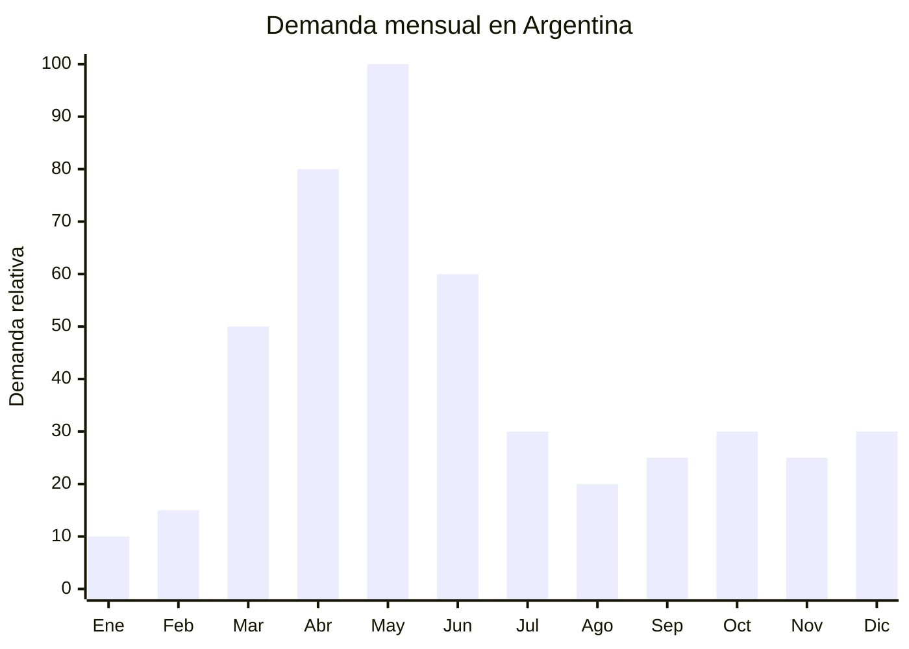

# Ramas y hojas artificiales otoñales

> **Capítulo NCM 67** — Flores artificiales y plumas | **Temporada:** Otoño (Mar–May)

## Qué es y por qué importarlo

Las ramas y hojas artificiales otoñales son elementos decorativos fabricados en seda, poliéster, plástico y alambre, que reproducen la estética del follaje de otoño: hojas de arce en tonos naranjas, rojos, ocres y dorados; ramas secas con bayas; tallos de eucalipto en tono cobre; hojas de roble marrón; y guirnaldas con mezcla de hojas multicolor. Se usan para decoración de hogares, vitrinas comerciales, eventos, bodas otoñales y fotografía.

En Argentina, la tendencia de decoración estacional ha crecido significativamente, impulsada por Instagram, Pinterest y TikTok. La estética "otoñal cálida" (warm autumn) con tonos tierra, terracota y dorado es una de las tendencias decorativas más fuertes. Los floristas, decoradores de eventos, fotógrafos de producto y tiendas de decoración son los principales compradores, junto con consumidores finales que decoran sus hogares.

China (Yiwu es el epicentro mundial de flores y follaje artificial) produce ramas otoñales a FOB de USD 0.50-3.00 por ramo/rama. En Argentina se venden entre ARS 2,000 y ARS 10,000. Sin ninguna regulación especial, sin antidumping, y con barrera de entrada prácticamente nula, es un producto ideal para importadores que buscan diversificar su catálogo decorativo.

## Datos clave

| Dato | Valor |
|------|-------|
| **Posiciones NCM típicas** | 6702.90.00 (flores, follaje y frutos artificiales de otras materias), 6702.10.00 (de plástico) |
| **Derecho de importación** | 18% (DIE) + 3% tasa estadística |
| **Rango FOB típico** | USD 0.50 — USD 3.00 por ramo/rama |
| **Precio de venta en Argentina** | ARS 2.000 — ARS 10.000 |
| **Margen bruto estimado** | 200% — 400% |
| **MOQ típico** | 100 — 500 ramos |
| **Demanda en MercadoLibre** | Media-Alta (creciente por tendencia decorativa) |
| **Competencia en MercadoLibre** | Baja-Media |
| **Dificultad para importar** | Muy Fácil |
| **Certificaciones necesarias** | Ninguna |
| **Antidumping** | No |

## Variantes y subtipos más comunes

| Subtipo / Variante | FOB aprox. | Venta AR aprox. | Nota |
|--------------------|-----------|-----------------|------|
| Rama de hojas de arce artificial (60-80 cm) | USD 0.50 — 1.00 | ARS 2.000 — 4.000 | **Más vendida** |
| Rama con bayas otoñales (holly berries) | USD 0.60 — 1.50 | ARS 2.500 — 5.000 | Decoración premium |
| Guirnalda hojas otoñales (1.5-2 m) | USD 1.50 — 3.00 | ARS 5.000 — 10.000 | Puertas, chimeneas |
| Ramo mixto hojas + bayas + flores secas | USD 1.00 — 2.50 | ARS 3.000 — 8.000 | Arreglos florales |
| Hojas de eucalipto tono cobre/dorado | USD 0.50 — 1.20 | ARS 2.000 — 5.000 | Tendencia bodas |
| Corona (wreath) decorativa otoñal | USD 2.00 — 5.00 | ARS 5.000 — 15.000 | Puerta principal, alto ticket |

## Regulaciones y requisitos

<Tabs>
  <Tab title="Certificaciones">
    | Organismo | Requiere | Detalle |
    |-----------|----------|---------|
    | ARCA (Aduana) | Sí siempre | Despacho estándar |
    | ANMAT | No | No aplica |
    | SENASA | No | No es material vegetal real |
    | ENACOM | No | No aplica |

    **Recomendación:** Producto sin barreras regulatorias. Es decoración artificial, no material vegetal real, por lo que no requiere controles fitosanitarios de SENASA.
  </Tab>

  <Tab title="Etiquetado">
    | Requisito | Aplica |
    |-----------|--------|
    | País de origen | Sí |
    | Datos del importador | Sí |
    | Material de fabricación | Recomendado (seda, poliéster, plástico) |
  </Tab>

  <Tab title="Restricciones">
    - Sin restricciones significativas para follaje artificial.
    - Verificar que las ramas con alambre interno no tengan puntas expuestas que puedan causar lesiones.
    - Algunos tintes de baja calidad pueden manchar superficies (verificar solidez del color).
    - Sin antidumping vigente.
  </Tab>
</Tabs>

## Logística de importación

| Factor | Detalle |
|--------|---------|
| **Peso por ramo/rama** | 30 — 150 g |
| **Volumen por unidad** | Medio-Alto (las ramas no se comprimen mucho) |
| **Unidades por caja (master carton)** | 20 — 100 ramos |
| **Peso por caja** | 3 — 10 kg |
| **Fragilidad** | Media (hojas y pétalos pueden aplastarse) |
| **Requiere embalaje especial** | Sí — cajas con separadores para evitar aplastamiento |
| **Envío recomendado** | Marítimo LCL (el volumen importa más que el peso) |

<Tip>
El follaje artificial es liviano pero voluminoso: ocupa más espacio del que pesa. Esto significa que en envíos marítimos se cobra por volumen, no por peso. Para optimizar, pedir al proveedor que comprima los ramos lo máximo posible sin dañar las hojas, y usar cajas ajustadas. Un primer pedido de 200-300 ramos puede enviarse por courier si se comprimen bien.
</Tip>

## Estacionalidad y timing de compra

| Dato | Valor |
|------|-------|
| **Meses de mayor venta** | Marzo — Junio (otoño pleno, pico en mayo) |
| **Pedido ideal (marítimo)** | Noviembre — Enero |
| **Pedido ideal (aéreo)** | Febrero — Marzo |
| **Anticipación mínima** | 2-3 meses |

## Ventajas y riesgos

<CardGroup cols={2}>
  <Card title="Ventajas" icon="circle-check">
    - Sin regulaciones ni certificaciones
    - Sin antidumping
    - Tendencia decorativa en crecimiento (redes sociales)
    - Competencia baja en MercadoLibre
    - Producto reutilizable (no se marchita como las flores reales)
    - Yiwu ofrece variedad inmensa y precios muy bajos
    - Se vende todo el año para eventos y bodas
  </Card>

  <Card title="Riesgos y desventajas" icon="triangle-exclamation">
    - Producto voluminoso: flete se cobra por volumen
    - Hojas y pétalos se aplastan en transporte
    - Tintes de baja calidad pueden manchar
    - Mercado aún en desarrollo en Argentina (menor que en EE.UU./Europa)
    - Ticket medio-bajo por unidad
    - Requiere buenas fotos de producto para vender online
  </Card>
</CardGroup>

## Palabras clave para buscar en Alibaba

`artificial autumn leaves branch` · `fall foliage artificial wholesale` · `maple leaf branch artificial` · `autumn wreath artificial` · `fake autumn leaves garland` · `artificial berry branch fall Yiwu`

## Fuentes

- MercadoLibre Argentina — búsqueda "hojas artificiales otoño decoración"
- Alibaba.com — proveedores de artificial autumn leaves wholesale
- Pinterest/Instagram — tendencias de decoración otoñal
- ARCA — Nomenclador Arancelario, posición 6702
