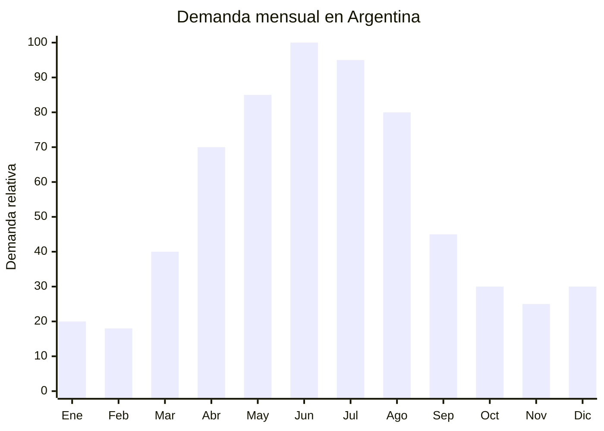

# Fuentes y cazuelas refractarias para horno

> **Capítulo NCM 69** — Productos cerámicos | **Temporada:** Otoño (Mar–May)

## Qué es y por qué importarlo

Las fuentes y cazuelas refractarias de cerámica son recipientes aptos para horno diseñados para cocinar y servir directamente en la mesa. Fabricadas en stoneware o cerámica vitrificada, resisten temperaturas de hasta 250-300°C y soportan el choque térmico moderado (no pasar de congelador a horno directo). Se usan para guisos, gratinados, lasañas, tartas, asados y postres horneados.

Con la llegada del otoño en Argentina (marzo-mayo), la cocina de horno se convierte en protagonista: los guisos, las cazuelas de lentejas, los gratinados de papa y los budines reemplazan a las ensaladas y asados al aire libre del verano. La demanda de fuentes refractarias acompaña este cambio estacional y se mantiene alta hasta agosto. En MercadoLibre, las búsquedas de "fuente para horno", "cazuela refractaria" y "bandeja cerámica horno" crecen consistentemente en otoño-invierno.

Chaozhou (Guangdong) es el principal centro productor de cerámica refractaria para cocina, con fábricas que ofrecen líneas completas de fuentes ovaladas, rectangulares, redondas y cazuelas con tapa. Los precios FOB de USD 2 a USD 8 por pieza permiten márgenes muy atractivos, especialmente en sets de 3 o 4 piezas que se venden a precios significativamente mayores.

## Datos clave

| Dato | Valor |
|------|-------|
| **Posiciones NCM típicas** | 6912.00.00 (vajilla y artículos de uso doméstico, de cerámica excepto porcelana) |
| **Derecho de importación** | 18% (DIE) + 3% tasa estadística |
| **Rango FOB típico** | USD 2.00 — USD 8.00 por pieza |
| **Precio de venta en Argentina** | ARS 8.000 — ARS 35.000 (unitaria) / ARS 20.000 — ARS 60.000 (sets) |
| **Margen bruto estimado** | 150% — 300% |
| **MOQ típico** | 300 — 1,000 unidades |
| **Demanda en MercadoLibre** | Media-Alta |
| **Competencia en MercadoLibre** | Media |
| **Dificultad para importar** | Moderada (producto pesado y frágil) |
| **Certificaciones necesarias** | Ninguna obligatoria. Recomendable certificado food grade |
| **Antidumping** | No |

## Variantes y subtipos más comunes

| Subtipo / Variante | FOB aprox. | Venta AR aprox. | Nota |
|--------------------|-----------|-----------------|------|
| Fuente rectangular 30x20cm | USD 2.00 — 3.50 | ARS 8.000 — 15.000 | **Más vendida**, lasañas y gratinados |
| Fuente ovalada 35cm | USD 2.50 — 4.00 | ARS 10.000 — 18.000 | Asados, pollos |
| Cazuela redonda con tapa 22-25cm | USD 3.50 — 6.00 | ARS 12.000 — 25.000 | Guisos, estofados |
| Set x3 fuentes (S, M, L) | USD 5.00 — 8.00 | ARS 20.000 — 35.000 | Alto ticket, formato regalo |
| Ramequines individuales x6 (10cm) | USD 2.00 — 4.00 | ARS 8.000 — 15.000 | Soufflés, crème brûlée |
| Fuente con asas y tapa cerámica | USD 4.00 — 8.00 | ARS 15.000 — 35.000 | Premium, presentación mesa |

## Regulaciones y requisitos

<Tabs>
  <Tab title="Certificaciones">
    | Organismo | Requiere | Detalle |
    |-----------|----------|---------|
    | ARCA (Aduana) | Sí siempre | Despacho estándar |
    | ANMAT | No obligatorio | No es envase de alimento procesado industrial. Recomendable certificado food grade |
    | ENACOM | No | No es electrónico |
    | SENASA | No | No es alimento |
    | INTI | No obligatorio | No existe norma IRAM obligatoria específica |

    **Recomendación:** Solicitar al proveedor certificado de resistencia térmica (especificando temperatura máxima de uso), test de migración de plomo y cadmio (norma FDA CFR 21 §4.1 o EU 84/500/EEC), y certificado de resistencia al choque térmico. Estos documentos son esenciales para respaldar las claims de "apto horno" en el etiquetado.
  </Tab>

  <Tab title="Etiquetado">
    | Requisito | Aplica |
    |-----------|--------|
    | País de origen | Sí |
    | Datos del importador | Sí (nombre, dirección, CUIT) |
    | Material | Recomendable ("Cerámica refractaria" / "Stoneware") |
    | Temperatura máxima | **Muy recomendable** ("Apto horno hasta 250°C") |
    | Instrucciones de uso | Sí ("No exponer a cambio térmico brusco") |
    | Apto lavavajillas/microondas | Recomendable indicar |
  </Tab>

  <Tab title="Restricciones">
    - Sin medidas antidumping vigentes.
    - Sin restricciones específicas de importación para cerámica de cocina.
    - Si se declara "refractaria" o "apto horno", el producto DEBE efectivamente resistir las temperaturas indicadas. Publicidad engañosa puede generar reclamos serios si una pieza se quiebra en el horno.
    - Cuidado con esmaltes con plomo en el interior de la fuente (zona de contacto con alimentos).
  </Tab>
</Tabs>

## Logística de importación

| Factor | Detalle |
|--------|---------|
| **Peso por unidad** | 0.8 — 2.5 kg |
| **Volumen por unidad** | 2,000 — 6,000 cm³ (con protección) |
| **Unidades por caja (master carton)** | 6 — 12 unidades |
| **Peso por caja** | 10 — 25 kg |
| **Cajas por contenedor 20'** | ~600 — 1,000 cajas |
| **Unidades por contenedor 20'** | ~5,000 — 10,000 unidades |
| **Fragilidad** | **Alta** — cerámica gruesa pero frágil |
| **Requiere embalaje especial** | Sí — foam individual + separadores + doble pared cartón + esquineros |

<Tip>
Las fuentes refractarias son más pesadas que los mugs (hasta 2.5 kg por pieza). El flete se calculará por peso bruto casi seguro. Solicitar "inner box + master carton" (caja individual dentro de caja master) para minimizar rotura. Considerar importar sets en una sola caja, que reducen el costo de embalaje por pieza y permiten un precio de venta mayor.
</Tip>

## Estacionalidad y timing de compra

| Dato | Valor |
|------|-------|
| **Meses de mayor venta** | Marzo — Agosto (otoño-invierno) |
| **Pedido ideal (marítimo)** | Diciembre — Enero (para llegar en marzo-abril) |
| **Pedido ideal (aéreo)** | No recomendable — peso y fragilidad |
| **Anticipación mínima** | 3 meses antes del pico |

## Ventajas y riesgos

<CardGroup cols={2}>
  <Card title="Ventajas" icon="circle-check">
    - Márgenes atractivos (150-300%), especialmente en sets
    - Sin certificaciones obligatorias (barrera baja)
    - Sin antidumping vigente
    - Personalización total en Chaozhou (color, forma, logo)
    - Producto funcional + decorativo = alto valor percibido
    - Sets de 3 piezas permiten ticket alto
    - Demanda predecible y estacional
  </Card>

  <Card title="Riesgos y desventajas" icon="triangle-exclamation">
    - **Muy frágil** — riesgo de rotura significativo en transporte
    - Producto pesado = flete alto por unidad
    - Aéreo inviable por peso y fragilidad
    - Riesgo de choque térmico si la calidad cerámica es baja
    - Reclamos por roturas en horno si no es genuinamente refractaria
    - Competencia con marcas locales (Biona, Tramontina cerámica)
  </Card>
</CardGroup>

## Palabras clave para buscar en Alibaba

`ceramic baking dish wholesale` · `stoneware casserole with lid` · `oven safe ceramic dish Chaozhou` · `rectangular baking pan ceramic` · `ceramic ramekin set wholesale` · `ovenproof stoneware set OEM`

## Fuentes

- MercadoLibre Argentina — búsqueda "fuente refractaria cerámica", "cazuela horno"
- Alibaba.com — proveedores de ceramic baking dish Chaozhou
- Nomenclador Arancelario Argentino — partida 6912.00.00
