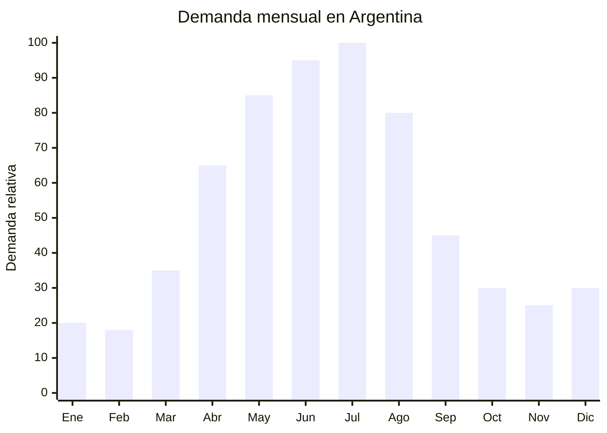

# Tazones y mugs stoneware grandes

> **Capítulo NCM 69** — Productos cerámicos | **Temporada:** Otoño (Mar–May)

## Qué es y por qué importarlo

Los tazones y mugs de stoneware (gres cerámico) de 350 a 500 ml son las tazas grandes diseñadas para bebidas calientes de consumo prolongado: café con leche, chocolate caliente, té con leche, cappuccino o sopas instantáneas. Se diferencian de las tazas estándar (200-250 ml) por su capacidad generosa y su estética "cozy" que invita a abrazar la taza con ambas manos. El material stoneware se cuece a temperaturas superiores a 1200°C, lo que produce piezas densas, resistentes y con excelente retención térmica.

En Argentina, la demanda de mugs grandes se dispara entre abril y agosto con la llegada del frío. El ritual del chocolate caliente, el café de media tarde y las infusiones ganan protagonismo, y el consumidor busca tazas con mayor capacidad y diseños atractivos. En MercadoLibre, las búsquedas de "tazón grande", "mug cerámico" y "taza 500ml" crecen sostenidamente cada otoño.

Chaozhou (Guangdong, China) es la capital mundial de la cerámica de mesa, con miles de fábricas especializadas en mugs, tazones y vajilla de stoneware. Ofrecen personalización completa: forma, esmalte, color, diseño impreso o en relieve, y packaging. Los precios FOB desde USD 0.80 por unidad permiten márgenes muy atractivos considerando que en Argentina estos mugs se venden entre ARS 4,000 y ARS 15,000.

## Datos clave

| Dato | Valor |
|------|-------|
| **Posiciones NCM típicas** | 6912.00.00 (vajilla y demás artículos de uso doméstico, de cerámica excepto porcelana) |
| **Derecho de importación** | 18% (DIE) + 3% tasa estadística |
| **Rango FOB típico** | USD 0.80 — USD 3.00 por unidad |
| **Precio de venta en Argentina** | ARS 4.000 — ARS 15.000 |
| **Margen bruto estimado** | 150% — 350% |
| **MOQ típico** | 500 — 1,000 unidades |
| **Demanda en MercadoLibre** | Media-Alta |
| **Competencia en MercadoLibre** | Media |
| **Dificultad para importar** | Baja-Moderada (producto frágil) |
| **Certificaciones necesarias** | Ninguna obligatoria. Recomendable certificado food grade (FDA/LFGB) |
| **Antidumping** | No |

## Variantes y subtipos más comunes

| Subtipo / Variante | FOB aprox. | Venta AR aprox. | Nota |
|--------------------|-----------|-----------------|------|
| Mug stoneware liso 350ml | USD 0.80 — 1.20 | ARS 4.000 — 7.000 | Entrada, mayor volumen |
| Mug stoneware 500ml con diseño impreso | USD 1.00 — 1.80 | ARS 5.000 — 10.000 | **Más vendido** |
| Tazón sopero con asa 500ml | USD 1.20 — 2.00 | ARS 6.000 — 11.000 | Sopas, guisos, cereales |
| Mug con tapa y cuchara | USD 1.50 — 2.50 | ARS 7.000 — 12.000 | Set completo, formato regalo |
| Mug en relieve 3D (animales, formas) | USD 2.00 — 3.00 | ARS 8.000 — 15.000 | Mayor valor percibido |
| Set x2 o x4 mugs en caja regalo | USD 3.00 — 8.00 | ARS 12.000 — 30.000 | Alto ticket, regalería |

## Regulaciones y requisitos

<Tabs>
  <Tab title="Certificaciones">
    | Organismo | Requiere | Detalle |
    |-----------|----------|---------|
    | ARCA (Aduana) | Sí siempre | Despacho estándar |
    | ANMAT | No obligatorio | No es envase de alimento procesado. Recomendable certificado food grade |
    | ENACOM | No | No es electrónico |
    | SENASA | No | No es alimento |
    | INTI | No obligatorio | No existe norma IRAM específica para tazas cerámicas |

    **Recomendación:** Solicitar al proveedor certificado de migración de metales pesados (plomo y cadmio) según norma FDA o LFGB europea. Los esmaltes cerámicos de baja calidad pueden liberar plomo, especialmente en colores rojos, amarillos y naranjas intensos. Un certificado SGS o Intertek de food safety es una inversión mínima que protege la marca.
  </Tab>

  <Tab title="Etiquetado">
    | Requisito | Aplica |
    |-----------|--------|
    | País de origen | Sí |
    | Datos del importador | Sí (nombre, dirección, CUIT) |
    | Material | Recomendable ("Cerámica stoneware") |
    | Apto microondas/lavavajillas | Recomendable indicar |
    | Capacidad | Recomendable indicar en ml |
  </Tab>

  <Tab title="Restricciones">
    - Sin medidas antidumping vigentes para cerámica de mesa.
    - Sin restricciones específicas de importación.
    - Cuidado con esmaltes con plomo: si un laboratorio detecta plomo por encima de límites, el producto puede ser retenido.
    - Los mugs con diseños de marcas registradas (Disney, Marvel, etc.) requieren licencia — NO importar réplicas.
  </Tab>
</Tabs>

## Logística de importación

| Factor | Detalle |
|--------|---------|
| **Peso por unidad** | 300 — 600 g |
| **Volumen por unidad** | 800 — 1,500 cm³ (con protección) |
| **Unidades por caja (master carton)** | 24 — 48 unidades |
| **Peso por caja** | 12 — 25 kg |
| **Cajas por contenedor 20'** | ~800 — 1,200 cajas |
| **Unidades por contenedor 20'** | ~25,000 — 50,000 unidades |
| **Fragilidad** | **Alta** — cerámica |
| **Requiere embalaje especial** | Sí — cada mug en foam sleeve + separadores internos en caja + doble pared de cartón |

<Tip>
La cerámica es pesada y frágil: doble riesgo logístico. El flete se cobra por peso (no volumen) y la rotura puede alcanzar 3-8% si el embalaje es deficiente. Exigir al proveedor "export packing" con foam individual por pieza, separadores corrugados y esquineros de cartón. Pedir fotos del embalaje antes de embarcar. Considerar un seguro de transporte que cubra rotura.
</Tip>

## Estacionalidad y timing de compra

| Dato | Valor |
|------|-------|
| **Meses de mayor venta** | Abril — Agosto (otoño-invierno) |
| **Pedido ideal (marítimo)** | Enero — Febrero (para llegar en abril) |
| **Pedido ideal (aéreo)** | No recomendable — peso y fragilidad hacen inviable el aéreo |
| **Anticipación mínima** | 3 meses antes del pico |

## Ventajas y riesgos

<CardGroup cols={2}>
  <Card title="Ventajas" icon="circle-check">
    - Márgenes atractivos (150-350%)
    - Chaozhou ofrece personalización total a bajo costo
    - Sin certificaciones obligatorias (barrera baja)
    - Producto decorativo + funcional = alta percepción de valor
    - Ideal para marca propia y sets de regalo
    - Sin antidumping
    - Demanda predecible y estacional
  </Card>

  <Card title="Riesgos y desventajas" icon="triangle-exclamation">
    - **Alta fragilidad** — riesgo de rotura en transporte (3-8%)
    - Producto pesado = flete relativamente alto por unidad
    - Aéreo inviable por peso y fragilidad
    - Esmaltes baratos pueden contener plomo
    - Competencia con marcas locales y bazares chinos establecidos
    - Colores de pantalla vs. realidad: pedir muestras físicas
  </Card>
</CardGroup>

## Palabras clave para buscar en Alibaba

`stoneware mug 500ml wholesale` · `ceramic mug large custom logo` · `coffee mug 350ml Chaozhou` · `ceramic mug with lid and spoon` · `stoneware soup mug with handle` · `custom printed ceramic mug OEM`

## Fuentes

- MercadoLibre Argentina — búsqueda "tazón grande cerámica", "mug 500ml"
- Alibaba.com — proveedores de stoneware mug wholesale Chaozhou
- Nomenclador Arancelario Argentino — partida 6912.00.00
