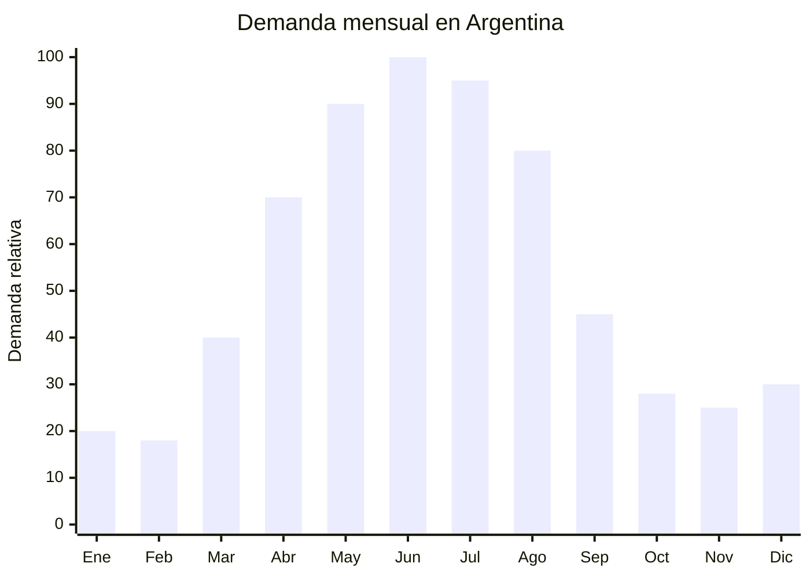

# Tazas de vidrio doble pared (borosilicato)

> **Capítulo NCM 70** — Vidrio y sus manufacturas | **Temporada:** Otoño (Mar–May)

## Qué es y por qué importarlo

Las tazas de vidrio doble pared son recipientes fabricados con vidrio borosilicato soplado artesanalmente, compuestos por dos capas de vidrio con una cámara de aire entre ellas que actúa como aislante térmico. Este diseño mantiene la bebida caliente por más tiempo sin que el exterior queme las manos, y genera un efecto visual llamativo donde el líquido parece "flotar" dentro de la taza. Las capacidades más populares son 80 ml (espresso), 250 ml (cappuccino) y 350-450 ml (latte/café con leche).

La demanda en Argentina crece fuertemente entre marzo y agosto, impulsada por la cultura del café especial y la tendencia barista que ha ganado tracción significativa. Marcas como Larhaus con su línea Barista Doppio se posicionaron entre los productos más vendidos del rubro tazas en 2024, validando la aceptación del formato doble pared en el mercado local. En MercadoLibre, las búsquedas de "taza doble vidrio", "vaso doble pared" y "taza borosilicato" tienen tendencia creciente.

Hebei (especialmente Hejian) es el principal centro productor mundial de vidrio borosilicato para uso doméstico. Las fábricas locales producen tazas doble pared en volúmenes masivos con precios FOB desde USD 1.00 por unidad. La clave está en el control de calidad: la uniformidad del grosor de ambas paredes y el sellado hermético de la cámara de aire determinan la durabilidad del producto.

## Datos clave

| Dato | Valor |
|------|-------|
| **Posiciones NCM típicas** | 7013.37.00 (vasos para beber, de vitrocerámica) / 7013.49.00 (artículos de vidrio para servicio de mesa) |
| **Derecho de importación** | 18% (DIE) + 3% tasa estadística |
| **Rango FOB típico** | USD 1.00 — USD 4.00 por unidad |
| **Precio de venta en Argentina** | ARS 3.000 — ARS 12.000 (unitaria) / ARS 8.000 — ARS 25.000 (set x2) |
| **Margen bruto estimado** | 150% — 300% |
| **MOQ típico** | 500 — 2,000 unidades |
| **Demanda en MercadoLibre** | Media-Alta (tendencia creciente) |
| **Competencia en MercadoLibre** | Media |
| **Dificultad para importar** | Moderada (producto **muy frágil**) |
| **Certificaciones necesarias** | Ninguna obligatoria. Recomendable certificado food grade |
| **Antidumping** | No |

## Variantes y subtipos más comunes

| Subtipo / Variante | FOB aprox. | Venta AR aprox. | Nota |
|--------------------|-----------|-----------------|------|
| Taza doble pared espresso 80ml | USD 1.00 — 1.80 | ARS 3.000 — 6.000 | Set x2, baristas |
| Taza doble pared cappuccino 250ml | USD 1.20 — 2.50 | ARS 4.000 — 9.000 | **Más vendida** |
| Taza doble pared latte 350-450ml | USD 1.50 — 3.00 | ARS 5.000 — 12.000 | Formato grande otoño |
| Vaso doble pared sin asa 350ml | USD 1.00 — 2.00 | ARS 3.500 — 8.000 | Moderno, cerveza artesanal |
| Set x2 tazas doble pared en caja | USD 3.00 — 6.00 | ARS 8.000 — 20.000 | Formato regalo |
| Taza doble pared con tapa bambú | USD 2.00 — 4.00 | ARS 6.000 — 15.000 | Estilo travel mug |

## Regulaciones y requisitos

<Tabs>
  <Tab title="Certificaciones">
    | Organismo | Requiere | Detalle |
    |-----------|----------|---------|
    | ARCA (Aduana) | Sí siempre | Despacho estándar |
    | ANMAT | No obligatorio | No es envase de alimento procesado |
    | ENACOM | No | No es electrónico |
    | SENASA | No | No es alimento |
    | INTI | No obligatorio | Sin norma IRAM específica |

    **Recomendación:** Solicitar certificado de vidrio borosilicato (composición química, resistencia térmica 400°C+), test de resistencia al choque térmico (de -20°C a 150°C) y certificado food grade. El vidrio borosilicato genuino resiste cambios bruscos de temperatura; el vidrio sódico-cálcico común NO.
  </Tab>

  <Tab title="Etiquetado">
    | Requisito | Aplica |
    |-----------|--------|
    | País de origen | Sí |
    | Datos del importador | Sí (nombre, dirección, CUIT) |
    | Material | Recomendable ("Vidrio borosilicato") |
    | Capacidad | Recomendable indicar en ml |
    | Instrucciones de uso | Recomendable ("Apto microondas, lavavajillas") |
    | Resistencia térmica | Recomendable indicar |
  </Tab>

  <Tab title="Restricciones">
    - Sin medidas antidumping vigentes para vidrio de mesa.
    - Sin restricciones específicas.
    - Verificar que sea genuinamente borosilicato (alto boro) y no vidrio común soplado con aspecto doble pared. El vidrio común se quiebra con cambios térmicos.
    - NO importar con marcas registradas (Bodum es marca registrada — no usar en publicaciones).
  </Tab>
</Tabs>

## Logística de importación

| Factor | Detalle |
|--------|---------|
| **Peso por unidad** | 150 — 350 g |
| **Volumen por unidad** | 600 — 1,500 cm³ (con protección) |
| **Unidades por caja (master carton)** | 12 — 36 unidades |
| **Peso por caja** | 4 — 10 kg |
| **Cajas por contenedor 20'** | ~1,000 — 2,000 cajas |
| **Unidades por contenedor 20'** | ~20,000 — 50,000 unidades |
| **Fragilidad** | **Muy alta** — vidrio soplado de doble pared, extremadamente delicado |
| **Requiere embalaje especial** | **Sí — crítico.** Foam individual por taza, separadores corrugados, caja individual + master carton con refuerzo |

<Tip>
Las tazas de doble pared de vidrio son uno de los productos más frágiles de importar. La rotura puede llegar al 5-15% si el embalaje no es excelente. Solicitar al proveedor "export standard packing" con foam moldeado individual para cada taza, y exigir fotos y video del embalaje antes de embarcar. Considerar contratar inspección pre-embarque con SGS o similar. Un seguro de transporte con cobertura de rotura es indispensable.
</Tip>

## Estacionalidad y timing de compra

| Dato | Valor |
|------|-------|
| **Meses de mayor venta** | Abril — Agosto (otoño-invierno) |
| **Pedido ideal (marítimo)** | Enero — Febrero (para llegar en abril) |
| **Pedido ideal (aéreo)** | No recomendable — fragilidad extrema |
| **Anticipación mínima** | 3 meses antes del pico |

## Ventajas y riesgos

<CardGroup cols={2}>
  <Card title="Ventajas" icon="circle-check">
    - Tendencia barista en crecimiento sostenido
    - Alta percepción de valor (producto "premium")
    - Sin certificaciones obligatorias
    - Sin antidumping
    - Margen 150-300%
    - Ideal para sets de regalo
    - Efecto visual "wow" que impulsa compra por impulso
  </Card>

  <Card title="Riesgos y desventajas" icon="triangle-exclamation">
    - **Fragilidad extrema** — rotura potencial 5-15%
    - Embalaje especial encarece logística
    - Aéreo inviable por fragilidad
    - Riesgo de recibir vidrio común en vez de borosilicato
    - Competencia con marcas establecidas (Larhaus, Bodum)
    - Reclamos por rotura en uso si la calidad es baja
  </Card>
</CardGroup>

## Palabras clave para buscar en Alibaba

`double wall glass cup borosilicate` · `double wall coffee mug wholesale` · `borosilicate glass cup 250ml` · `double wall latte cup set` · `Hejian glass cup factory` · `insulated glass mug wholesale OEM`

## Fuentes

- MercadoLibre Argentina — búsqueda "taza doble pared vidrio", "vaso doble vidrio"
- Alibaba.com — proveedores de double wall glass cup Hebei/Hejian
- Nomenclador Arancelario Argentino — partida 7013
