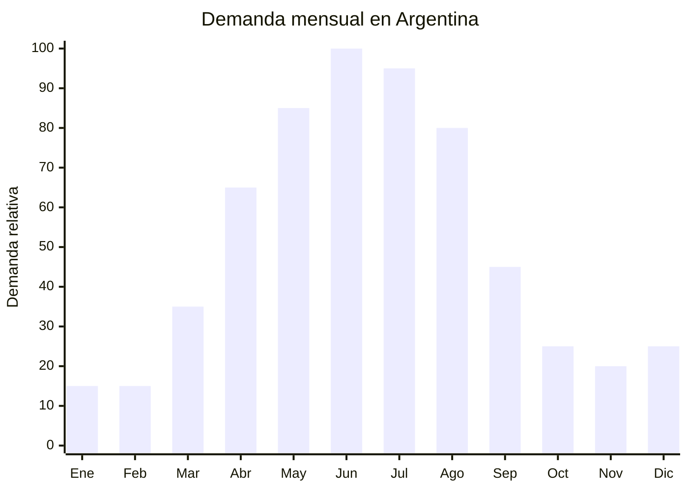

# Teteras de vidrio borosilicato con infusor

> **Capítulo NCM 70** — Vidrio y sus manufacturas | **Temporada:** Otoño (Mar–May)

## Qué es y por qué importarlo

Las teteras de vidrio borosilicato con infusor integrado de acero inoxidable son el recipiente ideal para preparar y servir té de hojas sueltas. Combinan un cuerpo transparente de vidrio resistente al calor (que permite ver la infusión y el despliegue de las hojas) con un filtro cilíndrico removible de acero inoxidable 304 que separa las hojas del líquido. Las capacidades más comunes son 600 ml (2-3 tazas), 800 ml (3-4 tazas) y 1,000-1,200 ml (5-6 tazas).

El consumo de té en Argentina crece sostenidamente, impulsado por la tendencia wellness, el interés en tés especiales (matcha, chai, rooibos, infusiones herbales) y la cultura de la merienda otoño-invernal. Entre abril y agosto, cuando las tardes se acortan y bajan las temperaturas, el ritual del té gana protagonismo. La tetera de vidrio con infusor transforma una preparación cotidiana en una experiencia visual y aromática.

Las fábricas de Hebei y Zhejiang (China) producen teteras de vidrio borosilicato en todas las capacidades y diseños, con precios FOB desde USD 2.50 por unidad. La combinación de vidrio borosilicato + acero inoxidable 304 + tapa de bambú o acero es la más popular. El desafío principal es la logística: el vidrio es extremadamente frágil y requiere packaging reforzado obligatorio.

## Datos clave

| Dato | Valor |
|------|-------|
| **Posiciones NCM típicas** | 7013.49.00 (artículos de vidrio para servicio de mesa, los demás) |
| **Derecho de importación** | 18% (DIE) + 3% tasa estadística |
| **Rango FOB típico** | USD 2.50 — USD 6.00 por unidad |
| **Precio de venta en Argentina** | ARS 5.000 — ARS 18.000 |
| **Margen bruto estimado** | 100% — 250% |
| **MOQ típico** | 500 — 1,000 unidades |
| **Demanda en MercadoLibre** | Media |
| **Competencia en MercadoLibre** | Media-Baja |
| **Dificultad para importar** | Moderada-Alta (producto **muy frágil**) |
| **Certificaciones necesarias** | Ninguna obligatoria. Recomendable food grade |
| **Antidumping** | No |

## Variantes y subtipos más comunes

| Subtipo / Variante | FOB aprox. | Venta AR aprox. | Nota |
|--------------------|-----------|-----------------|------|
| Tetera vidrio 600ml con infusor inox | USD 2.50 — 3.50 | ARS 5.000 — 10.000 | Para 2-3 tazas |
| Tetera vidrio 800ml con infusor inox | USD 3.00 — 4.00 | ARS 7.000 — 12.000 | **Más vendida** |
| Tetera vidrio 1200ml con infusor inox | USD 3.50 — 5.00 | ARS 8.000 — 15.000 | Familiar, reuniones |
| Tetera con tapa de bambú | USD 3.50 — 5.00 | ARS 8.000 — 15.000 | Estética premium |
| Tetera con calentador (base vela) | USD 5.00 — 8.00 | ARS 12.000 — 22.000 | Set completo |
| Tetera con vaso doble pared x2 (set) | USD 6.00 — 10.00 | ARS 15.000 — 30.000 | Formato regalo premium |

## Regulaciones y requisitos

<Tabs>
  <Tab title="Certificaciones">
    | Organismo | Requiere | Detalle |
    |-----------|----------|---------|
    | ARCA (Aduana) | Sí siempre | Despacho estándar |
    | ANMAT | No obligatorio | No es envase de alimento procesado |
    | ENACOM | No | No es electrónico |
    | SENASA | No | No es alimento |
    | INTI | No obligatorio | Sin norma IRAM específica |

    **Recomendación:** Solicitar certificado de vidrio borosilicato (resistencia térmica 400°C+), certificado food grade del acero inoxidable del infusor (AISI 304), y test de resistencia al choque térmico. Verificar que el bambú (si aplica) tenga tratamiento anti-moho food safe.
  </Tab>

  <Tab title="Etiquetado">
    | Requisito | Aplica |
    |-----------|--------|
    | País de origen | Sí |
    | Datos del importador | Sí (nombre, dirección, CUIT) |
    | Materiales | Recomendable ("Vidrio borosilicato, acero inoxidable 304") |
    | Capacidad | Sí, indicar en ml |
    | Instrucciones de uso | Recomendable ("Apto fuego directo: NO. Apto microondas: SÍ sin infusor") |
    | Precauciones | Recomendable ("No usar sobre fuego directo") |
  </Tab>

  <Tab title="Restricciones">
    - Sin medidas antidumping vigentes.
    - Sin restricciones específicas.
    - **Importante:** Las teteras de vidrio borosilicato NO son aptas para fuego directo (hornalla). Si se publicitan como tales y se quiebran, hay responsabilidad del importador.
    - Verificar que el infusor sea genuino acero inoxidable 304 y no acero cromado.
  </Tab>
</Tabs>

## Logística de importación

| Factor | Detalle |
|--------|---------|
| **Peso por unidad** | 350 — 700 g (con infusor) |
| **Volumen por unidad** | 1,500 — 4,000 cm³ (con caja) |
| **Unidades por caja (master carton)** | 6 — 12 unidades |
| **Peso por caja** | 5 — 8 kg |
| **Cajas por contenedor 20'** | ~1,500 — 2,500 cajas |
| **Unidades por contenedor 20'** | ~12,000 — 25,000 unidades |
| **Fragilidad** | **Muy alta** — vidrio con boquilla y asa son puntos débiles |
| **Requiere embalaje especial** | **Sí — CRÍTICO.** Caja individual con foam moldeado + master carton reforzado |

<Tip>
La tetera de vidrio tiene puntos de estrés en la unión del asa y la boquilla con el cuerpo. Estas zonas son donde más se producen las roturas. Solicitar embalaje con foam moldeado que envuelva completamente la pieza, incluyendo asa y pico. Exigir "drop test certificate" al proveedor (prueba de caída a 60 cm). Contratar seguro de transporte con cobertura de rotura es indispensable.
</Tip>

## Estacionalidad y timing de compra

| Dato | Valor |
|------|-------|
| **Meses de mayor venta** | Abril — Agosto (otoño-invierno) |
| **Pedido ideal (marítimo)** | Enero — Febrero (para llegar en abril) |
| **Pedido ideal (aéreo)** | No recomendable — fragilidad extrema |
| **Anticipación mínima** | 3 meses antes del pico |

## Ventajas y riesgos

<CardGroup cols={2}>
  <Card title="Ventajas" icon="circle-check">
    - Tendencia wellness y té especial en crecimiento
    - Producto con alta percepción de valor
    - Competencia baja en MercadoLibre
    - Sin certificaciones obligatorias
    - Sin antidumping
    - Ideal para marca propia y regalería
    - Complementa venta de tés de hojas sueltas
  </Card>

  <Card title="Riesgos y desventajas" icon="triangle-exclamation">
    - **Fragilidad extrema** — rotura potencial alta
    - Embalaje especial encarece significativamente
    - Aéreo inviable por fragilidad
    - Producto voluminoso para su valor
    - Mercado de nicho (no masivo como mugs cerámicos)
    - Repuestos de infusor difíciles de conseguir localmente
  </Card>
</CardGroup>

## Palabras clave para buscar en Alibaba

`glass teapot with infuser wholesale` · `borosilicate glass teapot 800ml` · `glass tea pot stainless steel filter` · `glass teapot bamboo lid` · `tea set glass teapot cups wholesale` · `Hejian glass teapot factory`

## Fuentes

- MercadoLibre Argentina — búsqueda "tetera vidrio infusor", "tetera borosilicato"
- Alibaba.com — proveedores de glass teapot with infuser
- Nomenclador Arancelario Argentino — partida 7013.49.00
