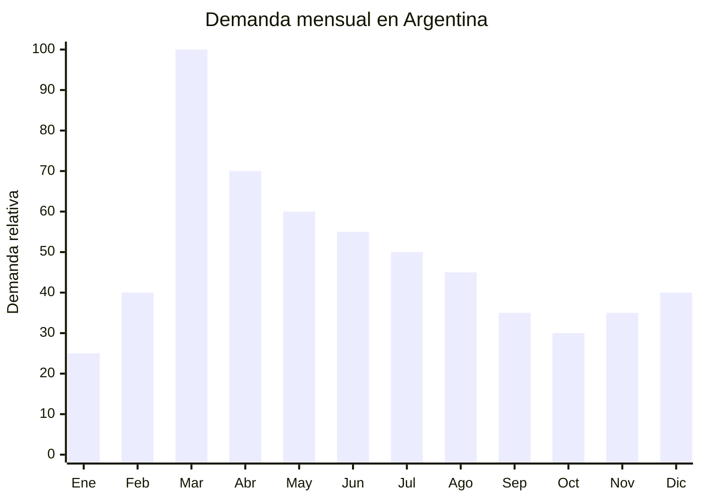

# Pins esmaltados de metal (enamel pins)

> **Capítulo NCM 71** — Perlas, piedras preciosas, metales preciosos y manufacturas; bisutería | **Temporada:** Otoño (Mar–May)

## Qué es y por qué importarlo

Los pins esmaltados (enamel pins) son pequeños accesorios decorativos de metal (generalmente aleación de zinc o hierro) con diseños rellenos de esmalte de colores, que se sujetan a mochilas, camperas, gorras, solapas y bolsos mediante un alfiler con tope de goma o mariposa metálica. Son una forma de expresión personal, especialmente popular entre jóvenes y adolescentes. Los tipos principales son soft enamel (textura en relieve) y hard enamel (superficie lisa y plana).

En Argentina, el pico de demanda se concentra en marzo con la vuelta a clases: los estudiantes personalizan sus mochilas y camperas nuevas con pins temáticos. Pero la demanda se mantiene durante todo el otoño como accesorio de ropa de abrigo. El mercado de pins tiene un fuerte componente de coleccionismo y comunidad (fandoms, bandas musicales, causas sociales, humor).

Yiwu y Dongguan (China) son los principales centros de producción de enamel pins, ofreciendo personalización total con MOQ sorprendentemente bajo (desde 50-100 unidades por diseño). Esto abre una oportunidad enorme para crear marca propia con diseños exclusivos. Los precios FOB de USD 0.15 a USD 0.80 por unidad combinados con precios de venta de ARS 500 a ARS 3,000 generan márgenes de 300% a 800%.

## Datos clave

| Dato | Valor |
|------|-------|
| **Posiciones NCM típicas** | 7117.19.00 (bisutería de metales comunes) / 8308.90.00 (broches, hebillas y similares de metal común) |
| **Derecho de importación** | 18% (DIE) + 3% tasa estadística |
| **Rango FOB típico** | USD 0.15 — USD 0.80 por unidad |
| **Precio de venta en Argentina** | ARS 500 — ARS 3.000 |
| **Margen bruto estimado** | 300% — 800% |
| **MOQ típico** | 50 — 500 unidades por diseño (personalizado) / 100 — 1,000 (catálogo) |
| **Demanda en MercadoLibre** | Media |
| **Competencia en MercadoLibre** | Media-Baja |
| **Dificultad para importar** | Muy baja |
| **Certificaciones necesarias** | Ninguna obligatoria |
| **Antidumping** | No |

## Variantes y subtipos más comunes

| Subtipo / Variante | FOB aprox. | Venta AR aprox. | Nota |
|--------------------|-----------|-----------------|------|
| Pin soft enamel estándar 25-30mm | USD 0.15 — 0.35 | ARS 500 — 1.500 | **Más vendido**, diseños variados |
| Pin hard enamel premium 25-30mm | USD 0.25 — 0.50 | ARS 800 — 2.000 | Acabado más liso y duradero |
| Pin grande 40-50mm | USD 0.40 — 0.80 | ARS 1.500 — 3.000 | Mayor detalle y visibilidad |
| Pin con glitter/brillo | USD 0.30 — 0.60 | ARS 1.000 — 2.500 | Tendencia juvenil |
| Set x5 pins temáticos en cartón | USD 0.80 — 2.00 | ARS 2.000 — 5.000 | Pack coleccionable |
| Pin personalizado con diseño propio | USD 0.25 — 0.60 | ARS 1.000 — 3.000 | **Marca propia**, mayor margen |

## Regulaciones y requisitos

<Tabs>
  <Tab title="Certificaciones">
    | Organismo | Requiere | Detalle |
    |-----------|----------|---------|
    | ARCA (Aduana) | Sí siempre | Despacho estándar |
    | ANMAT | No | No es cosmético ni producto de salud |
    | ENACOM | No | No es electrónico |
    | SENASA | No | No es alimento |
    | INTI | No obligatorio | Sin norma específica |

    **Recomendación:** Si el pin está dirigido a público infantil (menor de 14 años), considerar normativa de seguridad de juguetes (piezas pequeñas, riesgo de asfixia). Incluir advertencia "No apto para menores de 3 años" si aplica. Solicitar certificado de composición sin plomo si el target incluye niños.
  </Tab>

  <Tab title="Etiquetado">
    | Requisito | Aplica |
    |-----------|--------|
    | País de origen | Sí |
    | Datos del importador | Sí (nombre, dirección, CUIT) |
    | Material | Recomendable |
    | Precauciones | Si es para menores: "Contiene piezas pequeñas" |
  </Tab>

  <Tab title="Restricciones">
    - Sin medidas antidumping vigentes.
    - Sin restricciones específicas.
    - NO producir pins con marcas registradas, logos de equipos de fútbol, personajes Disney/Marvel, etc. sin licencia.
    - Verificar que el alfiler sea seguro y no se abra fácilmente (riesgo de pinchazo).
  </Tab>
</Tabs>

## Logística de importación

| Factor | Detalle |
|--------|---------|
| **Peso por unidad** | 5 — 20 g |
| **Volumen por unidad** | Mínimo (2.5 — 5 cm) |
| **Unidades por caja (master carton)** | 500 — 2,000 unidades |
| **Peso por caja** | 3 — 10 kg |
| **Cajas por contenedor 20'** | ~3,000 — 5,000 cajas |
| **Unidades por contenedor 20'** | ~1,500,000 — 5,000,000 unidades |
| **Fragilidad** | Muy baja (metal sólido) |
| **Requiere embalaje especial** | No — bolsa OPP individual o en cartón backing card |

<Tip>
Los enamel pins son probablemente el producto con mejor ratio valor/peso/volumen de todo este catálogo. Un envío courier de 5 kg puede contener 500-1,000 pins con diseños personalizados. Es el producto ideal para empezar a importar con inversión mínima: USD 100-300 de producto + USD 50-100 de flete courier = stock inicial para testear mercado. Empezar con 5-10 diseños de 50-100 unidades cada uno.
</Tip>

## Estacionalidad y timing de compra

| Dato | Valor |
|------|-------|
| **Meses de mayor venta** | Marzo (vuelta a clases) + Abril-Junio (otoño) |
| **Pedido ideal (marítimo)** | Diciembre — Enero (para llegar en marzo) |
| **Pedido ideal (aéreo/courier)** | Febrero (llega en 7-15 días para marzo) |
| **Anticipación mínima** | 1 mes (courier) / 2-3 meses (marítimo) |

## Ventajas y riesgos

<CardGroup cols={2}>
  <Card title="Ventajas" icon="circle-check">
    - Márgenes excepcionales (300-800%)
    - MOQ bajísimo (50-100 unidades por diseño)
    - Personalización total: marca propia con diseño exclusivo
    - Ultraliviano — ideal para courier
    - Inversión inicial mínima (desde USD 150-300)
    - Sin certificaciones obligatorias
    - Sin antidumping
    - Producto de colección = compra recurrente
  </Card>

  <Card title="Riesgos y desventajas" icon="triangle-exclamation">
    - Ticket muy bajo — necesita alto volumen de ventas
    - Diseños genéricos compiten con bazares chinos a ARS 200-300
    - Tendencias de diseño cambian rápidamente
    - Esmalte de baja calidad se descascara con el uso
    - Mercado fragmentado, difícil escalar
    - Riesgo de copia de diseños propios por competidores
  </Card>
</CardGroup>

## Palabras clave para buscar en Alibaba

`enamel pin custom wholesale` · `soft enamel pin manufacturer` · `hard enamel pin bulk` · `custom lapel pin Yiwu` · `enamel pin backing card` · `glitter enamel pin wholesale` · `pin badge factory low MOQ`

## Fuentes

- MercadoLibre Argentina — búsqueda "pin esmaltado", "pins mochilas"
- Alibaba.com — proveedores de custom enamel pin Yiwu/Dongguan
- Nomenclador Arancelario Argentino — partida 7117 / 8308
