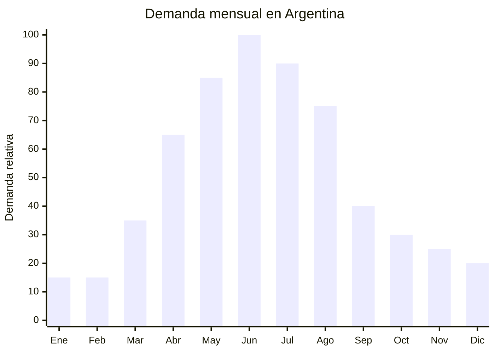

# Prendedores y broches decorativos para abrigos

> **Capítulo NCM 71** — Perlas, piedras preciosas, metales preciosos y manufacturas; bisutería | **Temporada:** Otoño (Mar–May)

## Qué es y por qué importarlo

Los prendedores y broches decorativos son accesorios de bisutería que se sujetan a la ropa mediante un alfiler con cierre de seguridad. En otoño-invierno cobran especial relevancia como complemento de abrigos, sacos, blazers, bufandas y chales. Los diseños van desde motivos clásicos (flores, mariposas, lazos) hasta modernos (geométricos, minimalistas, Art Deco). Los materiales más comunes son aleación de zinc con baño de oro o plata, con incrustaciones de cristales de vidrio (rhinestones), esmalte o perlas sintéticas.

Durante el otoño argentino (abril-agosto), cuando la gente empieza a usar capas de ropa, los prendedores se convierten en el accesorio de diferenciación por excelencia. Una bufanda lisa se transforma con un broche bien elegido, un blazer neutro gana personalidad con un prendedor vintage. En MercadoLibre Argentina hay más de 3,200 resultados activos para "prendedor broche", lo que indica un mercado activo con demanda sostenida.

Yiwu (Zhejiang) es el epicentro mundial de la bijoutería económica, con miles de proveedores de broches y prendedores que ofrecen catálogos de cientos de diseños con MOQ extremadamente bajos (desde 50-100 unidades por modelo). Los precios FOB de USD 0.30 a USD 2.50 por unidad permiten márgenes excepcionales.

## Datos clave

| Dato | Valor |
|------|-------|
| **Posiciones NCM típicas** | 7117.19.00 (bisutería de metales comunes, los demás) / 7117.90.00 (las demás bisuterías) |
| **Derecho de importación** | 18% (DIE) + 3% tasa estadística |
| **Rango FOB típico** | USD 0.30 — USD 2.50 por unidad |
| **Precio de venta en Argentina** | ARS 2.000 — ARS 15.000 |
| **Margen bruto estimado** | 300% — 700% |
| **MOQ típico** | 50 — 500 unidades por diseño |
| **Demanda en MercadoLibre** | Media-Alta (3,200+ resultados activos) |
| **Competencia en MercadoLibre** | Media |
| **Dificultad para importar** | Baja |
| **Certificaciones necesarias** | Ninguna obligatoria |
| **Antidumping** | No |

## Variantes y subtipos más comunes

| Subtipo / Variante | FOB aprox. | Venta AR aprox. | Nota |
|--------------------|-----------|-----------------|------|
| Broche floral con rhinestones | USD 0.50 — 1.50 | ARS 3.000 — 8.000 | **Más vendido** |
| Prendedor vintage Art Deco | USD 0.80 — 2.00 | ARS 4.000 — 12.000 | Público femenino 35+ |
| Broche mariposa/insecto con esmalte | USD 0.60 — 1.80 | ARS 3.000 — 10.000 | Tendencia naturaleza |
| Prendedor minimalista geométrico | USD 0.30 — 0.80 | ARS 2.000 — 5.000 | Diseño moderno |
| Broche perla sintética elegante | USD 0.80 — 2.50 | ARS 5.000 — 15.000 | Segmento premium |
| Set x3 broches surtidos en caja | USD 1.50 — 4.00 | ARS 6.000 — 18.000 | Formato regalo |

## Regulaciones y requisitos

<Tabs>
  <Tab title="Certificaciones">
    | Organismo | Requiere | Detalle |
    |-----------|----------|---------|
    | ARCA (Aduana) | Sí siempre | Despacho estándar |
    | ANMAT | No | No es cosmético ni producto de salud |
    | ENACOM | No | No es electrónico |
    | SENASA | No | No es alimento |
    | INTI | No obligatorio | Sin norma IRAM específica para bisutería |

    **Recomendación:** Solicitar certificado de composición metálica (especialmente contenido de níquel y plomo). El níquel es alérgeno común y puede generar dermatitis de contacto. Aunque no hay regulación argentina obligatoria para bisutería, la normativa europea EN 1811 (límite de liberación de níquel) es una referencia de calidad.
  </Tab>

  <Tab title="Etiquetado">
    | Requisito | Aplica |
    |-----------|--------|
    | País de origen | Sí |
    | Datos del importador | Sí (nombre, dirección, CUIT) |
    | Material | Recomendable ("Aleación metálica con baño de oro/plata") |
    | Precauciones | Recomendable ("Puede contener níquel") |
  </Tab>

  <Tab title="Restricciones">
    - Sin medidas antidumping vigentes para bisutería.
    - Sin restricciones específicas de importación.
    - No declarar como "oro" o "plata" si es baño — constituye publicidad engañosa.
    - Si contiene cristales, no declarar como "diamantes" o "zirconia" si son rhinestones de vidrio.
    - Verificar que el alfiler de cierre sea resistente y seguro.
  </Tab>
</Tabs>

## Logística de importación

| Factor | Detalle |
|--------|---------|
| **Peso por unidad** | 10 — 50 g |
| **Volumen por unidad** | Mínimo (5-8 cm de diámetro) |
| **Unidades por caja (master carton)** | 200 — 1,000 unidades |
| **Peso por caja** | 3 — 10 kg |
| **Cajas por contenedor 20'** | ~2,000 — 4,000 cajas |
| **Unidades por contenedor 20'** | ~500,000 — 2,000,000 unidades |
| **Fragilidad** | Baja-Media (los rhinestones pueden despegarse) |
| **Requiere embalaje especial** | Bolsa OPP individual + caja individual opcional para venta. Protección básica suficiente |

<Tip>
Los prendedores tienen una relación valor/peso/volumen excepcional. Un envío aéreo de 10 kg puede contener 500+ unidades con un flete de centavos por pieza. Ideal para primeras importaciones por courier (DHL, FedEx). Comprar variedad de diseños (50-100 unidades por modelo) para testear cuáles se venden mejor antes de hacer pedido grande.
</Tip>

## Estacionalidad y timing de compra

| Dato | Valor |
|------|-------|
| **Meses de mayor venta** | Abril — Agosto (temporada de abrigos) |
| **Pedido ideal (marítimo)** | Enero — Febrero |
| **Pedido ideal (aéreo/courier)** | Marzo (llega en 7-15 días) |
| **Anticipación mínima** | 1-2 meses (courier) / 3 meses (marítimo) |

## Ventajas y riesgos

<CardGroup cols={2}>
  <Card title="Ventajas" icon="circle-check">
    - Márgenes excepcionales (300-700%)
    - Ultraliviano — flete mínimo por unidad
    - MOQ muy bajo (50-100 unidades por diseño)
    - Sin certificaciones obligatorias
    - Sin antidumping
    - Ideal para courier en primeras pruebas
    - Variedad infinita de diseños en Yiwu
    - Producto de impulso con alta rotación
  </Card>

  <Card title="Riesgos y desventajas" icon="triangle-exclamation">
    - Ticket bajo por unidad — necesita volumen
    - Rhinestones pueden despegarse si la calidad es baja
    - Alergias al níquel pueden generar reclamos
    - Percepción de "bijoutería china barata" si el diseño no es cuidado
    - Competencia con bazares chinos locales
    - Tendencias de diseño cambian rápido
  </Card>
</CardGroup>

## Palabras clave para buscar en Alibaba

`brooch pin wholesale` · `rhinestone brooch flower` · `vintage brooch wholesale Yiwu` · `enamel pin brooch butterfly` · `pearl brooch elegant wholesale` · `scarf pin clip wholesale` · `brooch gift set box`

## Fuentes

- MercadoLibre Argentina — búsqueda "prendedor broche", "broche abrigo"
- Alibaba.com — proveedores de brooch pin wholesale Yiwu
- Nomenclador Arancelario Argentino — partida 7117
