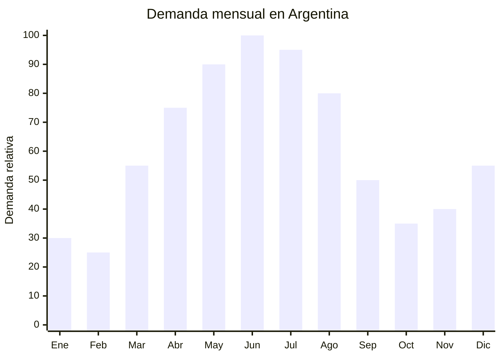

# Bombillas de acero inoxidable para mate

> **Capítulo NCM 73** — Manufacturas de fundición, de hierro o de acero | **Temporada:** Otoño (Mar–May)

## Qué es y por qué importarlo

Las bombillas de acero inoxidable son el instrumento esencial para tomar mate, la infusión más consumida en Argentina, Uruguay, Paraguay y el sur de Brasil. Se trata de un tubo metálico de 17 a 20 cm con un filtro en la punta inferior (resorte, cuchara perforada o espuela) que permite succionar la infusión reteniendo la yerba. El material estándar es acero inoxidable AISI 304 (18/8), mientras que la versión premium utiliza acero quirúrgico AISI 316L (18/10), más resistente a la corrosión y apto para contacto prolongado con líquidos calientes.

El consumo de mate caliente se intensifica significativamente con la llegada del frío, generando un pico de demanda entre marzo y agosto. En Argentina se consumen más de 100 litros de mate per cápita al año, y la bombilla es un accesorio de reposición frecuente: se deforma, se tapa, se pierde. Además, el auge del mate como regalo y la tendencia a los sets materos (mate + bombilla + termo) han convertido a la bombilla en un producto de margen alto y rotación constante.

China, particularmente las ciudades de Yiwu (Zhejiang) y Jieyang (Guangdong), es el principal proveedor de bombillas de acero inoxidable para el mercado sudamericano. Los fabricantes chinos producen específicamente para Argentina, Uruguay y Paraguay, con diseños adaptados (pico de loro, espuela, resorte) que no se usan en otros mercados. Los precios FOB son extremadamente competitivos comparados con la producción nacional, que prácticamente ha desaparecido.

## Datos clave

| Dato | Valor |
|------|-------|
| **Posiciones NCM típicas** | 7323.93.00 (artículos de uso doméstico y sus partes, de acero inoxidable) |
| **Derecho de importación** | 18% (DIE) + 3% tasa estadística |
| **Rango FOB típico** | USD 0.30 — USD 1.50 por unidad |
| **Precio de venta en Argentina** | ARS 1.500 — ARS 8.000 (unitaria) / Hasta ARS 39.999 en sets materos |
| **Margen bruto estimado** | 300% — 600% |
| **MOQ típico** | 500 — 2,000 unidades |
| **Demanda en MercadoLibre** | Alta (estacional con pico otoño-invierno) |
| **Competencia en MercadoLibre** | Alta |
| **Dificultad para importar** | Baja |
| **Certificaciones necesarias** | Ninguna obligatoria (recomendable certificado de grado alimenticio) |
| **Antidumping** | No |

## Variantes y subtipos más comunes

| Subtipo / Variante | FOB aprox. | Venta AR aprox. | Nota |
|--------------------|-----------|-----------------|------|
| Bombilla recta AISI 304 clásica | USD 0.30 — 0.60 | ARS 1.500 — 3.000 | Entrada, mayor volumen |
| Bombilla pico de loro AISI 304 | USD 0.40 — 0.80 | ARS 2.000 — 4.000 | Modelo más popular Argentina |
| Bombilla espuela AISI 304 | USD 0.40 — 0.80 | ARS 2.000 — 4.500 | Tradicional, filtrado superior |
| Bombilla resorte AISI 304 | USD 0.35 — 0.70 | ARS 1.800 — 3.500 | Fácil limpieza, desarmable |
| Bombilla AISI 316L quirúrgica | USD 0.80 — 1.50 | ARS 4.000 — 8.000 | **Premium**, mayor margen |
| Set matero completo (mate + bombilla + caja) | USD 3.00 — 8.00 | ARS 15.000 — 39.999 | Alto ticket, ideal regalo |
| Bombilla con cuchara filtro (cocido) | USD 0.35 — 0.70 | ARS 1.800 — 3.500 | Para mate cocido en taza |

## Regulaciones y requisitos

<Tabs>
  <Tab title="Certificaciones">
    | Organismo | Requiere | Detalle |
    |-----------|----------|---------|
    | ARCA (Aduana) | Sí siempre | Despacho estándar |
    | ANMAT | No obligatorio | No es envase de alimento procesado. Sin embargo, es recomendable contar con certificado de grado alimenticio (food grade) del proveedor |
    | ENACOM | No | No es electrónico |
    | SENASA | No | No es alimento |
    | INTI | No obligatorio | No existe norma IRAM específica para bombillas |

    **Recomendación:** Solicitar al proveedor chino: certificado de composición del acero (especificando AISI 304 o 316L), test de migración de metales pesados (plomo, cadmio, níquel) y certificado SGS o equivalente. Aunque no es legalmente obligatorio, estos documentos generan confianza en el comprador final y son útiles ante eventuales reclamos.
  </Tab>

  <Tab title="Etiquetado">
    | Requisito | Aplica |
    |-----------|--------|
    | País de origen | Sí |
    | Datos del importador | Sí (nombre, dirección, CUIT) |
    | Material | Recomendable indicar "Acero Inoxidable AISI 304" o "316L" |
    | Instrucciones de uso | Recomendable |
    | Lote | Recomendable |
  </Tab>

  <Tab title="Restricciones">
    - Sin medidas antidumping vigentes para esta categoría.
    - No existen restricciones específicas de importación.
    - Si se vende como "quirúrgico 316L" debe efectivamente ser 316L — vender 304 como 316L constituye publicidad engañosa.
    - Verificar que el acabado no tenga rebabas ni filos que puedan cortar labios o encías.
  </Tab>
</Tabs>

## Logística de importación

| Factor | Detalle |
|--------|---------|
| **Peso por unidad** | 30 — 80 g |
| **Volumen por unidad** | Mínimo (tubo de 17-20 cm × 1 cm diámetro) |
| **Unidades por caja (master carton)** | 100 — 500 unidades |
| **Peso por caja** | 5 — 15 kg |
| **Cajas por contenedor 20'** | ~1,500 — 2,500 cajas |
| **Unidades por contenedor 20'** | ~200,000 — 500,000 unidades |
| **Fragilidad** | Muy baja (acero inoxidable) |
| **Requiere embalaje especial** | No — bolsa individual OPP + caja master |

<Tip>
La bombilla es uno de los productos con mejor relación valor/peso/volumen para importar. Un envío aéreo de 50 kg puede contener 1,000+ unidades con un costo de flete de USD 0.20-0.40 por unidad. Para primeras importaciones o pedidos de prueba, el envío aéreo es muy viable económicamente. Combinar bombillas con otros accesorios materos (mates de vidrio, yerba) optimiza el contenedor.
</Tip>

## Estacionalidad y timing de compra

| Dato | Valor |
|------|-------|
| **Meses de mayor venta** | Marzo — Agosto (otoño-invierno) |
| **Pedido ideal (marítimo)** | Diciembre — Enero (llega marzo) |
| **Pedido ideal (aéreo)** | Febrero — Marzo (llega en 10-15 días) |
| **Anticipación mínima** | 2 — 3 meses antes del pico |

<Note>
Los sets materos tienen un segundo pico en noviembre-diciembre por la temporada de regalos (Día del Padre en junio también genera pico puntual). Considerar tener stock de sets premium todo el año.
</Note>

## Ventajas y riesgos

<CardGroup cols={2}>
  <Card title="Ventajas" icon="circle-check">
    - Margen bruto 300-600% sobre FOB
    - Producto ultraliviano (flete mínimo por unidad)
    - Sin certificaciones obligatorias (barrera baja)
    - Demanda constante con pico estacional fuerte
    - Reposición frecuente (se pierden, se tapan, se regalan)
    - Ideal para marca propia (grabado láser económico)
    - Complemento perfecto para vender en kits materos
  </Card>

  <Card title="Riesgos y desventajas" icon="triangle-exclamation">
    - Competencia alta — muchos importadores en el mercado
    - Diferenciación difícil en producto commodity
    - Riesgo de recibir acero de baja calidad (201 en vez de 304)
    - Filtro defectuoso = deja pasar yerba = devoluciones
    - Rebabas o filos pueden generar reclamos por seguridad
    - Mercado muy sensible al precio (guerra de precios en MercadoLibre)
  </Card>
</CardGroup>

## Palabras clave para buscar en Alibaba

`stainless steel mate straw bombilla` · `yerba mate straw 304` · `mate bombilla stainless steel filter` · `bombilla acero inoxidable 316L` · `mate straw wholesale Argentina` · `stainless steel drinking straw filter spring`

## Fuentes

- MercadoLibre Argentina — búsqueda "bombilla mate acero inoxidable"
- Alibaba.com — proveedores de stainless steel mate straw
- Instituto Nacional de la Yerba Mate (INYM) — estadísticas de consumo
- Nomenclador Arancelario Argentino — partida 7323.93.00
