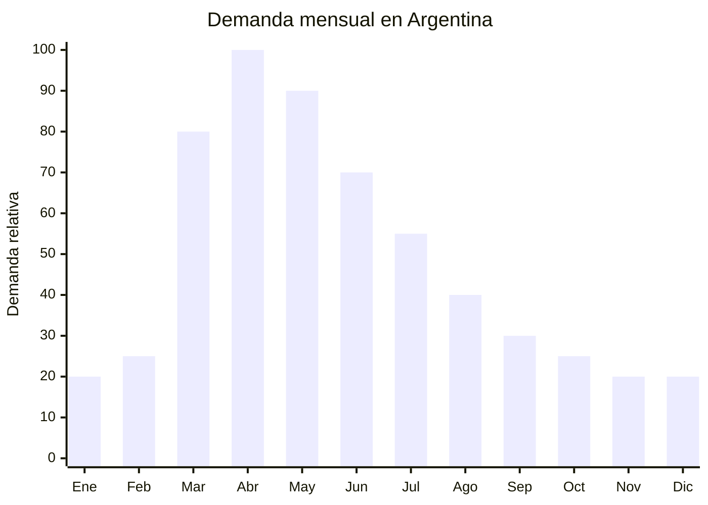

# Percheros de metal para abrigos pesados

> **Capítulo NCM 73** — Manufacturas de fundición, de hierro o de acero | **Temporada:** Otoño (Mar–May)

## Qué es y por qué importarlo

Los percheros metálicos para abrigos son estructuras de pie (tipo árbol o columna) o de pared (barras con ganchos) diseñados para soportar el peso de abrigos, camperas, sacos, buzos y bufandas. A diferencia de los percheros livianos de plástico o madera fina, estos están fabricados en acero o hierro con capacidad de 5 a 8 kg por gancho, necesario para prendas pesadas de invierno como camperas de pluma, sobretodos o tapados.

Con la llegada del otoño en Argentina (marzo-mayo), los hogares necesitan reorganizar sus espacios para acomodar la ropa de abrigo que durante el verano estuvo guardada. Los percheros de pie son especialmente populares en departamentos pequeños donde no hay placard suficiente, mientras que los de pared optimizan el espacio en halls de entrada. En oficinas, consultorios y comercios también crece la demanda de percheros resistentes para las prendas de clientes y empleados.

China ofrece percheros metálicos con terminación en pintura epoxi, cromado o acabado mate negro (tendencia industrial/nórdica) a precios FOB significativamente menores que los fabricados localmente. Los principales proveedores se concentran en Foshan (Guangdong) y Jinhua (Zhejiang).

## Datos clave

| Dato | Valor |
|------|-------|
| **Posiciones NCM típicas** | 7323.99.00 (artículos de uso doméstico de hierro o acero, los demás) / 7326.90.00 (las demás manufacturas de hierro o acero) |
| **Derecho de importación** | 18% (DIE) + 3% tasa estadística |
| **Rango FOB típico** | USD 5.00 — USD 20.00 (pie) / USD 1.00 — USD 5.00 (pared) |
| **Precio de venta en Argentina** | ARS 15.000 — ARS 60.000 (pie) / ARS 5.000 — ARS 20.000 (pared) |
| **Margen bruto estimado** | 100% — 250% |
| **MOQ típico** | 100 — 500 unidades |
| **Demanda en MercadoLibre** | Media-Alta |
| **Competencia en MercadoLibre** | Media |
| **Dificultad para importar** | Baja-Moderada (voluminoso) |
| **Certificaciones necesarias** | Ninguna obligatoria |
| **Antidumping** | No |

## Variantes y subtipos más comunes

| Subtipo / Variante | FOB aprox. | Venta AR aprox. | Nota |
|--------------------|-----------|-----------------|------|
| Perchero de pie tipo árbol 8 ganchos | USD 8.00 — 15.00 | ARS 25.000 — 50.000 | **Más vendido** |
| Perchero de pie minimalista nórdico | USD 10.00 — 20.00 | ARS 30.000 — 60.000 | Diseño premium |
| Perchero de pared barra con ganchos (5-8 ganchos) | USD 2.00 — 5.00 | ARS 5.000 — 15.000 | Optimiza espacio |
| Perchero de pared individual (ganchos sueltos x4-6) | USD 1.00 — 3.00 | ARS 3.000 — 10.000 | Flexibilidad de ubicación |
| Perchero de pie con paragüero integrado | USD 12.00 — 20.00 | ARS 35.000 — 60.000 | Hall de entrada |
| Perchero de pie plegable/portátil | USD 5.00 — 10.00 | ARS 15.000 — 30.000 | Eventos, oficinas |

## Regulaciones y requisitos

<Tabs>
  <Tab title="Certificaciones">
    | Organismo | Requiere | Detalle |
    |-----------|----------|---------|
    | ARCA (Aduana) | Sí siempre | Despacho estándar |
    | ANMAT | No | No es producto de salud |
    | ENACOM | No | No es electrónico |
    | SENASA | No | No es alimento |
    | INTI | No obligatorio | Sin norma IRAM específica para percheros |

    **Recomendación:** Verificar la capacidad de carga del perchero con el proveedor (kg por gancho y peso total máximo). Si se publicita como "reforzado" o "capacidad 8 kg por gancho", el producto debe cumplir esa especificación. Solicitar certificado de prueba de carga.
  </Tab>

  <Tab title="Etiquetado">
    | Requisito | Aplica |
    |-----------|--------|
    | País de origen | Sí |
    | Datos del importador | Sí (nombre, dirección, CUIT) |
    | Material | Recomendable ("Acero con pintura epoxi") |
    | Capacidad de carga | Recomendable indicar |
    | Instrucciones de armado | Sí, si requiere ensamblaje |
  </Tab>

  <Tab title="Restricciones">
    - Sin medidas antidumping vigentes para esta categoría.
    - Sin restricciones específicas de importación.
    - Verificar estabilidad del perchero de pie: base pesada suficiente para evitar volcamiento con abrigos pesados.
    - La pintura epoxi debe ser resistente a rayones para evitar devoluciones.
  </Tab>
</Tabs>

## Logística de importación

| Factor | Detalle |
|--------|---------|
| **Peso por unidad** | 2 — 8 kg (pie) / 0.5 — 2 kg (pared) |
| **Volumen por unidad** | Alto (percheros de pie: 170-180 cm de largo en caja) |
| **Unidades por caja (master carton)** | 1 — 4 unidades (pie) / 10 — 20 (pared) |
| **Peso por caja** | 5 — 15 kg |
| **Cajas por contenedor 20'** | ~300 — 800 cajas (pie) / ~1,500 — 2,500 (pared) |
| **Unidades por contenedor 20'** | ~800 — 2,000 (pie) / ~15,000 — 40,000 (pared) |
| **Fragilidad** | Baja (metal). Riesgo de rayones en pintura |
| **Requiere embalaje especial** | Protección anti-rayones (foam o burbuja en partes pintadas). Percheros de pie van desarmados en caja plana |

<Tip>
Los percheros de pie se envían siempre desarmados (flat pack) para optimizar espacio. Verificar que las instrucciones de armado sean claras y que incluyan tornillería completa. El punto crítico de calidad es la base: debe ser lo suficientemente pesada para soportar 15-20 kg de abrigos sin volcarse. Pedir prueba de estabilidad al proveedor.
</Tip>

## Estacionalidad y timing de compra

| Dato | Valor |
|------|-------|
| **Meses de mayor venta** | Marzo — Mayo (inicio otoño, reorganización del hogar) |
| **Pedido ideal (marítimo)** | Diciembre — Enero (para llegar en marzo) |
| **Pedido ideal (aéreo)** | Febrero (para percheros de pared livianos) |
| **Anticipación mínima** | 3 meses antes del pico |

## Ventajas y riesgos

<CardGroup cols={2}>
  <Card title="Ventajas" icon="circle-check">
    - Ticket medio-alto (ARS 15,000-60,000 perchero de pie)
    - Sin certificaciones obligatorias
    - Sin antidumping
    - Producto duradero — baja tasa de devolución
    - Demanda constante con pico estacional
    - Tendencia decoración nórdica/industrial impulsa diseños premium
    - Envío desarmado optimiza flete
  </Card>

  <Card title="Riesgos y desventajas" icon="triangle-exclamation">
    - Producto voluminoso — flete significativo (percheros de pie)
    - Rayones en pintura durante transporte = devoluciones
    - Competencia con bazares y tiendas de decoración locales
    - Percheros baratos pueden volcarse = reclamos de seguridad
    - Instrucciones de armado deficientes generan frustración
    - Margen menor que productos ultralivianos
  </Card>
</CardGroup>

## Palabras clave para buscar en Alibaba

`coat rack stand metal wholesale` · `standing coat hanger tree` · `wall mounted coat hooks metal` · `hat and coat stand steel` · `umbrella stand coat rack` · `Nordic coat rack minimalist` · `industrial coat rack pipe`

## Fuentes

- MercadoLibre Argentina — búsqueda "perchero de pie metal", "perchero pared abrigos"
- Alibaba.com — proveedores de coat rack stand wholesale
- Nomenclador Arancelario Argentino — partidas 7323.99.00 / 7326.90.00
