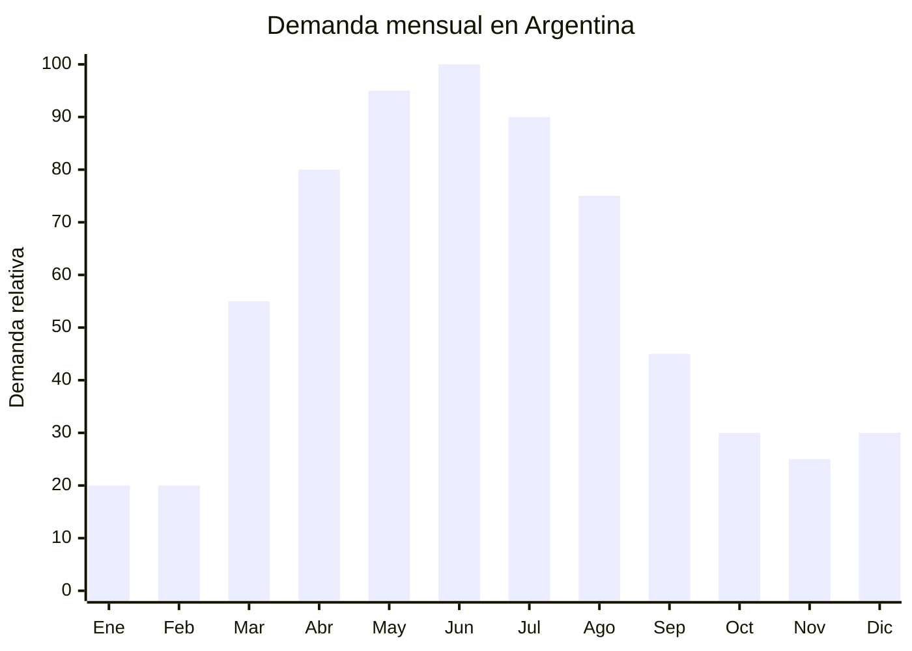

# Termos de aluminio y acero inoxidable para mate

> **Capítulo NCM 76** — Aluminio y sus manufacturas | **Temporada:** Otoño (Mar–May)

<Note>
**Nota sobre clasificación NCM:** Los termos isotérmicos con doble pared y vacío generalmente se clasifican en la **partida 9617** (Termos y demás recipientes isotérmicos, Cap. 96), no en el Cap. 76 (aluminio). Los termos de aluminio simple (sin aislamiento al vacío) sí van en Cap. 76 (7612.90.00). **Consultar siempre con el despachante de aduana** para confirmar la clasificación exacta según el producto específico, ya que el arancel puede variar.
</Note>

## Qué es y por qué importarlo

El termo para mate es EL producto estrella del otoño-invierno argentino. Es un recipiente isotérmico diseñado para mantener el agua caliente (entre 70°C y 85°C) durante horas, condición esencial para cebar mate. Los formatos más populares son: termo de acero inoxidable doble pared al vacío (1 litro, el estándar) y termo de aluminio con interior de vidrio (más económico pero más frágil). El termo acompaña al argentino al trabajo, a la universidad, a la plaza y a la cancha.

Argentina es el mayor consumidor mundial de mate per cápita, y el termo es el accesorio indispensable. La demanda se dispara entre marzo y agosto cuando el mate caliente se convierte en la bebida dominante. Marcas como Thermos, Stanley (fenómeno de ventas), Lumilagro, Waterdog y Contigo dominan el mercado, pero hay un amplio espacio para marcas propias con diseños diferenciados y precios competitivos.

Yongkang (Zhejiang, China) es la capital mundial de la fabricación de termos y botellas térmicas, con cientos de fábricas que producen para las marcas más reconocidas del mundo. Ofrecen personalización total: capacidad, color, grabado láser, packaging, y producción OEM/ODM. Los precios FOB de termos inox doble pared de 1 litro van de USD 3 a USD 12, dependiendo de la calidad del aislamiento y los acabados.

## Datos clave

| Dato | Valor |
|------|-------|
| **Posiciones NCM típicas** | 9617.00.00 (termos y demás recipientes isotérmicos) / 7612.90.00 (recipientes de aluminio, los demás) |
| **Derecho de importación** | 18-20% (DIE según NCM) + 3% tasa estadística |
| **Rango FOB típico** | USD 3.00 — USD 12.00 (inox doble pared 1L) / USD 2.00 — USD 6.00 (aluminio) |
| **Precio de venta en Argentina** | ARS 15.000 — ARS 120.000 (según marca y calidad) |
| **Margen bruto estimado** | 100% — 300% |
| **MOQ típico** | 500 — 2,000 unidades |
| **Demanda en MercadoLibre** | Muy Alta |
| **Competencia en MercadoLibre** | Muy Alta |
| **Dificultad para importar** | Moderada (competencia alta, clasificación NCM compleja) |
| **Certificaciones necesarias** | Ninguna obligatoria. Recomendable certificado food grade y test de retención térmica |
| **Antidumping** | No |

## Variantes y subtipos más comunes

| Subtipo / Variante | FOB aprox. | Venta AR aprox. | Nota |
|--------------------|-----------|-----------------|------|
| Termo inox doble pared 1L económico | USD 3.00 — 5.00 | ARS 15.000 — 30.000 | Entrada, competitivo |
| Termo inox doble pared 1L premium | USD 6.00 — 12.00 | ARS 35.000 — 80.000 | Mejor aislamiento, 24h+ |
| Termo aluminio con ampolla vidrio 1L | USD 2.00 — 4.00 | ARS 10.000 — 25.000 | Tradicional, más frágil |
| Termo pico matero (cebador) 1L | USD 4.00 — 8.00 | ARS 20.000 — 50.000 | **Pico vertedor para mate** |
| Termo 500ml compacto | USD 2.50 — 5.00 | ARS 12.000 — 30.000 | Portátil, oficina |
| Set termo + mate + bombilla en caja | USD 8.00 — 20.00 | ARS 40.000 — 120.000 | **Formato regalo estrella** |

## Regulaciones y requisitos

<Tabs>
  <Tab title="Certificaciones">
    | Organismo | Requiere | Detalle |
    |-----------|----------|---------|
    | ARCA (Aduana) | Sí siempre | Despacho estándar. **Clave:** clasificación NCM correcta |
    | ANMAT | No obligatorio | No es envase de alimento procesado. Recomendable certificado food grade |
    | ENACOM | No | No es electrónico |
    | SENASA | No | No es alimento |
    | INTI | No obligatorio | Sin norma IRAM obligatoria para termos |

    **Recomendación:** Solicitar al proveedor: test de retención térmica (cuántas horas mantiene el agua por encima de 70°C), certificado de acero inoxidable 304 food grade, y prueba de estanqueidad. La retención térmica es EL factor diferenciador: un termo que mantiene 12 horas vs. 24 horas marca la diferencia en reseñas y devoluciones.
  </Tab>

  <Tab title="Etiquetado">
    | Requisito | Aplica |
    |-----------|--------|
    | País de origen | Sí |
    | Datos del importador | Sí (nombre, dirección, CUIT) |
    | Capacidad | Sí (en ml o litros) |
    | Material | Recomendable ("Acero inoxidable 304" / "Aluminio") |
    | Instrucciones de uso | Recomendable ("Prellenar con agua caliente para mejor rendimiento") |
    | Retención térmica | Recomendable indicar horas |
  </Tab>

  <Tab title="Restricciones">
    - Sin medidas antidumping vigentes.
    - **Clasificación NCM crítica:** Termos con vacío = 9617.00.00 (arancel puede diferir). Recipientes de aluminio sin vacío = 7612.90.00. Consultar despachante.
    - No declarar retención térmica superior a la real — genera reseñas negativas masivas.
    - Verificar que la tapa cierre herméticamente (test de inversión: girar boca abajo sin que gotee).
  </Tab>
</Tabs>

## Logística de importación

| Factor | Detalle |
|--------|---------|
| **Peso por unidad** | 0.30 — 0.60 kg (vacío) |
| **Volumen por unidad** | 1,500 — 3,000 cm³ (con caja) |
| **Unidades por caja (master carton)** | 12 — 24 unidades |
| **Peso por caja** | 5 — 12 kg |
| **Cajas por contenedor 20'** | ~1,200 — 2,000 cajas |
| **Unidades por contenedor 20'** | ~20,000 — 40,000 unidades |
| **Fragilidad** | Baja (inox) / Media (aluminio con ampolla vidrio) |
| **Requiere embalaje especial** | Estándar para inox. Protección reforzada para termos con ampolla de vidrio |

<Tip>
Los termos de acero inoxidable doble pared son resistentes y livianos, lo que los convierte en un producto logísticamente eficiente. Sin embargo, los termos con ampolla de vidrio requieren protección reforzada ya que la ampolla se quiebra con golpes. Para el primer embarque, empezar con termos de acero inoxidable solamente. Pedir muestras de 3-5 proveedores diferentes y comparar retención térmica real (llenar con agua a 100°C, medir a las 6, 12 y 24 horas).
</Tip>

## Estacionalidad y timing de compra

| Dato | Valor |
|------|-------|
| **Meses de mayor venta** | Abril — Julio (otoño-invierno) + pico puntual en junio (Día del Padre) |
| **Pedido ideal (marítimo)** | Diciembre — Enero (para llegar en marzo-abril) |
| **Pedido ideal (aéreo)** | Febrero — Marzo (para primeras unidades) |
| **Anticipación mínima** | 3 meses antes del pico |

## Ventajas y riesgos

<CardGroup cols={2}>
  <Card title="Ventajas" icon="circle-check">
    - Producto ESTRELLA del mercado argentino
    - Demanda masiva y predecible
    - Sets materos = alto ticket (ARS 40,000-120,000)
    - Ideal para marca propia con diferenciación de diseño
    - Producto de reposición y regalo
    - Yongkang ofrece cientos de fábricas especializadas
    - Sin antidumping
  </Card>

  <Card title="Riesgos y desventajas" icon="triangle-exclamation">
    - **Competencia MUY alta** (Stanley, Thermos, Lumilagro, Waterdog)
    - Retención térmica insuficiente = reseñas negativas masivas
    - Clasificación NCM compleja (Cap. 76 vs. Cap. 96)
    - Termos baratos pierden vacío con el tiempo
    - Tapas que gotean = devoluciones
    - Mercado maduro — difícil posicionarse sin diferenciación clara
  </Card>
</CardGroup>

## Palabras clave para buscar en Alibaba

`stainless steel vacuum flask 1L` · `thermos flask double wall wholesale` · `mate thermos flask Argentina` · `vacuum insulated water bottle 1000ml` · `stainless steel thermos OEM Yongkang` · `thermal flask custom logo wholesale`

## Fuentes

- MercadoLibre Argentina — búsqueda "termo mate acero inoxidable", "termo 1 litro"
- Alibaba.com — proveedores de vacuum flask wholesale Yongkang
- Nomenclador Arancelario Argentino — partidas 9617.00.00 / 7612.90.00
- Instituto Nacional de la Yerba Mate (INYM) — estadísticas de consumo
