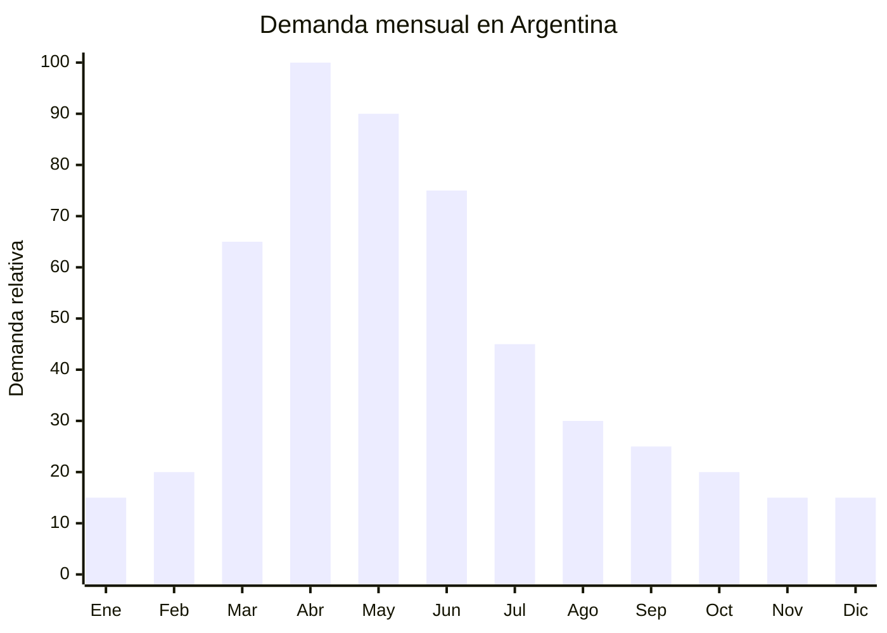

# Serruchos de poda plegables

> **Capítulo NCM 82** — Herramientas y útiles, artículos de cuchillería y cubiertos de mesa, de metales comunes | **Temporada:** Otoño (Mar–May)

## Qué es y por qué importarlo

Los serruchos de poda plegables son herramientas de corte con hoja dentada curva, diseñados para cortar ramas de 25 a 150 mm de diámetro que exceden la capacidad de las tijeras de podar. El mecanismo plegable permite que la hoja se guarde dentro del mango, haciéndolo seguro para transportar y compacto para almacenar. Las hojas suelen ser de acero SK5 o 65Mn con dientes de triple filo que cortan en ambas direcciones (tracción y empuje), y largos de 170, 210, 270 y 330 mm.

Son el complemento natural de las tijeras de podar: mientras la tijera corta ramas finas (hasta 25-30 mm), el serrucho plegable se encarga de ramas medianas y gruesas. La temporada de poda otoñal en Argentina (marzo-junio) genera demanda conjunta de ambos productos. Los viveristas, jardineros, fruticultores y aficionados a la jardinería necesitan ambas herramientas para completar la tarea de poda.

Yongkang (Zhejiang, China) concentra la producción de serruchos plegables con estándares de calidad que compiten con marcas japonesas (Silky, ARS) a una fracción del precio. Las hojas con tratamiento de triple filo y recubrimiento antioxidante se fabrican con maquinaria de precisión CNC.

## Datos clave

| Dato | Valor |
|------|-------|
| **Posiciones NCM típicas** | 8202.99.00 (hojas de sierra, las demás) / 8201.90.00 (herramientas de mano agrícolas) |
| **Derecho de importación** | 14-18% (DIE según NCM) + 3% tasa estadística |
| **Rango FOB típico** | USD 2.00 — USD 7.00 por unidad |
| **Precio de venta en Argentina** | ARS 8.000 — ARS 25.000 |
| **Margen bruto estimado** | 150% — 300% |
| **MOQ típico** | 500 — 2,000 unidades |
| **Demanda en MercadoLibre** | Media |
| **Competencia en MercadoLibre** | Media-Baja |
| **Dificultad para importar** | Baja |
| **Certificaciones necesarias** | Ninguna obligatoria |
| **Antidumping** | No |

## Variantes y subtipos más comunes

| Subtipo / Variante | FOB aprox. | Venta AR aprox. | Nota |
|--------------------|-----------|-----------------|------|
| Serrucho plegable 170mm económico | USD 2.00 — 3.00 | ARS 8.000 — 12.000 | Ramas finas, hobbista |
| Serrucho plegable 210mm SK5 | USD 3.00 — 4.50 | ARS 10.000 — 18.000 | **Más vendido**, polivalente |
| Serrucho plegable 270mm profesional | USD 4.00 — 5.50 | ARS 12.000 — 22.000 | Ramas gruesas |
| Serrucho plegable 330mm reforzado | USD 5.00 — 7.00 | ARS 15.000 — 25.000 | Profesional, leñas |
| Serrucho recto con funda (no plegable) | USD 3.00 — 6.00 | ARS 10.000 — 20.000 | Mayor rigidez |
| Serrucho telescópico (pértiga) | USD 8.00 — 15.00 | ARS 25.000 — 50.000 | Ramas altas sin escalera |

## Regulaciones y requisitos

<Tabs>
  <Tab title="Certificaciones">
    | Organismo | Requiere | Detalle |
    |-----------|----------|---------|
    | ARCA (Aduana) | Sí siempre | Despacho estándar |
    | ANMAT | No | No es producto de salud |
    | ENACOM | No | No es electrónico |
    | SENASA | No | No es producto fitosanitario |
    | INTI | No obligatorio | Sin norma IRAM obligatoria |

    **Recomendación:** Solicitar especificación del acero de la hoja (SK5 preferido, 65Mn aceptable), tipo de diente (triple filo recomendado), dureza (HRC 50-55), y test de corte (cantidad de cortes en madera de pino antes de perder filo). Verificar que el mecanismo de bloqueo de la hoja sea firme y no se suelte durante el uso.
  </Tab>

  <Tab title="Etiquetado">
    | Requisito | Aplica |
    |-----------|--------|
    | País de origen | Sí |
    | Datos del importador | Sí (nombre, dirección, CUIT) |
    | Material de la hoja | Recomendable ("Acero SK5") |
    | Largo de hoja | Recomendable indicar en mm |
    | Instrucciones de seguridad | Recomendable |
  </Tab>

  <Tab title="Restricciones">
    - Sin medidas antidumping vigentes.
    - Sin restricciones específicas.
    - Verificar que el mecanismo de bloqueo funcione correctamente: una hoja que se cierra sola durante el uso es un riesgo de corte grave.
    - El diente debe estar afilado de fábrica. Serruchos que no cortan desde el primer uso generan devoluciones.
  </Tab>
</Tabs>

## Logística de importación

| Factor | Detalle |
|--------|---------|
| **Peso por unidad** | 150 — 400 g (plegado) |
| **Volumen por unidad** | 300 — 800 cm³ (con empaque) |
| **Unidades por caja (master carton)** | 24 — 60 unidades |
| **Peso por caja** | 6 — 15 kg |
| **Cajas por contenedor 20'** | ~1,500 — 2,500 cajas |
| **Unidades por contenedor 20'** | ~50,000 — 100,000 unidades |
| **Fragilidad** | Muy baja |
| **Requiere embalaje especial** | No — blister individual o caja de cartón. La hoja plegada se protege sola |

<Tip>
El serrucho plegable es el complemento perfecto de la tijera de podar. Importar ambos productos juntos y venderlos como "kit de poda" aumenta significativamente el ticket promedio y reduce el costo logístico por unidad. Un kit (tijera SK5 + serrucho 210mm + guantes) puede venderse a ARS 20,000-45,000 con margen superior al del producto individual.
</Tip>

## Estacionalidad y timing de compra

| Dato | Valor |
|------|-------|
| **Meses de mayor venta** | Marzo — Junio (temporada de poda) |
| **Pedido ideal (marítimo)** | Diciembre — Enero (para llegar en marzo) |
| **Pedido ideal (aéreo)** | Febrero (llega en 10-15 días) |
| **Anticipación mínima** | 2-3 meses antes del pico |

## Ventajas y riesgos

<CardGroup cols={2}>
  <Card title="Ventajas" icon="circle-check">
    - Complemento natural de tijeras de podar (venta cruzada)
    - Sin certificaciones obligatorias
    - Sin antidumping
    - Producto compacto cuando está plegado (logística fácil)
    - Competencia baja en MercadoLibre comparado con tijeras
    - Margen atractivo (150-300%)
    - Posibilidad de kits de poda con mayor ticket
  </Card>

  <Card title="Riesgos y desventajas" icon="triangle-exclamation">
    - Mercado más pequeño que tijeras de podar
    - Competencia con marcas establecidas (Bahco, Tramontina)
    - Mecanismo de bloqueo defectuoso = riesgo de seguridad
    - Hojas de baja calidad se desafilan rápidamente
    - Producto estacional con demanda concentrada
    - Menor rotación que herramientas de uso diario
  </Card>
</CardGroup>

## Palabras clave para buscar en Alibaba

`folding pruning saw wholesale` · `pruning saw SK5 blade` · `garden hand saw foldable` · `tree pruning saw 210mm` · `folding saw triple cut teeth` · `pruning saw Yongkang factory` · `telescopic pruning saw pole`

## Fuentes

- MercadoLibre Argentina — búsqueda "serrucho poda plegable", "serrucho jardinería"
- Alibaba.com — proveedores de folding pruning saw Yongkang
- Nomenclador Arancelario Argentino — partida 8202 / 8201
