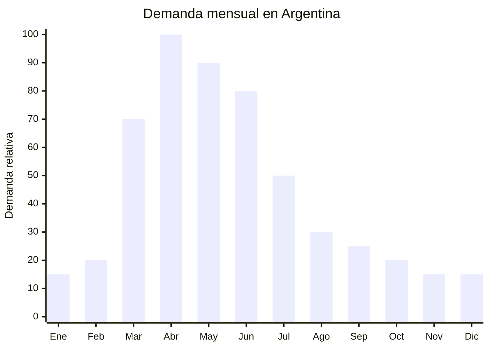

# Tijeras de podar profesionales (bypass y yunque)

> **Capítulo NCM 82** — Herramientas y útiles, artículos de cuchillería y cubiertos de mesa, de metales comunes | **Temporada:** Otoño (Mar–May)

## Qué es y por qué importarlo

Las tijeras de podar son herramientas de corte diseñadas para la poda de plantas, árboles frutales, rosales, viñedos y arbustos. Existen dos mecanismos principales: **bypass** (dos cuchillas que se cruzan como una tijera, para corte limpio en ramas vivas) y **yunque** (una cuchilla que cierra contra una base plana, para ramas secas). La capacidad de corte varía entre 15 mm (livianas) y 30 mm (profesionales reforzadas). Los mangos pueden ser de aluminio, acero forjado o plástico reforzado con fibra de vidrio.

El otoño argentino (marzo-junio) es **LA temporada de poda** por excelencia. Es cuando se podan frutales de hoja caduca (manzanos, perales, ciruelos), rosales, viñedos (pre-invierno), cítricos (poda de limpieza) y la mayoría de arbustos ornamentales. Los viveros, ferreterías, casas de jardín y marketplaces online experimentan un pico de demanda fuerte y predecible. Es también la temporada de preparación de huerta otoño-invierno.

Yongkang (Zhejiang, China) es el principal centro productor mundial de herramientas de mano, incluyendo tijeras de podar. Las fábricas locales producen desde modelos económicos con hojas de acero al carbono hasta líneas profesionales con hojas de acero SK5, mangos ergonómicos y resortes reemplazables, a precios FOB de USD 2.50 a USD 8.00.

## Datos clave

| Dato | Valor |
|------|-------|
| **Posiciones NCM típicas** | 8201.90.00 (tijeras de podar, herramientas de mano agrícolas) / 8213.00.00 (tijeras y sus hojas) |
| **Derecho de importación** | 14-18% (DIE según NCM) + 3% tasa estadística |
| **Rango FOB típico** | USD 2.50 — USD 8.00 (profesional) |
| **Precio de venta en Argentina** | ARS 5.000 — ARS 35.000 |
| **Margen bruto estimado** | 150% — 350% |
| **MOQ típico** | 500 — 2,000 unidades |
| **Demanda en MercadoLibre** | Alta (estacional con pico fuerte) |
| **Competencia en MercadoLibre** | Media-Alta |
| **Dificultad para importar** | Baja |
| **Certificaciones necesarias** | Ninguna obligatoria |
| **Antidumping** | No |

## Variantes y subtipos más comunes

| Subtipo / Variante | FOB aprox. | Venta AR aprox. | Nota |
|--------------------|-----------|-----------------|------|
| Tijera bypass económica 20cm | USD 2.50 — 3.50 | ARS 5.000 — 10.000 | Entrada, hobbista |
| Tijera bypass profesional SK5 | USD 4.00 — 6.00 | ARS 12.000 — 25.000 | **Más vendida** |
| Tijera yunque para ramas secas | USD 3.00 — 5.00 | ARS 8.000 — 18.000 | Complemento de bypass |
| Tijera con trinquete (ratchet) | USD 4.00 — 7.00 | ARS 15.000 — 28.000 | Menos esfuerzo, ramas gruesas |
| Tijera con mango ergonómico antideslizante | USD 3.50 — 6.00 | ARS 10.000 — 22.000 | Uso prolongado |
| Set tijera + serrucho plegable + guantes | USD 6.00 — 12.00 | ARS 20.000 — 45.000 | Kit de poda completo |

## Regulaciones y requisitos

<Tabs>
  <Tab title="Certificaciones">
    | Organismo | Requiere | Detalle |
    |-----------|----------|---------|
    | ARCA (Aduana) | Sí siempre | Despacho estándar |
    | ANMAT | No | No es producto de salud |
    | ENACOM | No | No es electrónico |
    | SENASA | No | No es producto fitosanitario (es herramienta) |
    | INTI | No obligatorio | Sin norma IRAM obligatoria para tijeras de podar |

    **Recomendación:** Solicitar al proveedor especificación del acero de la hoja (preferir SK5, 65Mn o acero al carbono de alto contenido), dureza Rockwell (HRC 55-60 es buena), y test de corte (cantidad de cortes antes de requerir afilado). Estos datos son valiosos para la publicación de venta.
  </Tab>

  <Tab title="Etiquetado">
    | Requisito | Aplica |
    |-----------|--------|
    | País de origen | Sí |
    | Datos del importador | Sí (nombre, dirección, CUIT) |
    | Material de la hoja | Recomendable ("Acero SK5" / "Acero al carbono") |
    | Capacidad de corte | Recomendable indicar diámetro máximo en mm |
    | Instrucciones de mantenimiento | Recomendable (aceitar, afilar) |
  </Tab>

  <Tab title="Restricciones">
    - Sin medidas antidumping vigentes.
    - Sin restricciones específicas de importación.
    - Verificar filo de fábrica: tijeras que llegan sin filo generan devoluciones.
    - El resorte es el punto de fallo más común: verificar calidad y que sea reemplazable.
    - Incluir protector de hoja (blade cover) para seguridad en transporte.
  </Tab>
</Tabs>

## Logística de importación

| Factor | Detalle |
|--------|---------|
| **Peso por unidad** | 200 — 400 g |
| **Volumen por unidad** | 400 — 800 cm³ (con empaque) |
| **Unidades por caja (master carton)** | 24 — 60 unidades |
| **Peso por caja** | 8 — 18 kg |
| **Cajas por contenedor 20'** | ~1,500 — 2,500 cajas |
| **Unidades por contenedor 20'** | ~50,000 — 100,000 unidades |
| **Fragilidad** | Muy baja (herramienta metálica robusta) |
| **Requiere embalaje especial** | No — empaque estándar con protector de hoja. Blister o caja individual |

<Tip>
Las tijeras de podar son compactas y resistentes, ideales para envíos mixtos. Combinar con serruchos plegables, guantes de jardín y otros productos de poda en el mismo embarque para ofrecer kits y optimizar el contenedor. El acero SK5 es el estándar de calidad mínimo para el mercado argentino — evitar acero genérico sin especificación.
</Tip>

## Estacionalidad y timing de compra

| Dato | Valor |
|------|-------|
| **Meses de mayor venta** | Marzo — Junio (temporada de poda otoñal) |
| **Pedido ideal (marítimo)** | Diciembre — Enero (para llegar en marzo) |
| **Pedido ideal (aéreo)** | Febrero (llega en 10-15 días) |
| **Anticipación mínima** | 2-3 meses antes del pico |

## Ventajas y riesgos

<CardGroup cols={2}>
  <Card title="Ventajas" icon="circle-check">
    - Márgenes atractivos (150-350%)
    - Demanda estacional fuerte y predecible
    - Sin certificaciones obligatorias
    - Sin antidumping
    - Producto compacto y resistente (logística fácil)
    - Compra de reposición (las hojas se desgastan)
    - Complementa con serruchos y kits de poda
  </Card>

  <Card title="Riesgos y desventajas" icon="triangle-exclamation">
    - Competencia con marcas establecidas (Bahco, Felco, Tramontina)
    - Calidad variable del acero chino
    - Tijeras sin filo de fábrica = devoluciones
    - Resortes que se rompen rápido = mala reputación
    - Producto estacional — stock sobrante espera al próximo otoño
    - Comparación de precio desfavorable vs. ferreterías locales
  </Card>
</CardGroup>

## Palabras clave para buscar en Alibaba

`pruning shears wholesale SK5` · `bypass pruner professional` · `garden scissors pruning` · `ratchet pruner wholesale` · `pruning shears Yongkang factory` · `garden hand pruner carbon steel` · `pruner set wholesale`

## Fuentes

- MercadoLibre Argentina — búsqueda "tijera de podar profesional", "tijera poda bypass"
- Alibaba.com — proveedores de pruning shears wholesale Yongkang
- Nomenclador Arancelario Argentino — partida 8201 / 8213
