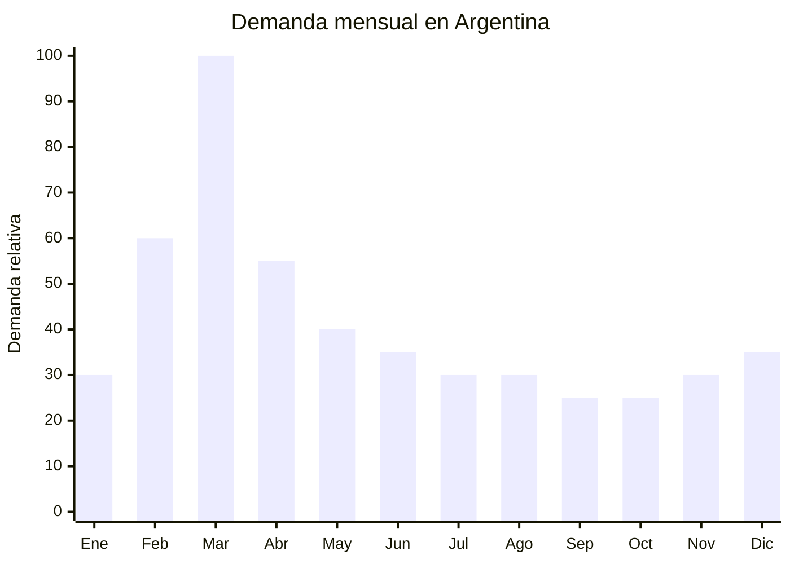

# Candados de combinación escolares

> **Capítulo NCM 83** — Manufacturas diversas de metales comunes | **Temporada:** Otoño (Mar–May)

## Qué es y por qué importarlo

Los candados de combinación son dispositivos de seguridad que se abren mediante una secuencia numérica de 3 o 4 dígitos, sin necesidad de llave. Son especialmente populares en el ámbito escolar para asegurar lockers, casilleros de gimnasio, mochilas y bolsos. Su ventaja principal es que no se necesita cargar una llave (que los estudiantes pierden frecuentemente). Los materiales van desde aleación de zinc y aluminio (económicos) hasta cuerpo de acero inoxidable (reforzados).

En Argentina, el pico de demanda se concentra en **marzo** con la vuelta a clases. Escuelas, colegios, universidades, clubes y gimnasios requieren candados para lockers y casilleros. Además, el formato de combinación es preferido por padres de niños y adolescentes porque elimina el problema de la llave perdida. La demanda secundaria incluye viajeros (candados TSA para valijas) y uso doméstico.

Yiwu y Wenzhou (Zhejiang, China) son los principales centros de producción de candados económicos, con fábricas que ofrecen personalización de colores, packaging y logo a precios FOB desde USD 0.50 por unidad. El MOQ es relativamente bajo (500-2,000 unidades), lo que permite pruebas de mercado accesibles.

## Datos clave

| Dato | Valor |
|------|-------|
| **Posiciones NCM típicas** | 8301.10.00 (candados) |
| **Derecho de importación** | 18% (DIE) + 3% tasa estadística |
| **Rango FOB típico** | USD 0.50 — USD 2.50 por unidad |
| **Precio de venta en Argentina** | ARS 2.000 — ARS 8.000 |
| **Margen bruto estimado** | 200% — 400% |
| **MOQ típico** | 500 — 2,000 unidades |
| **Demanda en MercadoLibre** | Media-Alta (pico marzo) |
| **Competencia en MercadoLibre** | Media |
| **Dificultad para importar** | Baja |
| **Certificaciones necesarias** | Ninguna obligatoria |
| **Antidumping** | No |

## Variantes y subtipos más comunes

| Subtipo / Variante | FOB aprox. | Venta AR aprox. | Nota |
|--------------------|-----------|-----------------|------|
| Candado combinación 3 dígitos económico | USD 0.50 — 1.00 | ARS 2.000 — 4.000 | Entrada, mayor volumen |
| Candado combinación 4 dígitos reforzado | USD 1.00 — 2.00 | ARS 3.500 — 6.000 | **Más vendido** |
| Candado combinación colores surtidos | USD 0.60 — 1.20 | ARS 2.500 — 5.000 | Popular escolar (rosa, azul, verde) |
| Candado TSA combinación (para viaje) | USD 1.50 — 2.50 | ARS 4.000 — 8.000 | Aeropuertos, valijas |
| Candado cable flexible combinación | USD 0.80 — 1.80 | ARS 3.000 — 6.000 | Bicicletas, mochilas |
| Pack x3 candados combinación | USD 1.50 — 3.50 | ARS 5.000 — 12.000 | Formato familia/escolar |

## Regulaciones y requisitos

<Tabs>
  <Tab title="Certificaciones">
    | Organismo | Requiere | Detalle |
    |-----------|----------|---------|
    | ARCA (Aduana) | Sí siempre | Despacho estándar |
    | ANMAT | No | No es producto de salud |
    | ENACOM | No | No es electrónico |
    | SENASA | No | No es alimento |
    | INTI | No obligatorio | Sin norma IRAM obligatoria para candados de combinación |

    **Recomendación:** Verificar que el mecanismo de combinación sea suave y confiable. Candados donde los dígitos se traban o no alinean correctamente generan devoluciones masivas. Solicitar prueba de apertura/cierre (mínimo 1,000 ciclos sin fallo).
  </Tab>

  <Tab title="Etiquetado">
    | Requisito | Aplica |
    |-----------|--------|
    | País de origen | Sí |
    | Datos del importador | Sí (nombre, dirección, CUIT) |
    | Material | Recomendable |
    | Instrucciones de uso | Sí (cómo setear la combinación) |
    | Combinación por defecto | Sí (indicar la combinación de fábrica: generalmente 000 o 0000) |
  </Tab>

  <Tab title="Restricciones">
    - Sin medidas antidumping vigentes.
    - Sin restricciones específicas.
    - Los candados TSA deben tener la certificación TSA genuina con el logo de Travel Sentry. No se puede usar el logo TSA sin licencia.
    - NO declarar nivel de seguridad que no corresponda (ej: "alta seguridad" para un candado de zinc de 3 dígitos).
  </Tab>
</Tabs>

## Logística de importación

| Factor | Detalle |
|--------|---------|
| **Peso por unidad** | 50 — 150 g |
| **Volumen por unidad** | Mínimo (5-8 cm) |
| **Unidades por caja (master carton)** | 100 — 500 unidades |
| **Peso por caja** | 8 — 20 kg |
| **Cajas por contenedor 20'** | ~1,500 — 3,000 cajas |
| **Unidades por contenedor 20'** | ~200,000 — 500,000 unidades |
| **Fragilidad** | Muy baja (metal) |
| **Requiere embalaje especial** | No — blister individual o bolsa OPP |

<Tip>
Los candados son compactos y pesados para su tamaño (el flete se cobra por peso). Para primeras importaciones, el envío aéreo/courier es viable: 100 candados pesan aproximadamente 10-15 kg. Importar en enero-febrero para tener stock listo para el pico de marzo (vuelta a clases). Ofrecer colores surtidos es clave para el público escolar.
</Tip>

## Estacionalidad y timing de compra

| Dato | Valor |
|------|-------|
| **Meses de mayor venta** | Febrero — Marzo (vuelta a clases) |
| **Pedido ideal (marítimo)** | Noviembre — Diciembre (para llegar en febrero) |
| **Pedido ideal (aéreo/courier)** | Enero — Febrero (llega en 7-15 días) |
| **Anticipación mínima** | 2-3 meses (marítimo) / 1 mes (courier) |

## Ventajas y riesgos

<CardGroup cols={2}>
  <Card title="Ventajas" icon="circle-check">
    - Márgenes altos (200-400%)
    - Sin certificaciones obligatorias
    - Sin antidumping
    - Producto compacto y resistente (logística fácil)
    - MOQ bajo (500 unidades)
    - Demanda predecible (vuelta a clases)
    - Producto de reposición (se olvidan combinaciones, se pierden)
    - Colores atractivos impulsan compra escolar
  </Card>

  <Card title="Riesgos y desventajas" icon="triangle-exclamation">
    - Demanda MUY concentrada en marzo — fuera de temporada baja rotación
    - Mecanismo de combinación defectuoso = devoluciones masivas
    - Ticket bajo — necesita volumen
    - Competencia con ferreterías y librerías escolares
    - Candados baratos dan imagen de baja seguridad
    - TSA requiere licencia genuina
  </Card>
</CardGroup>

## Palabras clave para buscar en Alibaba

`combination padlock wholesale` · `3 digit combination lock school` · `4 digit padlock locker` · `colorful combination padlock` · `TSA combination lock wholesale` · `cable combination lock Yiwu` · `zinc alloy padlock combination`

## Fuentes

- MercadoLibre Argentina — búsqueda "candado combinación", "candado locker escolar"
- Alibaba.com — proveedores de combination padlock Yiwu/Wenzhou
- Nomenclador Arancelario Argentino — partida 8301.10.00
