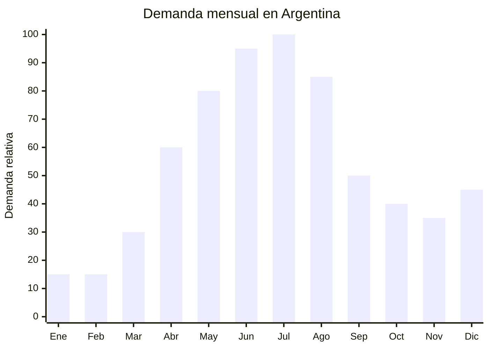

# Portavelas y candelabros metálicos decorativos

> **Capítulo NCM 83** — Manufacturas diversas de metales comunes | **Temporada:** Otoño (Mar–May)

## Qué es y por qué importarlo

Los portavelas y candelabros metálicos son accesorios decorativos diseñados para sostener velas de diferentes formatos: velas tea light (pequeñas), velas cilíndricas (pillar), velas cónicas (taper) y velas en frasco. Se fabrican en hierro forjado, acero con acabado negro mate, dorado, cobrizo o plateado, y van desde diseños minimalistas nórdicos hasta piezas ornamentales barrocas. Incluyen portavelas individuales, candelabros de múltiples brazos, linternas metálicas con vidrio y faroles decorativos.

La tendencia "hygge" (confort hogareño de origen escandinavo) ha consolidado a los portavelas como elementos esenciales de la decoración otoño-invernal. En Argentina, la demanda crece significativamente entre abril y agosto, cuando la gente pasa más tiempo en interiores y busca crear ambientes cálidos y acogedores. Los portavelas complementan perfectamente la venta de velas aromáticas, creando oportunidades de venta cruzada.

Yiwu y Shantou (China) son los principales centros de producción de decoración metálica, con miles de diseños disponibles y personalización de color y acabado. Los precios FOB de USD 1 a USD 8 por pieza permiten márgenes muy atractivos, especialmente en piezas decorativas que los consumidores perciben como de alto valor.

## Datos clave

| Dato | Valor |
|------|-------|
| **Posiciones NCM típicas** | 8306.21.00 (estatuillas y demás objetos de adorno de metales comunes, plateados, dorados o platinados) / 8306.29.00 (los demás) |
| **Derecho de importación** | 18% (DIE) + 3% tasa estadística |
| **Rango FOB típico** | USD 1.00 — USD 8.00 por pieza |
| **Precio de venta en Argentina** | ARS 3.000 — ARS 20.000 |
| **Margen bruto estimado** | 200% — 400% |
| **MOQ típico** | 200 — 1,000 unidades |
| **Demanda en MercadoLibre** | Media |
| **Competencia en MercadoLibre** | Media-Baja |
| **Dificultad para importar** | Baja |
| **Certificaciones necesarias** | Ninguna obligatoria |
| **Antidumping** | No |

## Variantes y subtipos más comunes

| Subtipo / Variante | FOB aprox. | Venta AR aprox. | Nota |
|--------------------|-----------|-----------------|------|
| Portavelas tea light individual metal | USD 1.00 — 2.00 | ARS 3.000 — 6.000 | Entrada, decoración diaria |
| Candelabro 3 brazos para vela cónica | USD 3.00 — 6.00 | ARS 8.000 — 16.000 | **Más vendido**, elegante |
| Candelabro 5 brazos estilo vintage | USD 5.00 — 8.00 | ARS 12.000 — 20.000 | Pieza central mesa |
| Linterna metálica con vidrio (farol) | USD 3.00 — 7.00 | ARS 8.000 — 18.000 | Indoor/outdoor |
| Portavelas geométrico minimalista | USD 1.50 — 3.50 | ARS 4.000 — 10.000 | Tendencia nórdica |
| Set x3 portavelas diferentes alturas | USD 3.00 — 6.00 | ARS 8.000 — 15.000 | Composición decorativa |

## Regulaciones y requisitos

<Tabs>
  <Tab title="Certificaciones">
    | Organismo | Requiere | Detalle |
    |-----------|----------|---------|
    | ARCA (Aduana) | Sí siempre | Despacho estándar |
    | ANMAT | No | No es producto de salud ni cosmético |
    | ENACOM | No | No es electrónico |
    | SENASA | No | No es alimento |
    | INTI | No obligatorio | Sin norma IRAM específica para decoración |

    **Recomendación:** Verificar la estabilidad del candelabro: debe soportar el peso de las velas sin volcarse. Solicitar acabado resistente a rayones y verificar que la pintura no se descascare con el calor de la vela.
  </Tab>

  <Tab title="Etiquetado">
    | Requisito | Aplica |
    |-----------|--------|
    | País de origen | Sí |
    | Datos del importador | Sí (nombre, dirección, CUIT) |
    | Material | Recomendable ("Hierro forjado", "Acero con acabado negro mate") |
    | Instrucciones de seguridad | Recomendable ("No dejar vela encendida sin supervisión") |
    | Tipo de vela compatible | Recomendable indicar |
  </Tab>

  <Tab title="Restricciones">
    - Sin medidas antidumping vigentes.
    - Sin restricciones específicas de importación.
    - Si incluye vidrio (linternas/faroles), considerar el riesgo de rotura en transporte.
    - Verificar que el acabado de pintura resista el calor directo de la llama sin desprenderse ni generar humo.
  </Tab>
</Tabs>

## Logística de importación

| Factor | Detalle |
|--------|---------|
| **Peso por unidad** | 200 g — 2 kg (según tamaño) |
| **Volumen por unidad** | Variable (portavelas compacto vs. candelabro grande) |
| **Unidades por caja (master carton)** | 6 — 24 unidades |
| **Peso por caja** | 5 — 20 kg |
| **Cajas por contenedor 20'** | ~800 — 2,000 cajas |
| **Unidades por contenedor 20'** | ~10,000 — 30,000 unidades |
| **Fragilidad** | Baja (metal solo) / Media (piezas con vidrio) |
| **Requiere embalaje especial** | Protección anti-rayones para acabados pintados. Foam para piezas con vidrio |

<Tip>
Los portavelas y candelabros son excelentes productos para venta cruzada con velas aromáticas. Si ya importás velas (Cap. 34), agregar portavelas metálicos al embarque optimiza el contenedor y permite ofrecer sets decorativos con ticket significativamente mayor. Un set "vela aromática + portavela metálico" puede venderse a ARS 10,000-25,000 con margen superior al de cada producto individual.
</Tip>

## Estacionalidad y timing de compra

| Dato | Valor |
|------|-------|
| **Meses de mayor venta** | Abril — Agosto (otoño-invierno) + diciembre (regalos) |
| **Pedido ideal (marítimo)** | Enero — Febrero (para llegar en abril) |
| **Pedido ideal (aéreo)** | Marzo (para piezas livianas) |
| **Anticipación mínima** | 3 meses antes del pico |

## Ventajas y riesgos

<CardGroup cols={2}>
  <Card title="Ventajas" icon="circle-check">
    - Márgenes altos (200-400%)
    - Sin certificaciones obligatorias
    - Sin antidumping
    - Tendencia hygge en crecimiento sostenido
    - Complementa venta de velas (venta cruzada)
    - Competencia baja en MercadoLibre
    - Producto perenne (no caduca, no se desgasta)
    - Alta percepción de valor decorativo
  </Card>

  <Card title="Riesgos y desventajas" icon="triangle-exclamation">
    - Producto de nicho — volumen menor que productos masivos
    - Pintura que se descascara con el calor = devoluciones
    - Piezas con vidrio aumentan riesgo de rotura
    - Tendencias decorativas cambian (estilo nórdico vs. barroco vs. industrial)
    - Candelabros grandes son voluminosos para el flete
    - Competencia con bazares de decoración locales
  </Card>
</CardGroup>

## Palabras clave para buscar en Alibaba

`metal candle holder wholesale` · `iron candlestick wholesale` · `tealight holder metal` · `candelabra metal decorative` · `hurricane lantern metal glass` · `Nordic candle holder minimalist` · `black metal candle stand wholesale`

## Fuentes

- MercadoLibre Argentina — búsqueda "portavelas metal", "candelabro decorativo"
- Alibaba.com — proveedores de metal candle holder Yiwu/Shantou
- Nomenclador Arancelario Argentino — partida 8306
