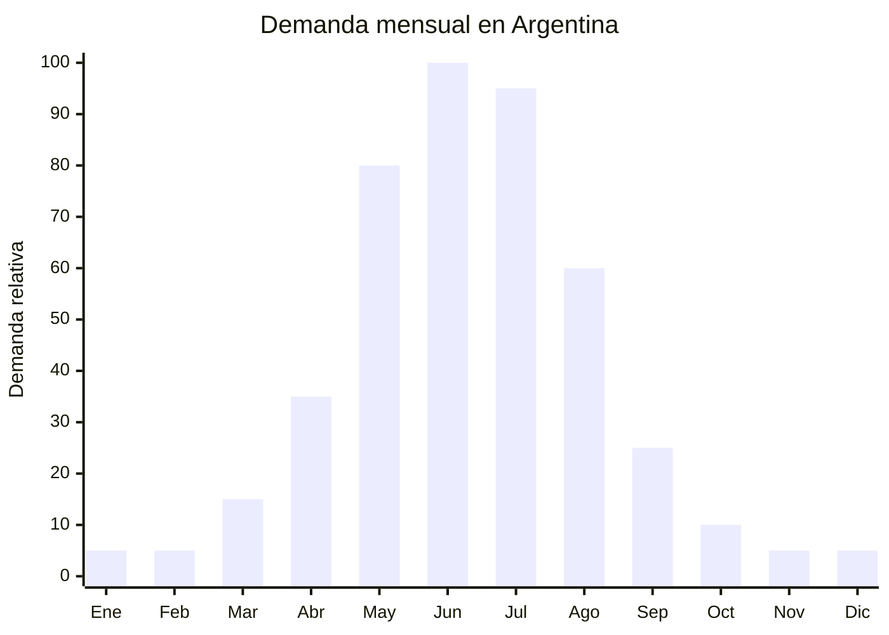

# Calefactores eléctricos convectores y paneles radiantes

> **Capítulo NCM 84** — Reactores nucleares, calderas, máquinas, aparatos y artefactos mecánicos | **Temporada:** Otoño (Mar–May)

<Warning>
**CERTIFICACIÓN OBLIGATORIA:** Desde octubre 2025, los calefactores eléctricos requieren **S-Mark + certificación IRAM + código QR** para comercializarse en Argentina. Sin estos sellos, el producto NO puede despacharse en aduana ni venderse legalmente. La barrera de entrada es **MEDIA-ALTA**. Consultar con laboratorio certificador (INTI, TUV, Bureau Veritas) antes de importar.
</Warning>

## Qué es y por qué importarlo

Los calefactores eléctricos convectores y paneles radiantes son el producto #1 de climatización para el invierno argentino. Los convectores funcionan por convección natural o forzada (con ventilador), calentando el aire que circula a través de una resistencia eléctrica. Los paneles radiantes (tipo placa o panel de pared) emiten calor infrarrojo de baja intensidad, calentando objetos y personas directamente sin mover aire. Las potencias más comunes son 1000W, 1500W y 2000W.

La demanda explota entre mayo y julio, pero la preparación comienza en otoño (marzo-abril) cuando los comercios empiezan a stockearse. En Argentina, los calefactores eléctricos dominan el mercado urbano porque no requieren instalación de gas, son portátiles y se enchufan directamente. Marcas como Atma, Liliana, Peabody, Midea y Enova compiten activamente, pero el mercado es lo suficientemente grande para marcas nuevas con buena relación precio-calidad.

China (especialmente Cixi y Ningbo en Zhejiang, y Guangdong) es el principal fabricante mundial de calefactores eléctricos. Las fábricas producen con certificaciones internacionales (CE, CB, SAA) y pueden adaptar la producción para cumplir con normas IRAM argentinas. El desafío principal no es el producto sino la certificación: obtener S-Mark e IRAM es un proceso que requiere tiempo (3-6 meses) e inversión (USD 3,000-8,000 por modelo).

## Datos clave

| Dato | Valor |
|------|-------|
| **Posiciones NCM típicas** | 8516.29.00 (aparatos eléctricos de calefacción de locales, los demás) |
| **Derecho de importación** | 20% (DIE) + 3% tasa estadística |
| **Rango FOB típico** | USD 8.00 — USD 25.00 por unidad |
| **Precio de venta en Argentina** | ARS 20.000 — ARS 80.000 |
| **Margen bruto estimado** | 80% — 200% |
| **MOQ típico** | 500 — 2,000 unidades |
| **Demanda en MercadoLibre** | Muy Alta |
| **Competencia en MercadoLibre** | Alta |
| **Dificultad para importar** | **Media-Alta** (S-Mark + IRAM + QR obligatorios) |
| **Certificaciones necesarias** | **S-Mark + IRAM + QR (obligatorio desde Oct. 2025)** |
| **Antidumping** | No |

## Variantes y subtipos más comunes

| Subtipo / Variante | FOB aprox. | Venta AR aprox. | Nota |
|--------------------|-----------|-----------------|------|
| Convector eléctrico 1000W básico | USD 8.00 — 12.00 | ARS 20.000 — 35.000 | Ambientes pequeños |
| Convector eléctrico 1500W con termostato | USD 10.00 — 16.00 | ARS 30.000 — 50.000 | **Más vendido** |
| Convector eléctrico 2000W con turbo | USD 14.00 — 20.00 | ARS 40.000 — 65.000 | Ambientes grandes |
| Panel radiante de pared 1000W | USD 12.00 — 18.00 | ARS 35.000 — 60.000 | Bajo consumo relativo |
| Panel radiante de pie 1500W | USD 14.00 — 22.00 | ARS 40.000 — 70.000 | Portátil + decorativo |
| Convector programable WiFi 2000W | USD 18.00 — 25.00 | ARS 55.000 — 80.000 | Smart home, premium |

## Regulaciones y requisitos

<Tabs>
  <Tab title="Certificaciones">
    | Organismo | Requiere | Detalle |
    |-----------|----------|---------|
    | ARCA (Aduana) | Sí siempre | Despacho estándar |
    | **S-Mark (Seguridad eléctrica)** | **SÍ — OBLIGATORIO** | Marca de seguridad eléctrica argentina. Sin S-Mark no se puede comercializar. Desde octubre 2025 obligatorio con QR |
    | **IRAM** | **SÍ — OBLIGATORIO** | Norma IRAM 62.115 (aparatos de calefacción eléctrica de ambiente). Verificar norma específica según tipo de calefactor |
    | **Código QR** | **SÍ — OBLIGATORIO** | Desde octubre 2025, el producto debe llevar un código QR vinculado al certificado de conformidad |
    | ENACOM | Solo si tiene WiFi/Bluetooth | Modelo WiFi requiere habilitación ENACOM |
    | SENASA | No | No es alimento |

    **Proceso de certificación:**
    1. Enviar muestras a laboratorio certificador argentino (INTI, TUV, Bureau Veritas)
    2. Ensayos según norma IRAM correspondiente (4-8 semanas)
    3. Obtención del certificado de conformidad
    4. Registro en sistema S-Mark con generación de QR
    5. Tiempo total estimado: 3-6 meses
    6. Costo estimado: USD 3,000-8,000 por modelo
  </Tab>

  <Tab title="Etiquetado">
    | Requisito | Aplica |
    |-----------|--------|
    | País de origen | Sí |
    | Datos del importador | Sí (razón social, CUIT, domicilio) |
    | Potencia (W) | **Sí — obligatorio** |
    | Tensión (V) | **Sí — obligatorio** (220V 50Hz Argentina) |
    | Marca S-Mark | **Sí — obligatorio** |
    | Código QR certificación | **Sí — obligatorio desde Oct. 2025** |
    | Instrucciones de uso y seguridad | Sí en español |
    | Número de norma IRAM | Sí |
  </Tab>

  <Tab title="Restricciones">
    - **S-Mark es excluyente:** Sin certificación, el producto queda retenido en aduana y NO puede venderse en Argentina bajo ninguna circunstancia.
    - Los calefactores DEBEN funcionar a 220V 50Hz (tensión argentina). Productos diseñados para 110V o 60Hz NO son aptos.
    - Si tiene función WiFi/Bluetooth, requiere además habilitación ENACOM.
    - Fusible térmico y protección contra sobrecalentamiento son requisitos de la norma IRAM.
    - Tip-over switch (apagado automático por volcamiento) es recomendable y valorado por el consumidor.
  </Tab>
</Tabs>

## Logística de importación

| Factor | Detalle |
|--------|---------|
| **Peso por unidad** | 2 — 6 kg |
| **Volumen por unidad** | Medio-Alto (cajas de 50-80 cm de largo) |
| **Unidades por caja (master carton)** | 1 — 4 unidades |
| **Peso por caja** | 5 — 15 kg |
| **Cajas por contenedor 20'** | ~800 — 1,500 cajas |
| **Unidades por contenedor 20'** | ~2,000 — 5,000 unidades |
| **Fragilidad** | Baja-Media (paneles de vidrio son frágiles) |
| **Requiere embalaje especial** | Estándar para convectores. Protección reforzada para paneles con frente de vidrio |

<Tip>
El factor crítico en calefactores NO es la logística sino la certificación. Antes de pedir cotización al proveedor chino, iniciar el proceso de certificación S-Mark/IRAM con un laboratorio argentino. Enviar 2-3 muestras del modelo exacto que se va a importar. Si el modelo no pasa los ensayos, solicitar al proveedor las modificaciones necesarias y re-ensayar. No comprar stock hasta tener la certificación aprobada.
</Tip>

## Estacionalidad y timing de compra

| Dato | Valor |
|------|-------|
| **Meses de mayor venta** | Mayo — Julio (invierno pleno) |
| **Pedido ideal (marítimo)** | Enero — Febrero (para llegar en abril-mayo) |
| **Anticipación certificación** | Iniciar S-Mark 6-9 meses antes del pico (septiembre-noviembre del año anterior) |
| **Anticipación mínima total** | 6-9 meses incluyendo certificación |

## Ventajas y riesgos

<CardGroup cols={2}>
  <Card title="Ventajas" icon="circle-check">
    - Producto #1 de climatización invernal
    - Demanda masiva y predecible
    - Ticket medio-alto (ARS 20,000-80,000)
    - Sin antidumping
    - Mercado en crecimiento (más departamentos = más demanda eléctrica)
    - China ofrece excelente relación calidad/precio
    - Paneles WiFi smart home como diferenciador premium
  </Card>

  <Card title="Riesgos y desventajas" icon="triangle-exclamation">
    - **Certificación S-Mark + IRAM obligatoria** (inversión USD 3,000-8,000 por modelo)
    - Proceso de certificación demora 3-6 meses
    - Competencia con marcas establecidas (Atma, Liliana, Peabody)
    - Producto estacional con demanda concentrada en 3 meses
    - Servicio técnico post-venta necesario
    - Stock sobrante de invierno pierde valor hasta próximo año
  </Card>
</CardGroup>

## Palabras clave para buscar en Alibaba

`electric convector heater wholesale` · `panel heater 1500W 220V` · `electric wall heater radiator` · `convection heater with thermostat` · `infrared panel heater wholesale` · `WiFi smart heater 2000W` · `electric heater CE CB certificate`

## Fuentes

- MercadoLibre Argentina — búsqueda "calefactor eléctrico convector", "panel radiante"
- Alibaba.com — proveedores de electric convector heater
- INTI — Requisitos de certificación S-Mark para electrodomésticos
- Nomenclador Arancelario Argentino — partida 8516.29.00
- Resolución S-Mark con QR obligatorio (octubre 2025)
