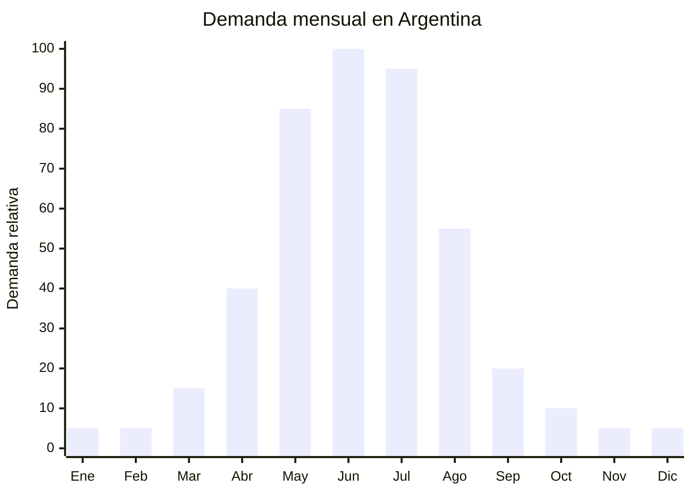

# Calefactores halógenos e infrarrojos de cuarzo

> **Capítulo NCM 84** — Reactores nucleares, calderas, máquinas, aparatos y artefactos mecánicos | **Temporada:** Otoño (Mar–May)

<Warning>
**CERTIFICACIÓN OBLIGATORIA:** Al igual que todos los calefactores eléctricos, los modelos halógenos e infrarrojos de cuarzo requieren **S-Mark + IRAM + código QR** para comercializarse en Argentina. Además, los tubos de cuarzo son **extremadamente frágiles** — embalar con máximo cuidado.
</Warning>

## Qué es y por qué importarlo

Los calefactores halógenos e infrarrojos de cuarzo son aparatos de calefacción que utilizan tubos de cuarzo o lámparas halógenas como elemento calefactor. Emiten calor radiante infrarrojo que calienta directamente objetos y personas (no el aire), proporcionando una sensación de calor instantáneo apenas se encienden. Son ideales para calentamiento localizado y puntual: frente al escritorio, junto al sillón, en el baño. Las potencias van de 800W a 2200W, típicamente con selector de 2 o 3 niveles.

La ventaja principal frente a los convectores es la **inmediatez**: se sienten calientes en segundos, mientras un convector tarda minutos en calentar el ambiente. Son más económicos de compra (tanto FOB como precio de venta), lo que los convierte en la opción de entrada para hogares de presupuesto ajustado. En Argentina, precios de venta entre ARS 19,995 y ARS 53,995 los posicionan como accesibles.

China (Cixi, Ningbo, Foshan) produce la gran mayoría de calefactores halógenos del mercado mundial. Los precios FOB desde USD 4 los convierten en uno de los calefactores más accesibles de importar, pero la fragilidad de los tubos de cuarzo requiere embalaje reforzado y la certificación S-Mark/IRAM es igualmente obligatoria.

## Datos clave

| Dato | Valor |
|------|-------|
| **Posiciones NCM típicas** | 8516.29.00 (aparatos eléctricos de calefacción de locales, los demás) |
| **Derecho de importación** | 20% (DIE) + 3% tasa estadística |
| **Rango FOB típico** | USD 4.00 — USD 15.00 por unidad |
| **Precio de venta en Argentina** | ARS 19.995 — ARS 53.995 |
| **Margen bruto estimado** | 100% — 250% |
| **MOQ típico** | 500 — 2,000 unidades |
| **Demanda en MercadoLibre** | Alta |
| **Competencia en MercadoLibre** | Alta |
| **Dificultad para importar** | **Media-Alta** (S-Mark + IRAM + fragilidad tubos) |
| **Certificaciones necesarias** | **S-Mark + IRAM + QR (obligatorio)** |
| **Antidumping** | No |

## Variantes y subtipos más comunes

| Subtipo / Variante | FOB aprox. | Venta AR aprox. | Nota |
|--------------------|-----------|-----------------|------|
| Calefactor halógeno 2 velas 800W | USD 4.00 — 6.00 | ARS 19.995 — 28.000 | Entrada, compacto |
| Calefactor halógeno 3 velas 1200W | USD 5.00 — 8.00 | ARS 25.000 — 38.000 | **Más vendido** |
| Calefactor infrarrojo cuarzo 1200W | USD 5.00 — 9.00 | ARS 25.000 — 40.000 | Calor más suave que halógeno |
| Calefactor halógeno oscilante 1600W | USD 7.00 — 12.00 | ARS 30.000 — 45.000 | Distribución amplia |
| Calefactor infrarrojo cuarzo 2200W | USD 8.00 — 15.00 | ARS 35.000 — 53.995 | Ambientes grandes |
| Calefactor tipo torre infrarrojo | USD 10.00 — 15.00 | ARS 38.000 — 53.995 | Diseño moderno |

## Regulaciones y requisitos

<Tabs>
  <Tab title="Certificaciones">
    | Organismo | Requiere | Detalle |
    |-----------|----------|---------|
    | ARCA (Aduana) | Sí siempre | Despacho estándar |
    | **S-Mark** | **SÍ — OBLIGATORIO** | Seguridad eléctrica argentina |
    | **IRAM** | **SÍ — OBLIGATORIO** | Norma IRAM 62.115 (calefacción eléctrica de ambiente) |
    | **Código QR** | **SÍ — OBLIGATORIO** | Desde octubre 2025 |
    | ENACOM | No (salvo modelos smart) | Solo si tiene WiFi/Bluetooth |
    | SENASA | No | No es alimento |

    **Proceso idéntico al de convectores:**
    1. Enviar muestras a laboratorio certificador (INTI, TUV, Bureau Veritas)
    2. Ensayos según norma IRAM (4-8 semanas)
    3. Obtención certificado + S-Mark + QR
    4. Tiempo total: 3-6 meses
    5. Costo: USD 3,000-8,000 por modelo

    **Nota:** Los tubos halógenos y de cuarzo son consumibles que se queman con el uso. Considerar importar repuestos para servicio post-venta.
  </Tab>

  <Tab title="Etiquetado">
    | Requisito | Aplica |
    |-----------|--------|
    | País de origen | Sí |
    | Datos del importador | Sí (razón social, CUIT, domicilio) |
    | Potencia (W) | **Sí — obligatorio** |
    | Tensión (V) | **Sí — obligatorio** (220V 50Hz) |
    | Marca S-Mark | **Sí — obligatorio** |
    | Código QR certificación | **Sí — obligatorio** |
    | Instrucciones de seguridad | Sí en español |
    | Distancia mínima de materiales inflamables | Sí |
  </Tab>

  <Tab title="Restricciones">
    - **S-Mark excluyente** — sin certificación, retención en aduana.
    - Deben funcionar a **220V 50Hz**.
    - Los tubos halógenos/cuarzo alcanzan temperaturas de **300-700°C** en la superficie. La norma IRAM exige rejilla de protección que impida el contacto directo.
    - Protección contra volcamiento (tip-over switch) obligatoria en la norma.
    - No deben usarse cerca de cortinas, ropa u otros materiales inflamables.
  </Tab>
</Tabs>

## Logística de importación

| Factor | Detalle |
|--------|---------|
| **Peso por unidad** | 1.5 — 4 kg |
| **Volumen por unidad** | Medio (cajas de 40-70 cm) |
| **Unidades por caja (master carton)** | 1 — 4 unidades |
| **Peso por caja** | 4 — 12 kg |
| **Cajas por contenedor 20'** | ~1,000 — 2,000 cajas |
| **Unidades por contenedor 20'** | ~3,000 — 6,000 unidades |
| **Fragilidad** | **ALTA — tubos de cuarzo y halógenos son MUY frágiles** |
| **Requiere embalaje especial** | **Sí — CRÍTICO.** Foam moldeado alrededor de cada tubo, caja individual rígida, master carton con refuerzo. Rotura de tubos = producto inutilizable |

<Tip>
Los tubos de cuarzo y halógenos son el punto crítico de este producto. Un golpe en transporte puede romper los tubos y dejar el calefactor inutilizable. Exigir al proveedor embalaje con foam moldeado que envuelva completamente cada tubo, y negociar un porcentaje de repuesto de tubos (5-10% adicional) en el embarque. Contratar seguro de transporte con cobertura de rotura.
</Tip>

## Estacionalidad y timing de compra

| Dato | Valor |
|------|-------|
| **Meses de mayor venta** | Mayo — Julio (invierno) |
| **Pedido ideal (marítimo)** | Enero — Febrero (para llegar en abril-mayo) |
| **Anticipación certificación** | Iniciar S-Mark 6-9 meses antes (septiembre-noviembre del año anterior) |
| **Anticipación mínima total** | 6-9 meses incluyendo certificación |

## Ventajas y riesgos

<CardGroup cols={2}>
  <Card title="Ventajas" icon="circle-check">
    - Precio de entrada accesible (FOB desde USD 4)
    - Calor instantáneo = satisfacción inmediata del usuario
    - Alta demanda en segmento económico
    - Sin antidumping
    - Más liviano que convectores (menor flete por unidad)
    - Bajo consumo en potencias bajas (800W)
    - Producto de reposición (tubos se queman)
  </Card>

  <Card title="Riesgos y desventajas" icon="triangle-exclamation">
    - **S-Mark + IRAM obligatorio** (misma barrera que convectores)
    - **Tubos MUY frágiles** — rotura en transporte significativa
    - Competencia alta con marcas establecidas
    - Percepción de producto "barato" y de baja gama
    - Tubos son consumibles — necesita servicio post-venta
    - Riesgo de incendio si se usa cerca de materiales inflamables
    - Estacionalidad extrema (3 meses de venta fuerte)
  </Card>
</CardGroup>

## Palabras clave para buscar en Alibaba

`halogen heater wholesale` · `quartz heater 1200W 220V` · `infrared quartz heater` · `halogen heater oscillating` · `quartz tube heater factory` · `electric radiant heater wholesale` · `halogen heater CE CB 220V`

## Fuentes

- MercadoLibre Argentina — búsqueda "calefactor halógeno", "calefactor cuarzo infrarrojo"
- Alibaba.com — proveedores de halogen heater / quartz heater
- INTI — Requisitos S-Mark para calefactores eléctricos
- Nomenclador Arancelario Argentino — partida 8516.29.00
