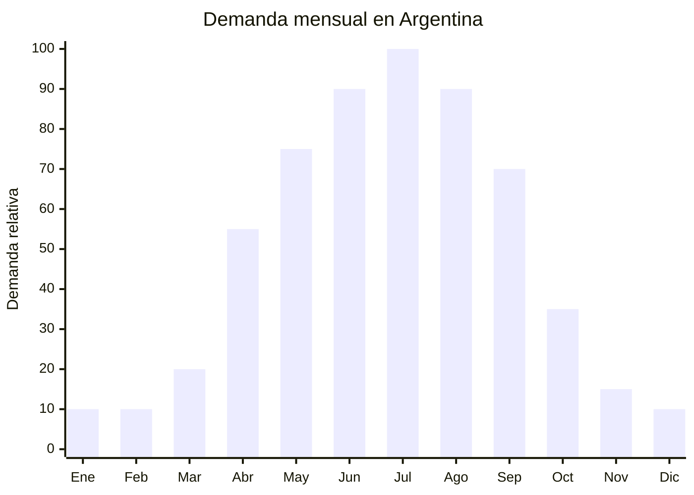

# Deshumidificadores portátiles

> **Capítulo NCM 84** — Reactores nucleares, calderas, máquinas, aparatos y artefactos mecánicos | **Temporada:** Otoño (Mar–May)

## Qué es y por qué importarlo

Los deshumidificadores portátiles son aparatos que extraen la humedad excesiva del aire, condensándola y almacenándola en un tanque interno. Existen dos tecnologías principales: **Peltier (termoeléctrico)** — compacto, silencioso, bajo consumo, capacidad de extracción de 300-500 ml/día, ideal para ambientes pequeños (closets, baños, habitaciones); y **compresor** — más potente, capacidad de 10-20 litros/día, para ambientes grandes (livings, sótanos, depósitos).

En Argentina, la humedad se convierte en problema entre abril y septiembre, especialmente en zonas como Buenos Aires, Rosario y la costa atlántica. La condensación en ventanas, el moho en paredes y armarios, y el olor a humedad en ropa impulsan la demanda de deshumidificadores. Es un producto que ha ganado mucha visibilidad en los últimos años gracias a la difusión en redes sociales sobre problemas de humedad en el hogar.

China produce ambas tecnologías a gran escala. Los Peltier son significativamente más fáciles y económicos de importar (FOB USD 15-30, peso 1-2 kg, sin refrigerante gaseoso), mientras que los de compresor (FOB USD 56-66) requieren consideraciones adicionales por el gas refrigerante. Para importadores principiantes, el deshumidificador Peltier es la opción recomendada.

## Datos clave

| Dato | Valor |
|------|-------|
| **Posiciones NCM típicas** | 8415.90.00 (partes de acondicionadores) / 8479.89.00 (máquinas y aparatos mecánicos, los demás) |
| **Derecho de importación** | 14-20% (DIE según NCM exacto) + 3% tasa estadística |
| **Rango FOB típico** | USD 15.00 — USD 30.00 (Peltier) / USD 56.00 — USD 66.00 (compresor) |
| **Precio de venta en Argentina** | ARS 30.000 — ARS 150.000 |
| **Margen bruto estimado** | 80% — 200% |
| **MOQ típico** | 200 — 500 unidades (Peltier) / 100 — 300 (compresor) |
| **Demanda en MercadoLibre** | Media-Alta |
| **Competencia en MercadoLibre** | Media |
| **Dificultad para importar** | Moderada (Peltier) / Alta (compresor — gas refrigerante) |
| **Certificaciones necesarias** | S-Mark recomendable. Verificar obligatoriedad según potencia y clasificación |
| **Antidumping** | No |

## Variantes y subtipos más comunes

| Subtipo / Variante | FOB aprox. | Venta AR aprox. | Nota |
|--------------------|-----------|-----------------|------|
| Deshumidificador Peltier 500ml/día compacto | USD 15.00 — 20.00 | ARS 30.000 — 50.000 | **Más fácil de importar** |
| Deshumidificador Peltier 800ml/día | USD 20.00 — 30.00 | ARS 45.000 — 70.000 | Ambientes medianos |
| Deshumidificador compresor 10L/día | USD 56.00 — 60.00 | ARS 80.000 — 120.000 | Semi-profesional |
| Deshumidificador compresor 20L/día | USD 60.00 — 66.00 | ARS 100.000 — 150.000 | Profesional, sótanos |
| Deshumidificador Peltier con luz UV | USD 18.00 — 25.00 | ARS 40.000 — 60.000 | Anti-moho premium |
| Deshumidificador tipo absorbente recargable | USD 3.00 — 8.00 | ARS 10.000 — 25.000 | Sin electricidad, gel de sílice |

## Regulaciones y requisitos

<Tabs>
  <Tab title="Certificaciones">
    | Organismo | Requiere | Detalle |
    |-----------|----------|---------|
    | ARCA (Aduana) | Sí siempre | Despacho estándar |
    | S-Mark / IRAM | **Verificar** | Los deshumidificadores de compresor probablemente requieran S-Mark. Los Peltier de baja potencia podrían estar exentos. **Consultar con laboratorio certificador** |
    | ENACOM | Solo si tiene WiFi | Modelos smart con WiFi requieren ENACOM |
    | SENASA | No | No es alimento |
    | Protocolo de Montreal | Sí (compresor) | El gas refrigerante debe ser autorizado (R134a o R290). Gases prohibidos (R22) NO pueden importarse |

    **Recomendación para principiantes:** Empezar con deshumidificadores Peltier. No contienen gas refrigerante, son más livianos, la certificación es más simple y el FOB es menor. Los de compresor requieren manejo de gas refrigerante, documentación adicional y son más pesados/costosos.
  </Tab>

  <Tab title="Etiquetado">
    | Requisito | Aplica |
    |-----------|--------|
    | País de origen | Sí |
    | Datos del importador | Sí (razón social, CUIT, domicilio) |
    | Potencia (W) | Sí |
    | Tensión (V) | Sí (220V 50Hz) |
    | Capacidad de extracción | Sí (ml/día o L/día) |
    | Área de cobertura | Recomendable (m²) |
    | Capacidad del tanque | Sí (litros) |
    | Tipo de refrigerante | Sí (compresor) |
    | Instrucciones en español | Sí |
  </Tab>

  <Tab title="Restricciones">
    - **Gas refrigerante (compresor):** Solo gases autorizados por el Protocolo de Montreal (R134a, R290). Documentación de tipo de gas obligatoria.
    - Verificar clasificación NCM exacta con despachante — la clasificación puede variar según si tiene compresor, tecnología y potencia.
    - Deshumidificadores de compresor son más pesados (8-15 kg) y voluminosos — impacta flete.
    - Si se publicita como "anti-moho" o "purificador", verificar que las claims sean respaldables.
  </Tab>
</Tabs>

## Logística de importación

| Factor | Detalle |
|--------|---------|
| **Peso por unidad** | 1 — 3 kg (Peltier) / 8 — 15 kg (compresor) |
| **Volumen por unidad** | Bajo (Peltier) / Medio-Alto (compresor) |
| **Unidades por caja (master carton)** | 2 — 6 (Peltier) / 1 (compresor) |
| **Peso por caja** | 4 — 10 kg (Peltier) / 10 — 18 kg (compresor) |
| **Cajas por contenedor 20'** | ~1,500 — 2,500 (Peltier) / ~500 — 800 (compresor) |
| **Fragilidad** | Baja (Peltier) / Media (compresor — no inclinar) |
| **Requiere embalaje especial** | Estándar (Peltier) / Caja reforzada con indicación "este lado arriba" (compresor) |

<Tip>
Los deshumidificadores Peltier son la entrada ideal para este mercado. Son compactos (caben en un envío courier), no tienen gas refrigerante (menos documentación), pesan poco (flete bajo) y el FOB es accesible. Empezar con 100-200 unidades Peltier, validar el mercado, y luego considerar los de compresor para el segmento profesional. Los de compresor tienen mayor margen por unidad pero mayor complejidad de importación.
</Tip>

## Estacionalidad y timing de compra

| Dato | Valor |
|------|-------|
| **Meses de mayor venta** | Abril — Septiembre (otoño-invierno-inicio primavera) |
| **Pedido ideal (marítimo)** | Enero — Febrero (para llegar en abril) |
| **Pedido ideal (aéreo/courier)** | Marzo (Peltier compactos) |
| **Anticipación mínima** | 2-3 meses (Peltier courier) / 4-5 meses (compresor marítimo) |

## Ventajas y riesgos

<CardGroup cols={2}>
  <Card title="Ventajas" icon="circle-check">
    - Mercado en crecimiento (conciencia sobre humedad y moho)
    - Peltier: fácil de importar, compacto, sin gas
    - Temporada larga (abril-septiembre = 6 meses)
    - Ticket medio-alto (ARS 30,000-150,000)
    - Sin antidumping
    - Competencia moderada comparado con calefactores
    - Producto que resuelve un problema real (moho, humedad)
  </Card>

  <Card title="Riesgos y desventajas" icon="triangle-exclamation">
    - Peltier tiene capacidad limitada (500ml/día) — puede decepcionar
    - Compresor requiere manejo de gas refrigerante
    - Certificación S-Mark puede ser necesaria (verificar)
    - Producto relativamente nuevo — consumidor no siempre entiende las diferencias
    - Compresor ruidoso puede generar reclamos
    - Clasificación NCM no siempre clara (consultar despachante)
  </Card>
</CardGroup>

## Palabras clave para buscar en Alibaba

`dehumidifier Peltier wholesale` · `mini dehumidifier portable` · `thermoelectric dehumidifier 500ml` · `compressor dehumidifier 10L` · `home dehumidifier 220V wholesale` · `dehumidifier UV light wholesale` · `small dehumidifier closet wholesale`

## Fuentes

- MercadoLibre Argentina — búsqueda "deshumidificador portátil", "deshumidificador Peltier"
- Alibaba.com — proveedores de portable dehumidifier
- Nomenclador Arancelario Argentino — partidas 8415 / 8479
- Protocolo de Montreal — gases refrigerantes autorizados
