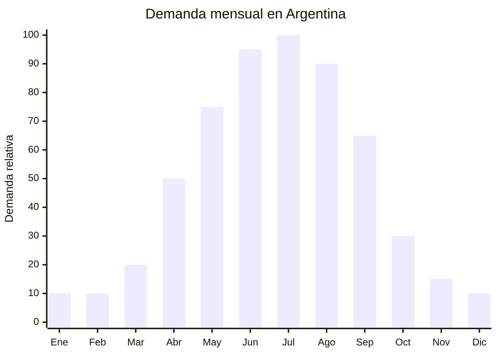

# Humidificadores ultrasónicos de ambiente

> **Capítulo NCM 84** — Reactores nucleares, calderas, máquinas, aparatos y artefactos mecánicos | **Temporada:** Otoño (Mar–May)

## Qué es y por qué importarlo

Los humidificadores ultrasónicos son aparatos que emiten una fina niebla de agua al aire para aumentar la humedad ambiental. Funcionan mediante una membrana piezoeléctrica que vibra a frecuencia ultrasónica (1.7-2.4 MHz), descomponiendo el agua en microgotas que se dispersan como vapor frío visible. Vienen en capacidades desde 300 ml (escritorio/personal) hasta 5 litros (ambiente/familiar), con funciones adicionales como luz LED, aromaterapia (bandeja para aceites esenciales), temporizador y apagado automático.

En Argentina, la demanda crece entre abril y septiembre por una razón específica: la calefacción (eléctrica o a gas) reseca el aire interior, causando sequedad en la piel, labios agrietados, garganta irritada y problemas respiratorios. El humidificador restaura el nivel de humedad confortable (40-60%). Es un producto que ha ganado popularidad significativa en los últimos años, con marcas como Gadnic y Kanji liderando las ventas en MercadoLibre.

China (especialmente Shenzhen y Foshan) domina la producción mundial de humidificadores ultrasónicos. Los precios FOB van desde USD 3 (modelos compactos 300 ml) hasta USD 25 (modelos de 3-5 litros con múltiples funciones). La tecnología ultrasónica es madura y confiable, con baja tasa de fallas. El producto es relativamente fácil de importar comparado con otros electrodomésticos.

## Datos clave

| Dato | Valor |
|------|-------|
| **Posiciones NCM típicas** | 8509.80.00 (aparatos electromecánicos de uso doméstico, los demás) / 8479.89.00 (máquinas y aparatos mecánicos, los demás) |
| **Derecho de importación** | 18-20% (DIE según NCM) + 3% tasa estadística |
| **Rango FOB típico** | USD 3.00 — USD 12.00 (300ml-1L) / USD 7.00 — USD 25.00 (3-5L) |
| **Precio de venta en Argentina** | ARS 6.000 — ARS 50.000 |
| **Margen bruto estimado** | 100% — 300% |
| **MOQ típico** | 300 — 1,000 unidades |
| **Demanda en MercadoLibre** | Alta |
| **Competencia en MercadoLibre** | Media-Alta (Gadnic, Kanji lideran) |
| **Dificultad para importar** | Moderada |
| **Certificaciones necesarias** | S-Mark verificar según potencia. ENACOM si tiene WiFi |
| **Antidumping** | No |

## Variantes y subtipos más comunes

| Subtipo / Variante | FOB aprox. | Venta AR aprox. | Nota |
|--------------------|-----------|-----------------|------|
| Humidificador USB 300ml escritorio | USD 3.00 — 5.00 | ARS 6.000 — 12.000 | Personal, oficina |
| Humidificador 1L con LED y aroma | USD 5.00 — 8.00 | ARS 10.000 — 20.000 | **Más vendido** |
| Humidificador 2L con temporizador | USD 7.00 — 12.00 | ARS 18.000 — 30.000 | Dormitorio |
| Humidificador 3-5L ambiente grande | USD 12.00 — 25.00 | ARS 30.000 — 50.000 | Living, consultorios |
| Humidificador doble boquilla 4L | USD 15.00 — 22.00 | ARS 25.000 — 45.000 | Mayor dispersión |
| Humidificador con higrómetro digital | USD 10.00 — 18.00 | ARS 20.000 — 40.000 | Control preciso de humedad |

## Regulaciones y requisitos

<Tabs>
  <Tab title="Certificaciones">
    | Organismo | Requiere | Detalle |
    |-----------|----------|---------|
    | ARCA (Aduana) | Sí siempre | Despacho estándar |
    | S-Mark / IRAM | **Verificar** | Depende de la clasificación y potencia. Los modelos USB de baja potencia podrían estar exentos. Modelos de 220V probablemente requieran S-Mark. **Consultar con laboratorio certificador** |
    | ENACOM | Solo si tiene WiFi/Bluetooth | Modelos smart requieren habilitación ENACOM |
    | ANMAT | No | No es producto médico (salvo que se declare como "nebulizador médico") |
    | SENASA | No | No es alimento |

    **Recomendación:** Los modelos USB de 5V/baja potencia tienen la barrera regulatoria más baja. Los modelos de 220V con tanque grande probablemente requieran S-Mark. Verificar antes de importar un lote grande. Solicitar al proveedor certificados CE/CB como base para la certificación argentina.
  </Tab>

  <Tab title="Etiquetado">
    | Requisito | Aplica |
    |-----------|--------|
    | País de origen | Sí |
    | Datos del importador | Sí (razón social, CUIT, domicilio) |
    | Potencia (W) | Sí |
    | Tensión (V) / USB | Sí (220V 50Hz o USB 5V) |
    | Capacidad del tanque | Sí (ml o L) |
    | Área de cobertura | Recomendable (m²) |
    | Autonomía | Recomendable (horas de funcionamiento continuo) |
    | Instrucciones en español | Sí |
  </Tab>

  <Tab title="Restricciones">
    - **NO declarar como "nebulizador médico" ni "purificador de aire"** — estos claims requieren registro como dispositivo médico (ANMAT) o certificación específica.
    - Verificar que la membrana ultrasónica sea de calidad: membranas baratas dejan de funcionar en pocas semanas.
    - El agua mineralizada puede dejar residuo blanco en muebles — informar al consumidor que use agua destilada o filtrada.
    - Clasificación NCM puede variar — consultar con despachante.
  </Tab>
</Tabs>

## Logística de importación

| Factor | Detalle |
|--------|---------|
| **Peso por unidad** | 0.3 — 2.5 kg (según capacidad) |
| **Volumen por unidad** | Bajo (300ml) a Medio (5L) |
| **Unidades por caja (master carton)** | 4 — 12 unidades |
| **Peso por caja** | 3 — 15 kg |
| **Cajas por contenedor 20'** | ~1,000 — 2,500 cajas |
| **Unidades por contenedor 20'** | ~8,000 — 20,000 unidades |
| **Fragilidad** | Baja-Media (plástico ABS resistente) |
| **Requiere embalaje especial** | Estándar. Proteger boquilla y tanque con foam |

<Tip>
Los humidificadores compactos (300ml-1L USB) son ideales para primeras importaciones: livianos, baratos, sin gas refrigerante, y probablemente sin S-Mark obligatorio. Un envío courier de 50 unidades (300ml USB) pesa aproximadamente 20 kg y tiene un costo de flete de USD 3-5 por unidad. Es una forma excelente de testear el mercado antes de escalar a modelos grandes de 220V.
</Tip>

## Estacionalidad y timing de compra

| Dato | Valor |
|------|-------|
| **Meses de mayor venta** | Abril — Septiembre (otoño-invierno, mientras se usa calefacción) |
| **Pedido ideal (marítimo)** | Enero — Febrero (para llegar en abril) |
| **Pedido ideal (aéreo/courier)** | Marzo (modelos compactos USB) |
| **Anticipación mínima** | 2-3 meses (courier) / 4-5 meses (marítimo) |

## Ventajas y riesgos

<CardGroup cols={2}>
  <Card title="Ventajas" icon="circle-check">
    - Mercado en crecimiento sostenido
    - Temporada larga (abril-septiembre = 6 meses)
    - Modelos USB: barrera regulatoria baja
    - FOB accesible (desde USD 3)
    - Producto liviano (flete eficiente)
    - Sin antidumping
    - Funciones adicionales (LED, aroma) aumentan percepción de valor
    - Producto que resuelve un problema concreto (aire seco)
  </Card>

  <Card title="Riesgos y desventajas" icon="triangle-exclamation">
    - Competencia con marcas establecidas (Gadnic, Kanji)
    - Membrana ultrasónica de baja calidad = vida útil corta
    - Modelos 220V pueden requerir S-Mark (verificar)
    - Residuo blanco en muebles si se usa agua de red
    - Percepción de "gadget chino" en modelos muy baratos
    - Clasificación NCM no siempre clara
  </Card>
</CardGroup>

## Palabras clave para buscar en Alibaba

`ultrasonic humidifier wholesale` · `cool mist humidifier 1L` · `USB humidifier mini wholesale` · `large capacity humidifier 5L` · `humidifier with essential oil tray` · `humidifier LED light wholesale` · `aroma diffuser humidifier 2L`

## Fuentes

- MercadoLibre Argentina — búsqueda "humidificador ultrasónico", "humidificador ambiente"
- Alibaba.com — proveedores de ultrasonic humidifier wholesale
- Nomenclador Arancelario Argentino — partidas 8509 / 8479
