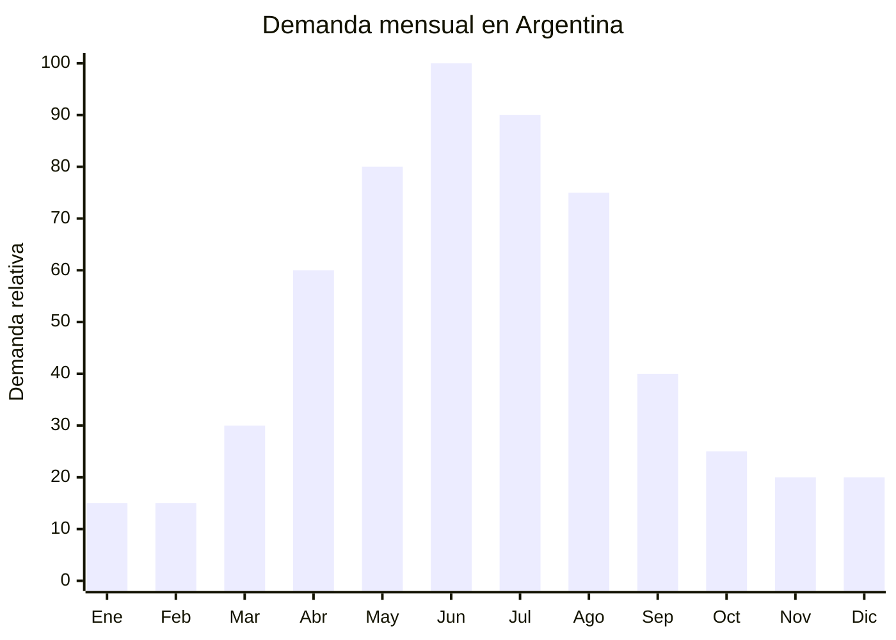

# Lámparas de sal del Himalaya

> **Capítulo NCM 85** — Máquinas, aparatos y material eléctrico | **Temporada:** Otoño (Mar–May)

<Note>
**NCM AMBIGUA:** Las lámparas de sal del Himalaya pueden clasificarse en el Capítulo 94 (luminarias/lámparas) o en el Capítulo 85 (aparatos eléctricos), dependiendo de si la aduana considera que el componente principal es la luminaria o el elemento eléctrico. Consultar con el despachante de aduana antes de importar para definir el NCM correcto y evitar sorpresas en el despacho.
</Note>

## Qué es y por qué importarlo

Las lámparas de sal del Himalaya son bloques de sal rosa (halita) de entre 2 y 5 kg, tallados en formas naturales o geométricas, con una base eléctrica interior que aloja una lámpara incandescente o LED de baja potencia. Al encenderse, la sal emite una luz cálida anaranjada que crea una atmósfera acogedora y relajante. Se asocian a la estética "hygge" (confort hogareño de inspiración nórdica) y a la decoración de ambientes para bienestar.

La demanda en Argentina sube entre abril y agosto, cuando los consumidores buscan crear ambientes cálidos e íntimos en sus hogares durante los días cortos y fríos del otoño-invierno. Las lámparas de sal se posicionan como elemento decorativo-funcional: dan luz tenue de ambiente y se promocionan con supuestos beneficios de ionización del aire (no comprobados científicamente, pero con fuerte arraigo en el mercado).

El aspecto clave de este producto es que combina dos orígenes: la sal proviene de Pakistán (minas de Khewra, Punjab) y la base eléctrica con cable y lámpara se fabrica en China. Muchos proveedores chinos compran la sal pakistaní, la tallan en Pakistán y ensamblan la base eléctrica en China para exportar el producto terminado. El costo FOB completo oscila entre USD 3 y USD 8 por unidad (2-5 kg), con precios de venta en Argentina de ARS 8,000 a ARS 25,000.

## Datos clave

| Dato | Valor |
|------|-------|
| **Posiciones NCM típicas** | 9405.49.00 (lámparas eléctricas, otras) o 8513.10.00 (según clasificación) |
| **Derecho de importación** | 20% (DIE) + 3% tasa estadística |
| **Rango FOB típico** | USD 3.00 — USD 8.00 por unidad (2-5 kg) |
| **Precio de venta en Argentina** | ARS 8.000 — ARS 25.000 |
| **Margen bruto estimado** | 100% — 200% |
| **MOQ típico** | 100 — 300 unidades |
| **Demanda en MercadoLibre** | Media |
| **Competencia en MercadoLibre** | Media |
| **Dificultad para importar** | Moderada (NCM ambigua + certificación eléctrica) |
| **Certificaciones necesarias** | S-Mark (por componente eléctrico) — consultar NCM exacto |
| **Antidumping** | No |

## Variantes y subtipos más comunes

| Subtipo / Variante | FOB aprox. | Venta AR aprox. | Nota |
|--------------------|-----------|-----------------|------|
| Lámpara sal natural 2-3 kg | USD 3.00 — 4.50 | ARS 8.000 — 14.000 | **Más vendida** |
| Lámpara sal natural 4-5 kg | USD 4.50 — 7.00 | ARS 12.000 — 20.000 | Tamaño familiar |
| Lámpara sal tallada (esfera, pirámide) | USD 5.00 — 8.00 | ARS 15.000 — 25.000 | Formato decorativo |
| Lámpara sal con base de madera premium | USD 4.00 — 7.00 | ARS 12.000 — 22.000 | Mayor valor percibido |
| Lámpara sal USB mini (escritorio) | USD 2.50 — 5.00 | ARS 6.000 — 15.000 | Para escritorio/mesa de luz |
| Candelabro sal Himalaya (sin eléctrica, para velas) | USD 1.50 — 3.50 | ARS 5.000 — 12.000 | Sin componente eléctrico — evita S-Mark |

## Regulaciones y requisitos

<Tabs>
  <Tab title="Certificaciones">
    | Organismo | Requiere | Detalle |
    |-----------|----------|---------|
    | ARCA (Aduana) | Sí siempre | Despacho estándar. Definición de NCM crítica |
    | INTI / S-Mark | **Probable — consultar** | Si clasifica como luminaria eléctrica, requiere S-Mark. Si clasifica como objeto decorativo con componente eléctrico menor, puede no requerir |
    | IRAM | Posible | Depende de la clasificación NCM |
    | ENACOM | No | No es electrónico de comunicación |
    | SENASA | No | No es alimento (aunque sea sal) |

    **Recomendación:** La clasificación NCM es el punto crítico. Consultar con despachante de aduana antes de importar. El candelabro sin componente eléctrico (para vela de té) evita completamente la necesidad de certificación eléctrica y simplifica el despacho.
  </Tab>

  <Tab title="Etiquetado">
    | Requisito | Aplica |
    |-----------|--------|
    | País de origen | Sí (puede ser Pakistán, China, o ambos) |
    | Datos importador | Sí (nombre, dirección, CUIT) |
    | Voltaje y frecuencia | Sí, si tiene componente eléctrico (220V — 50Hz) |
    | Potencia (watts) | Sí, si tiene componente eléctrico |
    | Instrucciones de uso | Sí |
    | Precauciones | Sí ("Mantener en ambiente seco", "No exponer a humedad directa") |
  </Tab>

  <Tab title="Restricciones">
    - **Sensibilidad a la humedad:** La sal del Himalaya absorbe humedad del ambiente. En climas húmedos, la lámpara puede "sudar" (gotear agua salada). Incluir advertencia al usuario y recomendar uso en ambientes secos.
    - **Peso:** Las lámparas de 4-5 kg son pesadas y requieren embalaje resistente para evitar rotura de la base de madera durante el transporte.
    - **No declarar propiedades medicinales:** Evitar claims de "purificación del aire", "ionización negativa" o beneficios para la salud. No están comprobados y pueden generar problemas regulatorios.
    - Sin antidumping vigente.
  </Tab>
</Tabs>

## Logística de importación

| Factor | Detalle |
|--------|---------|
| **Peso por unidad** | 2 — 6 kg (sal + base + cable) |
| **Volumen por unidad** | Moderado — caja individual de 18x18x25 cm aprox. |
| **Unidades por caja (master carton)** | 4 — 8 unidades |
| **Peso por caja** | 12 — 35 kg |
| **Cajas por contenedor 20'** | ~600 — 900 cajas |
| **Unidades por contenedor 20'** | ~3,000 — 6,000 unidades |
| **Fragilidad** | Media-Alta (sal es relativamente blanda pero pesada, base de madera puede rajarse) |
| **Requiere embalaje especial** | Sí — protección anti-humedad (film termocontraíble o bolsa zip) + espuma perimetral para evitar golpes |

<Tip>
El peso es el factor dominante del flete en las lámparas de sal. Un contenedor de 20 pies se llena por peso antes que por volumen. Calcular el costo de flete sobre peso bruto, no cubicaje. Las versiones mini USB (300-500g) tienen mucho mejor ratio valor/peso para flete aéreo o courier.
</Tip>

## Estacionalidad y timing de compra

| Dato | Valor |
|------|-------|
| **Meses de mayor venta** | Abril — Agosto (otoño-invierno) |
| **Pedido ideal (marítimo)** | Enero — Febrero (para llegar en abril) |
| **Pedido ideal (aéreo)** | Marzo (para llegar en abril) |
| **Anticipación mínima** | 3 meses antes del pico |

## Ventajas y riesgos

<CardGroup cols={2}>
  <Card title="Ventajas" icon="circle-check">
    - Producto aspiracional con alta percepción de valor
    - Estética hygge muy demandada en otoño-invierno
    - Bajo costo FOB con buen margen (100-200%)
    - Sin competencia de grandes marcas (producto artesanal percibido)
    - Versión candelabro evita certificación eléctrica
    - MOQ bajos (desde 100 unidades)
  </Card>

  <Card title="Riesgos y desventajas" icon="triangle-exclamation">
    - NCM ambigua: riesgo de reclasificación en aduana
    - Producto MUY pesado para su valor (flete alto por unidad)
    - Sensible a humedad (puede deteriorarse en tránsito o almacenamiento)
    - Base de madera puede rajarse con golpes
    - Claims de salud no comprobados (riesgo reputacional)
    - Cada pieza es única (difícil estandarizar fotos de venta)
  </Card>
</CardGroup>

## Palabras clave para buscar en Alibaba

`himalayan salt lamp wholesale` · `pink salt lamp natural shape` · `salt lamp wooden base 220V` · `himalayan salt lamp USB mini` · `salt rock lamp carved sphere pyramid`

## Fuentes

- MercadoLibre Argentina — búsqueda "lampara sal himalaya"
- Alibaba.com — proveedores de himalayan salt lamp wholesale
- INTI — Clasificación NCM para lámparas decorativas con componente eléctrico
- Información general sobre minas de sal Khewra, Pakistán
