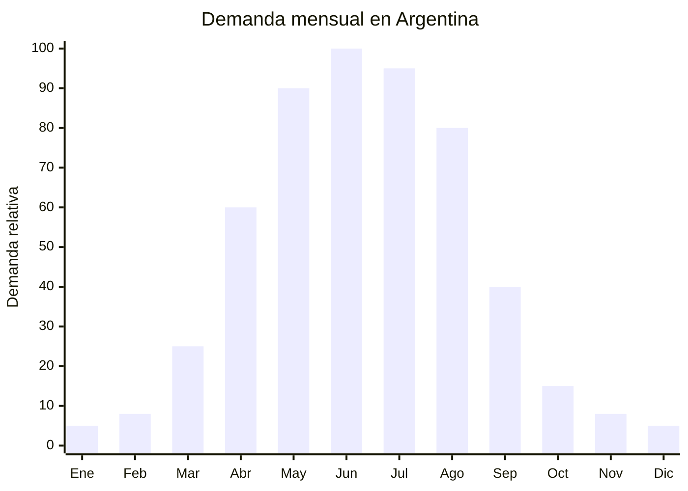

# Mantas eléctricas y almohadillas térmicas

> **Capítulo NCM 85** — Máquinas, aparatos y material eléctrico | **Temporada:** Otoño (Mar–May)

<Warning>
**SEGURIDAD CRÍTICA:** Las mantas eléctricas son uno de los productos con mayor riesgo de seguridad eléctrica. El apagado automático temporizado (2-4 horas) es OBLIGATORIO para la comercialización segura. Nunca importar modelos sin esta función. Verificar que el proveedor cumpla con normas IEC 60335-2-17 (mantas y almohadillas eléctricas flexibles).
</Warning>

## Qué es y por qué importarlo

Las mantas eléctricas y calienta-camas son productos textiles con resistencias eléctricas internas que generan calor controlado para calentar la cama antes de acostarse o mantener temperatura durante la noche. Se presentan en dos formatos principales: la manta eléctrica (se coloca encima, como una frazada) y el calienta-camas (se coloca debajo de la sábana, sobre el colchón). Las almohadillas térmicas son versiones más pequeñas, de uso localizado (espalda, cuello, abdomen).

En Argentina, la demanda se dispara entre abril y agosto, coincidiendo con la caída de temperaturas y el aumento del costo de la calefacción a gas. Las mantas eléctricas consumen aproximadamente 60-120W, lo que las convierte en una alternativa mucho más económica que la estufa o el aire acondicionado en modo calor. Marcas como Silfab, Beurer y Aspen lideran el mercado argentino, pero la mayoría de sus productos se fabrican en China.

El rango FOB de USD 10-17 para una manta eléctrica de 1 plaza permite precios de venta de ARS 15,000-90,000 dependiendo del tamaño y la marca. El margen es atractivo, pero la certificación S-Mark + IRAM 2001 es obligatoria y no negociable: se trata de un producto que la gente usa mientras duerme y el riesgo de incendio o electrocución existe si el producto no cumple con los estándares de seguridad.

## Datos clave

| Dato | Valor |
|------|-------|
| **Posiciones NCM típicas** | 8516.79.00 (aparatos electrotérmicos de uso doméstico) |
| **Derecho de importación** | 20% (DIE) + 3% tasa estadística |
| **Rango FOB típico** | USD 10.00 — USD 17.00 por unidad (1 plaza) |
| **Precio de venta en Argentina** | ARS 15.000 — ARS 90.000 |
| **Margen bruto estimado** | 100% — 200% |
| **MOQ típico** | 200 — 500 unidades |
| **Demanda en MercadoLibre** | Alta |
| **Competencia en MercadoLibre** | Media (dominada por Silfab/Beurer) |
| **Dificultad para importar** | Alta (S-Mark + IRAM 2001 obligatorio) |
| **Certificaciones necesarias** | S-Mark + IRAM 2001 (seguridad eléctrica para mantas) |
| **Antidumping** | No |

## Variantes y subtipos más comunes

| Subtipo / Variante | FOB aprox. | Venta AR aprox. | Nota |
|--------------------|-----------|-----------------|------|
| Calienta-camas 1 plaza (bajo sábana) | USD 10.00 — 13.00 | ARS 15.000 — 35.000 | **Más vendido** |
| Calienta-camas 2 plazas | USD 14.00 — 20.00 | ARS 30.000 — 60.000 | Mayor ticket |
| Manta eléctrica polar (sobre cuerpo) | USD 12.00 — 17.00 | ARS 25.000 — 50.000 | Uso en sillón/sofá |
| Almohadilla térmica cervical/lumbar | USD 5.00 — 10.00 | ARS 10.000 — 30.000 | Uso localizado |
| Manta eléctrica King Size | USD 18.00 — 30.00 | ARS 50.000 — 90.000 | Segmento premium |
| Almohadilla térmica con funda lavable | USD 6.00 — 12.00 | ARS 12.000 — 35.000 | Comodidad + higiene |

## Regulaciones y requisitos

<Tabs>
  <Tab title="Certificaciones">
    | Organismo | Requiere | Detalle |
    |-----------|----------|---------|
    | ARCA (Aduana) | Sí siempre | Despacho estándar |
    | INTI / S-Mark | **Sí — obligatorio** | Certificación de seguridad eléctrica. Producto de alto riesgo por uso nocturno |
    | IRAM 2001 | **Sí — obligatorio** | Norma específica para mantas y almohadillas eléctricas flexibles |
    | ENACOM | No | No es producto de comunicación |
    | ANMAT | No | No es producto médico (uso doméstico) |

    **Recomendación:** Exigir al proveedor chino certificación según IEC 60335-2-17 (norma internacional para mantas eléctricas). Esta norma es la base de IRAM 2001 y facilita enormemente la homologación en Argentina. Solicitar informes de prueba (test reports) de laboratorio acreditado.
  </Tab>

  <Tab title="Etiquetado">
    | Requisito | Aplica |
    |-----------|--------|
    | País de origen | Sí |
    | Datos importador | Sí (nombre, dirección, CUIT) |
    | Voltaje y frecuencia | Sí (220V — 50Hz) |
    | Potencia (watts) | Sí |
    | Sello S-Mark | Sí — visible en producto, cable y packaging |
    | Instrucciones de uso detalladas | Sí — **crítico por seguridad** |
    | Precauciones de seguridad | Sí ("No plegar en uso", "No usar con niños menores de 3 años", "Apagado automático") |
    | Niveles de calor | Sí (indicar niveles disponibles) |
  </Tab>

  <Tab title="Restricciones">
    - **Apagado automático obligatorio:** Todo modelo debe tener apagado automático temporizado (máx. 2-4 horas). Modelos sin esta función no deben importarse.
    - **Protección contra sobrecalentamiento:** Sensor térmico de corte obligatorio.
    - **No apto para uso médico:** No declarar propiedades terapéuticas sin registro ANMAT como producto médico.
    - **Lavabilidad:** El controlador debe ser desmontable para permitir lavado del textil. Indicar claramente en etiqueta.
    - Sin antidumping vigente.
  </Tab>
</Tabs>

## Logística de importación

| Factor | Detalle |
|--------|---------|
| **Peso por unidad** | 1.0 — 2.5 kg (según tamaño) |
| **Volumen por unidad** | Moderado — caja individual de 30x25x10 cm aprox. |
| **Unidades por caja (master carton)** | 6 — 12 unidades |
| **Peso por caja** | 8 — 25 kg |
| **Cajas por contenedor 20'** | ~800 — 1,200 cajas |
| **Unidades por contenedor 20'** | ~6,000 — 12,000 unidades |
| **Fragilidad** | Baja (textil flexible, controlador plástico) |
| **Requiere embalaje especial** | No — embalaje estándar. Proteger controlador electrónico contra humedad |

<Tip>
Solicitar al proveedor que incluya el manual de instrucciones en español dentro de la caja individual. Muchos fabricantes chinos ofrecen este servicio sin costo adicional si se les envía el texto traducido. Un manual en español con instrucciones de seguridad claras mejora la percepción del producto y reduce reclamos posventa.
</Tip>

## Estacionalidad y timing de compra

| Dato | Valor |
|------|-------|
| **Meses de mayor venta** | Abril — Agosto (otoño-invierno) |
| **Pedido ideal (marítimo)** | Enero — Febrero (para llegar en abril) |
| **Pedido ideal (aéreo)** | Marzo (para llegar en abril) |
| **Anticipación mínima** | 3 meses antes del pico (enero) |

## Ventajas y riesgos

<CardGroup cols={2}>
  <Card title="Ventajas" icon="circle-check">
    - Demanda fuerte y predecible abril-agosto
    - Alternativa económica a calefacción (60-120W vs. estufa)
    - Producto de ticket medio-alto (ARS 15,000-90,000)
    - Consumo recurrente (reposición por desgaste cada 2-3 temporadas)
    - Bajo costo de flete por unidad (textil liviano)
    - Pocas marcas dominantes, hay espacio para nuevos jugadores
  </Card>

  <Card title="Riesgos y desventajas" icon="triangle-exclamation">
    - **Riesgo de seguridad: producto de alto riesgo eléctrico**
    - Certificación S-Mark + IRAM 2001 obligatoria y costosa
    - Responsabilidad legal si el producto causa un incidente
    - Competencia de marcas establecidas (Silfab, Beurer, Aspen)
    - Estacionalidad extrema: stock sobrante pierde valor en verano
    - Reclamos posventa pueden ser complejos (seguridad eléctrica)
  </Card>
</CardGroup>

## Palabras clave para buscar en Alibaba

`electric blanket 220V wholesale` · `heated blanket underblanket manufacturer` · `electric heating pad cervical` · `electric blanket auto shut off OEM` · `heated mattress pad 220V 50Hz`

## Fuentes

- MercadoLibre Argentina — búsqueda "manta electrica" y "calienta camas"
- Alibaba.com — proveedores de electric blanket 220V
- IRAM 2001 — Norma de seguridad para mantas eléctricas
- IEC 60335-2-17 — Norma internacional para mantas y almohadillas eléctricas flexibles
