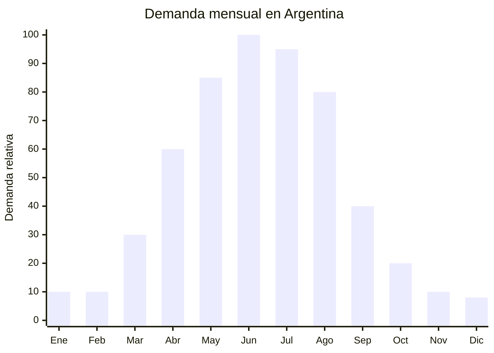

# Toalleros eléctricos calefactores

> **Capítulo NCM 85** — Máquinas, aparatos y material eléctrico | **Temporada:** Otoño (Mar–May)

## Qué es y por qué importarlo

Los toalleros eléctricos calefactores son estructuras metálicas (generalmente acero inoxidable o aluminio) con resistencias eléctricas internas que calientan las barras, cumpliendo una doble función: secan y calientan las toallas, y funcionan como calefactor complementario para el baño. Se instalan en la pared del baño y se conectan a la red eléctrica de 220V. La temperatura superficial oscila entre 45-65 grados, suficiente para secar toallas y templar un baño pequeño.

En Argentina, la demanda crece marcadamente entre abril y agosto. El baño es uno de los ambientes más fríos y húmedos de la casa durante el otoño-invierno, y salir de la ducha a una toalla húmeda y fría es una experiencia que los consumidores quieren resolver. Marcas como Atrim y Temptech posicionaron el producto en el mercado local, pero la oferta sigue siendo limitada comparada con la demanda creciente. Es un producto de ticket alto con excelente margen.

El rango FOB es amplio: desde USD 10 para modelos básicos de 4 barras hasta USD 58.50 para modelos premium de acero inoxidable 304 con múltiples barras y termostato. Los precios de venta en Argentina van de ARS 25,000 a ARS 120,000, posicionándolo como un producto aspiracional de mejora del hogar. La certificación IPX4 (protección contra salpicaduras) es obligatoria por tratarse de un producto eléctrico para uso en ambiente húmedo.

## Datos clave

| Dato | Valor |
|------|-------|
| **Posiciones NCM típicas** | 8516.79.00 (aparatos electrotérmicos de uso doméstico) |
| **Derecho de importación** | 20% (DIE) + 3% tasa estadística |
| **Rango FOB típico** | USD 10.00 — USD 58.50 por unidad |
| **Precio de venta en Argentina** | ARS 25.000 — ARS 120.000 |
| **Margen bruto estimado** | 100% — 200% |
| **MOQ típico** | 50 — 200 unidades |
| **Demanda en MercadoLibre** | Media |
| **Competencia en MercadoLibre** | Baja-Media |
| **Dificultad para importar** | Alta (S-Mark + IPX4 obligatorio) |
| **Certificaciones necesarias** | S-Mark + IRAM + IPX4 (protección contra salpicaduras) |
| **Antidumping** | No |

## Variantes y subtipos más comunes

| Subtipo / Variante | FOB aprox. | Venta AR aprox. | Nota |
|--------------------|-----------|-----------------|------|
| Toallero 4 barras acero cromado | USD 10.00 — 18.00 | ARS 25.000 — 45.000 | Entrada económica |
| Toallero 6-8 barras acero inoxidable | USD 18.00 — 35.00 | ARS 45.000 — 80.000 | **Más vendido** |
| Toallero escalera diseño (tipo radiador) | USD 25.00 — 45.00 | ARS 55.000 — 100.000 | Estética premium |
| Toallero con termostato y timer | USD 30.00 — 58.50 | ARS 70.000 — 120.000 | Máxima funcionalidad |
| Toallero portátil de pie (sin instalación) | USD 15.00 — 30.00 | ARS 35.000 — 70.000 | No requiere perforar pared |
| Toallero curvo de baño pequeño | USD 12.00 — 22.00 | ARS 30.000 — 55.000 | Espacios reducidos |

## Regulaciones y requisitos

<Tabs>
  <Tab title="Certificaciones">
    | Organismo | Requiere | Detalle |
    |-----------|----------|---------|
    | ARCA (Aduana) | Sí siempre | Despacho estándar |
    | INTI / S-Mark | **Sí — obligatorio** | Seguridad eléctrica. Producto eléctrico para ambiente húmedo |
    | IRAM | **Sí — obligatorio** | Norma de seguridad para aparatos electrotérmicos |
    | IPX4 | **Sí — obligatorio** | Protección contra salpicaduras de agua en todas las direcciones. Imprescindible para uso en baño |
    | ENACOM | No | No es producto de comunicación |

    **Recomendación:** El grado de protección IPX4 no es negociable para un producto eléctrico de baño. Solicitar al proveedor certificado IP de laboratorio acreditado. Verificar que el cable de conexión tenga aislamiento doble y que la conexión eléctrica sea sellada contra humedad.
  </Tab>

  <Tab title="Etiquetado">
    | Requisito | Aplica |
    |-----------|--------|
    | País de origen | Sí |
    | Datos importador | Sí (nombre, dirección, CUIT) |
    | Voltaje y frecuencia | Sí (220V — 50Hz) |
    | Potencia (watts) | Sí |
    | Grado IP | Sí (IPX4 mínimo) |
    | Sello S-Mark | Sí — visible en producto |
    | Instrucciones de instalación | Sí — con esquema de montaje en pared |
    | Precauciones | Sí ("Instalación por electricista matriculado", "No cubrir completamente") |
  </Tab>

  <Tab title="Restricciones">
    - **IPX4 OBLIGATORIO:** No importar toalleros eléctricos sin certificación IPX4. El uso en baño implica exposición constante a humedad y salpicaduras.
    - **Instalación eléctrica:** Recomendar instalación por electricista matriculado con conexión a tierra.
    - **Material:** Verificar que el acero sea genuinamente inoxidable (304 o 316) si se declara como tal. El acero cromado común se oxida rápidamente en ambiente de baño.
    - Sin antidumping vigente.
  </Tab>
</Tabs>

## Logística de importación

| Factor | Detalle |
|--------|---------|
| **Peso por unidad** | 3 — 10 kg (según tamaño y material) |
| **Volumen por unidad** | Alto — cajas de 60x50x15 cm aprox. |
| **Unidades por caja (master carton)** | 1 — 4 unidades |
| **Peso por caja** | 5 — 15 kg |
| **Cajas por contenedor 20'** | ~500 — 1,000 cajas |
| **Unidades por contenedor 20'** | ~1,500 — 3,000 unidades |
| **Fragilidad** | Media (acabado cromado sensible a rayaduras) |
| **Requiere embalaje especial** | Sí — protección anti-rayado con espuma + film. Embalaje individual con tornillería incluida |

<Tip>
Los toalleros eléctricos son productos de alto ticket pero alto peso/volumen. Para un primer embarque, importar por LCL (consolidado marítimo) 50-100 unidades como prueba de mercado. El MOQ bajo que ofrecen muchos proveedores (desde 20 unidades) permite testear sin comprometer mucho capital.
</Tip>

## Estacionalidad y timing de compra

| Dato | Valor |
|------|-------|
| **Meses de mayor venta** | Abril — Agosto (otoño-invierno) |
| **Pedido ideal (marítimo)** | Enero — Febrero (para llegar en abril) |
| **Pedido ideal (aéreo)** | Marzo (para llegar en abril) |
| **Anticipación mínima** | 3 meses antes del pico |

## Ventajas y riesgos

<CardGroup cols={2}>
  <Card title="Ventajas" icon="circle-check">
    - Ticket alto (ARS 25,000-120,000) con excelente margen
    - Competencia baja en Argentina (pocas marcas locales)
    - Doble funcionalidad: seca toallas + calefacciona baño
    - Producto aspiracional de mejora del hogar
    - Demanda creciente por tendencia de bienestar en el hogar
    - MOQ bajos permiten testear con poco capital
  </Card>

  <Card title="Riesgos y desventajas" icon="triangle-exclamation">
    - **IPX4 obligatorio: certificación costosa y no negociable**
    - Producto pesado y voluminoso (flete alto por unidad)
    - Requiere instalación profesional (limita público)
    - Acabado cromado sensible a rayaduras en transporte
    - Reclamos de instalación si no incluye instrucciones claras
    - Estacionalidad marcada: difícil vender en verano
  </Card>
</CardGroup>

## Palabras clave para buscar en Alibaba

`electric towel rack heated 220V` · `heated towel rail stainless steel` · `bathroom towel warmer wall mount` · `electric towel dryer IPX4` · `towel radiator heated wholesale`

## Fuentes

- MercadoLibre Argentina — búsqueda "toallero electrico"
- Alibaba.com — proveedores de electric heated towel rail
- INTI — Requisitos de certificación S-Mark y grado IP para productos eléctricos de baño
- IEC 60335-2-43 — Norma para secadores de ropa y toalleros eléctricos
