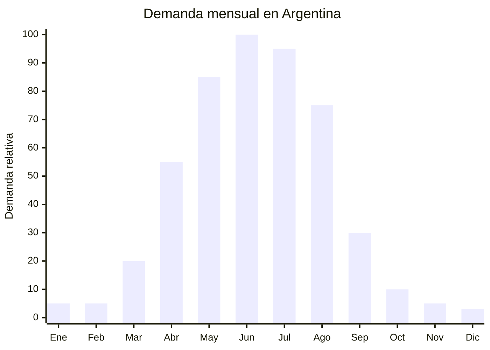

# Cubres parabrisas anti-helada

> **Capítulo NCM 87** — Vehículos automóviles, tractores, velocípedos y demás vehículos terrestres | **Temporada:** Otoño (Mar–May)

## Qué es y por qué importarlo

Los cubres parabrisas anti-helada son fundas protectoras que se colocan sobre el parabrisas del automóvil para evitar la formación de escarcha, hielo y rocío durante la noche. Están fabricados en tela Oxford 600D con capa interior de aluminio reflectante que actúa como barrera térmica. Se sujetan con ganchos a los espejos retrovisores y/o con imanes y solapas que se traban con las puertas. Pesan apenas unos 300 gramos y se pliegan en un estuche compacto que cabe en la guantera.

En Argentina, la demanda es estacional pura: de abril a agosto, cuando las heladas nocturnas son frecuentes en Buenos Aires, Córdoba, Mendoza, Rosario, Patagonia y toda la zona centro-sur. El conductor que no usa cubre parabrisas debe esperar 10-15 minutos con el motor encendido para descongelar el vidrio antes de salir, lo que genera una necesidad real y un punto de dolor claro para el marketing.

Es un producto con características ideales para importación: ultraliviano (menos de 300g), sin regulación ni certificación, MOQ bajo (desde 20 unidades en algunos proveedores), y margen altísimo. El FOB va de USD 1.35 a USD 8.57 según calidad y tamaño, con precios de venta en Argentina de ARS 5,000 a ARS 20,000. Sin competencia de marcas establecidas: es un mercado fragmentado dominado por vendedores de MercadoLibre.

## Datos clave

| Dato | Valor |
|------|-------|
| **Posiciones NCM típicas** | 8708.29.99 (partes y accesorios de vehículos, otros) |
| **Derecho de importación** | 18% (DIE) + 3% tasa estadística |
| **Rango FOB típico** | USD 1.35 — USD 8.57 por unidad |
| **Precio de venta en Argentina** | ARS 5.000 — ARS 20.000 |
| **Margen bruto estimado** | 150% — 400% |
| **MOQ típico** | 20 — 200 unidades |
| **Demanda en MercadoLibre** | Media-Alta (estacional) |
| **Competencia en MercadoLibre** | Media |
| **Dificultad para importar** | Muy fácil (sin regulación específica) |
| **Certificaciones necesarias** | Ninguna específica |
| **Antidumping** | No |

## Variantes y subtipos más comunes

| Subtipo / Variante | FOB aprox. | Venta AR aprox. | Nota |
|--------------------|-----------|-----------------|------|
| Cubre parabrisas básico Oxford 210D | USD 1.35 — 2.50 | ARS 5.000 — 9.000 | Entrada económica |
| Cubre parabrisas Oxford 600D + aluminio | USD 2.50 — 4.50 | ARS 8.000 — 14.000 | **Más vendido** |
| Cubre parabrisas SUV/camioneta (XL) | USD 3.50 — 6.00 | ARS 10.000 — 18.000 | Mayor tamaño |
| Cubre parabrisas con protección espejos | USD 4.00 — 7.00 | ARS 12.000 — 18.000 | Cobertura completa |
| Cubre parabrisas magnético premium | USD 5.00 — 8.57 | ARS 14.000 — 20.000 | Fijación superior |
| Combo cubre + raspador hielo | USD 2.50 — 5.00 | ARS 7.000 — 15.000 | Kit completo — mayor ticket |

## Regulaciones y requisitos

<Tabs>
  <Tab title="Certificaciones">
    | Organismo | Requiere | Detalle |
    |-----------|----------|---------|
    | ARCA (Aduana) | Sí siempre | Despacho estándar |
    | INTI | No | No es producto eléctrico ni de seguridad personal |
    | IRAM | No | No hay norma IRAM específica para cubres parabrisas |
    | ENACOM | No | No es electrónico |
    | ANMAT | No | No es producto de salud |

    **Recomendación:** Producto sin barreras regulatorias. Ideal para primera importación. Solo requiere el despacho aduanero estándar con documentación comercial básica (factura, packing list, BL).
  </Tab>

  <Tab title="Etiquetado">
    | Requisito | Aplica |
    |-----------|--------|
    | País de origen | Sí |
    | Datos importador | Sí |
    | Material de fabricación | Recomendado (Oxford 600D, aluminio reflectante) |
    | Dimensiones | Sí — indicar tamaño del parabrisas compatible |
    | Instrucciones de uso | Recomendado |
    | Compatibilidad vehículos | Recomendado (auto sedán, SUV, camioneta) |
  </Tab>

  <Tab title="Restricciones">
    Sin restricciones significativas. Es uno de los productos más simples de importar:
    - No requiere certificación.
    - No requiere habilitación especial.
    - No tiene regulación de seguridad.
    - Sin antidumping vigente.
    - Sin licencia no automática.
  </Tab>
</Tabs>

## Logística de importación

| Factor | Detalle |
|--------|---------|
| **Peso por unidad** | 200 — 400 g |
| **Volumen por unidad** | Muy bajo — plegado cabe en bolsa de 25x20x5 cm |
| **Unidades por caja (master carton)** | 50 — 100 unidades |
| **Peso por caja** | 12 — 30 kg |
| **Cajas por contenedor 20'** | ~1,500 — 2,500 cajas |
| **Unidades por contenedor 20'** | ~100,000 — 200,000 unidades |
| **Fragilidad** | Nula (tela plegable) |
| **Requiere embalaje especial** | No — bolsa individual con zip o embalaje estándar |

<Tip>
Por su peso ultraliviano y sin regulación, el cubre parabrisas es ideal para envío por courier o aéreo como primer lote de prueba (50-100 unidades). El costo de envío aéreo por unidad es mínimo y permite tener stock en 7-10 días. Validar el mercado rápido antes de escalar a marítimo.
</Tip>

## Estacionalidad y timing de compra

| Dato | Valor |
|------|-------|
| **Meses de mayor venta** | Mayo — Agosto (heladas frecuentes) |
| **Pedido ideal (marítimo)** | Enero — Febrero (para llegar en abril) |
| **Pedido ideal (aéreo/courier)** | Marzo — Abril (para llegar en abril-mayo) |
| **Anticipación mínima** | 2 meses antes del pico |

## Ventajas y riesgos

<CardGroup cols={2}>
  <Card title="Ventajas" icon="circle-check">
    - SIN regulación ni certificación de ningún tipo
    - Ultraliviano: mínimo costo de flete por unidad
    - Margen altísimo (150-400%)
    - MOQ bajo (desde 20 unidades)
    - Producto que resuelve un dolor real del usuario
    - Ideal para primera importación sin experiencia
    - Combina muy bien con raspador de hielo (kit)
  </Card>

  <Card title="Riesgos y desventajas" icon="triangle-exclamation">
    - Estacionalidad extrema: demanda CERO en verano
    - Mercado fragmentado: muchos vendedores con productos similares
    - Calidad variable: Oxford 210D se rompe rápido, exigir mínimo 420D
    - Tamaño único no sirve para todos los vehículos
    - Sin barrera de entrada: cualquiera puede importar
    - Stock sobrante de invierno ocupa espacio hasta el próximo año
  </Card>
</CardGroup>

## Palabras clave para buscar en Alibaba

`car windshield snow cover wholesale` · `frost guard windshield cover 600D` · `car windshield ice protector magnetic` · `auto windshield cover winter` · `car front window snow shield Oxford`

## Fuentes

- MercadoLibre Argentina — búsqueda "cubre parabrisas helada"
- Alibaba.com — proveedores de car windshield snow cover
- Foros de autos Argentina — experiencias de usuarios con cubres parabrisas importados
