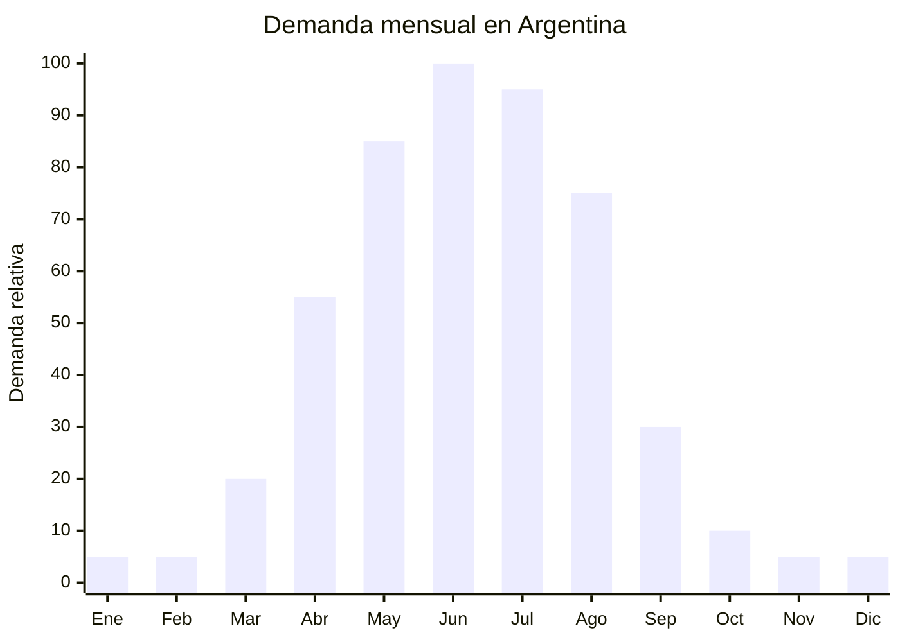

# Fundas de asiento con calefacción 12V

> **Capítulo NCM 87** — Vehículos automóviles, tractores, velocípedos y demás vehículos terrestres | **Temporada:** Otoño (Mar–May)

## Qué es y por qué importarlo

Las fundas de asiento con calefacción son coberturas acolchadas para los asientos del automóvil que incorporan una resistencia eléctrica interna alimentada por el encendedor de cigarrillos (12V DC). Se colocan sobre el asiento existente, se conectan al encendedor y en aproximadamente 2 minutos alcanzan una temperatura confortable de 35-45 grados. Ofrecen 2-3 niveles de calor regulables y cubren tanto el asiento como el respaldo.

En Argentina, la demanda crece entre abril y agosto, especialmente entre conductores que usan el auto temprano en la mañana, cuando los asientos de cuero o cuerina están helados. En ciudades como Buenos Aires, Córdoba, Mendoza, Rosario y toda la Patagonia, los primeros minutos al volante con el asiento congelado son una experiencia desagradable que este producto resuelve instantáneamente. Es más rápido que la calefacción del auto, que tarda 5-10 minutos en calentar el habitáculo.

El FOB oscila entre USD 8 y USD 20 por unidad, con precios de venta en Argentina de ARS 15,000 a ARS 40,000. El producto utiliza corriente continua de 12V del vehículo, lo que lo diferencia de las mantas eléctricas domésticas (220V AC). Requiere certificación IRAM por ser un accesorio eléctrico que se conecta al sistema eléctrico del vehículo y está en contacto directo con el cuerpo del usuario.

## Datos clave

| Dato | Valor |
|------|-------|
| **Posiciones NCM típicas** | 8708.99.90 (partes y accesorios de vehículos, otros) |
| **Derecho de importación** | 18% (DIE) + 3% tasa estadística |
| **Rango FOB típico** | USD 8.00 — USD 20.00 por unidad |
| **Precio de venta en Argentina** | ARS 15.000 — ARS 40.000 |
| **Margen bruto estimado** | 80% — 180% |
| **MOQ típico** | 100 — 300 unidades |
| **Demanda en MercadoLibre** | Media |
| **Competencia en MercadoLibre** | Baja-Media |
| **Dificultad para importar** | Moderada (requiere IRAM) |
| **Certificaciones necesarias** | IRAM (seguridad eléctrica automotriz) |
| **Antidumping** | No |

## Variantes y subtipos más comunes

| Subtipo / Variante | FOB aprox. | Venta AR aprox. | Nota |
|--------------------|-----------|-----------------|------|
| Funda calefactora asiento básica (1 asiento) | USD 8.00 — 12.00 | ARS 15.000 — 25.000 | **Más vendida** |
| Funda calefactora asiento + respaldo | USD 10.00 — 15.00 | ARS 20.000 — 32.000 | Cobertura completa |
| Funda calefactora con masaje vibratorio | USD 15.00 — 20.00 | ARS 28.000 — 40.000 | Valor agregado premium |
| Par de fundas (conductor + acompañante) | USD 16.00 — 28.00 | ARS 30.000 — 55.000 | Mayor ticket |
| Funda calefactora con temporizador | USD 12.00 — 18.00 | ARS 22.000 — 35.000 | Seguridad (apagado automático) |
| Cojín calefactor asiento (sin respaldo) | USD 5.00 — 10.00 | ARS 10.000 — 20.000 | Más compacto y económico |

## Regulaciones y requisitos

<Tabs>
  <Tab title="Certificaciones">
    | Organismo | Requiere | Detalle |
    |-----------|----------|---------|
    | ARCA (Aduana) | Sí siempre | Despacho estándar |
    | IRAM | **Sí — recomendado/obligatorio** | Accesorio eléctrico automotriz. Aunque no hay norma IRAM específica para fundas calefactoras 12V, se recomienda certificar bajo norma de seguridad eléctrica vehicular |
    | INTI | Posible | Dependiendo de clasificación como accesorio eléctrico |
    | ENACOM | No | No es producto de comunicación |
    | ANMAT | No | No es producto de salud |

    **Recomendación:** Solicitar al proveedor chino certificación CE y/o FCC del componente eléctrico. Exigir protección contra sobrecalentamiento (fusible térmico) y cable con fusible en línea. Verificar que el conector al encendedor 12V sea de calidad (contacto firme, sin calentamiento excesivo).
  </Tab>

  <Tab title="Etiquetado">
    | Requisito | Aplica |
    |-----------|--------|
    | País de origen | Sí |
    | Datos importador | Sí (nombre, dirección, CUIT) |
    | Tensión de alimentación | Sí (12V DC) |
    | Potencia (watts) | Sí (típicamente 30-50W) |
    | Instrucciones de uso | Sí |
    | Precauciones | Sí ("No usar con motor apagado por tiempo prolongado", "No cubrir mientras funciona") |
    | Compatibilidad vehículos | Recomendado (universal 12V) |
  </Tab>

  <Tab title="Restricciones">
    - **Consumo de batería:** La funda consume 30-50W del sistema 12V. Advertir al usuario que no la use con el motor apagado por períodos prolongados para evitar descargar la batería.
    - **Protección contra sobrecalentamiento:** El fusible térmico de corte es esencial. No importar modelos sin esta protección.
    - **Cable:** El cable debe ser lo suficientemente largo (1.5-2m) para llegar del encendedor al asiento sin quedar tenso.
    - Sin antidumping vigente.
  </Tab>
</Tabs>

## Logística de importación

| Factor | Detalle |
|--------|---------|
| **Peso por unidad** | 0.8 — 1.5 kg (con cable y controlador) |
| **Volumen por unidad** | Moderado — caja de 45x45x8 cm aprox. |
| **Unidades por caja (master carton)** | 10 — 20 unidades |
| **Peso por caja** | 10 — 25 kg |
| **Cajas por contenedor 20'** | ~800 — 1,200 cajas |
| **Unidades por contenedor 20'** | ~10,000 — 20,000 unidades |
| **Fragilidad** | Baja (textil acolchado con cable) |
| **Requiere embalaje especial** | No — protección estándar. Verificar que el cable no se doble en ángulos extremos |

<Tip>
Importar junto con los cubres parabrisas y raspadores de hielo para armar un "kit invierno para auto" completo. Compartir el flete marítimo entre los tres productos optimiza costos y permite ofrecer combos en MercadoLibre con mayor ticket promedio y mejor posicionamiento en búsquedas.
</Tip>

## Estacionalidad y timing de compra

| Dato | Valor |
|------|-------|
| **Meses de mayor venta** | Mayo — Agosto (frío intenso) |
| **Pedido ideal (marítimo)** | Enero — Febrero (para llegar en abril) |
| **Pedido ideal (aéreo)** | Marzo (para llegar en abril-mayo) |
| **Anticipación mínima** | 3 meses antes del pico |

## Ventajas y riesgos

<CardGroup cols={2}>
  <Card title="Ventajas" icon="circle-check">
    - Resuelve un dolor real (asiento helado por la mañana)
    - Ticket medio-alto (ARS 15,000-40,000)
    - Competencia baja en Argentina
    - Complemento perfecto del kit invierno automotor
    - Calentamiento ultra rápido (2 minutos)
    - Instalación universal sin herramientas (plug and play)
  </Card>

  <Card title="Riesgos y desventajas" icon="triangle-exclamation">
    - Requiere certificación IRAM (barrera moderada)
    - Responsabilidad si el producto causa un cortocircuito
    - Estacionalidad marcada: demanda cero en verano
    - Conector encendedor puede no hacer buen contacto en todos los autos
    - Riesgo de descarga de batería si se usa con motor apagado
    - Modelos con masaje vibratorio tienen más puntos de falla
  </Card>
</CardGroup>

## Palabras clave para buscar en Alibaba

`heated car seat cover 12V wholesale` · `car seat heater cushion 12V` · `heated car seat pad winter` · `car seat warmer cover universal` · `12V heated seat cover massage`

## Fuentes

- MercadoLibre Argentina — búsqueda "funda asiento calefacción auto"
- Alibaba.com — proveedores de heated car seat cover 12V
- IRAM — Normas de seguridad eléctrica para accesorios automotrices
