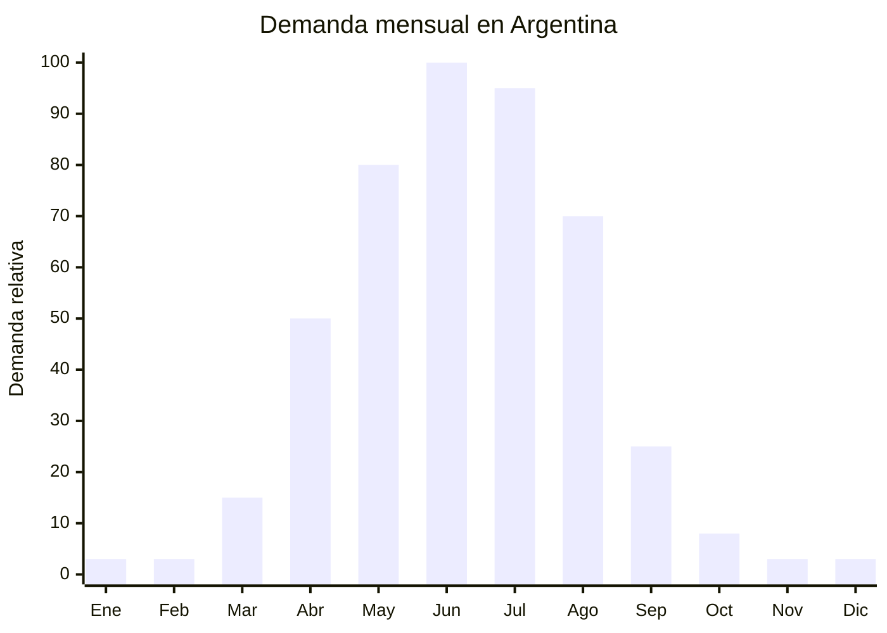

# Raspadores de hielo para parabrisas

> **Capítulo NCM 87** — Vehículos automóviles, tractores, velocípedos y demás vehículos terrestres | **Temporada:** Otoño (Mar–May)

## Qué es y por qué importarlo

Los raspadores de hielo para parabrisas son herramientas manuales fabricadas en ABS o policarbonato diseñadas para remover la escarcha, hielo y nieve acumulados sobre el vidrio del automóvil. Se componen de una hoja raspadora rígida con borde afilado (sin cortar) y un mango ergonómico. Los modelos más completos incluyen cepillo en el extremo opuesto para barrer la nieve suelta y guante térmico incorporado. Pesan menos de 100 gramos, son prácticamente indestructibles y cuestan centavos.

En Argentina, el raspador de hielo es el complemento natural del cubre parabrisas. Mientras el cubre previene la formación de escarcha, el raspador la remueve cuando ya se formó. La venta cruzada entre ambos productos genera combos con mayor ticket promedio. La demanda se concentra entre abril y agosto en toda la zona centro-sur del país, con pico en las primeras heladas fuertes de mayo-junio.

El costo FOB es extremadamente bajo: desde USD 0.30 por unidad para el modelo básico hasta USD 1.50 para modelos con cepillo integrado y mango telescópico. Este es un producto donde el margen porcentual es altísimo pero el ticket absoluto es bajo, por lo que la estrategia ganadora es venderlo en combos (con cubre parabrisas) o en packs de 2-3 unidades, y siempre como parte de un catálogo más amplio de accesorios de invierno para auto.

## Datos clave

| Dato | Valor |
|------|-------|
| **Posiciones NCM típicas** | 8708.99.90 (partes y accesorios de vehículos, otros) |
| **Derecho de importación** | 18% (DIE) + 3% tasa estadística |
| **Rango FOB típico** | USD 0.30 — USD 1.50 por unidad |
| **Precio de venta en Argentina** | ARS 2.000 — ARS 8.000 |
| **Margen bruto estimado** | 200% — 500% |
| **MOQ típico** | 100 — 500 unidades |
| **Demanda en MercadoLibre** | Media (estacional) |
| **Competencia en MercadoLibre** | Baja-Media |
| **Dificultad para importar** | Muy fácil (sin regulación) |
| **Certificaciones necesarias** | Ninguna |
| **Antidumping** | No |

## Variantes y subtipos más comunes

| Subtipo / Variante | FOB aprox. | Venta AR aprox. | Nota |
|--------------------|-----------|-----------------|------|
| Raspador básico ABS simple | USD 0.30 — 0.50 | ARS 2.000 — 4.000 | Mínimo costo, máximo margen |
| Raspador con cepillo de nieve | USD 0.60 — 1.00 | ARS 3.000 — 6.000 | **Más vendido** |
| Raspador con mango telescópico | USD 0.80 — 1.50 | ARS 4.000 — 8.000 | Para SUV y camionetas |
| Raspador con guante térmico | USD 0.70 — 1.20 | ARS 3.500 — 7.000 | Protege la mano del frío |
| Raspador cónico (gira sobre hielo) | USD 0.50 — 1.00 | ARS 2.500 — 5.000 | Diseño circular, práctico |
| Combo raspador + cubre parabrisas | USD 2.50 — 5.00 | ARS 7.000 — 15.000 | Kit completo — mayor ticket |

## Regulaciones y requisitos

<Tabs>
  <Tab title="Certificaciones">
    | Organismo | Requiere | Detalle |
    |-----------|----------|---------|
    | ARCA (Aduana) | Sí siempre | Despacho estándar |
    | INTI | No | No aplica |
    | IRAM | No | No hay norma específica |
    | ENACOM | No | No es electrónico |
    | ANMAT | No | No es producto de salud |

    **Recomendación:** Producto sin ninguna barrera regulatoria. Importación directa sin trámites especiales más allá del despacho aduanero estándar.
  </Tab>

  <Tab title="Etiquetado">
    | Requisito | Aplica |
    |-----------|--------|
    | País de origen | Sí |
    | Datos importador | Sí |
    | Material | Recomendado (ABS, policarbonato) |
    | Instrucciones de uso | Recomendado |
  </Tab>

  <Tab title="Restricciones">
    Sin restricciones. Producto de complejidad regulatoria cero:
    - No requiere certificación de ningún tipo.
    - No tiene regulación de seguridad.
    - Sin antidumping.
    - Sin licencia no automática.
  </Tab>
</Tabs>

## Logística de importación

| Factor | Detalle |
|--------|---------|
| **Peso por unidad** | 50 — 150 g |
| **Volumen por unidad** | Muy bajo — 25x12x3 cm aprox. |
| **Unidades por caja (master carton)** | 100 — 200 unidades |
| **Peso por caja** | 6 — 20 kg |
| **Cajas por contenedor 20'** | ~2,000 — 3,500 cajas |
| **Unidades por contenedor 20'** | ~300,000 — 500,000 unidades |
| **Fragilidad** | Muy baja (plástico resistente a impactos) |
| **Requiere embalaje especial** | No — embalaje estándar a granel o individual |

<Tip>
Por su peso insignificante (menos de 100g por unidad), el raspador de hielo es el candidato perfecto para combinar con el cubre parabrisas en un mismo envío. El raspador casi no suma peso ni volumen al embarque del cubre, pero duplica el ticket de venta cuando se ofrece como combo. Importar ambos productos juntos del mismo proveedor para optimizar logística.
</Tip>

## Estacionalidad y timing de compra

| Dato | Valor |
|------|-------|
| **Meses de mayor venta** | Mayo — Agosto (heladas frecuentes) |
| **Pedido ideal (marítimo)** | Enero — Febrero (para llegar en abril) |
| **Pedido ideal (aéreo/courier)** | Marzo — Abril (junto con cubres parabrisas) |
| **Anticipación mínima** | 2 meses antes del pico |

## Ventajas y riesgos

<CardGroup cols={2}>
  <Card title="Ventajas" icon="circle-check">
    - SIN regulación ni certificación
    - FOB bajísimo: desde USD 0.30 por unidad
    - Margen porcentual excepcional (200-500%)
    - Ultraliviano: casi no agrega costo de flete
    - Complemento natural del cubre parabrisas (venta cruzada)
    - Producto indestructible: cero devoluciones
    - MOQ bajo y capital mínimo requerido
  </Card>

  <Card title="Riesgos y desventajas" icon="triangle-exclamation">
    - Ticket absoluto bajo (ARS 2,000-8,000) — necesita volumen
    - Estacionalidad extrema: demanda cero en verano
    - Sin barrera de entrada: cualquier vendedor puede importar
    - Producto commoditizado: difícil diferenciarse
    - Solo es rentable como parte de un catálogo o en combos
    - Mercado limitado a zonas con heladas (no todo el país)
  </Card>
</CardGroup>

## Palabras clave para buscar en Alibaba

`ice scraper car wholesale` · `windshield ice scraper brush` · `car snow scraper ABS` · `cone ice scraper windshield` · `telescopic snow brush ice scraper`

## Fuentes

- MercadoLibre Argentina — búsqueda "raspador hielo parabrisas"
- Alibaba.com — proveedores de car ice scraper wholesale
- Foros automotor Argentina — accesorios invierno
