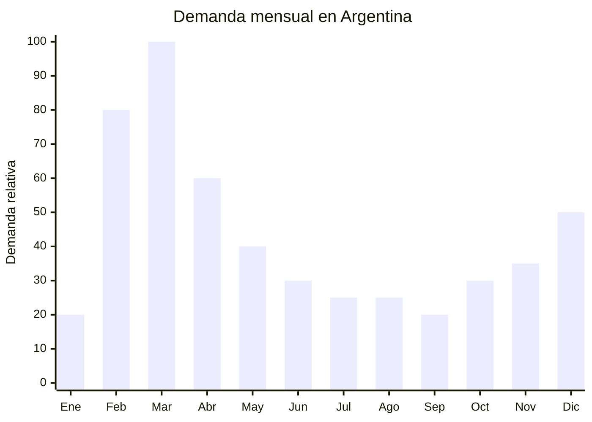

# Relojes infantiles GPS / smartwatches para niños

> **Capítulo NCM 91** — Aparatos de relojería y sus partes | **Temporada:** Otoño (Mar–May)

<Warning>
**ENACOM OBLIGATORIO:** Este producto incorpora múltiples tecnologías de comunicación inalámbrica (GPS, WiFi, Bluetooth, 4G/LTE). La homologación ante ENACOM (Ente Nacional de Comunicaciones) es obligatoria para cada modelo y puede costar entre USD 500 y USD 1,000 por modelo. Sin esta homologación, el producto NO puede despacharse en aduana.
</Warning>

## Qué es y por qué importarlo

Los relojes infantiles GPS (también llamados smartwatches para niños) son dispositivos tipo reloj pulsera diseñados para que los padres puedan localizar a sus hijos en tiempo real mediante GPS, LBS (localización por antenas celulares) y WiFi. Incorporan botón SOS que envía alerta al celular de los padres, conectividad 4G/LTE con ranura nano SIM para llamadas de voz, modo aula (silencia el reloj en horario escolar), geocerca (alerta si el niño sale de una zona definida) y cámara frontal para videollamadas.

En Argentina, la demanda explota entre febrero y marzo, coincidiendo con la vuelta a clases. Los padres buscan una forma de mantener contacto y localizar a sus hijos cuando empiezan a ir solos al colegio o a actividades extracurriculares. En MercadoLibre se encuentran más de 2,699 publicaciones activas de smartwatches infantiles, con precios que llegan hasta ARS 90,560 para modelos premium con 4G y videollamada.

El FOB oscila entre USD 7.50 y USD 8.90 por unidad para modelos con funcionalidad completa (GPS+WiFi+BT+4G), lo que permite márgenes atractivos. Sin embargo, la barrera de entrada principal es la homologación ENACOM, que requiere documentación técnica del producto (frecuencias, potencia, protocolos) y puede demorar 30-60 días. Esto actúa como barrera protectora: quien logra la homologación tiene ventaja competitiva sobre importadores que no la tramitan.

## Datos clave

| Dato | Valor |
|------|-------|
| **Posiciones NCM típicas** | 9102.12.00 (relojes de pulsera, electrónicos) |
| **Derecho de importación** | 20% (DIE) + 3% tasa estadística |
| **Rango FOB típico** | USD 7.50 — USD 8.90 por unidad |
| **Precio de venta en Argentina** | ARS 20.000 — ARS 90.560 |
| **Margen bruto estimado** | 100% — 250% |
| **MOQ típico** | 100 — 300 unidades |
| **Demanda en MercadoLibre** | Alta (2,699+ publicaciones activas) |
| **Competencia en MercadoLibre** | Alta |
| **Dificultad para importar** | Media-Alta (ENACOM obligatorio, costo USD 500-1,000) |
| **Certificaciones necesarias** | ENACOM (GPS + WiFi + Bluetooth + 4G) |
| **Antidumping** | No |

## Variantes y subtipos más comunes

| Subtipo / Variante | FOB aprox. | Venta AR aprox. | Nota |
|--------------------|-----------|-----------------|------|
| Smartwatch niño GPS+WiFi+BT básico (2G) | USD 5.00 — 7.00 | ARS 15.000 — 30.000 | Funcionalidad limitada |
| Smartwatch niño GPS+4G+SOS+cámara | USD 7.50 — 8.90 | ARS 30.000 — 55.000 | **Más vendido** |
| Smartwatch niño 4G+videollamada+WhatsApp | USD 9.00 — 15.00 | ARS 45.000 — 90.560 | Premium, mayor ticket |
| Smartwatch niño resistente al agua IP67 | USD 8.00 — 12.00 | ARS 35.000 — 65.000 | Valor agregado (recreo, lluvia) |
| Smartwatch niño con juegos educativos | USD 4.00 — 7.00 | ARS 12.000 — 25.000 | Sin SIM, sin ENACOM (verificar) |
| Smartwatch niño diseño personaje (Frozen, Spider-Man) | USD 8.00 — 12.00 | ARS 35.000 — 70.000 | Licencia agrega valor pero riesgo legal |

## Regulaciones y requisitos

<Tabs>
  <Tab title="Certificaciones">
    | Organismo | Requiere | Detalle |
    |-----------|----------|---------|
    | ARCA (Aduana) | Sí siempre | Despacho estándar. Requiere VDI (Verificación de Destino de Importación) |
    | ENACOM | **Sí — obligatorio** | Homologación de cada modelo por separado. Frecuencias GPS, WiFi 2.4GHz, Bluetooth, 4G LTE. Costo aprox. USD 500-1,000 por modelo. Plazo: 30-60 días |
    | INTI | No específicamente | No requiere S-Mark (batería recargable baja tensión) |
    | ANMAT | No | No es producto de salud |

    **Recomendación:** Iniciar el trámite de ENACOM antes de embarcar la mercadería. Solicitar al proveedor toda la documentación técnica: fichas de radio (RF), certificados FCC/CE, bandas de frecuencia, potencia de transmisión, protocolos. Sin esta documentación, el trámite ENACOM se demora o rechaza. Verificar que las bandas 4G sean compatibles con operadores argentinos (B2, B4, B7, B28).
  </Tab>

  <Tab title="Etiquetado">
    | Requisito | Aplica |
    |-----------|--------|
    | País de origen | Sí |
    | Datos importador | Sí (nombre, dirección, CUIT) |
    | Número de homologación ENACOM | Sí |
    | Instrucciones de uso | Sí — en español |
    | Precauciones | Sí ("Supervisión parental recomendada") |
    | Especificaciones técnicas | Sí (conectividad, bandas de frecuencia) |
  </Tab>

  <Tab title="Restricciones">
    - **Bandas 4G:** Verificar compatibilidad con operadores argentinos (Claro, Movistar, Personal). No todos los modelos chinos soportan las bandas de frecuencia usadas en Argentina.
    - **Privacidad de menores:** Aunque no hay regulación específica en Argentina, considerar las implicaciones de privacidad de un dispositivo con GPS y cámara dirigido a niños.
    - **Modelos con diseños de personajes licenciados:** Riesgo de reclamo por propiedad intelectual si no se tiene licencia oficial (Disney, Marvel, etc.). Preferir diseños genéricos.
    - Sin antidumping vigente.
  </Tab>
</Tabs>

## Logística de importación

| Factor | Detalle |
|--------|---------|
| **Peso por unidad** | 40 — 80 g (con correa) |
| **Volumen por unidad** | Bajo — caja individual de 10x10x8 cm aprox. |
| **Unidades por caja (master carton)** | 50 — 100 unidades |
| **Peso por caja** | 3 — 8 kg |
| **Cajas por contenedor 20'** | ~2,000 — 3,500 cajas |
| **Unidades por contenedor 20'** | ~150,000 — 300,000 unidades |
| **Fragilidad** | Media (pantalla puede rayarse, batería litio) |
| **Requiere embalaje especial** | Sí — protección anti-estática + cumplir normas IATA para baterías de litio si envío aéreo |

<Tip>
Las baterías de litio de los smartwatches tienen restricciones para transporte aéreo (IATA DG). Para envío aéreo/courier, verificar que la capacidad de la batería esté por debajo de los límites permitidos (generalmente menor a 100Wh, lo cual cumplen holgadamente los relojes infantiles). El proveedor debe proveer MSDS de la batería y declaración de conformidad.
</Tip>

## Estacionalidad y timing de compra

| Dato | Valor |
|------|-------|
| **Meses de mayor venta** | Febrero — Marzo (vuelta a clases) |
| **Segundo pico** | Agosto (Día del Niño) y Diciembre (Navidad) |
| **Pedido ideal (marítimo)** | Noviembre — Diciembre (para llegar en febrero) |
| **Pedido ideal (aéreo)** | Enero (para llegar en febrero) |
| **Anticipación mínima** | 3-4 meses (incluir tiempo ENACOM) |

## Ventajas y riesgos

<CardGroup cols={2}>
  <Card title="Ventajas" icon="circle-check">
    - Demanda alta y creciente (seguridad infantil)
    - Ticket alto (ARS 20,000-90,000) con buen margen
    - Producto ultraliviano: flete mínimo por unidad
    - Barrera ENACOM protege contra competencia informal
    - Múltiples picos de demanda (clases, Día del Niño, Navidad)
    - Producto recurrente: se regala al hermano, al primo
  </Card>

  <Card title="Riesgos y desventajas" icon="triangle-exclamation">
    - **ENACOM obligatorio: USD 500-1,000 por modelo + 30-60 días**
    - Bandas 4G pueden no ser compatibles con operadores argentinos
    - Competencia alta en MercadoLibre (2,699+ publicaciones)
    - Riesgo de propiedad intelectual con diseños licenciados
    - Requiere soporte posventa (configuración app, SIM)
    - Evolución tecnológica rápida: modelos obsolescen en 12-18 meses
  </Card>
</CardGroup>

## Palabras clave para buscar en Alibaba

`kids GPS watch 4G wholesale` · `children smartwatch SOS GPS tracker` · `kids smart watch video call 4G LTE` · `child GPS tracker watch waterproof` · `kids smartwatch SIM card camera wholesale`

## Fuentes

- MercadoLibre Argentina — búsqueda "reloj gps niños" y "smartwatch infantil"
- Alibaba.com — proveedores de kids GPS smartwatch 4G
- ENACOM — Requisitos de homologación de equipos de comunicación
- IATA — Regulaciones de transporte de baterías de litio
