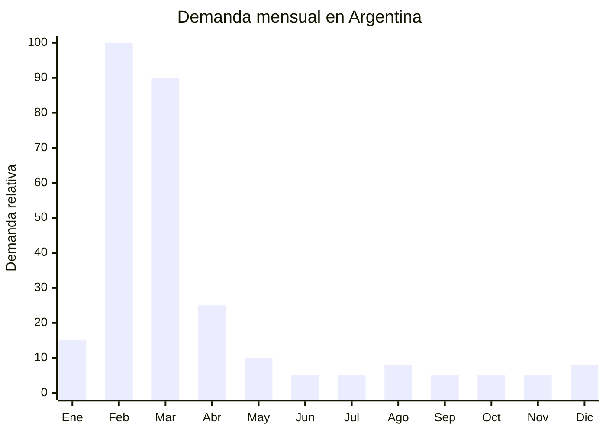

# Flautas dulces escolares soprano

> **Capítulo NCM 92** — Instrumentos musicales; sus partes y accesorios | **Temporada:** Otoño (Mar–May)

## Qué es y por qué importarlo

La flauta dulce soprano (también llamada flauta escolar o recorder) es un instrumento musical de viento fabricado en plástico ABS, con digitación alemana o barroca, que se usa universalmente en la educación primaria argentina como primer instrumento musical de los niños. Prácticamente todos los colegios del país la incluyen en la lista de útiles de primero a sexto grado. Es un producto de demanda garantizada e inelástica: no importa la situación económica, los padres deben comprarla si está en la lista escolar.

El pico de demanda es MASIVO y ultra concentrado: el 70% o más de las ventas anuales se produce en febrero y marzo, coincidiendo con la compra de útiles escolares para el inicio de clases. Es un fenómeno predecible, repetitivo cada año y con volúmenes enormes. Un colegio primario de 300 alumnos puede necesitar 50-100 flautas nuevas por año (las anteriores se pierden, se rompen o se quiere una nueva).

El costo FOB es extraordinariamente bajo: desde USD 0.50 por unidad para el modelo básico hasta USD 2.00 para modelos de mejor calidad tonal con estuche rígido. Con precios de venta en Argentina de ARS 3,000 a ARS 8,000, el margen bruto es altísimo. El producto pesa apenas 80 gramos, no requiere ninguna certificación ni regulación especial, y la barrera de entrada es mínima. Es posiblemente el producto con mejor relación margen/esfuerzo de toda esta guía.

## Datos clave

| Dato | Valor |
|------|-------|
| **Posiciones NCM típicas** | 9205.90.10 (flautas) |
| **Derecho de importación** | 20% (DIE) + 3% tasa estadística |
| **Rango FOB típico** | USD 0.50 — USD 2.00 por unidad |
| **Precio de venta en Argentina** | ARS 3.000 — ARS 8.000 |
| **Margen bruto estimado** | 300% — 700% |
| **MOQ típico** | 500 — 2,000 unidades |
| **Demanda en MercadoLibre** | Muy Alta (estacional) |
| **Competencia en MercadoLibre** | Alta (pero hay volumen para todos) |
| **Dificultad para importar** | Muy fácil (sin regulación) |
| **Certificaciones necesarias** | Ninguna |
| **Antidumping** | No |

## Variantes y subtipos más comunes

| Subtipo / Variante | FOB aprox. | Venta AR aprox. | Nota |
|--------------------|-----------|-----------------|------|
| Flauta soprano plástica básica (sin estuche) | USD 0.50 — 0.80 | ARS 3.000 — 4.500 | Máximo margen, mínimo costo |
| Flauta soprano con estuche plástico rígido | USD 0.80 — 1.20 | ARS 4.000 — 6.000 | **Más vendida** — estuche protege y presenta |
| Flauta soprano colores (rosa, azul, verde) | USD 0.60 — 1.00 | ARS 3.500 — 5.500 | Atractiva para niños |
| Flauta soprano digitación barroca | USD 0.80 — 1.50 | ARS 4.500 — 7.000 | Preferida por algunos profesores |
| Flauta soprano con limpiador y tabla de digitación | USD 1.00 — 1.50 | ARS 5.000 — 7.000 | Kit completo escolar |
| Flauta soprano semiprofesional (mejor afinación) | USD 1.50 — 2.00 | ARS 6.000 — 8.000 | Conservatorios y escuelas de música |

## Regulaciones y requisitos

<Tabs>
  <Tab title="Certificaciones">
    | Organismo | Requiere | Detalle |
    |-----------|----------|---------|
    | ARCA (Aduana) | Sí siempre | Despacho estándar |
    | INTI | No | No es producto eléctrico |
    | IRAM | No | No hay norma IRAM para instrumentos musicales plásticos |
    | ENACOM | No | No es electrónico |
    | ANMAT | No | No es producto de salud |

    **Recomendación:** Aunque no hay regulación obligatoria, solicitar al proveedor que el plástico ABS sea libre de plomo y ftalatos, ya que los niños tienden a morder la boquilla. Un certificado de materiales seguros (ROHS o similar) agrega valor y tranquilidad al comprador final.
  </Tab>

  <Tab title="Etiquetado">
    | Requisito | Aplica |
    |-----------|--------|
    | País de origen | Sí |
    | Datos importador | Sí |
    | Material | Recomendado (ABS, libre de plomo) |
    | Tipo de digitación | Recomendado (alemana o barroca) |
    | Tonalidad | Recomendado (Do soprano) |
  </Tab>

  <Tab title="Restricciones">
    Sin restricciones regulatorias de ningún tipo. Producto de máxima simplicidad para importación:
    - No requiere certificación.
    - No requiere habilitación especial.
    - No tiene regulación de seguridad.
    - Sin antidumping vigente.
    - Sin licencia no automática.

    **Nota:** Aunque técnicamente es un producto para niños, NO clasifica como juguete (es un instrumento musical), por lo que NO requiere certificación IRAM de seguridad de juguetes.
  </Tab>
</Tabs>

## Logística de importación

| Factor | Detalle |
|--------|---------|
| **Peso por unidad** | 60 — 100 g (con estuche) |
| **Volumen por unidad** | Bajo — 35x5x5 cm aprox. (con estuche) |
| **Unidades por caja (master carton)** | 100 — 200 unidades |
| **Peso por caja** | 8 — 16 kg |
| **Cajas por contenedor 20'** | ~2,000 — 3,000 cajas |
| **Unidades por contenedor 20'** | ~300,000 — 500,000 unidades |
| **Fragilidad** | Muy baja (plástico ABS resistente) |
| **Requiere embalaje especial** | No — embalaje estándar. El estuche individual ya protege suficiente |

<Tip>
La flauta dulce tiene uno de los mejores ratios valor/peso/volumen de todos los productos escolares. Un master carton de 200 flautas con estuche pesa menos de 16 kg. Para el primer embarque, considerar envío aéreo/courier de 500-1,000 unidades en enero para tener stock listo para la primera semana de febrero, cuando arranca la compra de útiles escolares.
</Tip>

## Estacionalidad y timing de compra

| Dato | Valor |
|------|-------|
| **Meses de mayor venta** | Febrero — Marzo (vuelta a clases, 70%+ de ventas anuales) |
| **Meses valle** | Abril — Enero (demanda mínima) |
| **Pedido ideal (marítimo)** | Noviembre — Diciembre (para llegar en febrero) |
| **Pedido ideal (aéreo)** | Enero (para llegar en febrero) |
| **Anticipación mínima** | 2-3 meses antes de febrero |

## Ventajas y riesgos

<CardGroup cols={2}>
  <Card title="Ventajas" icon="circle-check">
    - MARGEN ALTÍSIMO: FOB USD 0.50, venta ARS 3,000+ (300-700%)
    - Demanda garantizada e inelástica (lista de útiles escolar)
    - SIN regulación ni certificación de ningún tipo
    - Ultraliviano: costo de flete mínimo por unidad
    - Producto indestructible: prácticamente cero devoluciones
    - Demanda predecible y repetitiva cada año
    - MOQ accesible y capital mínimo requerido
  </Card>

  <Card title="Riesgos y desventajas" icon="triangle-exclamation">
    - Estacionalidad EXTREMA: 70%+ de ventas en febrero-marzo
    - Ticket absoluto bajo (ARS 3,000-8,000) — necesita volumen
    - Competencia alta (pero hay mercado para todos)
    - Sin barrera de entrada: cualquiera puede importar
    - Stock sobrante de marzo queda hasta febrero del año siguiente
    - Producto commoditizado: poca diferenciación posible
  </Card>
</CardGroup>

## Palabras clave para buscar en Alibaba

`recorder flute plastic wholesale` · `soprano recorder ABS school` · `plastic recorder instrument wholesale` · `German fingering recorder factory` · `school recorder flute with case bulk`

## Fuentes

- MercadoLibre Argentina — búsqueda "flauta dulce escolar"
- Alibaba.com — proveedores de plastic recorder flute wholesale
- Listas de útiles escolares Argentina — colegios primarios
