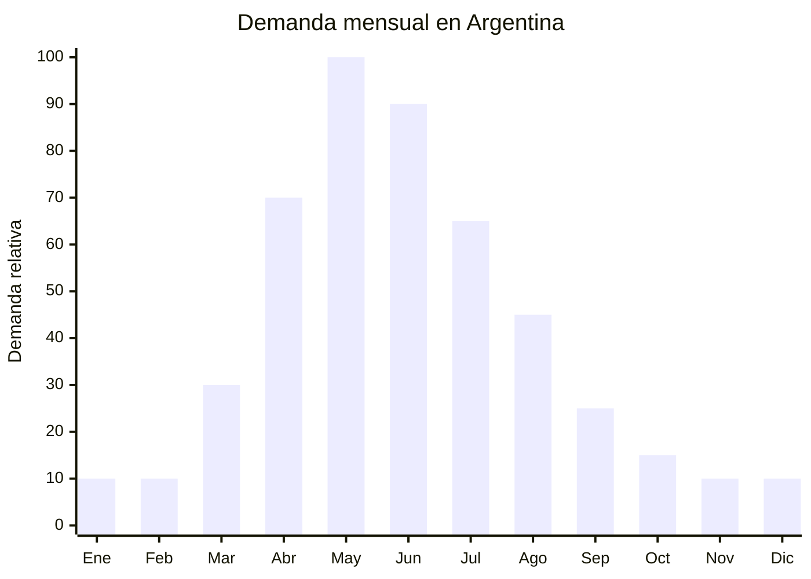

# Deshumidificadores portátiles

> **Capítulo NCM 94** — Muebles; mobiliario médico-quirúrgico; artículos de cama y similares | **Temporada:** Otoño (Mar–May)

## Qué es y por qué importarlo

Los deshumidificadores portátiles son aparatos eléctricos que extraen la humedad excesiva del aire interior, condensándola en un tanque de agua que se vacía manualmente. Existen dos tecnologías principales: los deshumidificadores por compresor (similares a un aire acondicionado en miniatura, más potentes y más caros) y los deshumidificadores Peltier o termoeléctricos (sin compresor, silenciosos, compactos, económicos y con menor capacidad de extracción).

En Argentina, la humedad interior es un problema serio entre abril y junio, cuando las lluvias otoñales, la menor ventilación (ventanas cerradas por frío) y las temperaturas moderadas generan un ambiente propicio para la condensación en paredes, moho en armarios y olor a humedad. Buenos Aires, Rosario, y toda la zona pampeana y litoral son especialmente afectadas. Los deshumidificadores portátiles compiten con soluciones pasivas (bolsas de gel de sílice, absorbedores de humedad) y con sistemas de climatización central.

Los modelos mini Peltier son los más fáciles de importar para un principiante: pesan 1-2 kg, cuestan FOB USD 8-20, no tienen gas refrigerante (evitan regulaciones de gases fluorados), son silenciosos y tienen un diseño compacto atractivo. Los modelos de compresor (FOB USD 40-80) son más potentes pero más complejos regulatoriamente. Los precios de venta en Argentina arrancan desde ARS 33,000 para mini Peltier hasta ARS 200,000+ para modelos de compresor de alta capacidad.

## Datos clave

| Dato | Valor |
|------|-------|
| **Posiciones NCM típicas** | 8479.89.99 / 8415.90.00 (aparatos para tratamiento del aire) |
| **Derecho de importación** | 20% (DIE) + 3% tasa estadística |
| **Rango FOB típico** | USD 8.00 — USD 80.00 por unidad |
| **Precio de venta en Argentina** | ARS 33.000 — ARS 200.000+ |
| **Margen bruto estimado** | 80% — 180% |
| **MOQ típico** | 100 — 300 unidades |
| **Demanda en MercadoLibre** | Media-Alta |
| **Competencia en MercadoLibre** | Media |
| **Dificultad para importar** | Moderada (Peltier) / Alta (compresor) |
| **Certificaciones necesarias** | IRAM + S-Mark. Compresor: puede requerir regulación de refrigerantes |
| **Antidumping** | No |

## Variantes y subtipos más comunes

| Subtipo / Variante | FOB aprox. | Venta AR aprox. | Nota |
|--------------------|-----------|-----------------|------|
| Mini Peltier 500ml/día (1-2 litros tanque) | USD 8.00 — 15.00 | ARS 33.000 — 55.000 | **Más fácil de importar** |
| Mini Peltier 1L/día con humidistato | USD 12.00 — 20.00 | ARS 45.000 — 70.000 | Control automático |
| Deshumidificador compresor 10L/día | USD 40.00 — 55.00 | ARS 80.000 — 130.000 | Alta capacidad |
| Deshumidificador compresor 20L/día | USD 55.00 — 80.00 | ARS 120.000 — 200.000 | Para espacios grandes |
| Mini Peltier con purificador de aire | USD 15.00 — 25.00 | ARS 50.000 — 80.000 | Doble función |
| Deshumidificador para closet/armario | USD 5.00 — 10.00 | ARS 20.000 — 40.000 | Ultra compacto, nicho específico |

## Regulaciones y requisitos

<Tabs>
  <Tab title="Certificaciones">
    | Organismo | Requiere | Detalle |
    |-----------|----------|---------|
    | ARCA (Aduana) | Sí siempre | Despacho estándar |
    | INTI / S-Mark | **Sí — obligatorio** | Seguridad eléctrica para aparatos de uso doméstico |
    | IRAM | **Sí — obligatorio** | Norma de seguridad para aparatos electrodomésticos |
    | ENACOM | No | No es producto de comunicación (salvo modelos WiFi) |
    | Regulación refrigerantes | Solo compresor | Los modelos con compresor usan gas refrigerante (R134a, R410a) y pueden requerir permisos adicionales |

    **Recomendación:** Para la primera importación, elegir modelos mini Peltier (termoeléctricos). No tienen gas refrigerante, lo que elimina una capa de regulación. Son más livianos, más baratos y el proceso de certificación S-Mark es más simple. Escalar a modelos de compresor una vez dominado el proceso regulatorio.
  </Tab>

  <Tab title="Etiquetado">
    | Requisito | Aplica |
    |-----------|--------|
    | País de origen | Sí |
    | Datos importador | Sí (nombre, dirección, CUIT) |
    | Voltaje y frecuencia | Sí (220V — 50Hz) |
    | Potencia (watts) | Sí |
    | Capacidad de extracción | Sí (ml/día o L/día) |
    | Sello S-Mark | Sí |
    | Instrucciones de uso | Sí |
    | Capacidad del tanque | Sí |
    | Tipo de refrigerante | Solo si tiene compresor |
  </Tab>

  <Tab title="Restricciones">
    - **Modelos con compresor:** El gas refrigerante puede estar sujeto a regulaciones ambientales. Verificar si el tipo de refrigerante (R134a, R410a, R290) tiene restricciones de importación.
    - **Ruido:** Los modelos Peltier son silenciosos (menos de 40 dB), pero los de compresor pueden generar ruido significativo. Indicar nivel de ruido en la publicación.
    - **Eficiencia real:** Los mini Peltier extraen 300-500 ml/día en condiciones ideales. No sobredimensionar la capacidad en la publicación para evitar reclamos.
    - Sin antidumping vigente.
  </Tab>
</Tabs>

## Logística de importación

| Factor | Detalle |
|--------|---------|
| **Peso por unidad (Peltier)** | 1 — 3 kg |
| **Peso por unidad (compresor)** | 8 — 15 kg |
| **Volumen por unidad** | Bajo (Peltier: 20x20x30 cm) / Alto (compresor: 40x30x55 cm) |
| **Unidades por caja (master carton)** | 4 — 12 (Peltier) / 1 — 2 (compresor) |
| **Peso por caja** | 6 — 20 kg |
| **Cajas por contenedor 20'** | ~800 — 2,000 cajas |
| **Unidades por contenedor 20'** | ~5,000 — 15,000 (Peltier) / ~1,500 — 3,000 (compresor) |
| **Fragilidad** | Media |
| **Requiere embalaje especial** | Sí — protección del tanque y elementos plásticos. Compresor: transporte vertical obligatorio |

<Tip>
Los deshumidificadores Peltier mini son ideales para envío por courier o aéreo como primera prueba de mercado. Un lote de 50 unidades Peltier pesa menos de 100 kg y ocupa el espacio de una valija grande. Se puede tener stock en Argentina en 7-10 días y validar la demanda antes de comprometer un contenedor con modelos de compresor.
</Tip>

## Estacionalidad y timing de compra

| Dato | Valor |
|------|-------|
| **Meses de mayor venta** | Abril — Junio (otoño húmedo) |
| **Pedido ideal (marítimo)** | Enero — Febrero (para llegar en abril) |
| **Pedido ideal (aéreo)** | Marzo (para llegar en abril) |
| **Anticipación mínima** | 3 meses antes del pico |

## Ventajas y riesgos

<CardGroup cols={2}>
  <Card title="Ventajas" icon="circle-check">
    - Resuelve un problema real y molesto (humedad, moho)
    - Mini Peltier: fácil de importar, sin gas refrigerante
    - Ticket medio-alto (ARS 33,000-200,000)
    - Demanda creciente por conciencia de calidad del aire interior
    - Producto de uso permanente (no solo estacional extremo)
    - Competencia moderada: mercado en crecimiento
  </Card>

  <Card title="Riesgos y desventajas" icon="triangle-exclamation">
    - S-Mark + IRAM obligatorio
    - Mini Peltier: capacidad real limitada, posibles reclamos
    - Modelos compresor: pesados, voluminosos, regulación de refrigerantes
    - Competencia de soluciones pasivas más baratas (bolsas absorbentes)
    - Algunos usuarios no entienden las limitaciones de los mini Peltier
    - Producto menos estacional que otros: demanda más distribuida pero sin pico explosivo
  </Card>
</CardGroup>

## Palabras clave para buscar en Alibaba

`mini dehumidifier Peltier wholesale` · `small dehumidifier 500ml home` · `portable dehumidifier 220V` · `thermoelectric dehumidifier manufacturer` · `compressor dehumidifier 10L 220V wholesale`

## Fuentes

- MercadoLibre Argentina — búsqueda "deshumidificador portatil"
- Alibaba.com — proveedores de mini dehumidifier Peltier wholesale
- INTI — Requisitos S-Mark para electrodomésticos
- Información sobre regulación de gases refrigerantes en Argentina
