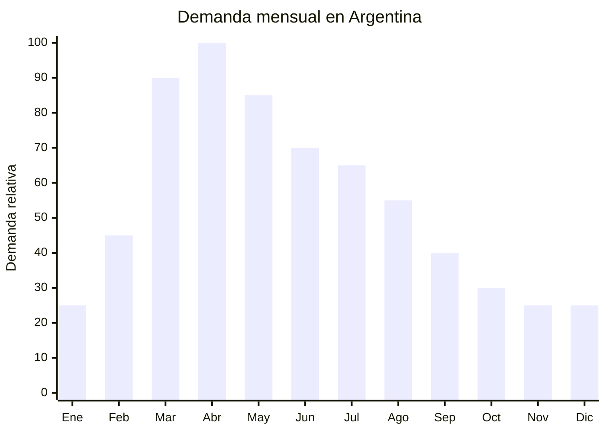

# Lámparas LED de escritorio y veladores de estudio

> **Capítulo NCM 94** — Muebles; aparatos de alumbrado | **Temporada:** Otoño (Mar–May)

## Qué es y por qué importarlo

Las lámparas LED de escritorio son luminarias de sobremesa diseñadas para iluminación de tareas: estudio, lectura, trabajo en computadora y manualidades. Los modelos actuales incorporan brazo articulado flexible o plegable, regulación de intensidad (dimmer), temperatura de color ajustable (cálida/neutra/fría) y puerto USB de carga integrado. El formato más vendido en Argentina es la lámpara con clip o base pesada, brazo tipo cuello de cisne y panel LED plano.

En Argentina, la demanda tiene un pico claro entre marzo y mayo por la convergencia de dos factores: la vuelta a clases (millones de estudiantes necesitan un velador de estudio) y el acortamiento natural de los días en otoño, que adelanta la necesidad de iluminación artificial. Marcas como TRAFOLUC y GADNIC lideran el segmento en MercadoLibre, pero la mayoría son productos chinos con marca local, lo que abre oportunidad para importación directa con marca propia.

El costo FOB oscila entre USD 3 y USD 10 según complejidad (brazo fijo vs. articulado, con o sin USB, calidad del LED). Los precios de venta en Argentina van de ARS 8,000 a ARS 35,000, dejando márgenes brutos de 100-250% dependiendo del modelo y el canal de venta. El producto requiere certificación S-Mark e IRAM para su comercialización legal en Argentina, lo que actúa como barrera de entrada moderada pero protege contra la competencia informal.

## Datos clave

| Dato | Valor |
|------|-------|
| **Posiciones NCM típicas** | 9405.42.00 (lámparas eléctricas de mesa, LED) |
| **Derecho de importación** | 20% (DIE) + 3% tasa estadística |
| **Rango FOB típico** | USD 3.00 — USD 10.00 por unidad |
| **Precio de venta en Argentina** | ARS 8.000 — ARS 35.000 |
| **Margen bruto estimado** | 100% — 250% |
| **MOQ típico** | 200 — 500 unidades |
| **Demanda en MercadoLibre** | Alta |
| **Competencia en MercadoLibre** | Media-Alta |
| **Dificultad para importar** | Moderada (S-Mark + IRAM) |
| **Certificaciones necesarias** | S-Mark + IRAM (seguridad eléctrica) |
| **Antidumping** | No |

## Variantes y subtipos más comunes

| Subtipo / Variante | FOB aprox. | Venta AR aprox. | Nota |
|--------------------|-----------|-----------------|------|
| Lámpara brazo fijo LED básica | USD 3.00 — 5.00 | ARS 8.000 — 15.000 | Entrada económica |
| Lámpara brazo articulado + dimmer | USD 5.00 — 7.00 | ARS 15.000 — 25.000 | **Más vendida** |
| Lámpara con puerto USB y dimmer | USD 6.00 — 8.00 | ARS 18.000 — 28.000 | Valor agregado |
| Lámpara con clip (pinza) flexible | USD 3.50 — 6.00 | ARS 10.000 — 20.000 | Para estantes/cabeceras |
| Lámpara plegable portátil recargable | USD 4.00 — 8.00 | ARS 12.000 — 25.000 | Sin cable, batería interna |
| Lámpara con base organizadora (porta lápices) | USD 5.00 — 10.00 | ARS 15.000 — 35.000 | Segmento escolar premium |

## Regulaciones y requisitos

<Tabs>
  <Tab title="Certificaciones">
    | Organismo | Requiere | Detalle |
    |-----------|----------|---------|
    | ARCA (Aduana) | Sí siempre | Despacho estándar |
    | INTI / S-Mark | **Sí — obligatorio** | Certificación de seguridad eléctrica. Todo producto eléctrico que se conecta a la red de 220V requiere sello S-Mark |
    | IRAM | **Sí — obligatorio** | Norma IRAM para luminarias. Aplica en combinación con S-Mark |
    | ENACOM | No | No tiene comunicación inalámbrica (salvo modelos con Bluetooth, verificar) |
    | ANMAT | No | No es producto de salud |

    **Recomendación:** Solicitar al proveedor chino que la lámpara ya venga diseñada para 220V/50Hz (estándar argentino) con ficha bipolar argentina incluida o con adaptador. Algunas fábricas ofrecen enviar con certificados de prueba (test reports) que aceleran la homologación S-Mark en Argentina.
  </Tab>

  <Tab title="Etiquetado">
    | Requisito | Aplica |
    |-----------|--------|
    | País de origen | Sí |
    | Datos importador | Sí (nombre, dirección, CUIT) |
    | Voltaje y frecuencia | Sí (220V — 50Hz) |
    | Potencia (watts) | Sí |
    | Sello S-Mark | Sí — visible en producto y packaging |
    | Instrucciones de uso | Sí |
    | Precauciones | Sí ("No cubrir durante el uso", "Mantener lejos de agua") |
  </Tab>

  <Tab title="Restricciones">
    - Los modelos con batería de litio recargable tienen restricciones de transporte aéreo (IATA DG). Verificar con el agente de carga.
    - Modelos con puerto USB deben cumplir con límites de tensión de salida seguros (5V DC).
    - Sin antidumping vigente para luminarias LED.
    - Si el modelo incluye Bluetooth o WiFi (smart lamp), requiere además ENACOM.
  </Tab>
</Tabs>

## Logística de importación

| Factor | Detalle |
|--------|---------|
| **Peso por unidad** | 300 — 800 g (según modelo y base) |
| **Volumen por unidad** | Variable — cajas individuales de 15x15x40 cm aprox. |
| **Unidades por caja (master carton)** | 12 — 24 unidades |
| **Peso por caja** | 5 — 15 kg |
| **Cajas por contenedor 20'** | ~800 — 1,500 cajas |
| **Unidades por contenedor 20'** | ~12,000 — 25,000 unidades |
| **Fragilidad** | Media (brazo articulado y panel LED requieren protección) |
| **Requiere embalaje especial** | Sí — caja individual con inserto de espuma o cartón moldeado para proteger brazo y panel |

<Tip>
Para el primer embarque, considerar modelos con brazo fijo o cuello de cisne flexible (sin articulaciones mecánicas), que son menos propensos a daño en tránsito y tienen menor costo FOB. Escalar a modelos articulados premium una vez validada la demanda y el canal de venta.
</Tip>

## Estacionalidad y timing de compra

| Dato | Valor |
|------|-------|
| **Meses de mayor venta** | Marzo — Mayo (vuelta a clases + días cortos) |
| **Pedido ideal (marítimo)** | Diciembre — Enero (para llegar en marzo) |
| **Pedido ideal (aéreo)** | Febrero (para llegar en marzo) |
| **Anticipación mínima** | 2-3 meses antes de marzo |

## Ventajas y riesgos

<CardGroup cols={2}>
  <Card title="Ventajas" icon="circle-check">
    - Demanda estacional fuerte y predecible (vuelta a clases)
    - Producto de uso diario con baja tasa de devolución
    - Múltiples variantes para segmentar (básica, premium, escolar)
    - Puerto USB agrega valor percibido con costo mínimo
    - Demanda residual todo el año (trabajo remoto, estudio)
    - Producto liviano con buen ratio valor/peso
  </Card>

  <Card title="Riesgos y desventajas" icon="triangle-exclamation">
    - Requiere S-Mark + IRAM (costo y tiempo de certificación)
    - Brazo articulado puede dañarse en transporte
    - Competencia de marcas establecidas (TRAFOLUC, GADNIC)
    - Modelos con batería litio complican logística aérea
    - Verificar compatibilidad 220V/50Hz antes de comprar
    - Ciclo de vida del LED: verificar horas declaradas vs. reales
  </Card>
</CardGroup>

## Palabras clave para buscar en Alibaba

`LED desk lamp dimmable wholesale` · `study lamp flexible arm USB` · `rechargeable desk lamp clip` · `LED table lamp 220V manufacturer` · `desk lamp organizer pen holder OEM`

## Fuentes

- MercadoLibre Argentina — búsqueda "lampara led escritorio"
- Alibaba.com — proveedores de LED desk lamp wholesale
- INTI — Requisitos de certificación S-Mark para luminarias
- Resolución SCI sobre seguridad eléctrica de productos importados
