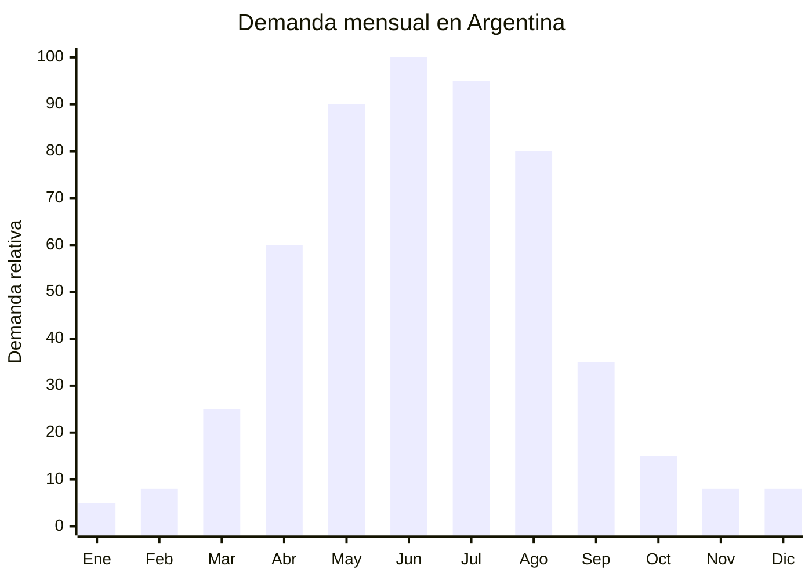

# Mantas y frazadas eléctricas (uso hogar)

> **Capítulo NCM 94** — Muebles; mobiliario médico-quirúrgico; artículos de cama y similares | **Temporada:** Otoño (Mar–May)

<Note>
**CLASIFICACIÓN NCM:** Las mantas eléctricas pueden clasificarse en el Capítulo 85 (como aparato eléctrico) o en el Capítulo 94 (como artículo de cama). Esta ficha aborda el producto desde la perspectiva de uso hogar/dormitorio. Para la visión técnica eléctrica, consultar la ficha del Capítulo 85.
</Note>

## Qué es y por qué importarlo

Las mantas y frazadas eléctricas son productos textiles para cama que incorporan filamentos calefactores en su interior, diseñados para proporcionar calor durante el descanso nocturno. Se presentan en dos formatos: la manta eléctrica (se coloca encima del cuerpo como una frazada) y el calienta-camas (se coloca debajo de la sábana, sobre el colchón). El acabado exterior es de polar, felpa o microfibra, integrándose visualmente con la ropa de cama convencional.

Desde la perspectiva de uso hogar, la manta eléctrica compite directamente con las frazadas de polar grueso, los acolchados de plumas y la calefacción a gas. Su ventaja es que calienta directamente el cuerpo y la cama con un consumo eléctrico mínimo (60-120W), lo que la convierte en la opción más económica de calefacción nocturna. Marcas como Silfab y Aspen dominan el mercado argentino con precios desde ARS 18,000 para 1 plaza.

El enfoque hogar/textil permite posicionar el producto en la categoría de ropa de cama premium, compitiendo con acolchados y frazadas de alta gama en lugar de con aparatos eléctricos. La presentación en caja tipo regalo, con acabado textil suave y colores elegantes, justifica un precio superior al de un simple calienta-camas genérico. El FOB oscila entre USD 10 y USD 25 según tamaño y calidad del textil exterior.

## Datos clave

| Dato | Valor |
|------|-------|
| **Posiciones NCM típicas** | 9404.90.00 (artículos de cama y similares) / 8516.79.00 |
| **Derecho de importación** | 20% (DIE) + 3% tasa estadística |
| **Rango FOB típico** | USD 10.00 — USD 25.00 por unidad |
| **Precio de venta en Argentina** | ARS 18.000 — ARS 80.000 |
| **Margen bruto estimado** | 100% — 180% |
| **MOQ típico** | 200 — 500 unidades |
| **Demanda en MercadoLibre** | Alta |
| **Competencia en MercadoLibre** | Media (Silfab, Aspen dominan) |
| **Dificultad para importar** | Alta (IRAM obligatorio) |
| **Certificaciones necesarias** | IRAM (seguridad eléctrica) + S-Mark |
| **Antidumping** | No |

## Variantes y subtipos más comunes

| Subtipo / Variante | FOB aprox. | Venta AR aprox. | Nota |
|--------------------|-----------|-----------------|------|
| Calienta-camas 1 plaza polar | USD 10.00 — 14.00 | ARS 18.000 — 30.000 | **Más vendido** |
| Calienta-camas 2 plazas polar | USD 14.00 — 20.00 | ARS 30.000 — 50.000 | Mayor ticket |
| Frazada eléctrica felpa 1 plaza | USD 12.00 — 18.00 | ARS 25.000 — 45.000 | Uso sobre el cuerpo |
| Frazada eléctrica microfibra 2 plazas | USD 16.00 — 25.00 | ARS 40.000 — 65.000 | Premium |
| Manta eléctrica king size premium | USD 20.00 — 30.00 | ARS 55.000 — 80.000 | Segmento alto |
| Set manta + almohadilla térmica | USD 18.00 — 28.00 | ARS 35.000 — 60.000 | Kit regalo |

## Regulaciones y requisitos

<Tabs>
  <Tab title="Certificaciones">
    | Organismo | Requiere | Detalle |
    |-----------|----------|---------|
    | ARCA (Aduana) | Sí siempre | Despacho estándar |
    | INTI / S-Mark | **Sí — obligatorio** | Certificación de seguridad eléctrica |
    | IRAM | **Sí — obligatorio** | Norma para mantas y almohadillas eléctricas |
    | ENACOM | No | No es producto de comunicación |
    | ANMAT | No | No es producto de salud |

    **Recomendación:** Solicitar al proveedor certificación según IEC 60335-2-17. Exigir protección contra sobrecalentamiento con sensor térmico de corte y apagado automático temporizado. Verificar que el textil exterior sea lavable con controlador desmontable.
  </Tab>

  <Tab title="Etiquetado">
    | Requisito | Aplica |
    |-----------|--------|
    | País de origen | Sí |
    | Datos importador | Sí |
    | Composición textil | Sí (porcentaje de poliéster, algodón, etc.) |
    | Voltaje y frecuencia | Sí (220V — 50Hz) |
    | Potencia (watts) | Sí |
    | Instrucciones de lavado | Sí — con símbolos ISO |
    | Sello S-Mark | Sí |
    | Precauciones de seguridad | Sí |
  </Tab>

  <Tab title="Restricciones">
    - **Apagado automático:** Todo modelo debe incluir temporizador de apagado automático (2-4 horas).
    - **Sensor de sobrecalentamiento:** Obligatorio para prevenir incendios.
    - **Textil lavable:** El controlador debe ser desmontable para permitir lavado.
    - **Composición textil:** Cumplir con normativa de etiquetado textil argentino (similar a IRAM 12560).
    - Sin antidumping vigente.
  </Tab>
</Tabs>

## Logística de importación

| Factor | Detalle |
|--------|---------|
| **Peso por unidad** | 1.2 — 3.0 kg (según tamaño y textil) |
| **Volumen por unidad** | Moderado — caja regalo de 40x30x12 cm aprox. |
| **Unidades por caja (master carton)** | 6 — 10 unidades |
| **Peso por caja** | 10 — 25 kg |
| **Cajas por contenedor 20'** | ~700 — 1,200 cajas |
| **Unidades por contenedor 20'** | ~5,000 — 10,000 unidades |
| **Fragilidad** | Baja (textil flexible) |
| **Requiere embalaje especial** | No — protección estándar. Caja regalo individual mejora presentación y protege |

<Tip>
Solicitar al proveedor que el packaging sea tipo "gift box" (caja regalo con ventana transparente o foto del producto). En la categoría de ropa de cama, la presentación del empaque influye directamente en la decisión de compra. Un packaging premium justifica un sobreprecio de ARS 3,000-5,000 con un costo adicional FOB de apenas USD 0.30-0.50.
</Tip>

## Estacionalidad y timing de compra

| Dato | Valor |
|------|-------|
| **Meses de mayor venta** | Abril — Agosto (otoño-invierno) |
| **Segundo pico menor** | Junio (Día del Padre) — regalo popular |
| **Pedido ideal (marítimo)** | Enero — Febrero (para llegar en abril) |
| **Pedido ideal (aéreo)** | Marzo (para llegar en abril) |
| **Anticipación mínima** | 3-4 meses (incluir certificación IRAM) |

## Ventajas y riesgos

<CardGroup cols={2}>
  <Card title="Ventajas" icon="circle-check">
    - Posicionamiento hogar/textil con mayor percepción de valor
    - Ticket alto (ARS 18,000-80,000)
    - Demanda fuerte y predecible abril-agosto
    - Alternativa económica a calefacción central
    - Formato regalo ideal para Día del Padre y fiestas
    - Pocas marcas dominantes, hay espacio para competir
  </Card>

  <Card title="Riesgos y desventajas" icon="triangle-exclamation">
    - **IRAM + S-Mark obligatorio: costo y tiempo de certificación**
    - Producto de alto riesgo eléctrico (uso nocturno)
    - Responsabilidad legal si causa incidente
    - Competencia de Silfab y Aspen (marcas establecidas)
    - Estacionalidad marcada: stock de invierno pierde valor en verano
    - Doble etiquetado: textil (IRAM 12560) + eléctrico (S-Mark)
  </Card>
</CardGroup>

## Palabras clave para buscar en Alibaba

`electric blanket fleece 220V wholesale` · `heated blanket polar throw` · `electric underblanket microfiber` · `heated bed blanket gift box` · `electric blanket auto shut off 220V`

## Fuentes

- MercadoLibre Argentina — búsqueda "frazada electrica" y "manta electrica polar"
- Alibaba.com — proveedores de electric heated blanket 220V
- IRAM — Norma de seguridad para mantas eléctricas
- Silfab y Aspen — Catálogos de referencia de mercado argentino
