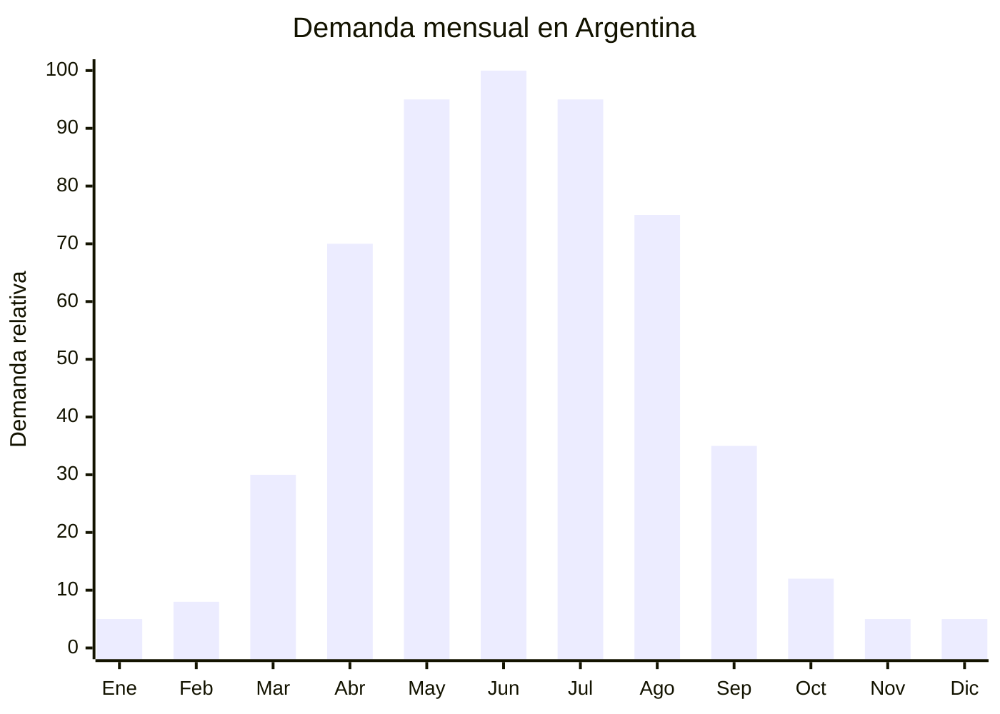

# Paneles calefactores eléctricos bajo consumo

> **Capítulo NCM 94** — Muebles; mobiliario médico-quirúrgico; artículos de cama y similares; aparatos de alumbrado | **Temporada:** Otoño (Mar–May)

## Qué es y por qué importarlo

Los paneles calefactores eléctricos de bajo consumo son dispositivos de calefacción planos que se montan en la pared y emiten calor por convección y radiación. Funcionan con resistencias eléctricas internas recubiertas por una placa de vidrio templado, cerámica o metal, consumiendo típicamente entre 500 y 700W (promedio 600W/hora). Se caracterizan por no tener combustión (no queman gas ni generan monóxido de carbono), ser silenciosos, no resecar el ambiente y tener bajo consumo comparado con estufas eléctricas convencionales de cuarzo o halógenas.

En Argentina, el panel calefactor se consolidó como el producto de climatización estrella del otoño. La combinación de aumentos en las tarifas de gas, la peligrosidad del gas envasado (garrafas) y la practicidad de enchufar un panel a la pared impulsaron una demanda masiva. Marcas como Liliana, Atma, Peabody y GADNIC dominan el mercado con precios desde ARS 7,499 en modelos básicos hasta ARS 80,000+ en modelos premium con WiFi y control por app.

La Resolución 16/2025 del Ministerio de Economía de Argentina aceptó normas IEC internacionales como base para la certificación de productos eléctricos, lo que facilita el proceso de homologación S-Mark para paneles fabricados en China que ya cuentan con certificación internacional. El FOB oscila entre USD 15 y USD 50 según potencia, material y funcionalidades, dejando márgenes brutos de 100-200%.

## Datos clave

| Dato | Valor |
|------|-------|
| **Posiciones NCM típicas** | 9403.89.00 / 8516.29.00 (calefactores eléctricos de ambiente) |
| **Derecho de importación** | 20% (DIE) + 3% tasa estadística |
| **Rango FOB típico** | USD 15.00 — USD 50.00 por unidad |
| **Precio de venta en Argentina** | ARS 7.499 — ARS 80.000+ |
| **Margen bruto estimado** | 100% — 200% |
| **MOQ típico** | 100 — 300 unidades |
| **Demanda en MercadoLibre** | Muy Alta |
| **Competencia en MercadoLibre** | Alta (Liliana, Atma, Peabody, GADNIC) |
| **Dificultad para importar** | Moderada-Alta (S-Mark + IRAM obligatorio) |
| **Certificaciones necesarias** | S-Mark + IRAM. Res. 16/2025 acepta IEC como base |
| **Antidumping** | No |

## Variantes y subtipos más comunes

| Subtipo / Variante | FOB aprox. | Venta AR aprox. | Nota |
|--------------------|-----------|-----------------|------|
| Panel convector 500W básico (chapa) | USD 15.00 — 22.00 | ARS 7.499 — 18.000 | Entrada económica |
| Panel vidrio templado 600W | USD 20.00 — 30.00 | ARS 18.000 — 35.000 | **Más vendido** — estética moderna |
| Panel cerámico 700W con termostato | USD 25.00 — 35.00 | ARS 25.000 — 45.000 | Retención de calor superior |
| Panel 1000W con timer digital | USD 30.00 — 40.00 | ARS 35.000 — 55.000 | Para ambientes más grandes |
| Panel WiFi/Smart con app y control remoto | USD 35.00 — 50.00 | ARS 45.000 — 80.000 | Premium, máximo ticket |
| Panel infrarrojo (radiación directa) | USD 18.00 — 30.00 | ARS 15.000 — 35.000 | Calor instantáneo dirigido |

## Regulaciones y requisitos

<Tabs>
  <Tab title="Certificaciones">
    | Organismo | Requiere | Detalle |
    |-----------|----------|---------|
    | ARCA (Aduana) | Sí siempre | Despacho con VDI (Verificación de Destino de Importación) |
    | INTI / S-Mark | **Sí — obligatorio** | Certificación de seguridad eléctrica obligatoria para todo calefactor eléctrico |
    | IRAM | **Sí — obligatorio** | Norma de seguridad para aparatos de calefacción eléctrica |
    | ENACOM | Solo si tiene WiFi/Bluetooth | Modelos smart requieren homologación ENACOM adicional |
    | ANMAT | No | No es producto de salud |

    **Recomendación:** La Resolución 16/2025 aceptó normas IEC internacionales como base para la certificación en Argentina. Solicitar al proveedor chino certificados según IEC 60335-2-30 (calefactores de ambiente) emitidos por laboratorio reconocido (TUV, SGS, Intertek). Esto agiliza enormemente el trámite S-Mark/IRAM en Argentina. Presupuestar USD 2,000-5,000 para el proceso completo de certificación por modelo.
  </Tab>

  <Tab title="Etiquetado">
    | Requisito | Aplica |
    |-----------|--------|
    | País de origen | Sí |
    | Datos importador | Sí (nombre, dirección, CUIT) |
    | Voltaje y frecuencia | Sí (220V — 50Hz) |
    | Potencia (watts) | Sí |
    | Sello S-Mark | Sí — visible en producto y packaging |
    | Eficiencia energética | Recomendado (clase energética si aplica) |
    | Instrucciones de instalación | Sí (montaje en pared + distancias de seguridad) |
    | Precauciones | Sí ("No cubrir", "Distancia mínima a cortinas/muebles", "No usar en baño sin IPX") |
  </Tab>

  <Tab title="Restricciones">
    - **Uso en baño:** Los paneles estándar NO tienen protección IPX y no deben usarse en baños. Si se quiere un modelo para baño, debe tener certificación IPX4 como mínimo.
    - **Potencia máxima por circuito:** Informar al usuario que un circuito doméstico de 10A soporta hasta 2,200W. No conectar múltiples calefactores al mismo circuito.
    - **Distancias de seguridad:** Mantener mínimo 50 cm de cortinas, muebles y materiales inflamables.
    - Sin antidumping vigente para paneles calefactores.
  </Tab>
</Tabs>

## Logística de importación

| Factor | Detalle |
|--------|---------|
| **Peso por unidad** | 3 — 8 kg (según material: chapa 3kg, vidrio 6-8kg) |
| **Volumen por unidad** | Alto — caja de 60x45x10 cm aprox. |
| **Unidades por caja (master carton)** | 1 — 2 unidades |
| **Peso por caja** | 5 — 12 kg |
| **Cajas por contenedor 20'** | ~1,000 — 2,000 cajas |
| **Unidades por contenedor 20'** | ~2,000 — 3,000 unidades |
| **Fragilidad** | Alta (paneles de vidrio templado) / Media (paneles de chapa) |
| **Requiere embalaje especial** | Sí — paneles de vidrio requieren embalaje con esquineros de espuma, separadores y caja reforzada. Los de chapa necesitan protección contra abolladuras |

<Tip>
Para el primer embarque, considerar paneles de chapa metálica en lugar de vidrio templado. Son más livianos, más resistentes al transporte y tienen menor FOB. El vidrio templado tiene mejor estética y mayor precio de venta, pero el riesgo de rotura en tránsito es real. Escalar a modelos de vidrio una vez validada la cadena logística.
</Tip>

## Estacionalidad y timing de compra

| Dato | Valor |
|------|-------|
| **Meses de mayor venta** | Abril — Agosto (otoño-invierno) |
| **Pedido ideal (marítimo)** | Diciembre — Enero (para llegar en marzo-abril) |
| **Pedido ideal (aéreo)** | Febrero — Marzo (para llegar en abril) |
| **Anticipación mínima** | 3-4 meses (incluir certificación S-Mark) |

## Ventajas y riesgos

<CardGroup cols={2}>
  <Card title="Ventajas" icon="circle-check">
    - Producto de climatización #1 en Argentina otoño-invierno
    - Demanda masiva y predecible
    - Sin combustión: seguro, limpio, sin olores
    - Bajo consumo comparado con estufas convencionales
    - Res. 16/2025 facilita certificación con normas IEC
    - Múltiples segmentos: económico, vidrio, smart WiFi
    - Producto de ticket medio-alto con buen margen
  </Card>

  <Card title="Riesgos y desventajas" icon="triangle-exclamation">
    - **S-Mark + IRAM obligatorio (USD 2,000-5,000 por modelo)**
    - Competencia fuerte de marcas establecidas (Liliana, Atma, Peabody)
    - Paneles de vidrio templado: alto riesgo de rotura en transporte
    - Producto pesado y voluminoso (flete alto)
    - Estacionalidad marcada: stock sobrante pierde valor en verano
    - Responsabilidad legal si el producto causa incendio
  </Card>
</CardGroup>

## Palabras clave para buscar en Alibaba

`electric panel heater 220V wholesale` · `glass panel heater convection` · `wall mount electric heater 600W` · `ceramic panel heater thermostat` · `smart WiFi panel heater 220V manufacturer`

## Fuentes

- MercadoLibre Argentina — búsqueda "panel calefactor bajo consumo"
- Alibaba.com — proveedores de electric panel heater 220V
- INTI — Requisitos S-Mark para calefactores eléctricos
- Resolución 16/2025 — Aceptación de normas IEC para certificación argentina
- IEC 60335-2-30 — Norma internacional para calefactores de ambiente
