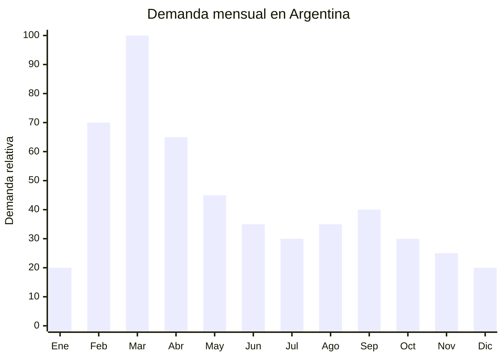

# Colchonetas de gimnasia escolares plegables

> **Capítulo NCM 95** — Juguetes, juegos y artículos para recreo o deporte | **Temporada:** Otoño (Mar–May)

## Qué es y por qué importarlo

Las colchonetas de gimnasia escolares son superficies acolchadas plegables diseñadas para ejercicios de piso en clases de educación física, gimnasia, yoga, artes marciales y actividades deportivas en general. Miden entre 1 y 2 metros de largo, con espesores de 5 a 10 cm, y están recubiertas con funda de PVC o vinilo impermeable que las hace fáciles de limpiar. El relleno interior es de espuma de polietileno expandido o poliuretano de alta densidad.

La demanda pico se concentra en febrero y marzo, cuando escuelas, gimnasios, clubes deportivos y academias de artes marciales reponen su equipamiento para el nuevo ciclo. Los profesores de educación física son un canal de compra importante: recomiendan a los alumnos o compran directamente para el aula. También hay demanda de padres que buscan colchonetas para ejercicio en casa (tendencia que se aceleró con la pandemia y se mantuvo).

El FOB va de USD 5 para colchonetas básicas de 1m x 60cm x 5cm hasta USD 20 para modelos de 2m x 1m x 10cm con relleno de alta densidad. Los precios de venta en Argentina oscilan entre ARS 11,900 y ARS 59,990. Al ser artículo deportivo (no juguete), no requiere certificación IRAM de seguridad de juguetes, lo que simplifica el proceso de importación significativamente.

## Datos clave

| Dato | Valor |
|------|-------|
| **Posiciones NCM típicas** | 9506.91.00 (artículos y material para cultura física y gimnasia) |
| **Derecho de importación** | 20% (DIE) + 3% tasa estadística |
| **Rango FOB típico** | USD 5.00 — USD 20.00 por unidad |
| **Precio de venta en Argentina** | ARS 11.900 — ARS 59.990 |
| **Margen bruto estimado** | 100% — 200% |
| **MOQ típico** | 100 — 300 unidades |
| **Demanda en MercadoLibre** | Media-Alta |
| **Competencia en MercadoLibre** | Media |
| **Dificultad para importar** | Fácil (sin IRAM obligatorio) |
| **Certificaciones necesarias** | Ninguna específica (artículo deportivo) |
| **Antidumping** | No |

## Variantes y subtipos más comunes

| Subtipo / Variante | FOB aprox. | Venta AR aprox. | Nota |
|--------------------|-----------|-----------------|------|
| Colchoneta plegable 1m x 60cm x 5cm | USD 5.00 — 8.00 | ARS 11.900 — 20.000 | Uso escolar básico |
| Colchoneta plegable 1.5m x 60cm x 5cm | USD 7.00 — 12.00 | ARS 16.000 — 30.000 | **Más vendida** |
| Colchoneta plegable 2m x 1m x 5cm | USD 10.00 — 15.00 | ARS 25.000 — 40.000 | Gimnasia/artes marciales |
| Colchoneta alta densidad 1.5m x 10cm | USD 12.00 — 20.00 | ARS 30.000 — 59.990 | Para caídas/volteretas |
| Colchoneta enrollable (yoga/fitness) | USD 3.00 — 7.00 | ARS 8.000 — 18.000 | Más delgada, más liviana |
| Set x2 colchonetas plegables 1m | USD 9.00 — 14.00 | ARS 20.000 — 35.000 | Pack escolar/familiar |

## Regulaciones y requisitos

<Tabs>
  <Tab title="Certificaciones">
    | Organismo | Requiere | Detalle |
    |-----------|----------|---------|
    | ARCA (Aduana) | Sí siempre | Despacho estándar |
    | INTI / IRAM | **No** | Artículo deportivo, no juguete. No requiere IRAM de juguetes |
    | ENACOM | No | No es electrónico |
    | ANMAT | No | No es producto de salud |

    **Recomendación:** Aunque no hay certificación obligatoria, solicitar al proveedor que la funda PVC sea libre de plomo y ftalatos, especialmente si el producto se venderá para uso infantil. Un certificado ROHS o SGS de los materiales agrega valor comercial y protege legalmente.
  </Tab>

  <Tab title="Etiquetado">
    | Requisito | Aplica |
    |-----------|--------|
    | País de origen | Sí |
    | Datos importador | Sí |
    | Dimensiones (largo x ancho x espesor) | Sí |
    | Material funda | Recomendado (PVC, vinilo) |
    | Material relleno | Recomendado (espuma PE, PU) |
    | Densidad del relleno | Recomendado |
    | Peso máximo soportado | Recomendado |
    | Instrucciones de limpieza | Recomendado |
  </Tab>

  <Tab title="Restricciones">
    Sin restricciones regulatorias significativas.
    - **Clasificación:** Mantener la clasificación como artículo deportivo (NCM 9506), no como colchón (NCM 9404) que tiene regulaciones diferentes.
    - **Olor:** Las colchonetas nuevas de PVC y espuma pueden tener olor fuerte. Solicitar al proveedor ventilación previa al empaquetado o advertir al usuario.
    - Sin antidumping vigente.
  </Tab>
</Tabs>

## Logística de importación

| Factor | Detalle |
|--------|---------|
| **Peso por unidad** | 1 — 4 kg (según tamaño y espesor) |
| **Volumen por unidad (plegada)** | Moderado — 60x30x15 cm a 100x50x20 cm aprox. |
| **Unidades por caja (master carton)** | 2 — 6 unidades |
| **Peso por caja** | 5 — 18 kg |
| **Cajas por contenedor 20'** | ~800 — 1,500 cajas |
| **Unidades por contenedor 20'** | ~3,000 — 6,000 unidades |
| **Fragilidad** | Nula (espuma flexible) |
| **Requiere embalaje especial** | No — bolsa plástica individual suficiente. Proteger funda PVC de perforaciones |

<Tip>
Las colchonetas son un producto que se vende por volumen, no por peso. Al calcular el contenedor, el factor limitante será el espacio (cubicaje), no el peso. Optimizar con el proveedor la forma de plegado más compacta para maximizar unidades por contenedor. Las colchonetas de 5 cm de espesor ocupan significativamente menos que las de 10 cm.
</Tip>

## Estacionalidad y timing de compra

| Dato | Valor |
|------|-------|
| **Meses de mayor venta** | Febrero — Abril (vuelta a clases + arranque gimnasios) |
| **Pico máximo** | Marzo (inicio de educación física) |
| **Pedido ideal (marítimo)** | Noviembre — Diciembre (para llegar en febrero) |
| **Pedido ideal (aéreo)** | Enero (para llegar en febrero) |
| **Anticipación mínima** | 2-3 meses antes de febrero |

## Ventajas y riesgos

<CardGroup cols={2}>
  <Card title="Ventajas" icon="circle-check">
    - Sin certificación IRAM (artículo deportivo)
    - Demanda predecible (vuelta a clases + gimnasios)
    - Producto prácticamente indestructible
    - Mercado institucional (escuelas, gimnasios, clubes)
    - Demanda residual todo el año (fitness en casa)
    - Canal de profesores de educación física como prescriptores
    - Bajo riesgo de devolución (producto simple)
  </Card>

  <Card title="Riesgos y desventajas" icon="triangle-exclamation">
    - Producto VOLUMINOSO: flete alto por unidad
    - Ticket medio (ARS 12,000-60,000) pero compite por precio
    - Olor químico de PVC nuevo puede generar reclamos
    - Relleno de baja densidad se aplasta rápido
    - Competencia con fabricación local artesanal
    - Colchonetas grandes difíciles de enviar por courier/aéreo
  </Card>
</CardGroup>

## Palabras clave para buscar en Alibaba

`gymnastics mat foldable PVC wholesale` · `exercise mat folding school` · `gym mat thick foam foldable` · `PVC exercise mat 5cm 10cm factory` · `tumbling mat foldable wholesale`

## Fuentes

- MercadoLibre Argentina — búsqueda "colchoneta gimnasia plegable"
- Alibaba.com — proveedores de foldable gymnastics mat wholesale
- Nomenclatura arancelaria argentina — NCM 9506.91.00
