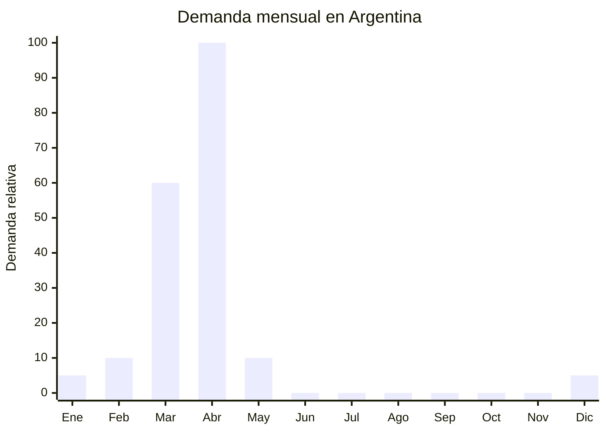

# Huevos de Pascua plastico con sorpresas

> **Capitulo NCM 95** — Juguetes, juegos y articulos para recreo o deporte | **Temporada:** Otono (Mar-May)

## Que es y por que importarlo

Los huevos de Pascua plasticos son capsulas de plastico (generalmente polipropileno PP o poliestireno PS) con forma de huevo que se abren por la mitad y pueden contener juguetes pequenos, dulces, stickers o simplemente venderse vacios para que las familias los rellenen. Se utilizan principalmente en la tradicion del "egg hunt" (busqueda de huevos), una costumbre que viene creciendo fuertemente en Argentina, impulsada por la influencia cultural norteamericana a traves de redes sociales y contenido para ninos.

La demanda esta 100% concentrada en las semanas previas a Pascuas (abril, ocasionalmente finales de marzo). Es un producto de compra unica anual con un pico extremadamente agudo: las ventas se concentran en 3-4 semanas. Sin embargo, los volumenes pueden ser enormes. Alibaba ofrece mas de 100,000 resultados para "plastic Easter eggs bulk", con proveedores especializados en Yiwu y Shantou que producen millones de unidades por temporada.

Existen dos segmentos claros: los huevos vacios (FOB USD 0.05-0.30/unidad) que se venden en packs de 24 a 200 unidades para que las familias los rellenen, y los huevos con juguete sorpresa adentro (FOB USD 0.50-2.00/unidad) que se venden individualmente o en packs de 6-12 unidades. El segundo segmento tiene mayor ticket pero requiere certificacion **IRAM 3583** si los juguetes estan destinados a menores de 14 anos. Los huevos vacios sin juguete no requieren esta certificacion.

## Datos clave

| Dato | Valor |
|------|-------|
| **Posiciones NCM tipicas** | 9503.00.99 (juguetes diversos), 3924.90.00 (articulos plasticos para el hogar, si es huevo vacio sin juguete) |
| **Derecho de importacion** | 20% (DIE) + 3% tasa estadistica |
| **Rango FOB tipico** | USD 0.05 - USD 0.30/u (vacio) / USD 0.50 - USD 2.00/u (con juguete) |
| **Precio de venta en Argentina** | ARS 500 - ARS 2.000/u (vacio en pack) / ARS 3.000 - ARS 8.000/u (con sorpresa) |
| **Margen bruto estimado** | 200% - 500% |
| **MOQ tipico** | 500 - 5,000 unidades (vacios en pack) / 200 - 1,000 unidades (con juguete) |
| **Demanda en MercadoLibre** | Alta (pico extremo en abril) |
| **Competencia en MercadoLibre** | Media-Baja (pocos importadores especializados) |
| **Dificultad para importar** | Baja (vacios) / Moderada-Alta (con juguetes, requiere IRAM) |
| **Certificaciones necesarias** | IRAM 3583 obligatorio si contiene juguetes para menores de 14 anos / Ninguna si es huevo vacio |
| **Antidumping** | No |

## Variantes y subtipos mas comunes

| Subtipo / Variante | FOB aprox. | Venta AR aprox. | Nota |
|--------------------|-----------|-----------------|------|
| Huevo vacio 6 cm colores surtidos (pack x24) | USD 0.05 - 0.10/u | ARS 500 - 1.000/u | **Mayor volumen**, familias arman egg hunt |
| Huevo vacio 8-10 cm grande (pack x12) | USD 0.10 - 0.20/u | ARS 800 - 1.500/u | Para rellenar con golosinas grandes |
| Huevo vacio transparente/dorado (pack x50-200) | USD 0.05 - 0.15/u | ARS 400 - 1.000/u | Decorativo, sorpresa visible |
| Huevo con juguete sorpresa individual | USD 0.50 - 1.00/u | ARS 3.000 - 5.000/u | Requiere IRAM 3583 |
| Huevo con figurita/sticker coleccionable | USD 0.30 - 0.80/u | ARS 2.000 - 4.000/u | Sin IRAM si no es juguete funcional |
| Huevo grande premium con juguete articulado | USD 1.00 - 2.00/u | ARS 5.000 - 8.000/u | Mayor ticket, regalo individual |

## Regulaciones y requisitos

<Tabs>
  <Tab title="Certificaciones">
    | Organismo | Requiere | Detalle |
    |-----------|----------|---------|
    | ARCA (Aduana) | Si siempre | Despacho estandar |
    | IRAM 3583 | **Si, si contiene juguetes para menores de 14 anos** | Certificacion de seguridad obligatoria. Costo: USD 500 - 2,000 por modelo. Tiempo: 4-8 semanas |
    | IRAM 3583 | **No, si es huevo vacio** | Los huevos plasticos vacios sin juguete no se consideran juguetes y no requieren certificacion |
    | ANMAT | No | No aplica |
    | SENASA | No | No aplica (salvo que contenga alimentos, en cuyo caso si) |

    <Warning>
    Si el huevo contiene un juguete destinado a menores de 14 anos, la certificacion **IRAM 3583 es obligatoria**. Sin esta certificacion, la aduana retendra la mercaderia. Solicitar al proveedor chino el informe **EN-71** (norma europea equivalente) para acelerar el tramite. Si el huevo contiene piezas pequenas, debe llevar advertencia obligatoria de peligro de asfixia para menores de 3 anos.
    </Warning>
  </Tab>

  <Tab title="Etiquetado">
    | Requisito | Aplica |
    |-----------|--------|
    | Idioma espanol | Si |
    | Datos del importador | Si |
    | Rango de edad recomendado | **Si (obligatorio si contiene juguete)** |
    | Advertencia piezas pequenas | **Si (obligatorio si contiene piezas pequenas)** |
    | Logo IRAM con numero de certificacion | Si (si aplica IRAM) |
    | Pais de origen | Si |
    | Composicion del plastico | Recomendado (PP, PS, ABS) |
    | Garantia legal 6 meses | Si |
  </Tab>

  <Tab title="Restricciones">
    - Si el huevo contiene juguetes con piezas pequenas, es obligatorio indicar "No apto para menores de 3 anos" con el simbolo correspondiente
    - Si el huevo contiene alimentos (golosinas, chocolates), requiere habilitacion ANMAT/SENASA adicional, lo que complica mucho la importacion. Se recomienda importar solo huevos vacios o con juguetes, no con alimentos
    - Evitar juguetes con pinturas con plomo o materiales toxicos (verificar certificados del proveedor)
    - No hay medidas antidumping vigentes
  </Tab>
</Tabs>

## Logistica de importacion

| Factor | Detalle |
|--------|---------|
| **Peso por unidad** | 10 - 80 g (segun tamano y contenido) |
| **Volumen por unidad** | 200 - 800 cm3 aprox. (alto volumen, bajo peso) |
| **Unidades por caja (master carton)** | 100 - 500 unidades (vacios) / 50 - 200 unidades (con juguete) |
| **Peso por caja** | 3 - 10 kg |
| **Cajas por contenedor 20'** | ~1,500 - 3,000 cajas |
| **Unidades por contenedor 20'** | ~200,000 - 500,000 unidades (vacios) |
| **Fragilidad** | Baja (plastico resistente) |
| **Requiere embalaje especial** | No - bolsa OPP + caja master estandar |

<Tip>
Los huevos de Pascua vacios son productos de **alto volumen y bajo peso**: un contenedor puede llevar cientos de miles de unidades pero el peso total es bajo. Esto significa que el flete se calcula por volumen, no por peso. Para primeras importaciones, un envio aereo/courier de 2,000-5,000 huevos vacios es perfectamente viable (pesan menos de 100 kg). Pedir con minimo 3-4 meses de anticipacion (diciembre-enero para Pascuas de abril).
</Tip>

## Estacionalidad y timing de compra

| Dato | Valor |
|------|-------|
| **Meses de mayor venta** | Marzo (preventa) — Abril (Pascuas, pico absoluto) |
| **Pedido ideal (maritimo)** | Noviembre — Diciembre (llega febrero-marzo) |
| **Pedido ideal (aereo)** | Enero — Febrero |
| **Anticipacion minima** | 3 - 4 meses |

<Warning>
La temporada de Pascuas es **extremadamente corta**: practicamente toda la demanda se concentra en 3-4 semanas (desde 2 semanas antes de Pascuas hasta el domingo de Pascua). Si la mercaderia llega tarde, quedas con todo el stock hasta el ano siguiente. Pascuas 2027 sera el 28 de marzo, lo que adelanta la temporada. Verificar siempre la fecha de Pascuas del ano en curso al planificar el pedido.
</Warning>

## Ventajas y riesgos

<CardGroup cols={2}>
  <Card title="Ventajas" icon="circle-check">
    - FOB extremadamente bajo (desde USD 0.05/u vacio)
    - Margenes de 200-500% en packs
    - Poca competencia de importadores especializados en Argentina
    - Tradicion del egg hunt en crecimiento (redes sociales, influencers)
    - Producto liviano y no fragil
    - Los huevos vacios NO requieren certificacion IRAM
    - Alibaba tiene enorme oferta (+100,000 resultados)
    - Se venden tambien como packaging creativo para regalos
  </Card>
  <Card title="Riesgos y desventajas" icon="triangle-exclamation">
    - Temporada ultra corta (3-4 semanas al ano)
    - Si llega tarde, stock invendible hasta el proximo ano
    - IRAM 3583 obligatorio si incluye juguetes (USD 500-2,000 por modelo)
    - Fecha de Pascuas varia cada ano (planificacion compleja)
    - Margen de error en timing es minimo
    - Producto exclusivamente estacional, no hay demanda fuera de temporada
  </Card>
</CardGroup>

## Palabras clave para buscar en Alibaba

`plastic Easter eggs bulk` . `Easter egg hunt set wholesale` . `fillable plastic eggs` . `surprise egg toy wholesale` . `Easter eggs empty colorful` . `Easter egg capsule toy` . `plastic egg gift wholesale` . `Easter decoration eggs bulk`

## Fuentes

- MercadoLibre Argentina — busqueda "huevos de Pascua plastico"
- Alibaba.com — proveedores de plastic Easter eggs bulk
- IRAM — Certificacion de juguetes IRAM 3583
- ARCA — Nomenclador NCM posicion 9503
