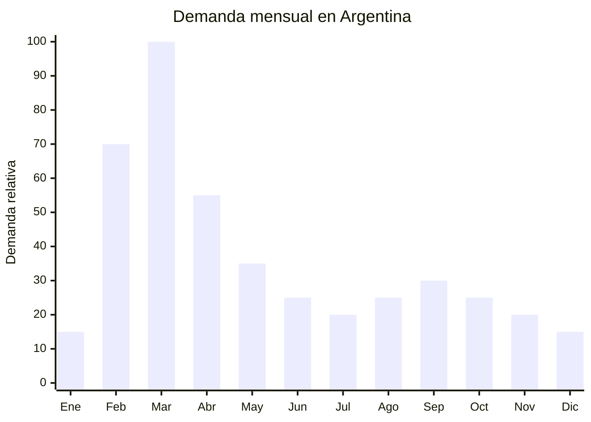

# Kits de educación física

> **Capítulo NCM 95** — Juguetes, juegos y artículos para recreo o deporte | **Temporada:** Otoño (Mar–May)

## Qué es y por qué importarlo

Los kits de educación física son conjuntos de elementos deportivos básicos utilizados en clases de gimnasia escolar, entrenamientos deportivos y preparación física. Un kit típico incluye combinaciones de: sogas para saltar, conos señalizadores, aros (hula hoops), escaleras de agilidad (agility ladder), cintas de coordinación, bandas elásticas y bolsas de transporte. Se venden como sets armados con cantidades variables de cada elemento.

La demanda se concentra en febrero y marzo, cuando tres segmentos de compradores actúan simultáneamente: profesores de educación física que equipan sus clases para el nuevo ciclo lectivo, padres que compran el material solicitado en la lista de útiles deportivos, y clubes/escuelas deportivas que renuevan equipamiento. Los profesores son un canal de prescripción fundamental: su recomendación genera compras masivas de un mismo producto.

El FOB oscila entre USD 3 y USD 8 por kit dependiendo de la composición y cantidad de elementos. Los kits se arman con productos individuales extremadamente económicos (un cono cuesta centavos FOB, una soga de saltar menos de USD 0.50). La clave de rentabilidad está en el armado del kit: comprar los componentes por separado en China, armar kits con combinaciones atractivas y venderlos como sets completos con mayor valor percibido. Ninguno de estos productos requiere certificación IRAM.

## Datos clave

| Dato | Valor |
|------|-------|
| **Posiciones NCM típicas** | 9506.91.00 (artículos para cultura física y gimnasia) |
| **Derecho de importación** | 20% (DIE) + 3% tasa estadística |
| **Rango FOB típico** | USD 3.00 — USD 8.00 por kit |
| **Precio de venta en Argentina** | ARS 8.000 — ARS 30.000 por kit |
| **Margen bruto estimado** | 150% — 350% |
| **MOQ típico** | 200 — 500 kits (o componentes equivalentes) |
| **Demanda en MercadoLibre** | Media-Alta (estacional) |
| **Competencia en MercadoLibre** | Media |
| **Dificultad para importar** | Muy fácil (sin regulación) |
| **Certificaciones necesarias** | Ninguna (artículos deportivos) |
| **Antidumping** | No |

## Variantes y subtipos más comunes

| Subtipo / Variante | FOB aprox. | Venta AR aprox. | Nota |
|--------------------|-----------|-----------------|------|
| Kit básico: 1 soga + 6 conos + 1 aro | USD 3.00 — 4.50 | ARS 8.000 — 14.000 | Kit escolar individual |
| Kit coordinación: escalera agilidad 4m + 10 conos | USD 4.00 — 6.00 | ARS 12.000 — 20.000 | **Más vendido** (profesores) |
| Kit completo: escalera + conos + soga + aros x3 | USD 6.00 — 8.00 | ARS 18.000 — 30.000 | Set premium |
| Escalera de agilidad sola (4-6 metros) | USD 2.00 — 4.00 | ARS 6.000 — 15.000 | Producto estrella individual |
| Set 20 conos señalizadores con soporte | USD 1.50 — 3.00 | ARS 4.000 — 10.000 | Uso institucional |
| Set 5 sogas para saltar (diferentes largos) | USD 2.00 — 4.00 | ARS 5.000 — 12.000 | Pack escolar |

## Regulaciones y requisitos

<Tabs>
  <Tab title="Certificaciones">
    | Organismo | Requiere | Detalle |
    |-----------|----------|---------|
    | ARCA (Aduana) | Sí siempre | Despacho estándar |
    | INTI / IRAM | **No** | Artículos deportivos, no juguetes. No requieren IRAM |
    | ENACOM | No | No son electrónicos |
    | ANMAT | No | No son productos de salud |

    **Recomendación:** Producto de barrera cero. No requiere certificación de ningún tipo. Solo despacho aduanero estándar con documentación comercial (factura, packing list, BL/AWB).
  </Tab>

  <Tab title="Etiquetado">
    | Requisito | Aplica |
    |-----------|--------|
    | País de origen | Sí |
    | Datos importador | Sí |
    | Contenido del kit | Sí — detallar qué incluye cada kit |
    | Material | Recomendado (PP, nylon, PVC, etc.) |
    | Instrucciones de uso | Recomendado |
    | Rango de edad recomendado | Recomendado (si se vende para niños) |
  </Tab>

  <Tab title="Restricciones">
    Sin restricciones regulatorias.

    **Nota sobre clasificación:** Si los kits incluyen elementos que podrían clasificarse individualmente como juguetes (ej: aros muy pequeños, sogas con diseño infantil temático), existe riesgo de que aduana los clasifique como juguetes, lo que activaría la necesidad de IRAM. Mantener la presentación y comunicación como "artículos deportivos" o "material de educación física", no como "juguetes".
  </Tab>
</Tabs>

## Logística de importación

| Factor | Detalle |
|--------|---------|
| **Peso por kit** | 0.5 — 2.0 kg (según composición) |
| **Volumen por kit** | Variable — escalera de agilidad plegada ocupa 30x15x10 cm |
| **Unidades por caja (master carton)** | 10 — 30 kits |
| **Peso por caja** | 8 — 25 kg |
| **Cajas por contenedor 20'** | ~1,000 — 2,000 cajas |
| **Unidades por contenedor 20'** | ~15,000 — 40,000 kits |
| **Fragilidad** | Nula (plástico y textil flexible) |
| **Requiere embalaje especial** | No — bolsa o caja individual estándar. Los conos se apilan, las sogas se enrollan |

<Tip>
La estrategia más rentable es importar los componentes por separado (conos, sogas, aros, escaleras) y armar los kits en Argentina según la demanda de cada canal. Esto permite ofrecer kits personalizados para diferentes compradores: "Kit escolar primaria", "Kit entrenamiento fútbol", "Kit fitness en casa". El armado local agrega valor percibido y permite ajustar la composición del kit sin depender del proveedor chino.
</Tip>

## Estacionalidad y timing de compra

| Dato | Valor |
|------|-------|
| **Meses de mayor venta** | Febrero — Abril (vuelta a clases + arranque deportivo) |
| **Pico máximo** | Marzo (inicio de educación física) |
| **Pedido ideal (marítimo)** | Noviembre — Diciembre (para llegar en febrero) |
| **Pedido ideal (aéreo)** | Enero (para llegar en febrero) |
| **Anticipación mínima** | 2-3 meses antes de febrero |

## Ventajas y riesgos

<CardGroup cols={2}>
  <Card title="Ventajas" icon="circle-check">
    - SIN regulación ni certificación de ningún tipo
    - Margen altísimo (150-350%) por composición flexible de kits
    - Producto liviano: bajo costo de flete por unidad
    - Demanda predecible (vuelta a clases)
    - Canal de profesores como prescriptores de compra
    - Armado de kits en Argentina agrega valor sin costo significativo
    - Producto indestructible: cero devoluciones por defecto
    - Múltiples canales: escuelas, clubes, padres, gimnasios
  </Card>

  <Card title="Riesgos y desventajas" icon="triangle-exclamation">
    - Ticket individual bajo (ARS 8,000-30,000) — necesita volumen
    - Estacionalidad concentrada en febrero-marzo
    - Sin barrera de entrada: competencia fácil de nuevos importadores
    - Productos commoditizados: difícil diferenciación
    - Calidad variable: conos y sogas muy baratos se rompen rápido
    - Riesgo de reclasificación como juguete si la presentación es infantil
  </Card>
</CardGroup>

## Palabras clave para buscar en Alibaba

`agility ladder speed training wholesale` · `training cones set wholesale` · `jump rope school bulk` · `PE equipment school set` · `sports training kit wholesale China`

## Fuentes

- MercadoLibre Argentina — búsqueda "kit educacion fisica" y "escalera agilidad"
- Alibaba.com — proveedores de sports training equipment wholesale
- Nomenclatura arancelaria argentina — NCM 9506.91.00
- Listas de útiles deportivos escolares Argentina
