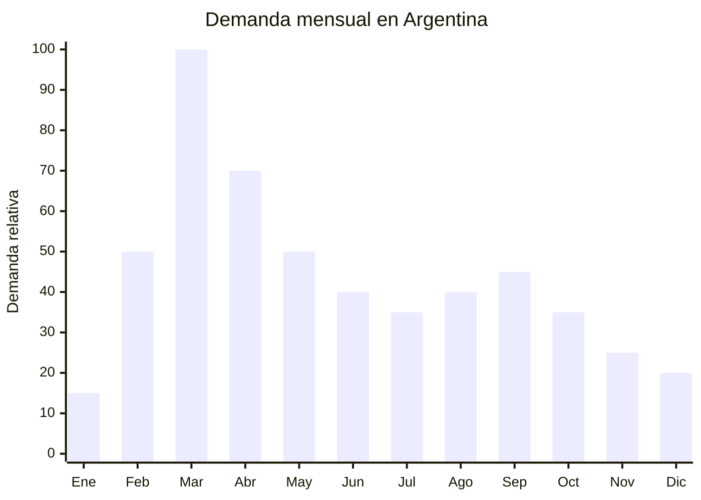

# Pelotas de fútbol N5 escolares

> **Capítulo NCM 95** — Juguetes, juegos y artículos para recreo o deporte | **Temporada:** Otoño (Mar–May)

## Qué es y por qué importarlo

Las pelotas de fútbol N5 (tamaño 5, circunferencia 68-70 cm, peso 410-450g) son el balón de tamaño oficial utilizado en competiciones y, de forma masiva, en las clases de educación física de escuelas secundarias y clubes deportivos en toda Argentina. Se fabrican en PVC o PU (poliuretano) con costura a máquina, lo que las hace resistentes y económicas, a diferencia de las pelotas premium de costura manual o termoselladas usadas en competición profesional.

La demanda tiene un pico claro en marzo, cuando comienza el ciclo lectivo y las instituciones educativas reponen su equipamiento deportivo. Profesores de educación física, padres que compran para la clase de gimnasia, clubes barriales y escuelas deportivas son los principales compradores. A diferencia de las pelotas de marca (Adidas, Nike, Puma), las pelotas escolares son productos genéricos donde el precio es el factor decisivo de compra.

El costo FOB es muy bajo: USD 2-5 por unidad para pelotas PVC cosidas a máquina. Los precios de venta en Argentina oscilan entre ARS 5,000 y ARS 15,000 según calidad y presentación. Un punto clave: las pelotas de fútbol, al ser artículos deportivos (no juguetes), NO requieren certificación IRAM de seguridad de juguetes, lo que simplifica enormemente la importación. La barrera de entrada es mínima.

## Datos clave

| Dato | Valor |
|------|-------|
| **Posiciones NCM típicas** | 9506.62.00 (balones de fútbol, inflables) |
| **Derecho de importación** | 20% (DIE) + 3% tasa estadística |
| **Rango FOB típico** | USD 2.00 — USD 5.00 por unidad |
| **Precio de venta en Argentina** | ARS 5.000 — ARS 15.000 |
| **Margen bruto estimado** | 100% — 250% |
| **MOQ típico** | 200 — 500 unidades |
| **Demanda en MercadoLibre** | Alta |
| **Competencia en MercadoLibre** | Alta |
| **Dificultad para importar** | Fácil (sin certificación IRAM) |
| **Certificaciones necesarias** | Ninguna específica (artículo deportivo, no juguete) |
| **Antidumping** | No |

## Variantes y subtipos más comunes

| Subtipo / Variante | FOB aprox. | Venta AR aprox. | Nota |
|--------------------|-----------|-----------------|------|
| Pelota PVC cosida máquina N5 básica | USD 2.00 — 3.00 | ARS 5.000 — 8.000 | **Más vendida escolar** |
| Pelota PVC cosida máquina N5 diseño | USD 2.50 — 3.50 | ARS 6.000 — 10.000 | Diseños atractivos |
| Pelota PU cosida máquina N5 | USD 3.50 — 5.00 | ARS 8.000 — 15.000 | Mejor tacto y durabilidad |
| Pelota N4 (infantil, 8-12 años) | USD 1.80 — 3.00 | ARS 4.000 — 8.000 | Escuela primaria |
| Pack x3 pelotas N5 escolar | USD 5.50 — 10.00 | ARS 14.000 — 25.000 | Para instituciones/clubes |
| Pelota fútsal (sala) N4 | USD 2.50 — 4.50 | ARS 6.000 — 12.000 | Para gimnasio cubierto |

## Regulaciones y requisitos

<Tabs>
  <Tab title="Certificaciones">
    | Organismo | Requiere | Detalle |
    |-----------|----------|---------|
    | ARCA (Aduana) | Sí siempre | Despacho estándar |
    | INTI / IRAM | **No** | Las pelotas de fútbol clasifican como artículo deportivo, NO como juguete. No requieren certificación IRAM de seguridad de juguetes |
    | ENACOM | No | No es electrónico |
    | ANMAT | No | No es producto de salud |

    **Recomendación:** Aunque no hay certificación obligatoria, solicitar al proveedor fichas técnicas con especificaciones de peso, circunferencia, presión de inflado y materiales. Si la pelota se venderá a instituciones educativas, contar con documentación técnica genera confianza en el comprador institucional.
  </Tab>

  <Tab title="Etiquetado">
    | Requisito | Aplica |
    |-----------|--------|
    | País de origen | Sí |
    | Datos importador | Sí |
    | Tamaño (N4, N5) | Sí |
    | Material (PVC, PU) | Recomendado |
    | Presión de inflado recomendada | Recomendado |
    | Peso | Recomendado |
  </Tab>

  <Tab title="Restricciones">
    Sin restricciones regulatorias. Puntos a tener en cuenta:
    - **NO es juguete:** La clasificación como artículo deportivo (NCM 9506) evita la regulación de juguetes. Sin embargo, si se empaqueta con un diseño infantil temático (personajes de dibujos animados), aduana podría reclasificar como juguete. Mantener presentación deportiva.
    - **Inflado:** Las pelotas se envían desinfladas para optimizar volumen. Incluir aguja de inflado o indicar que no se incluye.
    - Sin antidumping vigente.
  </Tab>
</Tabs>

## Logística de importación

| Factor | Detalle |
|--------|---------|
| **Peso por unidad** | 410 — 450 g (desinflada) |
| **Volumen por unidad (desinflada)** | Muy bajo — se aplanan completamente |
| **Unidades por caja (master carton)** | 20 — 50 unidades (desinfladas) |
| **Peso por caja** | 10 — 22 kg |
| **Cajas por contenedor 20'** | ~1,000 — 2,000 cajas |
| **Unidades por contenedor 20'** | ~30,000 — 80,000 unidades |
| **Fragilidad** | Nula |
| **Requiere embalaje especial** | No — se envían desinfladas y aplanadas, máximo aprovechamiento de espacio |

<Tip>
Las pelotas se envían SIEMPRE desinfladas desde China. Esto reduce drásticamente el volumen: una caja de 50 pelotas desinfladas ocupa el mismo espacio que 5 pelotas infladas. Incluir una aguja de inflado por cada 10 pelotas o vender la aguja por separado como accesorio. Verificar que la válvula de inflado sea compatible con agujas estándar.
</Tip>

## Estacionalidad y timing de compra

| Dato | Valor |
|------|-------|
| **Meses de mayor venta** | Febrero — Abril (vuelta a clases + inicio ligas barriales) |
| **Pico máximo** | Marzo (inicio de clases de educación física) |
| **Pedido ideal (marítimo)** | Noviembre — Diciembre (para llegar en febrero) |
| **Pedido ideal (aéreo)** | Enero (para llegar en febrero) |
| **Anticipación mínima** | 2-3 meses antes de marzo |

## Ventajas y riesgos

<CardGroup cols={2}>
  <Card title="Ventajas" icon="circle-check">
    - Sin certificación IRAM (artículo deportivo, no juguete)
    - Demanda predecible y masiva (marzo = inicio clases)
    - FOB bajo con buen margen (100-250%)
    - Se envían desinfladas: excelente ratio volumen/unidades
    - Producto indestructible en transporte
    - Demanda residual todo el año (clubes, recreación)
    - Mercado institucional (escuelas, clubes) genera pedidos grandes
  </Card>

  <Card title="Riesgos y desventajas" icon="triangle-exclamation">
    - Competencia alta con marcas económicas y otras importaciones
    - Ticket bajo (ARS 5,000-15,000) — necesita volumen
    - Calidad del PVC variable: pelotas baratas se deforman rápido
    - Competencia de pelotas de marca (Adidas, Nike) en segmento premium
    - Válvulas de baja calidad pueden perder aire rápidamente
    - Riesgo de reclasificación como juguete si tiene diseño infantil temático
  </Card>
</CardGroup>

## Palabras clave para buscar en Alibaba

`soccer ball PVC size 5 wholesale` · `football machine stitched bulk` · `PU soccer ball size 5 factory` · `cheap football wholesale China` · `soccer ball school training wholesale`

## Fuentes

- MercadoLibre Argentina — búsqueda "pelota futbol n5"
- Alibaba.com — proveedores de soccer ball PVC wholesale
- Nomenclatura arancelaria argentina — NCM 9506.62.00
