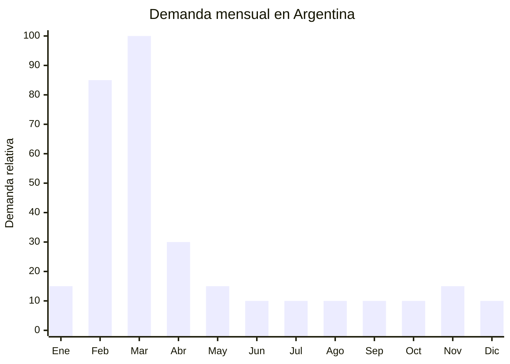

# Cartucheras escolares (simples y con contenido)

> **Capitulo NCM 96** — Manufacturas diversas | **Temporada:** Otono (Mar-May)

## Que es y por que importarlo

Las cartucheras escolares clasificadas en el capitulo 96 son aquellas que se venden **con contenido** (utiles escolares incluidos) o que por su construccion y materiales (plastico rigido, metal, materiales no textiles) no clasifican en el capitulo 42 (cuero y textiles). Esto incluye cartucheras de lata con set de lapices, estuches plasticos rigidos con utiles, portatodo metalicos de personajes y sets cartuchera + lapices/fibras/regla. Tambien abarca cartucheras simples de plastico rigido (PP, ABS) sin contenido textil.

La cartuchera es el **3er articulo escolar mas vendido** en Argentina despues de la mochila y los cuadernos. La demanda se concentra masivamente en febrero-marzo con la vuelta a clases, pero las cartucheras con contenido (sets completos) tienen un atractivo adicional: el padre compra "todo resuelto" en un solo producto. Las marcas dominantes en Argentina son Mooving, Cresko, Footy y Wabro, pero todas importan desde China, lo que demuestra la viabilidad del negocio.

El precio promedio de una cartuchera escolar en Argentina ronda los ARS 11.050 (temporada 2025-2026), con variaciones enormes segun el tipo: desde ARS 3.000 una cartuchera basica hasta ARS 30.000+ un set completo con 40+ utiles incluidos. Los proveedores chinos en Yiwu y Shantou ofrecen cartucheras con contenido desde USD 2.00 FOB, permitiendo margenes brutos de 200-400%. La barrera de entrada es **MUY BAJA**: no hay certificaciones obligatorias, el producto es liviano y compacto, y el MOQ puede ser tan bajo como 100 unidades.

## Datos clave

| Dato | Valor |
|------|-------|
| **Posiciones NCM tipicas** | 9608.99.00 (partes de articulos de escritura), 9609.90.00 (lapices/crayones con estuche), 9610.00.00 (pizarras para escribir con estuche) |
| **Derecho de importacion** | 18% (DIE) + 3% tasa estadistica |
| **Rango FOB tipico** | USD 0.50 - USD 3.00 (vacia) / USD 2.00 - USD 5.00 (con utiles) |
| **Precio de venta en Argentina** | ARS 3.000 - ARS 30.000 (promedio ARS 11.050) |
| **Margen bruto estimado** | 200% - 400% |
| **MOQ tipico** | 100 - 500 unidades |
| **Demanda en MercadoLibre** | Muy alta (estacional) |
| **Competencia en MercadoLibre** | Alta (Mooving, Cresko, Footy, Wabro) |
| **Dificultad para importar** | Muy baja |
| **Certificaciones necesarias** | Ninguna |
| **Antidumping** | No |

## Variantes y subtipos mas comunes

| Subtipo / Variante | FOB aprox. | Venta AR aprox. | Nota |
|--------------------|-----------|-----------------|------|
| Cartuchera plastico rigido basica (vacia) | USD 0.50 - 1.00 | ARS 3.000 - 6.000 | Economica, volumen |
| Cartuchera de lata con personaje (vacia) | USD 0.80 - 1.50 | ARS 4.000 - 8.000 | Popular infantil, coleccionable |
| Cartuchera plastico + set 12 lapices color | USD 2.00 - 3.00 | ARS 8.000 - 15.000 | **Mas vendido como regalo** |
| Set completo: cartuchera + lapices + fibras + regla + goma + sacapuntas | USD 3.00 - 5.00 | ARS 12.000 - 25.000 | Premium, "todo resuelto" |
| Cartuchera doble piso metalica con utiles | USD 2.50 - 4.00 | ARS 10.000 - 20.000 | Percepcion premium |
| Cartuchera tipo caja rigida con boton magnetico | USD 1.00 - 2.00 | ARS 5.000 - 10.000 | Tendencia, diseno moderno |

## Regulaciones y requisitos

<Tabs>
  <Tab title="Certificaciones">
    | Organismo | Requiere | Detalle |
    |-----------|----------|---------|
    | ARCA (Aduana) | Si siempre | Despacho estandar |
    | ANMAT | No | No aplica |
    | ENACOM | No | No aplica |
    | IRAM | No | No es juguete — es articulo escolar |
    | INTI | No | No es textil regulado (es plastico/metal) |

    **Recomendacion:** Producto con barrera regulatoria practicamente nula. Ideal para importadores principiantes. Si la cartuchera incluye tijera, verificar que no tenga punta afilada (exigencia habitual de escuelas primarias, no regulatoria).
  </Tab>

  <Tab title="Etiquetado">
    | Requisito | Aplica |
    |-----------|--------|
    | Idioma espanol | Si |
    | Datos del importador | Si |
    | Composicion / materiales | Si (plastico PP, metal, etc.) |
    | Contenido del set (si aplica) | Si (listar cada item incluido) |
    | Pais de origen | Si |
    | Garantia legal 6 meses | Si |
  </Tab>

  <Tab title="Restricciones">
    Sin restricciones significativas. Puntos a considerar:
    - Evitar disenos con marcas registradas sin licencia (Disney, Marvel, etc.)
    - Si el set incluye tijera, preferir punta roma para mercado escolar primario
    - Los lapices y fibras incluidos deben ser no toxicos (verificar certificados AP/CE del proveedor)
    - No hay medidas antidumping vigentes
  </Tab>
</Tabs>

## Logistica de importacion

| Factor | Detalle |
|--------|---------|
| **Peso por unidad** | 80 - 350 g (segun contenido) |
| **Volumen por unidad** | 500 - 2,000 cm3 aprox. |
| **Unidades por caja (master carton)** | 30 - 100 unidades |
| **Peso por caja** | 5 - 15 kg |
| **Cajas por contenedor 20'** | ~1,200 - 2,500 cajas |
| **Unidades por contenedor 20'** | ~50,000 - 150,000 unidades |
| **Fragilidad** | Baja (plastico rigido/metal resiste golpes) |
| **Requiere embalaje especial** | No - blister individual o caja display + caja master |

<Tip>
Las cartucheras con contenido tienen mejor relacion valor/peso que las vacias. Un pedido de prueba de 300-500 sets completos pesa menos de 150 kg y puede enviarse por courier (USD 4-6/kg). Validar que las fibras y lapices incluidos escriban correctamente (solicitar muestra y probar cada item). Los utiles de calidad muy baja generan reclamos que afectan mas que el ahorro en FOB.
</Tip>

## Estacionalidad y timing de compra

| Dato | Valor |
|------|-------|
| **Meses de mayor venta** | Febrero - Marzo (vuelta a clases) |
| **Pedido ideal (maritimo)** | Octubre - Noviembre |
| **Pedido ideal (aereo)** | Enero |
| **Anticipacion minima** | 3 meses |

<Note>
Las cartucheras escolares de cap. 96 (con contenido y rigidas) compiten directamente con las de cap. 42 (textiles). La ventaja de importar sets completos es que el cliente percibe mayor valor: paga mas por el combo que por la cartuchera sola. Considerar armar combos mochila (cap. 42) + cartuchera con utiles (cap. 96) + lunchera (cap. 42) como "kit vuelta a clases".
</Note>

## Ventajas y riesgos

<CardGroup cols={2}>
  <Card title="Ventajas" icon="circle-check">
    - 3er articulo escolar mas vendido en Argentina
    - Sin regulaciones ni certificaciones obligatorias
    - Barrera de entrada MUY BAJA
    - Sets con contenido tienen mayor ticket y valor percibido
    - Producto liviano y compacto (flete economico)
    - MOQ bajo (desde 100 unidades)
    - Se vende en combo con mochila y lunchera
    - Variedad enorme en proveedores chinos (Yiwu, Shantou)
  </Card>
  <Card title="Riesgos y desventajas" icon="triangle-exclamation">
    - Temporada muy corta (4-6 semanas de pico)
    - Competencia con marcas establecidas (Mooving, Cresko, Footy, Wabro)
    - Utiles incluidos de mala calidad = reclamos masivos
    - Stock sobrante queda hasta el ano siguiente
    - Tendencias de personajes cambian cada ano
    - Margenes se comprimen si los utiles incluidos son de baja calidad y hay devoluciones
  </Card>
</CardGroup>

## Palabras clave para buscar en Alibaba

`pencil case set stationery wholesale` . `pencil box with stationery set` . `metal pencil case kids wholesale` . `plastic pencil case school set` . `stationery set pencil case` . `tin pencil box cartoon wholesale` . `school supplies set wholesale` . `pencil case with pencils rulers erasers`

## Fuentes

- MercadoLibre Argentina — busqueda "cartuchera escolar con utiles"
- Alibaba.com — proveedores de pencil case stationery set wholesale
- ARCA — Nomenclador NCM capitulo 96
- Canasta escolar Argentina 2025/2026 — referencia de precios
