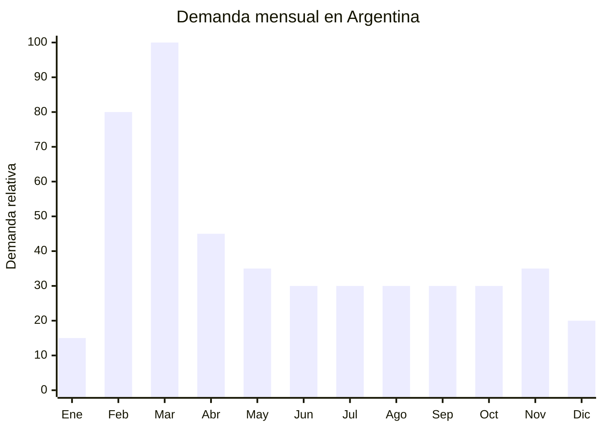

# Loncheras termicas escolares

> **Capitulo NCM 96** — Manufacturas diversas | **Temporada:** Otono (Mar-May)

## Que es y por que importarlo

Las loncheras termicas escolares clasificadas en el capitulo 96 son aquellas que se venden como **sets completos** con contenedores plasticos, cubiertos o accesorios incluidos (el conjunto se clasifica por el componente que le da caracter esencial, que puede ser el contenedor o los cubiertos). Tambien incluye loncheras con estructura rigida de plastico moldeado (no textil) que no clasifican en el capitulo 42. Son el complemento natural de la mochila escolar y se comercializan frecuentemente como parte de un "kit vuelta a clases".

En Argentina, la tendencia de llevar vianda al colegio ha crecido significativamente, impulsada por dos factores: la busqueda de alimentacion mas saludable y la economia familiar (evitar el gasto del comedor escolar). Las loncheras termicas con aislacion se han convertido en un basico escolar, especialmente en nivel primario. Las marcas mas vendidas en Argentina (Skora, Cresko, Wabro) importan sus loncheras desde China, validando la cadena de suministro.

Los proveedores chinos en Dongguan, Guangzhou y Yiwu ofrecen loncheras termicas con aislacion PEVA o aluminio laminado desde FOB USD 1.50/unidad, con disenos personalizados y MOQ accesibles. La ventaja de importar loncheras como parte del capitulo 96 (cuando incluyen contenedores o cubiertos) es que el ticket promedio sube significativamente respecto a la lonchera sola, y la percepcion de valor es mayor para el comprador.

## Datos clave

| Dato | Valor |
|------|-------|
| **Posiciones NCM tipicas** | 9617.00.00 (termos y recipientes isotermicos), 3924.10.00 (vajilla/cubiertos plasticos, si predominan los contenedores) |
| **Derecho de importacion** | 18% (DIE) + 3% tasa estadistica |
| **Rango FOB tipico** | USD 1.50 - USD 4.00 por unidad |
| **Precio de venta en Argentina** | ARS 5.000 - ARS 18.000 |
| **Margen bruto estimado** | 150% - 300% |
| **MOQ tipico** | 200 - 1,000 unidades |
| **Demanda en MercadoLibre** | Alta (estacional, con demanda base todo el ano) |
| **Competencia en MercadoLibre** | Media-Alta (Skora, Cresko, Wabro) |
| **Dificultad para importar** | Baja |
| **Certificaciones necesarias** | Ninguna para la lonchera en si (verificar contenedores si incluyen recipientes plasticos para alimentos) |
| **Antidumping** | No |

## Variantes y subtipos mas comunes

| Subtipo / Variante | FOB aprox. | Venta AR aprox. | Nota |
|--------------------|-----------|-----------------|------|
| Lonchera termica basica rigida (sin contenedores) | USD 1.50 - 2.50 | ARS 5.000 - 9.000 | Entrada, economica |
| Lonchera termica infantil con personaje + 1 contenedor | USD 2.00 - 3.00 | ARS 7.000 - 12.000 | **Mas vendido escolar** |
| Lonchera set completo (lonchera + 2 contenedores + cubiertos) | USD 3.00 - 4.00 | ARS 10.000 - 18.000 | Mayor ticket, "todo resuelto" |
| Lonchera tipo mochilita rigida (con correas) | USD 2.50 - 4.00 | ARS 8.000 - 15.000 | Jardin de infantes, practica |
| Lonchera adulto oficina con divisiones | USD 2.00 - 3.50 | ARS 6.000 - 12.000 | Demanda atemporal |
| Lonchera plegable/colapsable | USD 2.00 - 3.00 | ARS 6.000 - 10.000 | Ahorra espacio, tendencia |

## Regulaciones y requisitos

<Tabs>
  <Tab title="Certificaciones">
    | Organismo | Requiere | Detalle |
    |-----------|----------|---------|
    | ARCA (Aduana) | Si siempre | Despacho estandar |
    | ANMAT | Parcial | La lonchera termica en si NO requiere. Si incluye recipientes plasticos para contacto con alimentos, esos recipientes deben ser aptos alimentarios (libre de BPA) |
    | ENACOM | No | No aplica |
    | INTI | No | No aplica |

    **Recomendacion:** Si la lonchera se vende como set con contenedores plasticos, solicitar al proveedor chino certificado de aptitud alimentaria (FDA o equivalente) para los contenedores. La lonchera termica por si sola no tiene requisitos especiales ya que los alimentos no tocan directamente su superficie interior.
  </Tab>

  <Tab title="Etiquetado">
    | Requisito | Aplica |
    |-----------|--------|
    | Idioma espanol | Si |
    | Datos del importador | Si |
    | Composicion / materiales | Si (PP, PEVA, aluminio, poliester, etc.) |
    | Capacidad en litros | Recomendado |
    | Libre de BPA (si incluye contenedores) | Recomendado destacar |
    | Pais de origen | Si |
    | Garantia legal 6 meses | Si |
  </Tab>

  <Tab title="Restricciones">
    Sin restricciones significativas. Puntos a considerar:
    - Si incluye contenedores plasticos para alimentos, verificar que sean libres de BPA y aptos para microondas si se publicita esa funcion
    - Evitar disenos con marcas registradas sin licencia
    - El forro interior de aluminio/PEVA debe estar bien adherido (si se despega, genera reclamos por contacto del alimento con la espuma aislante)
    - No hay medidas antidumping vigentes
  </Tab>
</Tabs>

## Logistica de importacion

| Factor | Detalle |
|--------|---------|
| **Peso por unidad** | 200 - 500 g (segun set) |
| **Volumen por unidad** | 2,000 - 6,000 cm3 aprox. |
| **Unidades por caja (master carton)** | 20 - 50 unidades |
| **Peso por caja** | 5 - 15 kg |
| **Cajas por contenedor 20'** | ~800 - 1,800 cajas |
| **Unidades por contenedor 20'** | ~25,000 - 50,000 unidades |
| **Fragilidad** | Baja |
| **Requiere embalaje especial** | No - bolsa OPP individual + caja master |

<Tip>
Las loncheras plegables o colapsables reducen el volumen de envio hasta un 60-70%, lo que baja significativamente el costo de flete. Si el presupuesto de flete es una preocupacion, considerar este tipo de diseno para el primer pedido. Un lote de prueba de 200-500 loncheras pesa menos de 200 kg y es viable por courier aereo.
</Tip>

## Estacionalidad y timing de compra

| Dato | Valor |
|------|-------|
| **Meses de mayor venta** | Febrero - Marzo (vuelta a clases), con demanda base todo el ano |
| **Pedido ideal (maritimo)** | Octubre - Noviembre |
| **Pedido ideal (aereo)** | Enero |
| **Anticipacion minima** | 3 meses |

<Note>
A diferencia de mochilas y cartucheras, las loncheras termicas tienen **demanda base significativa fuera de temporada escolar**. Se usan para oficina, gimnasio, viajes, picnics y delivery de comida casera. Esto reduce el riesgo de stock sobrante post-temporada. Considerar tener variantes "adultas" (colores neutros, sin personajes) para vender todo el ano.
</Note>

## Ventajas y riesgos

<CardGroup cols={2}>
  <Card title="Ventajas" icon="circle-check">
    - Complemento natural de la mochila (venta cruzada)
    - Demanda escolar + demanda atemporal (oficina, gym, viajes)
    - Sin regulaciones especiales (la lonchera en si)
    - Sets con contenedores aumentan ticket promedio
    - Producto liviano y compacto
    - MOQ accesible (desde 200 unidades)
    - Tendencia de viandas saludables impulsa demanda
    - Barrera de entrada BAJA
  </Card>
  <Card title="Riesgos y desventajas" icon="triangle-exclamation">
    - Pico concentrado en febrero-marzo
    - Calidad del forro interior PEVA variable (puede pelarse o desprender olor)
    - Competencia con marcas locales (Skora, Cresko, Wabro)
    - Contenedores plasticos de baja calidad manchan o retienen olores
    - Costuras defectuosas en modelos economicos causan filtraciones
    - Si incluye contenedores, verificar aptitud alimentaria (libre de BPA)
  </Card>
</CardGroup>

## Palabras clave para buscar en Alibaba

`insulated lunch bag set wholesale` . `kids lunch box bag with containers` . `thermal lunch bag school set` . `lunch bag with food containers` . `PEVA insulated lunch bag children` . `bento lunch bag set wholesale` . `school lunch bag with cutlery` . `portable lunch box bag wholesale`

## Fuentes

- MercadoLibre Argentina — busqueda "lonchera termica escolar"
- Alibaba.com — proveedores de insulated lunch bag set wholesale
- ARCA — Nomenclador NCM capitulo 96
- Canasta escolar Argentina 2025/2026 — referencia de precios
