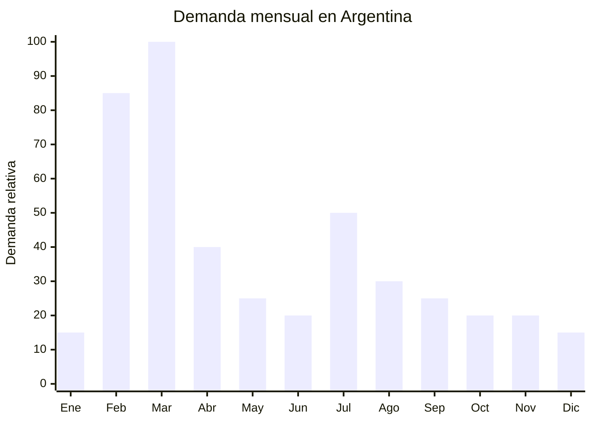

# Sets de escritura y lapiceras importadas

> **Capitulo NCM 96** — Manufacturas diversas | **Temporada:** Otono (Mar-May)

## Que es y por que importarlo

Los sets de escritura y lapiceras importadas incluyen boligrafos, lapiceras de gel, portaminas mecanicos, resaltadores, marcadores, correctores y sets completos que combinan varios de estos elementos en un blister o estuche. El capitulo 96 del NCM abarca especificamente los instrumentos de escritura (posicion 9608) y sus partes, lo que incluye tanto lapiceras individuales al por mayor como sets armados con presentacion retail.

La vuelta a clases en Argentina (febrero-marzo) genera un pico de demanda masivo de utiles escolares. La canasta escolar 2026 alcanza valores de hasta ARS 243.000 segun estimaciones del sector, y los articulos de escritura representan una porcion significativa de ese gasto. Existe un **segundo pico menor en julio** con el inicio del segundo cuatrimestre, donde las familias reponen los utiles consumidos o perdidos durante el primer semestre.

China (Ningbo, Wenzhou, Yiwu) es el mayor exportador mundial de articulos de escritura, con precios FOB desde USD 0.10 por lapicera de gel y USD 1-3 por set completo. La relacion valor/peso es excelente: un set de escritura completo pesa menos de 200 gramos, lo que lo hace ideal para envio aereo. Las marcas argentinas como Filgo, Simball, Faber-Castell (produccion local limitada) y Staedtler compiten en el segmento, pero la importacion directa permite margenes de 200-400% en el segmento generico y de marca propia.

## Datos clave

| Dato | Valor |
|------|-------|
| **Posiciones NCM tipicas** | 9608.10.00 (boligrafos), 9608.20.00 (rotuladores/fibras con punta de fieltro), 9608.30.00 (plumas fuente), 9608.40.00 (portaminas), 9608.99.00 (partes y sets) |
| **Derecho de importacion** | 18% (DIE) + 3% tasa estadistica |
| **Rango FOB tipico** | USD 0.10 - USD 0.50/lapicera individual / USD 1.00 - USD 3.00/set completo |
| **Precio de venta en Argentina** | ARS 500 - ARS 2.000/lapicera / ARS 3.000 - ARS 15.000/set |
| **Margen bruto estimado** | 200% - 400% |
| **MOQ tipico** | 500 - 2,000 unidades (individual) / 100 - 500 sets |
| **Demanda en MercadoLibre** | Muy alta (estacional con base anual) |
| **Competencia en MercadoLibre** | Alta |
| **Dificultad para importar** | Muy baja |
| **Certificaciones necesarias** | Ninguna obligatoria |
| **Antidumping** | No |

## Variantes y subtipos mas comunes

| Subtipo / Variante | FOB aprox. | Venta AR aprox. | Nota |
|--------------------|-----------|-----------------|------|
| Boligrafo comun punta 0.7mm (por docena) | USD 0.10 - 0.20/u | ARS 500 - 1.000/u | Basico escolar, altisimo volumen |
| Lapicera de gel colores (pack x10-12) | USD 0.15 - 0.30/u | ARS 800 - 1.500/u | **Muy popular entre estudiantes** |
| Portaminas mecanico 0.5/0.7mm | USD 0.20 - 0.50/u | ARS 1.000 - 2.500/u | Secundaria/universidad |
| Set escritura basico (2 boligrafos + portaminas + resaltador) | USD 1.00 - 1.50/set | ARS 3.000 - 6.000/set | Entrada, regalo economico |
| Set escritura completo (lapicera + boligrafo + portaminas + 3 resaltadores + corrector) | USD 1.50 - 3.00/set | ARS 5.000 - 12.000/set | **Mayor ticket** |
| Set premium en estuche rigido (boligrafo metal + portaminas metal) | USD 2.00 - 5.00/set | ARS 8.000 - 15.000/set | Regalo, corporativo |

## Regulaciones y requisitos

<Tabs>
  <Tab title="Certificaciones">
    | Organismo | Requiere | Detalle |
    |-----------|----------|---------|
    | ARCA (Aduana) | Si siempre | Despacho estandar |
    | ANMAT | No | No aplica |
    | ENACOM | No | No aplica |
    | IRAM | No | No hay norma obligatoria para articulos de escritura de uso general |
    | INTI | No | No aplica |

    **Recomendacion:** Producto sin barreras regulatorias. El unico cuidado es que las tintas sean no toxicas, especialmente si se comercializan para uso escolar infantil. Solicitar al proveedor certificados AP (Approved Product) o CE para tintas.
  </Tab>

  <Tab title="Etiquetado">
    | Requisito | Aplica |
    |-----------|--------|
    | Idioma espanol | Si |
    | Datos del importador | Si |
    | Tipo de tinta (gel, aceite, etc.) | Recomendado |
    | Grosor de punta (0.5mm, 0.7mm, 1.0mm) | Si |
    | Color de tinta | Si |
    | Pais de origen | Si |
    | Garantia legal 6 meses | Si |
  </Tab>

  <Tab title="Restricciones">
    Sin restricciones significativas. Puntos a considerar:
    - Las tintas deben cumplir estandares basicos de no toxicidad (solicitar certificado AP o CE)
    - Evitar lapiceras con forma de alimentos o juguetes que puedan confundir a ninos pequenos
    - Si las lapiceras tienen capuchon, este debe tener orificio de ventilacion (norma de seguridad infantil contra asfixia) segun regulaciones europeas que aplican como buena practica
    - No hay medidas antidumping vigentes para articulos de escritura
  </Tab>
</Tabs>

## Logistica de importacion

| Factor | Detalle |
|--------|---------|
| **Peso por unidad** | 10 - 30 g (individual) / 100 - 200 g (set completo) |
| **Volumen por unidad** | Muy bajo |
| **Unidades por caja (master carton)** | 100 - 500 unidades (individual) / 50 - 200 sets |
| **Peso por caja** | 3 - 10 kg |
| **Cajas por contenedor 20'** | ~2,000 - 4,000 cajas |
| **Unidades por contenedor 20'** | ~300,000 - 1,000,000 unidades (individual) |
| **Fragilidad** | Muy baja |
| **Requiere embalaje especial** | No - blister/bolsa OPP + caja master |

<Tip>
Los articulos de escritura tienen una de las mejores relaciones valor/peso de todos los productos escolares. Un pedido de 1,000 sets completos pesa menos de 200 kg y puede enviarse por courier aereo a un costo de flete total muy bajo (aprox. USD 4-6/kg). Es un producto ideal para empezar a importar con bajo riesgo y capital minimo. Incluso 500 lapiceras de gel pueden ser un primer pedido de prueba viable.
</Tip>

## Estacionalidad y timing de compra

| Dato | Valor |
|------|-------|
| **Meses de mayor venta** | Febrero - Marzo (vuelta a clases, pico principal) / Julio (segundo cuatrimestre, pico menor) |
| **Pedido ideal (maritimo)** | Octubre - Noviembre (para temporada principal) / Abril (para segundo pico) |
| **Pedido ideal (aereo)** | Enero (para temporada principal) / Junio (para segundo pico) |
| **Anticipacion minima** | 2 - 3 meses |

<Note>
A diferencia de mochilas y cartucheras, los articulos de escritura tienen **demanda durante todo el ano**: oficinas, universidades, cursos y capacitaciones consumen lapiceras permanentemente. El segundo pico de julio es significativo (reposicion escolar del segundo cuatrimestre). Esto reduce el riesgo de stock sobrante y permite mantener rotacion constante.
</Note>

## Ventajas y riesgos

<CardGroup cols={2}>
  <Card title="Ventajas" icon="circle-check">
    - Sin regulaciones ni certificaciones obligatorias
    - Relacion valor/peso excepcional (flete minimo)
    - Demanda escolar + demanda anual (oficina, universidad)
    - Dos picos de venta (Feb-Mar + Jul) reducen riesgo estacional
    - FOB extremadamente bajo (desde USD 0.10/u)
    - MOQ flexible (desde 500 unidades)
    - Ideal para primera importacion con capital minimo
    - Se vende como complemento en combos escolares
  </Card>
  <Card title="Riesgos y desventajas" icon="triangle-exclamation">
    - Competencia con marcas establecidas (Filgo, Simball, Faber-Castell, Staedtler)
    - Calidad de tinta variable en lapiceras de bajo costo (fallan, se secan)
    - Las lapiceras de gel economicas pueden tener flujo irregular
    - Percepcion de "lapicera china barata" si no hay branding
    - Margenes se comprimen en el segmento ultra economico
    - Los resaltadores de baja calidad se secan rapido (reclamos)
  </Card>
</CardGroup>

## Palabras clave para buscar en Alibaba

`gel pen wholesale school` . `stationery set wholesale` . `ballpoint pen bulk` . `mechanical pencil 0.5mm wholesale` . `highlighter pen set wholesale` . `writing set gift box` . `gel ink pen color set` . `school stationery set blister` . `pen set custom logo wholesale` . `correction pen tape wholesale`

## Fuentes

- MercadoLibre Argentina — busqueda "set escritura escolar" y "lapiceras gel pack"
- Alibaba.com — proveedores de stationery set wholesale y gel pen wholesale
- ARCA — Nomenclador NCM posicion 9608
- Canasta escolar Argentina 2026 — referencia de precios (estimacion hasta ARS 243,000)
