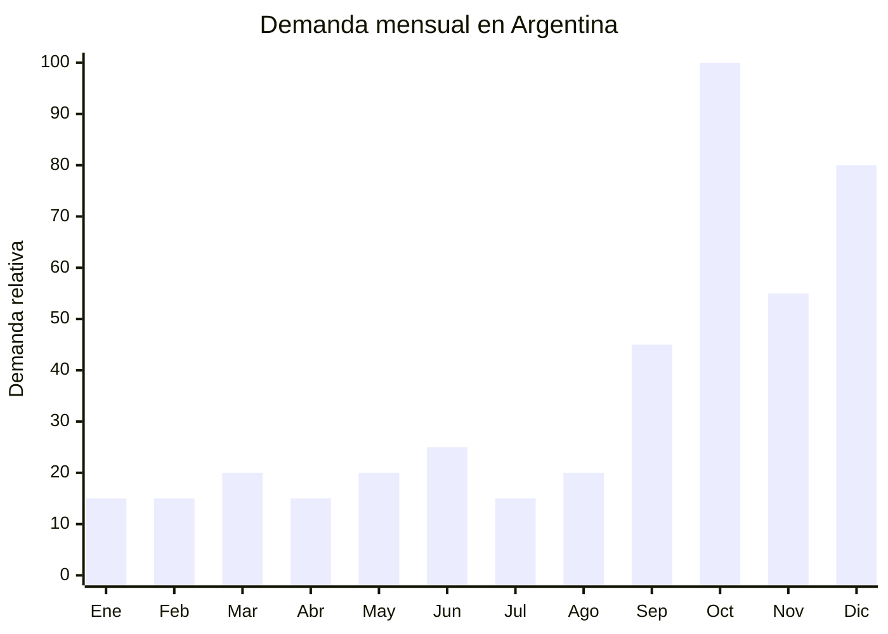

# Perfumes importados regalo Dia de la Madre

> **Capitulo NCM 33** — Aceites esenciales, preparaciones de perfumeria, de tocador o de cosmetica | **Temporada:** Primavera (Sep-Nov)

## Que es y por que importarlo

Los perfumes importados para regalo abarcan desde fragancias "inspired-by" (inspiradas en marcas premium) hasta aceites esenciales para difusor, pasando por colonias y body mists en presentaciones regalo. En Argentina, el perfume es el regalo estrella del Dia de la Madre, con un ticket promedio de ARS 60.000 en marcas reconocidas. Esto abre una oportunidad enorme para fragancias de tipo "alternativo" que ofrecen una experiencia olfativa similar a un precio significativamente menor.

El mercado de fragancias en Argentina tiene una particularidad: las marcas premium (Moschino Fresh Couture fue top ventas en 2025, Carolina Herrera, Dior) dominan el imaginario del consumidor, pero los precios de retail superan los ARS 80.000-150.000 por 100ml. Las fragancias tipo "inspired-by" o "type" replican familias olfativas populares (florales, orientales, citricas) sin infringir marcas registradas, y se posicionan en el rango de ARS 15.000-40.000. Otra alternativa con menor barrera regulatoria son los aceites esenciales para difusor ultrasonico, que se presentan en sets regalo con el difusor incluido.

China produce fragancias "type" en grandes volumenes, especialmente en Guangzhou (capital de la cosmetica china) y en la zona de Fujian. Los aceites esenciales provienen mayoritariamente de Jiangxi y Yunnan. El punto critico es el registro ANMAT: todo perfume o fragancia que se aplique sobre la piel requiere habilitacion obligatoria. Los aceites esenciales para difusor (uso ambiental, no contacto con piel) tienen una regulacion mas laxa y representan una excelente alternativa para importadores principiantes.

## Datos clave

| Dato | Valor |
|------|-------|
| **FOB tipico (China)** | USD 3 — 15/unidad (fragancia type 100ml) |
| **Precio venta Argentina** | ARS 15.000 — 60.000 |
| **Margen estimado** | 200 — 500% |
| **MOQ habitual** | 100 — 500 unidades |
| **Peso/volumen** | 0.2 — 0.5 kg / 0.001 — 0.003 cbm aprox. |
| **Pico de demanda** | Octubre (Dia de la Madre) |
| **Origen principal** | Guangzhou / Fujian, China |

## Demanda y mercado en Argentina

- **Volumen de mercado:** La perfumeria es una de las categorias mas fuertes en el e-commerce argentino. Las busquedas de "perfume mujer" y "perfume regalo" se multiplican por 3-4x en octubre.
- **Tendencia:** Creciente. El mercado de fragancias alternativas (inspired-by, nicho) crece a medida que el consumidor busca opciones accesibles frente a marcas premium con precios cada vez mas altos.
- **Perfil del comprador:** Hombres de 25-55 que buscan regalo para Dia de la Madre. Mujeres que descubren fragancias alternativas por redes sociales.
- **Canales de venta principales:** MercadoLibre, Instagram, ferias y showrooms, mayorista a perfumerias de barrio.

<Note>
Moschino Fresh Couture fue una de las fragancias mas vendidas en Argentina en 2025. Las fragancias "type" que replican su familia olfativa (fresca, floral acuatica) tienen alta demanda y permiten margenes de 400-500% sobre el costo landed.
</Note>

## Variantes y subtipos mas comunes

| Variante | Descripcion | FOB referencia |
|----------|-------------|----------------|
| Fragancia type 100ml | Inspirada en marca premium, EDP concentracion 15-20% | USD 3 — 6 |
| Fragancia type 50ml + caja regalo | Presentacion gift box con lazo | USD 4 — 8 |
| Set fragancia + body lotion | Perfume 50ml + crema corporal 200ml en caja | USD 8 — 15 |
| Body mist 250ml | Spray corporal ligero, menor concentracion | USD 2 — 4 |
| Set aceites esenciales difusor (6 frascos) | Lavanda, eucalipto, menta, arbol de te, limon, naranja | USD 3 — 6 |
| Difusor ultrasonico + aceites | Difusor LED + 3-6 aceites esenciales en caja regalo | USD 8 — 15 |

## Regulaciones y requisitos

<Tabs>
  <Tab title="Certificaciones">
    | Organismo | Requiere | Detalle | Costo aprox. | Tiempo aprox. |
    |-----------|----------|---------|-------------|--------------|
    | ARCA (Aduana) | Si siempre | Despacho de importacion estandar | — | — |
    | ANMAT | **Si** (perfumes sobre piel) | Cosmetico Grado 1 (DJC simplificada, Disp. 4033/2025). Perfumes con filtro solar: Grado 2 | USD 300 — 800 | 3 — 6 semanas |
    | ANMAT | **No** (aceites difusor) | Aceites esenciales para uso ambiental no requieren registro ANMAT | — | — |
    | ENACOM | Solo difusores | Si el difusor es electrico con adaptador, puede requerir declaracion | USD 100 — 200 | 2 — 3 semanas |
    | SENASA | No | No aplica | — | — |

    **Estrategia regulatoria:** Para evitar la complejidad del registro ANMAT de perfumes, una alternativa viable es importar aceites esenciales para difusor (no contacto con piel = no cosmetico). Los sets de difusor + aceites tienen excelente recepcion como regalo y eliminan la barrera ANMAT.
  </Tab>

  <Tab title="Etiquetado">
    | Requisito | Aplica |
    |-----------|--------|
    | Idioma espanol | Si (obligatorio) |
    | Datos del importador | Si (razon social, CUIT, direccion) |
    | Lista de ingredientes INCI | Si (obligatorio para perfumes; para aceites difusor indicar composicion) |
    | Lote y fecha de vencimiento | Si |
    | Contenido neto (ml) | Si |
    | Pais de origen | Si |
    | Modo de empleo | Si |
    | Advertencias (alergenos) | Si (fragancias deben listar alergenos segun normativa) |
    | Numero de registro ANMAT | Si (perfumes); No (aceites difusor ambiental) |
  </Tab>

  <Tab title="Restricciones">
    - **Transporte aereo:** Los perfumes contienen alcohol y se clasifican como mercancia peligrosa clase 3 (inflamable). Requieren embalaje especial y documentacion DGR (Dangerous Goods Regulation) para envio aereo.
    - **Transporte maritimo:** Sin restricciones especiales, pero declarar correctamente como liquido inflamable en el BL.
    - **Propiedad intelectual:** Las fragancias "inspired-by" son legales siempre que NO utilicen nombres, logos o envases que imiten marcas registradas. Usar nombres genericos o marca propia.
    - **Contenido de alcohol:** Fragancias con mas del 70% de alcohol etilico tienen restricciones adicionales de almacenamiento y transporte.
  </Tab>
</Tabs>

## Logistica de importacion

| Aspecto | Detalle |
|---------|---------|
| **Metodo recomendado** | Maritimo LCL (por clasificacion como liquido inflamable, aereo es complejo y costoso) |
| **Tiempo total estimado** | 8 — 12 semanas (maritimo) / 4 — 6 semanas (aereo con DGR) |
| **Embalaje tipico** | Botella de vidrio en caja individual + separadores de carton + caja master con calce |
| **Tip logistico** | Solicitar al proveedor empaque con material absorbente y bandejas termoformadas para evitar roturas. Las botellas de vidrio son el punto critico de toda la cadena |

<Tip>
Si recien empezas y queres evitar el tramite ANMAT, arranca con **sets de aceites esenciales para difusor**. No requieren registro cosmetico, el packaging regalo es igual de atractivo, y el margen es comparable. Una vez que tengas experiencia y volumen, avanza con las fragancias "type" registradas.
</Tip>

## Estacionalidad y timing de compra

| Momento | Accion recomendada |
|---------|-------------------|
| Abril — Mayo | Seleccionar fragancias, pedir muestras olfativas. Definir packaging |
| Junio — Julio | Confirmar orden. Iniciar tramite ANMAT si corresponde. Envio maritimo |
| Agosto — Septiembre | Recepcion de mercaderia. Etiquetado final. Armar publicaciones |
| Octubre | Pico de ventas Dia de la Madre. Stock completo y logistica de despacho lista |
| Noviembre — Diciembre | Segundo pico: Navidad, CyberMonday. Liquidar remanente con promos |

## Ventajas y riesgos

<CardGroup cols={2}>
  <Card title="Ventajas" icon="circle-check">
    - Margen extraordinario (300-500% en fragancias type)
    - Producto liviano y compacto
    - Demanda probada: perfume es el regalo numero uno para Dia de la Madre
    - Aceites esenciales como alternativa sin ANMAT
    - Posibilidad de marca propia con identidad olfativa exclusiva
    - Alto valor percibido con packaging premium
  </Card>
  <Card title="Riesgos" icon="triangle-exclamation">
    - ANMAT obligatorio para todo lo que toque la piel
    - Fragilidad del vidrio: riesgo de roturas en transporte
    - Clasificacion como liquido inflamable complica logistica
    - Riesgo de problemas de propiedad intelectual si se copia branding
    - Sensibilidad a temperatura: calor extremo altera la fragancia
    - Competencia con perfumerias establecidas y outlets
  </Card>
</CardGroup>

<Warning>
**Propiedad intelectual:** Las fragancias "inspired-by" son legales, pero el packaging NUNCA debe imitar marcas registradas (nombres, logos, formas de frasco patentadas). Aduana y el INPI pueden retener mercaderia que infrinja propiedad intelectual. Usar siempre marca propia o generica. Consultar con un abogado especializado antes de importar si hay dudas.
</Warning>

## Palabras clave para buscar en Alibaba

> perfume wholesale OEM, fragrance type inspired private label, perfume gift set wholesale, body mist spray wholesale, essential oil gift set diffuser, aroma diffuser gift box wholesale, eau de parfum private label 100ml, perfume bottle glass wholesale

## Fuentes

- [MercadoLibre Argentina — Perfumes importados](https://listado.mercadolibre.com.ar/perfume-importado-mujer)
- [Alibaba — Perfume wholesale OEM](https://www.alibaba.com/showroom/perfume-wholesale.html)
- [ANMAT — Registro de cosmeticos](https://www.argentina.gob.ar/anmat/cosmeticos)
- [CAPA — Camara Argentina de la Industria Cosmetica y Perfumeria](https://www.capa.org.ar/)
