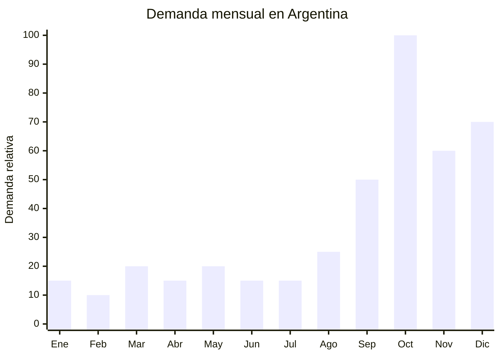

# Sets de maquillaje regalo Dia de la Madre

> **Capitulo NCM 33** — Aceites esenciales, preparaciones de perfumeria, de tocador o de cosmetica | **Temporada:** Primavera (Sep-Nov)

## Que es y por que importarlo

Los sets de maquillaje para regalo son kits armados que combinan varios productos cosmeticos en un mismo packaging atractivo, pensados para regalar sin necesidad de conocer las preferencias exactas de la destinataria. Un set tipico incluye una paleta de sombras (6-12 tonos), una mascara de pestanas, un labial o gloss, y un espejo de bolso o brocha destacada. Todo presentado en una caja con diseno premium, listo para obsequiar.

El Dia de la Madre en Argentina (tercer domingo de octubre) es el segundo evento de mayor consumo del ano despues de Navidad. La categoria de maquillaje crecio mas de un 90% interanual en ventas online, impulsada por la tendencia de autocuidado y la influencia de redes sociales. Marcas como Maybelline sirven de referencia de precio para el consumidor, pero los sets importados directamente de China ofrecen una relacion calidad-precio superior que permite margenes amplios. El comprador tipico busca un regalo "resuelto" con buena presentacion, sin tener que armar el combo pieza por pieza.

China (especialmente Yiwu, Guangzhou y Shenzhen) concentra la produccion mundial de cosmetica de gama media. Los fabricantes ofrecen sets pre-armados con branding personalizable o generico, con MOQs accesibles desde 50 unidades. La clave del negocio esta en el packaging: una caja bien disenada eleva el valor percibido del set de ARS 5.000 a ARS 25.000 sin cambiar significativamente el costo FOB. La clasificacion como cosmetico Grado 1 bajo la Disposicion ANMAT 4033/2025 permite un registro simplificado mediante Declaracion Jurada de Conformidad (DJC), lo cual reduce tiempos y costos frente al registro completo.

## Datos clave

| Dato | Valor |
|------|-------|
| **FOB tipico (China)** | USD 2 — 8/set |
| **Precio venta Argentina** | ARS 8.000 — 35.000 |
| **Margen estimado** | 200 — 400% |
| **MOQ habitual** | 50 — 300 sets |
| **Peso/volumen** | 0.3 — 0.8 kg / 0.002 — 0.005 cbm aprox. |
| **Pico de demanda** | Octubre (Dia de la Madre) |
| **Origen principal** | Yiwu / Guangzhou, China |

## Demanda y mercado en Argentina

- **Volumen de mercado:** Miles de publicaciones activas en MercadoLibre. Los sets de maquillaje son una de las categorias mas buscadas en septiembre-octubre.
- **Tendencia:** Fuertemente creciente. La categoria de maquillaje crecio +90% interanual en ventas online, impulsada por influencers y tutoriales en TikTok e Instagram.
- **Perfil del comprador:** Hombres de 25-50 que buscan regalo resuelto para sus madres, parejas o amigas. Tambien mujeres que se auto-regalan.
- **Canales de venta principales:** MercadoLibre (dominante), Instagram shops, venta mayorista a perfumerias y comercios de regalos.

<Note>
La clave para vender sets de maquillaje como regalo es la **presentacion**. El 70% del valor percibido viene del packaging, no del producto en si. Una caja rigida con cierre magnetico, laminado mate y lazo de raso eleva un set de USD 3 FOB a un precio de venta de ARS 20.000-25.000.
</Note>

## Variantes y subtipos mas comunes

| Variante | Descripcion | FOB referencia |
|----------|-------------|----------------|
| Set basico 3 piezas | Paleta mini + mascara + labial | USD 2 — 3 |
| Set estandar 5 piezas | Paleta 12 tonos + mascara + labial + delineador + espejo | USD 4 — 6 |
| Set premium 8+ piezas | Paleta grande + mascara + labial + delineador + rubor + brochas + estuche cuero PU | USD 6 — 8 |
| Set tipo Maybelline | Estetica de marca reconocida con marca propia | USD 3 — 5 |
| Mini set sorpresa | 3 minis en caja cubo, ideal como souvenir o corporativo | USD 1.50 — 2.50 |

## Regulaciones y requisitos

<Tabs>
  <Tab title="Certificaciones">
    | Organismo | Requiere | Detalle | Costo aprox. | Tiempo aprox. |
    |-----------|----------|---------|-------------|--------------|
    | ARCA (Aduana) | Si siempre | Despacho de importacion estandar | — | — |
    | ANMAT | Si | Cosmetico Grado 1. Registro simplificado mediante DJC (Disposicion 4033/2025) | USD 200 — 500 (gestor) | 2 — 4 semanas |
    | ENACOM | No | No aplica | — | — |
    | INTI | No | No aplica | — | — |

    **Nota importante:** La Disposicion ANMAT 4033/2025 establece un regimen simplificado para cosmeticos de Grado 1 (maquillaje decorativo, labiales, sombras). Se requiere una Declaracion Jurada de Conformidad (DJC) en lugar del tramite completo de registro, lo cual agiliza significativamente la importacion. Si el set incluye protector solar o productos con accion terapeutica, pasa a Grado 2 y requiere registro completo.
  </Tab>

  <Tab title="Etiquetado">
    | Requisito | Aplica |
    |-----------|--------|
    | Idioma espanol | Si (obligatorio en todos los componentes) |
    | Datos del importador | Si (razon social, CUIT, direccion) |
    | Composicion / ingredientes INCI | Si (obligatorio para cosmeticos) |
    | Lote y fecha de vencimiento | Si |
    | Pais de origen | Si |
    | Instrucciones de uso | Si |
    | Numero de registro ANMAT | Si (debe figurar en el envase) |

    **Consejo:** Solicitar al proveedor chino que imprima las etiquetas en espanol directamente en fabrica. Es mas economico y prolijo que pegar stickers en Argentina. Enviar el arte con los textos legales antes de la produccion.
  </Tab>

  <Tab title="Restricciones">
    Sin antidumping ni cupos especificos para sets de maquillaje. Sin embargo, tener en cuenta:

    - Los cosmeticos que contengan ingredientes prohibidos por ANMAT (mercurio, plomo sobre limites, etc.) seran rechazados en aduana.
    - Verificar que el proveedor chino cumpla con las normas de la CFDA (China Food and Drug Administration) ya que es un buen indicador de calidad.
    - Los sets que incluyan perfumes o fragancias en envases mayores a 100ml pueden requerir documentacion adicional de seguridad quimica.
  </Tab>
</Tabs>

## Logistica de importacion

| Aspecto | Detalle |
|---------|---------|
| **Metodo recomendado** | Aereo o maritimo LCL (producto liviano, alto valor por kg) |
| **Tiempo total estimado** | 3 — 5 semanas (aereo) / 8 — 12 semanas (maritimo) |
| **Embalaje tipico** | Caja individual por set + caja master de 20-50 sets con relleno de espuma |
| **Tip logistico** | Los cosmeticos liquidos (mascara, gloss) deben declararse correctamente para transporte aereo. Verificar que no superen limites de inflamabilidad |

<Tip>
Para el Dia de la Madre, el pedido debe salir de fabrica **a mas tardar en julio** si es maritimo o **principios de septiembre** si es aereo. Considerar que agosto es temporada de ferias en China (Canton Fair) y las fabricas pueden tener tiempos de produccion extendidos. Pedir muestras en mayo-junio para aprobar calidad antes de la orden grande.
</Tip>

## Estacionalidad y timing de compra

| Momento | Accion recomendada |
|---------|-------------------|
| Mayo — Junio | Contactar proveedores, pedir muestras, aprobar arte de packaging |
| Julio — Agosto | Confirmar orden de produccion. Envio maritimo si se elige esa via |
| Septiembre | Envio aereo de ultimo momento. Armar publicaciones en MercadoLibre |
| Octubre | Pico de ventas Dia de la Madre. Maximizar envios y atencion al cliente |
| Noviembre — Diciembre | Venta de remanente como regalo de Navidad/fin de ano. Segundo pico |

## Ventajas y riesgos

<CardGroup cols={2}>
  <Card title="Ventajas" icon="circle-check">
    - Margen bruto excepcional (200-400%)
    - Producto liviano, bajo costo de flete por unidad
    - ANMAT Grado 1 simplificado (DJC) reduce tramites
    - Demanda comprobada y creciente (+90% interanual)
    - Packaging diferenciador: la caja vende tanto como el producto
    - Ideal para marca propia (private label)
  </Card>
  <Card title="Riesgos" icon="triangle-exclamation">
    - Requiere registro ANMAT (aunque simplificado, es un tramite obligatorio)
    - Calidad de pigmentos variable: pedir siempre pruebas de laboratorio o certificados SGS
    - Cosmeticos vencidos o mal conservados generan reclamos y problemas legales
    - Competencia con marcas establecidas (Maybelline, Ruby Rose, Vogue)
    - Estacionalidad marcada: el 60% de la demanda se concentra en Sep-Dic
  </Card>
</CardGroup>

<Warning>
**Nunca importar cosmeticos sin registro ANMAT.** La aduana puede retener el embarque completo y las multas son significativas. Iniciar el tramite de DJC (Grado 1) al menos 4-6 semanas antes de la llegada de la mercaderia. Verificar que todos los ingredientes figuren en la lista INCI permitida por ANMAT y que no contengan sustancias prohibidas o restringidas.
</Warning>

## Palabras clave para buscar en Alibaba

> makeup gift set wholesale, cosmetic gift set box, eyeshadow palette mascara lipstick set, makeup set private label, makeup gift box women, cosmetic set christmas mother day, makeup kit gift set OEM

## Fuentes

- [MercadoLibre Argentina — Sets de maquillaje regalo](https://listado.mercadolibre.com.ar/set-maquillaje-regalo)
- [Alibaba — Makeup gift set wholesale](https://www.alibaba.com/showroom/makeup-gift-set.html)
- [ANMAT — Disposicion 4033/2025 Cosmeticos Grado 1](https://www.argentina.gob.ar/anmat/cosmeticos)
- [Camara Argentina de la Industria Cosmetica y Perfumeria (CAPA)](https://www.capa.org.ar/)
