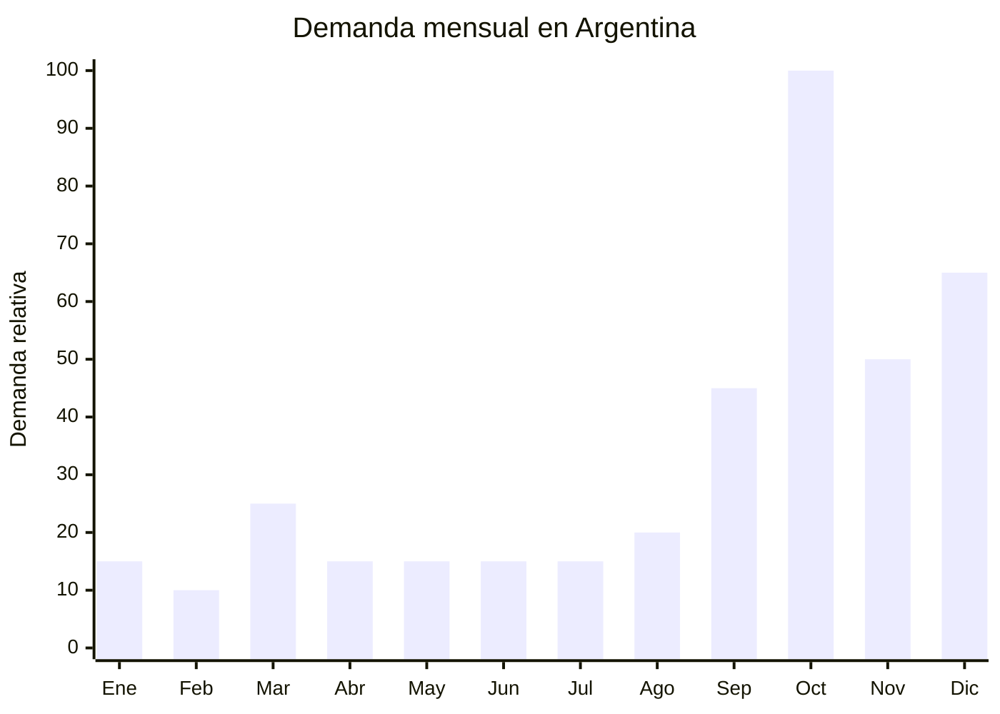

# Sets spa casero y jabones regalo Dia de la Madre

> **Capitulo NCM 34** — Jabones, agentes de superficie organicos, preparaciones para lavar | **Temporada:** Primavera (Sep-Nov)

## Que es y por que importarlo

Los sets de spa casero son kits regalo que combinan productos para una experiencia de relajacion en el hogar: jabon artesanal (lavanda, rosa, avena), bombas de bano efervescentes, sales de bano, locion corporal y una vela aromatica. Todo presentado en una caja regalo con papel de seda, lazo o canasta decorativa. Son uno de los regalos mas populares para el Dia de la Madre porque transmiten cuidado personal y bienestar, sin necesidad de conocer tallas ni preferencias especificas.

En Argentina, la tendencia de self-care y bienestar crecio exponencialmente post-pandemia. Los sets de spa casero ocupan un nicho entre el regalo economico (flores, bombones) y el premium (perfumes de marca). Con un ticket de ARS 10.000-40.000, son accesibles para la mayoria de los compradores. Las bombas de bano en particular se viralizaron en redes sociales por su efecto visual al disolverse, convirtiendose en un producto de alto engagement que se vende solo con buenas fotos y videos.

China produce sets de spa a gran escala en Yiwu (packaging y armado), Guangzhou (jabones y cosmetica) y Zhejiang (velas). Los proveedores ofrecen sets pre-armados con posibilidad de personalizar componentes, aromas y packaging. La ventaja logistica es que son productos livianos y compactos, con costos de flete muy bajos por unidad. La regulacion depende de los componentes: si el set incluye jabones y bombas de bano solamente, clasifica como cosmetico Grado 1 con registro simplificado. Si incluye cremas o lociones, tambien entra en Grado 1 ANMAT bajo la DJC simplificada.

## Datos clave

| Dato | Valor |
|------|-------|
| **FOB tipico (China)** | USD 3 — 10/set |
| **Precio venta Argentina** | ARS 10.000 — 40.000 |
| **Margen estimado** | 200 — 400% |
| **MOQ habitual** | 50 — 300 sets |
| **Peso/volumen** | 0.4 — 1.2 kg / 0.003 — 0.008 cbm aprox. |
| **Pico de demanda** | Octubre (Dia de la Madre) |
| **Origen principal** | Yiwu / Guangzhou, China |

## Demanda y mercado en Argentina

- **Volumen de mercado:** Los sets de spa y bienestar crecen sostenidamente en MercadoLibre. La busqueda "set spa regalo" se multiplica por 5x en octubre.
- **Tendencia:** Creciente. La cultura de self-care y wellness se consolido post-pandemia y sigue expandiendose en todos los segmentos etarios.
- **Perfil del comprador:** Personas de 20-45 que buscan un regalo accesible y significativo. Popular tanto para Dia de la Madre como para amigas, maestras y regalos corporativos.
- **Canales de venta principales:** MercadoLibre, Instagram, ferias artesanales, venta mayorista a bazares y tiendas de regalos.

<Note>
Los sets de spa son un producto de **doble estacionalidad**: pico fuerte en octubre (Dia de la Madre) y segundo pico en diciembre (Navidad y regalos corporativos). Planificar stock para cubrir ambos picos con un solo envio maritimo optimiza costos significativamente.
</Note>

## Variantes y subtipos mas comunes

| Variante | Descripcion | FOB referencia |
|----------|-------------|----------------|
| Set basico 3 piezas | Jabon artesanal + bomba de bano + sal de bano | USD 3 — 4 |
| Set estandar 5 piezas | Jabon + bomba + sales + locion mini + vela | USD 5 — 7 |
| Set premium 7-8 piezas | Jabon + 2 bombas + sales + locion + vela + esponja + caja madera | USD 7 — 10 |
| Pack bombas de bano x6 | 6 bombas efervescentes de diferentes aromas y colores | USD 2 — 4 |
| Set canasta mimbre | Productos de spa en canasta de mimbre decorativa | USD 8 — 12 |
| Set mini spa corporativo | 3 piezas chicas para regalo empresarial | USD 2 — 3 |

## Regulaciones y requisitos

<Tabs>
  <Tab title="Certificaciones">
    | Organismo | Requiere | Detalle | Costo aprox. | Tiempo aprox. |
    |-----------|----------|---------|-------------|--------------|
    | ARCA (Aduana) | Si siempre | Despacho de importacion estandar | — | — |
    | ANMAT | Si | Jabones, bombas de bano, sales y lociones: cosmetico Grado 1 (DJC simplificada, Disp. 4033/2025) | USD 200 — 500 | 2 — 4 semanas |
    | ENACOM | No | No aplica | — | — |
    | SENASA | No | No aplica | — | — |

    **Aclaracion:** Los jabones de tocador, bombas de bano y sales de bano clasifican como cosmeticos Grado 1 bajo normativa ANMAT. La DJC simplificada (Disp. 4033/2025) aplica para todo el set siempre que ningun componente sea Grado 2 (con accion terapeutica, solar, etc.). Las velas aromaticas incluidas en el set NO son cosmeticos y no requieren registro ANMAT por separado.
  </Tab>

  <Tab title="Etiquetado">
    | Requisito | Aplica |
    |-----------|--------|
    | Idioma espanol | Si |
    | Datos del importador | Si (razon social, CUIT, direccion) |
    | Ingredientes INCI | Si (en cada producto cosmetico del set) |
    | Lote y fecha de vencimiento | Si |
    | Contenido neto | Si (peso o volumen de cada componente) |
    | Pais de origen | Si |
    | Instrucciones de uso | Si (especialmente para bombas de bano) |
    | Advertencias | Si (alergenos, no ingerir, mantener fuera del alcance de ninos) |
  </Tab>

  <Tab title="Restricciones">
    Sin antidumping ni cupos para sets de spa/jabones. Consideraciones a tener en cuenta:

    - Las bombas de bano con glitter plastico pueden enfrentar restricciones ambientales futuras. Preferir glitter biodegradable.
    - Jabones con ingredientes de origen animal (lanolina, sebo) pueden requerir certificado SENASA en algunos casos puntuales.
    - Las velas aromaticas con parafina no tienen restriccion, pero las de cera de soja pueden requerir documentacion fitosanitaria si contienen ingredientes botanicos.
  </Tab>
</Tabs>

## Logistica de importacion

| Aspecto | Detalle |
|---------|---------|
| **Metodo recomendado** | Maritimo LCL (liviano, compacto, no urgente si se planifica bien) |
| **Tiempo total estimado** | 8 — 12 semanas (maritimo) / 3 — 5 semanas (aereo) |
| **Embalaje tipico** | Caja individual regalo + film retractil + caja master de 20-40 sets |
| **Tip logistico** | Las bombas de bano son fragiles (se desgranan con golpes). Pedir doble capa de proteccion en caja master y evitar estiba superior. Las velas pueden derretirse con calor: no enviar en contenedores sin ventilacion en verano |

<Tip>
Las bombas de bano y jabones artesanales pierden aroma con el tiempo. Pedir al proveedor que envuelva cada unidad individualmente en **film retractil** y que la caja incluya papel de seda con fragancia adicional. Esto mantiene la intensidad del aroma hasta 8-12 meses y mejora la experiencia de unboxing del cliente.
</Tip>

## Estacionalidad y timing de compra

| Momento | Accion recomendada |
|---------|-------------------|
| Mayo — Junio | Seleccionar proveedores, pedir muestras. Definir aromas y composicion del set |
| Julio | Confirmar orden y enviar arte de packaging. Iniciar tramite ANMAT |
| Agosto | Envio maritimo. Preparar logistica de recepcion |
| Septiembre | Recepcion. Armado de publicaciones con fotos profesionales |
| Octubre | Pico de ventas Dia de la Madre |
| Noviembre — Diciembre | Segundo pico: Navidad, amigo invisible, regalos corporativos |

## Ventajas y riesgos

<CardGroup cols={2}>
  <Card title="Ventajas" icon="circle-check">
    - Producto liviano y compacto (flete economico)
    - Alto valor percibido gracias al packaging regalo
    - Margen excelente (200-400%)
    - Multiples ocasiones de venta: Madre, Navidad, cumpleanos, corporativo
    - Baja competencia de marcas premium en este nicho
    - Ideal para marca propia con identidad de wellness
  </Card>
  <Card title="Riesgos" icon="triangle-exclamation">
    - ANMAT requerido para jabones, bombas y lociones
    - Bombas de bano fragiles: riesgo de deterioro en transporte
    - Aromas se degradan con el tiempo si no se sellan bien
    - Velas pueden derretirse en transporte en meses calidos
    - Calidad de ingredientes variable (pedir certificados de inocuidad)
    - Estacionalidad marcada en Dia de la Madre
  </Card>
</CardGroup>

<Warning>
Verificar la composicion de cada componente del set antes de importar. Algunos jabones chinos economicos contienen **colorantes no autorizados** por ANMAT o ingredientes que pueden causar reacciones alergicas. Solicitar siempre fichas tecnicas, certificados SGS y lista INCI completa. Hacer pruebas en piel con las muestras antes de aprobar la produccion masiva.
</Warning>

## Palabras clave para buscar en Alibaba

> spa gift set wholesale, bath bomb gift set, soap gift box, bath salt gift set, spa set women gift box, bath gift set private label, handmade soap gift set, bath bomb set OEM, relaxation gift set wholesale

## Fuentes

- [MercadoLibre Argentina — Sets spa regalo](https://listado.mercadolibre.com.ar/set-spa-regalo)
- [Alibaba — Spa gift set wholesale](https://www.alibaba.com/showroom/spa-gift-set.html)
- [ANMAT — Normativa cosmeticos](https://www.argentina.gob.ar/anmat/cosmeticos)
