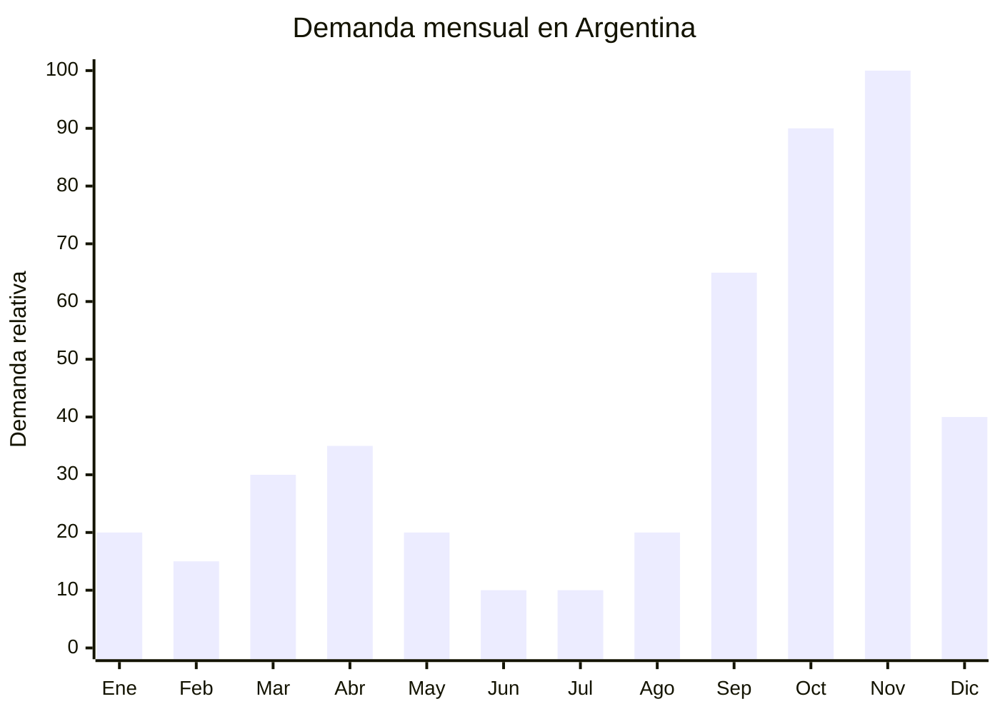

# Composteras domesticas de plastico reciclado

> **Capitulo NCM 39** — Plastico y sus manufacturas | **Temporada:** Primavera (Sep-Nov)

## Que es y por que importarlo

Las composteras domesticas son sistemas apilables de 3 cajones (bandejas perforadas) con una base recolectora de liquido lixiviado y una canilla para drenar el biofertilizante liquido resultante. Permiten transformar residuos organicos del hogar (cascara de frutas, yerba, restos de verdura) en compost nutritivo para plantas, reduciendo la basura domestica hasta un 50%. El modelo estandar de 3 cajones mide aproximadamente 40x40x60cm y procesa los residuos de una familia de 2-4 personas.

La tendencia de sustentabilidad y economia circular esta en pleno auge en Argentina. Varias ciudades (Buenos Aires, Rosario, Cordoba) implementaron programas de compostaje domiciliario, y la ley nacional de presupuestos minimos de residuos incentiva la separacion en origen. Esto genera una demanda creciente y sostenida de composteras hogareñas. La primavera es el momento ideal de venta porque coincide con el inicio de la temporada de jardineria (el compost se usa para fertilizar plantas y huertas) y con campanas ambientales.

China fabrica composteras plasticas en Taizhou y Ningbo (Zhejiang), usando polipropileno reciclado o virgen. El costo FOB es de USD 5-15 por unidad dependiendo del tamano y calidad del plastico. No requieren ninguna certificacion especial en Argentina, lo que simplifica enormemente la importacion. El producto apela tanto al consumidor ecologico de clase media-alta como a municipios y cooperativas que implementan programas de compostaje comunitario.

## Datos clave

| Dato | Valor |
|------|-------|
| **FOB tipico (China)** | USD 5 — 15/unidad |
| **Precio venta Argentina** | ARS 25.000 — 75.000 |
| **Margen estimado** | 150 — 350% |
| **MOQ habitual** | 50 — 300 unidades |
| **Peso/volumen** | 2 — 5 kg / 0.05 — 0.15 cbm aprox. |
| **Pico de demanda** | Septiembre — Noviembre |
| **Origen principal** | Taizhou / Ningbo (Zhejiang), China |

## Demanda y mercado en Argentina

- **Volumen de mercado:** Nicho en crecimiento rapido. Las publicaciones de composteras en MercadoLibre se multiplicaron en los ultimos 2 anos, impulsadas por programas municipales y conciencia ambiental.
- **Tendencia:** Fuertemente creciente. Los municipios de CABA, Rosario, Cordoba y otros promueven activamente el compostaje domiciliario con campanas educativas y hasta entrega de composteras.
- **Perfil del comprador:** Personas de 25-50 con conciencia ambiental, habitantes urbanos con pequenos jardines o balcones, familias que buscan reducir residuos.
- **Canales de venta principales:** MercadoLibre, tiendas de productos sustentables, venta mayorista a municipios y cooperativas.

<Note>
Vender composteras tiene un componente educativo fuerte. Los compradores quieren saber **como compostar**, no solo comprar la compostera. Incluir una guia impresa, videos tutoriales y soporte post-venta por WhatsApp diferencia enormemente de la competencia y reduce devoluciones por "no supe usarla".
</Note>

## Variantes y subtipos mas comunes

| Variante | Descripcion | FOB referencia |
|----------|-------------|----------------|
| Compostera 3 cajones basica (30L) | PP virgen, sin tapa hermetica, malla anti-moscas | USD 5 — 7 |
| Compostera 3 cajones estandar (50L) | PP reciclado, tapa hermetica, canilla lixiviado, ventilacion | USD 8 — 12 |
| Compostera 4 cajones premium (80L) | PP reciclado certificado, ruedas, filtro carbon activado anti-olor | USD 12 — 15 |
| Compostera giratoria (tumbler) | Barril rotatorio sobre soporte, mezcla automatica | USD 15 — 25 |
| Vermicompostera (con compartimento lombrices) | Compostera + compartimento especial para lombrices californianas | USD 8 — 13 |
| Balde de cocina pre-compost (5L) | Balde con filtro carbon para juntar residuos antes de llevar a compostera | USD 2 — 4 |

## Regulaciones y requisitos

<Tabs>
  <Tab title="Certificaciones">
    | Organismo | Requiere | Detalle | Costo aprox. | Tiempo aprox. |
    |-----------|----------|---------|-------------|--------------|
    | ARCA (Aduana) | Si siempre | Despacho de importacion estandar | — | — |
    | ANMAT | No | No es producto alimentario ni cosmetico | — | — |
    | ENACOM | No | No es electronico | — | — |
    | INTI | No | No aplica | — | — |
    | Min. Ambiente | No | No requiere habilitacion ambiental para composteras domesticas | — | — |

    **Sin regulacion especifica.** Las composteras plasticas son manufacturas de plastico sin requisitos de certificacion. El unico requisito es el despacho aduanero estandar.
  </Tab>

  <Tab title="Etiquetado">
    | Requisito | Aplica |
    |-----------|--------|
    | Idioma espanol | Recomendado |
    | Datos del importador | Si (razon social, CUIT) |
    | Material / composicion | Recomendado (indicar si es plastico reciclado) |
    | Pais de origen | Si |
    | Instrucciones de armado y uso | Altamente recomendado (incluir guia de compostaje) |
    | Capacidad en litros | Recomendado |

    **Consejo:** Incluir una guia impresa de compostaje en espanol con el producto. Esto agrega valor percibido enorme, reduce consultas postventa y diferencia de la competencia. El costo de impresion es minimo (USD 0.05-0.10 por guia).
  </Tab>

  <Tab title="Restricciones">
    Sin restricciones especiales. No hay antidumping, licencias previas ni cupos para composteras plasticas.

    **Oportunidad:** Si el plastico es reciclado certificado, puede calificar para beneficios arancelarios o programas de importacion verde en el futuro. Solicitar al proveedor certificado de material reciclado (post-consumer recycled PP).
  </Tab>
</Tabs>

## Logistica de importacion

| Aspecto | Detalle |
|---------|---------|
| **Metodo recomendado** | Maritimo LCL o FCL (producto voluminoso) |
| **Tiempo total estimado** | 8 — 12 semanas (maritimo) |
| **Embalaje tipico** | Cajones apilados y anidados + desarmados flat-pack en caja master |
| **Tip logistico** | Negociar envio desarmado (flat-pack) para reducir CBM hasta un 60%. Los cajones se apilan y anidan, y la canilla va suelta. El usuario final arma en 5 minutos sin herramientas |

<Tip>
El principal competidor no es otra compostera importada sino los fabricantes locales artesanales (carpinterias y cooperativas que hacen composteras de madera). La ventaja de la compostera plastica importada es la durabilidad, la estetica uniforme y el sistema de lixiviado integrado. Comunicar estos beneficios claramente en las publicaciones de venta.
</Tip>

## Estacionalidad y timing de compra

| Momento | Accion recomendada |
|---------|-------------------|
| Mayo — Junio | Investigar proveedores. Solicitar muestras y verificar calidad del plastico |
| Julio | Confirmar orden. Optar por flat-pack para reducir flete |
| Agosto | Envio maritimo. Preparar contenido educativo (guia de compostaje, videos) |
| Septiembre | Inicio de temporada. Lanzar publicaciones con contenido educativo |
| Octubre — Noviembre | Pico de demanda. Dia de la Madre como regalo sustentable |
| Marzo — Abril | Segundo pico menor: inicio de otono y preparacion de compost para invierno |

## Ventajas y riesgos

<CardGroup cols={2}>
  <Card title="Ventajas" icon="circle-check">
    - Cero regulacion: sin certificaciones requeridas
    - Tendencia de sustentabilidad en pleno crecimiento
    - Apoyo de politicas publicas municipales y nacionales
    - Margen atractivo (150-350%)
    - Producto diferenciado vs. macetas y jardineria comun
    - Venta recurrente de accesorios (baldes pre-compost, lombrices, sustratos)
  </Card>
  <Card title="Riesgos" icon="triangle-exclamation">
    - Alto volumen/CBM: flete puede ser significativo
    - Competencia de fabricantes locales artesanales (madera)
    - Requiere educacion del consumidor (no todos saben compostar)
    - Plastico barato puede deformarse con calor o quebrarse con frio
    - Nicho especifico: demanda menor que productos masivos
  </Card>
</CardGroup>

<Warning>
La calidad del plastico es critica en composteras. El proceso de compostaje genera calor (hasta 60 grados centigrados) y el lixiviado es acido. Plasticos de baja calidad se deforman, se agrietan o pierden color en pocos meses. Exigir al proveedor **PP de grado alimentario** o **PP reciclado certificado** con resistencia UV y termica. Pedir fichas tecnicas del material y hacer pruebas de resistencia con las muestras.
</Warning>

## Palabras clave para buscar en Alibaba

> compost bin plastic wholesale, kitchen compost bin, stackable compost bin, worm compost bin, tumbler composter wholesale, home composting bin 3 tier, compost bin with spigot, recycled plastic compost bin, garden composter wholesale

## Fuentes

- [MercadoLibre Argentina — Composteras](https://listado.mercadolibre.com.ar/compostera)
- [Alibaba — Compost bin wholesale](https://www.alibaba.com/showroom/compost-bin.html)
- [Ministerio de Ambiente Argentina — Compostaje domiciliario](https://www.argentina.gob.ar/ambiente)
