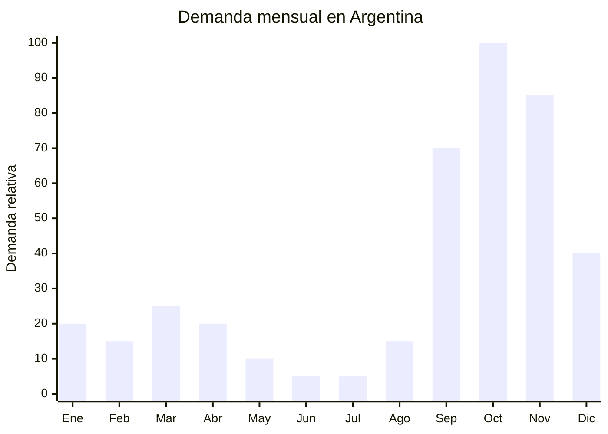

# Macetas autorriego y jardineras urbanas

> **Capitulo NCM 39** — Plastico y sus manufacturas | **Temporada:** Primavera (Sep-Nov)

## Que es y por que importarlo

Las macetas con autorriego son recipientes plasticos que incorporan un deposito de agua en la base y un sistema de mecha o capilaridad que mantiene la tierra humeda de forma autonoma durante 1-3 semanas. Las jardineras urbanas son versiones alargadas o modulares pensadas para balcones, terrazas y ventanas de departamentos. Ambos productos responden a la tendencia de urban gardening (huerta y jardin urbano) que exploto en Argentina post-pandemia y continua creciendo ano a ano.

La primavera (septiembre-noviembre) es la temporada estrella de jardineria en Argentina. Con la llegada del buen clima, millones de personas renuevan sus balcones, arman huertas en macetas y compran plantas. La marca VIVRO es referencia en MercadoLibre para macetas autorriego, validando la demanda del formato. Las macetas autorriego resuelven el dolor principal del jardinero urbano: el riego inconsistente (olvido, vacaciones, falta de tiempo). Este beneficio funcional las convierte en un upgrade natural respecto a la maceta comun de plastico.

China (Taizhou, Zhejiang) es el mayor productor mundial de macetas plasticas y sistemas de jardineria. Los costos FOB son extraordinariamente bajos (USD 0.50-3 por unidad dependiendo del tamano), el producto no requiere ninguna certificacion especial en Argentina, y los margenes de venta son amplios. El principal desafio logistico es el volumen: las macetas son productos huecos que ocupan mucho CBM, pero se pueden anidar (una dentro de otra) para optimizar espacio en el contenedor.

## Datos clave

| Dato | Valor |
|------|-------|
| **FOB tipico (China)** | USD 0.50 — 3/unidad |
| **Precio venta Argentina** | ARS 3.000 — 18.000 |
| **Margen estimado** | 200 — 500% |
| **MOQ habitual** | 200 — 1.000 unidades |
| **Peso/volumen** | 0.1 — 0.8 kg / 0.002 — 0.015 cbm aprox. |
| **Pico de demanda** | Septiembre — Noviembre |
| **Origen principal** | Taizhou (Zhejiang), China |

## Demanda y mercado en Argentina

- **Volumen de mercado:** La categoria de macetas y jardineria crece sostenidamente en MercadoLibre. Las macetas autorriego son un segmento premium dentro de macetas, con menor competencia y mayor margen.
- **Tendencia:** Fuertemente creciente. Urban gardening, huerta en casa y decoracion con plantas son tendencias consolidadas que no muestran signos de desaceleracion.
- **Perfil del comprador:** Mujeres de 25-55, habitantes de departamentos y PH, amantes de las plantas que buscan soluciones practicas para riego. Tambien hombres que buscan regalo practico para Dia de la Madre.
- **Canales de venta principales:** MercadoLibre (dominante), viveros online, Instagram, venta mayorista a viveros y garden centers.

<Note>
La marca VIVRO posiciono fuertemente las macetas autorriego en Argentina a traves de MercadoLibre, validando la demanda del formato. Esto significa que el consumidor ya conoce y busca este tipo de producto, lo que facilita la venta de alternativas importadas con marca propia.
</Note>

## Variantes y subtipos mas comunes

| Variante | Descripcion | FOB referencia |
|----------|-------------|----------------|
| Maceta autorriego redonda chica (12-15cm) | Para suculentas y aromaticas, indicador de nivel de agua | USD 0.50 — 0.80 |
| Maceta autorriego mediana (18-22cm) | Para plantas de interior, sistema capilar con mecha | USD 0.80 — 1.50 |
| Maceta autorriego grande (25-35cm) | Para arbustos o huerta, deposito de 2-3 litros | USD 1.50 — 3.00 |
| Jardinera rectangular balcon (40-60cm) | Con soporte para baranda, autorriego integrado | USD 2.00 — 3.50 |
| Sistema modular vertical (3-5 niveles) | Jardin vertical apilable con riego en cascada | USD 3.00 — 6.00 |
| Maceta autorriego decorativa (imitacion ceramica) | Plastico PP con acabado mate tipo cemento o terracota | USD 1.00 — 2.50 |
| Kit huerta urbana con autorriego | Jardinera + sustrato + semillas + guia, listo para usar | USD 3.00 — 5.00 |

## Regulaciones y requisitos

<Tabs>
  <Tab title="Certificaciones">
    | Organismo | Requiere | Detalle | Costo aprox. | Tiempo aprox. |
    |-----------|----------|---------|-------------|--------------|
    | ARCA (Aduana) | Si siempre | Despacho de importacion estandar | — | — |
    | ANMAT | No | No es producto cosmetico ni alimentario | — | — |
    | ENACOM | No | No es electronico | — | — |
    | INTI | No | No aplica | — | — |
    | SENASA | No | No es planta ni sustrato | — | — |

    **Sin regulacion especifica.** Las macetas plasticas son manufacturas de plastico sin requisitos de certificacion. Es uno de los productos con menor barrera regulatoria para importar. Solo se requiere el despacho aduanero estandar.
  </Tab>

  <Tab title="Etiquetado">
    | Requisito | Aplica |
    |-----------|--------|
    | Idioma espanol | Recomendado (no obligatorio para productos sin contacto alimentario) |
    | Datos del importador | Si (razon social, CUIT) |
    | Material / composicion | Recomendado (PP, PE, etc.) |
    | Pais de origen | Si |
    | Instrucciones de uso del autorriego | Recomendado (agrega valor y reduce consultas postventa) |
  </Tab>

  <Tab title="Restricciones">
    Sin restricciones especiales. No hay antidumping, licencias previas ni cupos para macetas plasticas.

    **Nota ambiental:** Argentina avanza hacia regulaciones de plasticos de un solo uso, pero las macetas son productos de uso prolongado y no estan alcanzadas por estas normativas actuales.
  </Tab>
</Tabs>

## Logistica de importacion

| Aspecto | Detalle |
|---------|---------|
| **Metodo recomendado** | Maritimo LCL (o FCL si el volumen lo justifica — las macetas son voluminosas) |
| **Tiempo total estimado** | 8 — 12 semanas (maritimo) |
| **Embalaje tipico** | Macetas anidadas (una dentro de otra) + film stretch + caja master |
| **Tip logistico** | Negociar con el proveedor macetas anidables para reducir CBM hasta un 50%. Combinar tamanos en el mismo envio para optimizar espacio |

<Tip>
El costo de flete por maceta es mas importante que el costo FOB. Una maceta de USD 1 puede costar USD 1.50 de flete si no se optimiza el espacio. Priorizar disenos apilables/anidables y negociar flat-pack cuando sea posible. Calcular siempre el **costo landed** (FOB + flete + impuestos) antes de fijar precio de venta.
</Tip>

## Estacionalidad y timing de compra

| Momento | Accion recomendada |
|---------|-------------------|
| Mayo — Junio | Contactar proveedores en Taizhou. Pedir muestras y catalogo de modelos |
| Junio — Julio | Confirmar orden. Priorizar modelos autorriego y jardineras de balcon |
| Julio — Agosto | Envio maritimo. Preparar contenido (fotos, videos de uso) |
| Septiembre | Inicio de temporada. Lanzar publicaciones. Primeras ventas |
| Octubre — Noviembre | Pico de demanda. Dia de la Madre impulsa ventas como regalo original |
| Diciembre | Demanda se mantiene para regalos de Navidad y mudanzas de verano |

## Ventajas y riesgos

<CardGroup cols={2}>
  <Card title="Ventajas" icon="circle-check">
    - Cero regulacion: sin ANMAT, ENACOM ni certificaciones
    - FOB ultra bajo (desde USD 0.50)
    - Margenes de 200-500%
    - Tendencia urban gardening en pleno crecimiento
    - Producto funcional con beneficio claro (autorriego)
    - Multiples nichos: suculentas, huerta, decoracion, regalo
  </Card>
  <Card title="Riesgos" icon="triangle-exclamation">
    - Alto CBM: el flete puede superar el costo FOB si no se optimiza
    - Estacionalidad marcada (primavera)
    - Competencia de fabricantes nacionales y viveros
    - Plastico barato puede degradarse con UV si no tiene proteccion
    - Sistemas de autorriego baratos pueden fallar (mecha insuficiente)
  </Card>
</CardGroup>

<Warning>
Verificar que las macetas tengan **proteccion UV** (estabilizador UV en el plastico). Las macetas de plastico barato sin proteccion UV se decoloran y se vuelven fragiles en 3-6 meses de exposicion solar directa. Esto genera reclamos masivos y deterioro de reputacion en MercadoLibre. Solicitar al proveedor que especifique si el material tiene aditivo anti-UV y pedir certificado o ficha tecnica del material.
</Warning>

## Palabras clave para buscar en Alibaba

> self watering planter wholesale, self watering pot plastic, automatic watering flower pot, balcony planter box, window planter box, garden planter rectangular, stackable garden planter, self watering planter OEM, urban garden pot wholesale

## Fuentes

- [MercadoLibre Argentina — Macetas autorriego](https://listado.mercadolibre.com.ar/maceta-autorriego)
- [Alibaba — Self watering planter wholesale](https://www.alibaba.com/showroom/self-watering-planter.html)
- [VIVRO — Marca referencia de macetas autorriego en Argentina](https://www.mercadolibre.com.ar/tienda/vivro)
