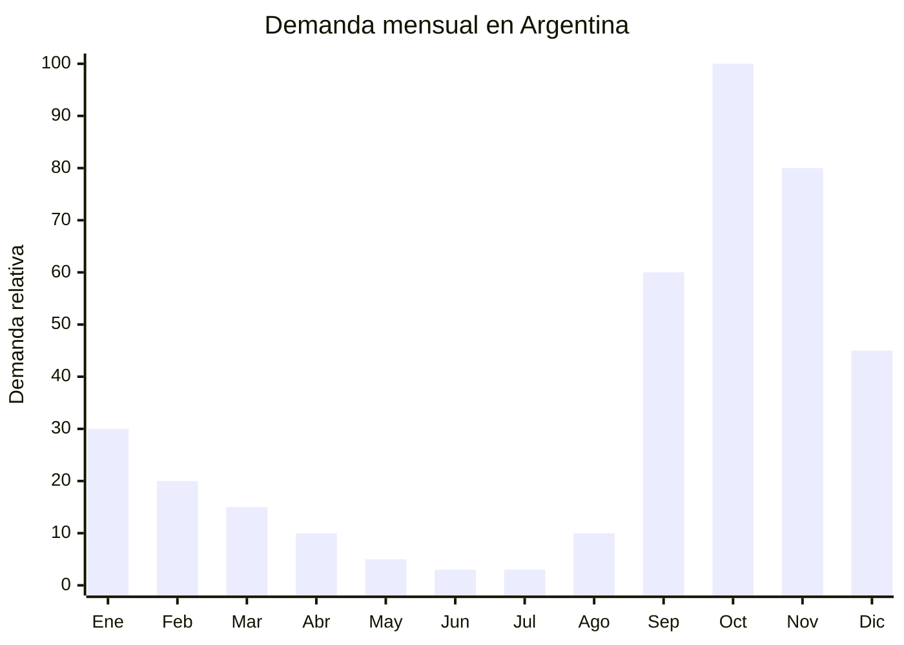

# Mangueras extensibles y kits riego por goteo

> **Capitulo NCM 40** — Caucho y sus manufacturas | **Temporada:** Primavera (Sep-Nov)

## Que es y por que importarlo

Las mangueras extensibles (conocidas como "magic hose") son mangueras de jardin que se expanden hasta 3 veces su largo original cuando se abre el agua y se contraen automaticamente al cerrarla. Estan fabricadas con un tubo interior de latex/TPE recubierto por una funda textil de poliester. Los kits de riego por goteo son sistemas modulares de tubos, conectores, goteros y temporizadores que permiten automatizar el riego de jardines, huertas y macetas, ahorrando hasta un 70% de agua respecto al riego manual.

Ambos productos tienen su pico de demanda en primavera (septiembre-noviembre) cuando los argentinos activan sus jardines, huertas y terrazas despues del invierno. Octubre es el mes mas fuerte, impulsado por el buen clima y el Dia de la Madre (una manguera extensible o un kit de riego son regalos practicos muy populares para madres que disfrutan de la jardineria). La manguera magic hose resuelve los problemas clasicos de las mangueras tradicionales: peso, enrollado engorroso y almacenamiento.

China domina la produccion mundial de ambos productos. Las mangueras extensibles se fabrican mayoritariamente en Yongkang (Zhejiang) y Shenzhen, mientras que los kits de riego por goteo provienen de Taizhou y Ningbo. Los costos FOB son muy accesibles, no requieren ninguna certificacion en Argentina, y los margenes son atractivos. La clave esta en la calidad del latex interior (punto critico de falla) y en la durabilidad de los conectores de bronce vs. plastico.

## Datos clave

| Dato | Valor |
|------|-------|
| **FOB tipico (China)** | USD 2 — 6/manguera, USD 3 — 10/kit goteo |
| **Precio venta Argentina** | ARS 12.000 — 35.000 (manguera), ARS 8.000 — 30.000 (kit goteo) |
| **Margen estimado** | 150 — 350% |
| **MOQ habitual** | 100 — 500 unidades |
| **Peso/volumen** | 0.5 — 1.5 kg / 0.003 — 0.010 cbm aprox. |
| **Pico de demanda** | Octubre (jardineria primaveral) |
| **Origen principal** | Yongkang / Taizhou (Zhejiang), China |

## Demanda y mercado en Argentina

- **Volumen de mercado:** Las mangueras extensibles tienen cientos de publicaciones activas en MercadoLibre con vendedores de alto volumen. Los kits de riego por goteo son un nicho mas especializado pero en crecimiento constante.
- **Tendencia:** Estable-creciente. La demanda sigue el ciclo estacional de primavera-verano. La tendencia de huerta urbana impulsa los kits de riego por goteo como complemento natural.
- **Perfil del comprador:** Propietarios de casas con jardin (mangueras), habitantes de departamentos con balcon/terraza (kits goteo), y entusiastas de la huerta urbana.
- **Canales de venta principales:** MercadoLibre (dominante), ferreterias online, marketplaces de jardineria.

<Note>
Los kits de riego por goteo con timer automatico son el producto de mayor margen dentro de esta categoria. El timer agrega USD 3-5 al costo FOB pero permite cobrar ARS 10.000-15.000 adicionales en el precio de venta, apelando al comprador que quiere automatizar completamente el riego.
</Note>

## Variantes y subtipos mas comunes

| Variante | Descripcion | FOB referencia |
|----------|-------------|----------------|
| Manguera extensible 15m (50ft) | Magic hose basica con pistola 7 funciones | USD 2 — 3 |
| Manguera extensible 23m (75ft) | Tamano medio, ideal para jardines medianos | USD 3 — 4 |
| Manguera extensible 30m (100ft) | Tamano grande con conectores de bronce | USD 4 — 6 |
| Kit riego goteo 15m (30 goteros) | Sistema basico para macetas y canteros | USD 3 — 5 |
| Kit riego goteo 30m (60 goteros) | Sistema intermedio para huerta o jardin mediano | USD 5 — 8 |
| Kit riego goteo con timer automatico | Sistema con temporizador programable a pilas | USD 8 — 10 |
| Manguera plana enrollable 15m | Manguera flat tipo bombero para espacios reducidos | USD 2 — 3 |

## Regulaciones y requisitos

<Tabs>
  <Tab title="Certificaciones">
    | Organismo | Requiere | Detalle | Costo aprox. | Tiempo aprox. |
    |-----------|----------|---------|-------------|--------------|
    | ARCA (Aduana) | Si siempre | Despacho de importacion estandar | — | — |
    | ANMAT | No | No es producto cosmetico ni alimentario | — | — |
    | ENACOM | No | No es electronico (salvo timers con Bluetooth, poco comun) | — | — |
    | INTI | No | No aplica | — | — |
    | INA (Inst. Nac. del Agua) | No | No requiere habilitacion para uso domestico | — | — |

    **Sin regulacion especifica.** Mangueras y sistemas de riego domesticos no requieren certificaciones en Argentina. Es un producto de libre importacion con despacho aduanero estandar.
  </Tab>

  <Tab title="Etiquetado">
    | Requisito | Aplica |
    |-----------|--------|
    | Idioma espanol | Recomendado |
    | Datos del importador | Si (razon social, CUIT) |
    | Material / composicion | Recomendado (latex, TPE, poliester, bronce) |
    | Largo / especificaciones | Si (indicar largo expandido y contraido) |
    | Pais de origen | Si |
    | Instrucciones de uso | Recomendado (como conectar, presion maxima) |
    | Garantia legal 6 meses | Si |
  </Tab>

  <Tab title="Restricciones">
    Sin restricciones especiales. No hay antidumping, licencias previas ni cupos para mangueras ni sistemas de riego domesticos.

    **Nota:** Si el kit de riego incluye un timer con conexion Bluetooth o WiFi, ese componente especifico podria requerir declaracion ENACOM. Los timers mecanicos o a pilas simples no tienen esta restriccion.
  </Tab>
</Tabs>

## Logistica de importacion

| Aspecto | Detalle |
|---------|---------|
| **Metodo recomendado** | Maritimo LCL (producto compacto cuando esta contraido) |
| **Tiempo total estimado** | 8 — 12 semanas (maritimo) |
| **Embalaje tipico** | Caja color individual con manguera contraida + accesorios + caja master de 20-30 unidades |
| **Tip logistico** | Las mangueras extensibles se envian contraidas y ocupan muy poco espacio. Un pallet puede contener 200-400 mangueras. Aprovechar este ratio peso/volumen favorable para combinar con otros productos de jardineria en el mismo envio |

<Tip>
La pistola de riego multifuncion que viene con la manguera es un diferenciador clave. Las pistolas de metal con 8-10 funciones elevan el valor percibido significativamente respecto a las pistolas plasticas de 3 funciones. La diferencia de costo FOB es de apenas USD 0.50-1, pero permite cobrar ARS 5.000-8.000 mas en el precio de venta.
</Tip>

## Estacionalidad y timing de compra

| Momento | Accion recomendada |
|---------|-------------------|
| Mayo — Junio | Contactar proveedores. Pedir muestras de mangueras (probar 5-10 ciclos de expansion) |
| Julio | Confirmar orden. Verificar calidad de conectores y pistola |
| Agosto | Envio maritimo. Preparar videos de uso para publicaciones |
| Septiembre | Lanzar publicaciones. Inicio de temporada |
| Octubre | Pico maximo. Reforzar stock si es necesario con envio aereo |
| Noviembre — Diciembre | Demanda alta: verano implica mas riego. Navidad como regalo practico |
| Enero — Febrero | Demanda moderada: verano caluroso = necesidad de riego continuo |

## Ventajas y riesgos

<CardGroup cols={2}>
  <Card title="Ventajas" icon="circle-check">
    - Sin regulacion: importacion directa sin tramites extra
    - Producto compacto cuando esta contraido (bajo CBM)
    - Margenes de 150-350%
    - Demanda estacional fuerte y predecible
    - Facil de demostrar en video (alto engagement en redes)
    - Multiples variantes para ofrecer (tamanos, accesorios)
  </Card>
  <Card title="Riesgos" icon="triangle-exclamation">
    - Durabilidad del latex interior: punto critico de falla
    - Mangueras baratas revientan con presion alta o calor
    - Conectores de plastico se rompen (preferir bronce)
    - Estacionalidad: stock no vendido en primavera queda hasta el anio siguiente
    - Competencia con marcas nacionales posicionadas (Tramontina, etc.)
    - Reclamos frecuentes si la calidad no es buena
  </Card>
</CardGroup>

<Warning>
La manguera extensible es un producto donde la calidad marca la diferencia entre un negocio exitoso y un desastre de reclamos. Las mangueras de latex simple (capa unica) revientan en 1-3 meses de uso. **Exigir latex de doble capa o TPE** (elastomero termoplastico) como material interior, y **conectores de bronce** en lugar de plastico. Hacer pruebas con las muestras: expandir y contraer al menos 10 veces, dejar al sol 48 horas, y probar con presion maxima de red domestica antes de aprobar la orden.
</Warning>

## Palabras clave para buscar en Alibaba

> expandable garden hose wholesale, magic hose 100ft, garden hose expandable brass connector, drip irrigation kit garden, micro drip irrigation system, garden watering kit wholesale, expandable hose latex double layer, automatic drip irrigation timer

## Fuentes

- [MercadoLibre Argentina — Manguera extensible](https://listado.mercadolibre.com.ar/manguera-extensible)
- [MercadoLibre Argentina — Kit riego por goteo](https://listado.mercadolibre.com.ar/kit-riego-goteo)
- [Alibaba — Expandable garden hose wholesale](https://www.alibaba.com/showroom/expandable-garden-hose.html)
