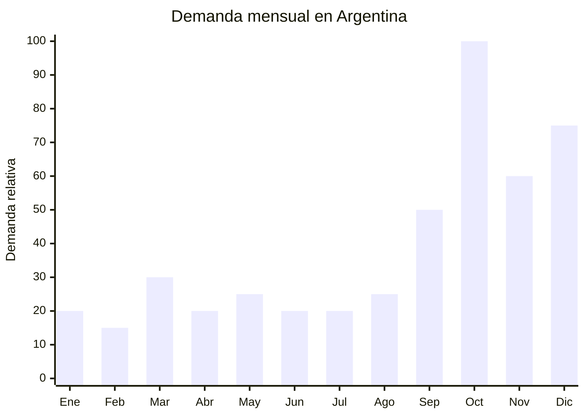

# Carteras y bolsos mujer regalo Dia de la Madre

> **Capitulo NCM 42** — Manufacturas de cuero, articulos de viaje, bolsos de mano | **Temporada:** Primavera (Sep-Nov)

## Que es y por que importarlo

Las carteras y bolsos de mujer abarcan una amplia gama de accesorios de moda: bandoleras (crossbody), bolsos tote, mochilas urbanas, clutch (sobre de mano) y bolsos de hombro. Fabricados principalmente en PU (poliuretano, cuero sintetico), ofrecen un aspecto similar al cuero genuino a una fraccion del costo. Son uno de los regalos mas buscados para el Dia de la Madre en Argentina, con un ticket que permite tanto opciones economicas como premium.

El mercado argentino de carteras tiene una particularidad: las marcas locales premium (Prune, Blaquee, Vitamina) manejan precios de ARS 80.000-200.000, mientras que las carteras importadas de buena calidad en PU se posicionan en ARS 15.000-50.000, cubriendo un segmento masivo de compradoras que buscan estilo sin el precio de marca. Guangzhou es la capital mundial de la fabricacion de bolsos y carteras, con un ecosistema de miles de fabricas, trading companies y mercados mayoristas (Sanyuanli, Baiyun) que ofrecen desde produccion en serie hasta desarrollo de modelos exclusivos.

La ventaja de importar carteras es que no requieren ninguna certificacion especial en Argentina (no son textil regulado por INTI ni producto con requisitos ANMAT), el producto es relativamente compacto y resistente al transporte, y las tendencias de moda permiten diferenciarse constantemente con colores, texturas y formatos de temporada. El margen es especialmente bueno en el segmento de carteras de calidad media-alta con marca propia.

## Datos clave

| Dato | Valor |
|------|-------|
| **FOB tipico (China)** | USD 3 — 15/unidad |
| **Precio venta Argentina** | ARS 15.000 — 60.000 |
| **Margen estimado** | 200 — 400% |
| **MOQ habitual** | 30 — 200 unidades (por modelo/color) |
| **Peso/volumen** | 0.3 — 0.8 kg / 0.003 — 0.010 cbm aprox. |
| **Pico de demanda** | Octubre (Dia de la Madre) |
| **Origen principal** | Guangzhou (Guangdong), China |

## Demanda y mercado en Argentina

- **Volumen de mercado:** Categoría masiva. "Cartera mujer" es una de las busquedas con mayor volumen en MercadoLibre, con miles de publicaciones activas y vendedores de alto volumen.
- **Tendencia:** Estable-creciente. La moda de carteras rota con las temporadas, pero la demanda base es constante y se potencia en octubre (Dia de la Madre) y diciembre (Navidad).
- **Perfil del comprador:** Hombres de 25-55 que buscan regalo para Dia de la Madre (octubre). Mujeres de 18-45 que compran para uso propio o regalo.
- **Canales de venta principales:** MercadoLibre, Instagram shops, showrooms, venta mayorista a locales de galeria y comercios de moda.

<Note>
La **bandolera (crossbody)** es el formato mas vendido en Argentina, seguido por la mochila urbana. Ambos formatos priorizan practicidad y seguridad (manos libres, cierre antirrobo). Concentrar el surtido inicial en estos dos formatos maximiza la rotacion de stock.
</Note>

## Variantes y subtipos mas comunes

| Variante | Descripcion | FOB referencia |
|----------|-------------|----------------|
| Bandolera (crossbody) compacta | PU cuero sintetico, correa ajustable, 20x15cm | USD 3 — 5 |
| Bolso tote mediano | Bolso abierto grande, ideal uso diario, 35x30cm | USD 5 — 8 |
| Mochila urbana mujer | Mochila de PU con cierre oculto antirrobo | USD 5 — 10 |
| Clutch / sobre de mano | Para eventos, con cadena desmontable | USD 3 — 6 |
| Bolso hombro estructurado | Estilo clasico, cierre metalico, compartimentos | USD 8 — 15 |
| Set 2-3 piezas (bolso + billetera + neceser) | Kit coordinado en misma linea estetica | USD 8 — 15 |

## Regulaciones y requisitos

<Tabs>
  <Tab title="Certificaciones">
    | Organismo | Requiere | Detalle | Costo aprox. | Tiempo aprox. |
    |-----------|----------|---------|-------------|--------------|
    | ARCA (Aduana) | Si siempre | Despacho de importacion estandar | — | — |
    | ANMAT | No | No es producto cosmetico ni alimentario | — | — |
    | ENACOM | No | No es electronico | — | — |
    | INTI | No | Carteras y bolsos no clasifican como textil regulado | — | — |

    **Sin regulacion especifica.** Las carteras y bolsos de PU o cuero sintetico no requieren certificaciones adicionales al despacho aduanero estandar. Si fueran de cuero genuino, podrian requerir documentacion CITES si provienen de especies protegidas (cocodrilo, piton, etc.), pero esto no aplica a PU.
  </Tab>

  <Tab title="Etiquetado">
    | Requisito | Aplica |
    |-----------|--------|
    | Idioma espanol | Si |
    | Datos del importador | Si (razon social, CUIT, direccion) |
    | Composicion / material | Si (indicar "PU" o "cuero sintetico", NO decir "cuero" si no lo es) |
    | Pais de origen | Si |
    | Garantia legal 6 meses | Si |

    **Importante:** Nunca etiquetar como "cuero" o "leather" un producto que es PU/cuero sintetico. Esto constituye publicidad enganosa y puede generar problemas legales. Usar siempre "cuero sintetico", "PU", "eco-cuero" o "simil cuero".
  </Tab>

  <Tab title="Restricciones">
    Sin antidumping ni cupos para carteras y bolsos de PU cuero sintetico.

    **Propiedad intelectual:** El riesgo principal es la falsificacion de marcas. NUNCA importar carteras con logos, monogramas o disenos que imiten marcas registradas (Louis Vuitton, Gucci, Michael Kors, etc.). Aduana retiene y destruye mercaderia falsificada, y las multas son severas. Importar siempre con marca propia o generica.
  </Tab>
</Tabs>

## Logistica de importacion

| Aspecto | Detalle |
|---------|---------|
| **Metodo recomendado** | Maritimo LCL (producto liviano y no fragil) o aereo para pedidos urgentes |
| **Tiempo total estimado** | 8 — 12 semanas (maritimo) / 3 — 5 semanas (aereo) |
| **Embalaje tipico** | Cada cartera en dust bag + caja individual + caja master de 10-20 unidades |
| **Tip logistico** | Las carteras estructuradas deben enviarse con relleno interior de papel para mantener la forma durante el transporte. Las carteras blandas pueden comprimirse para reducir volumen |

<Tip>
Para diferenciarte en MercadoLibre, solicita al proveedor de Guangzhou que incluya **dust bag con logo propio** (bolsa de tela protectora) y una **caja de presentacion**. El costo adicional es de USD 0.30-0.80 por cartera, pero eleva significativamente el valor percibido y permite posicionar el producto en un segmento superior de precio.
</Tip>

## Estacionalidad y timing de compra

| Momento | Accion recomendada |
|---------|-------------------|
| Abril — Mayo | Visitar mercados mayoristas online de Guangzhou. Seleccionar modelos de tendencia |
| Junio — Julio | Confirmar orden. Definir colores de temporada primavera (pasteles, neutros, trending) |
| Agosto | Envio maritimo. Preparar sesion de fotos profesional |
| Septiembre | Lanzar publicaciones. Posicionar como regalo de Dia de la Madre |
| Octubre | Pico de ventas Dia de la Madre |
| Noviembre — Diciembre | Segundo pico: Navidad, CyberMonday. Liquidar modelos de temporada |

## Ventajas y riesgos

<CardGroup cols={2}>
  <Card title="Ventajas" icon="circle-check">
    - Sin regulacion: importacion directa sin tramites extra
    - Margenes excelentes (200-400%)
    - Producto liviano y resistente al transporte
    - Guangzhou ofrece variedad infinita de modelos
    - MOQ bajos (desde 30 unidades por modelo)
    - Moda permite renovar constantemente la oferta
    - Ideal para marca propia
  </Card>
  <Card title="Riesgos" icon="triangle-exclamation">
    - Calidad de PU variable: algunas se pelan en 3-6 meses
    - Herrajes (cierres, hebillas) de baja calidad se oxidan o rompen
    - Riesgo de propiedad intelectual si se copian disenos de marca
    - Competencia alta en MercadoLibre
    - Moda cambia: stock de modelos pasados pierde valor
    - Olores quimicos fuertes en PU barato
  </Card>
</CardGroup>

<Warning>
La calidad del PU (cuero sintetico) varia enormemente. El PU barato se pela, se agrieta y huele a quimico fuerte. **Pedir siempre muestras** y hacer estas pruebas: 1) Doblar el material repetidamente para verificar que no se agriete; 2) Frotar con un pano humedo para verificar que el color no transfiera; 3) Oler para detectar exceso de solventes; 4) Verificar costuras y pegado de forros internos. Un proveedor serio de Guangzhou proporcionara certificados de calidad del PU (resistencia a abrasion, solidez del color, etc.).
</Warning>

## Palabras clave para buscar en Alibaba

> women handbag PU leather wholesale, crossbody bag women wholesale, tote bag PU leather, women backpack urban wholesale, clutch bag women, women bag set wholesale, handbag private label OEM, PU leather bag Guangzhou, women shoulder bag wholesale

## Fuentes

- [MercadoLibre Argentina — Carteras mujer](https://listado.mercadolibre.com.ar/cartera-mujer)
- [Alibaba — Women handbag PU leather wholesale](https://www.alibaba.com/showroom/women-handbag-pu-leather.html)
- [Guangzhou leather market guide](https://www.alibaba.com/showroom/guangzhou-handbag.html)
