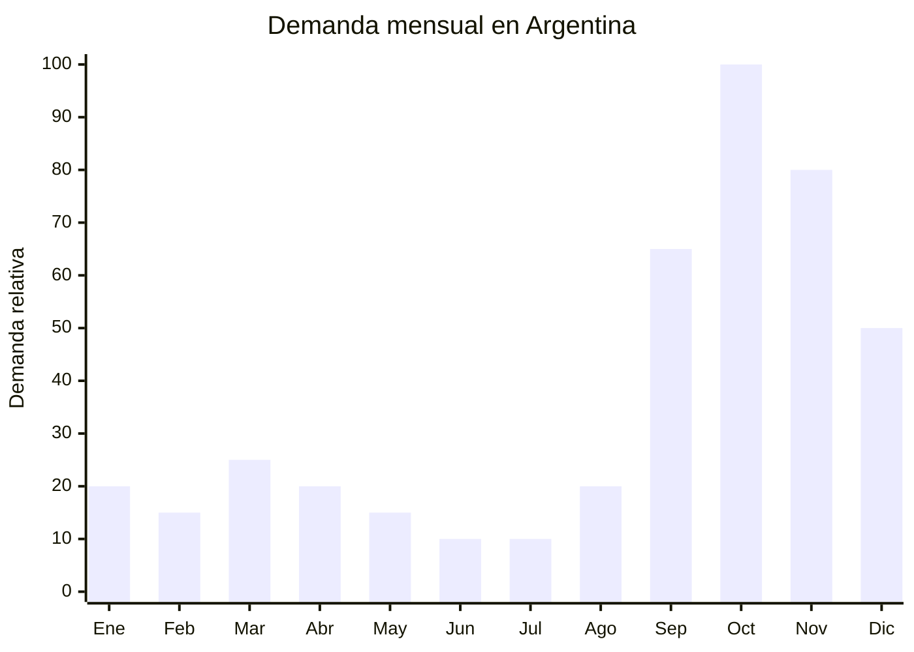

# Maceteros y soportes de madera/bambu para plantas

> **Capitulo NCM 44** — Madera, carbon vegetal y manufacturas de madera | **Temporada:** Primavera (Sep-Nov)

## Que es y por que importarlo

Los maceteros y soportes de madera/bambu para plantas abarcan una familia de productos decorativos-funcionales: soportes tipo escalera de 3-4 niveles para exhibir plantas, maceteros colgantes de macrame con base de madera, estantes para suculentas, pedestales para macetas grandes y organizadores de plantas para interior y exterior. Fabricados en madera de pino, bambu o MDF, combinan la tendencia de decoracion natural con la pasion por las plantas.

La cultura "plant mom" (amante de las plantas) se consolido como un fenomeno masivo en Argentina. Las redes sociales estan llenas de contenido sobre decoracion con plantas, propagacion de esquejes y "plant tours" que muestran como organizar colecciones de plantas en espacios reducidos. Los soportes de madera resuelven este problema: permiten exhibir multiples plantas de forma vertical, optimizando el espacio en balcones y livings. La primavera es la temporada estrella porque coincide con el momento en que la gente compra plantas nuevas y reorganiza sus espacios verdes.

China produce estos productos a gran escala en Fujian (capital maderera china), Zhejiang y Jiangxi. El bambu proviene principalmente de Anji (Zhejiang), reconocido como "la capital del bambu en China". Los costos FOB son muy accesibles, y el producto no requiere certificaciones especiales en Argentina. El principal atractivo es que los soportes de madera/bambu tienen un valor percibido alto (se asocian con calidad, calidez y naturalidad) mientras que el costo de fabricacion en China es minimo.

## Datos clave

| Dato | Valor |
|------|-------|
| **FOB tipico (China)** | USD 3 — 10/unidad |
| **Precio venta Argentina** | ARS 12.000 — 45.000 |
| **Margen estimado** | 200 — 400% |
| **MOQ habitual** | 50 — 300 unidades |
| **Peso/volumen** | 1 — 4 kg / 0.01 — 0.05 cbm aprox. |
| **Pico de demanda** | Septiembre — Noviembre |
| **Origen principal** | Fujian / Anji (Zhejiang), China |

## Demanda y mercado en Argentina

- **Volumen de mercado:** Nicho creciente dentro de decoracion y jardineria. Los soportes para plantas tipo escalera son una busqueda frecuente en MercadoLibre, especialmente en primavera.
- **Tendencia:** Fuertemente creciente. La cultura "plant mom" esta consolidada en Argentina, impulsada por Instagram, Pinterest y TikTok. El contenido de plant tours y decoracion con plantas genera demanda organica constante.
- **Perfil del comprador:** Mujeres de 25-45, apasionadas por las plantas y la decoracion de interiores. Tambien compradores buscando regalo de Dia de la Madre (soporte + planta = combo ganador).
- **Canales de venta principales:** MercadoLibre, tiendas de decoracion online, Instagram shops, ferias de diseno, venta mayorista a viveros.

<Note>
Los soportes de bambu con acabado natural son los mas buscados en Argentina. El bambu transmite una estetica zen/minimalista que combina con la tendencia de decoracion actual. Un soporte escalera de bambu de 4 niveles se vende facilmente a ARS 30.000-45.000 con un FOB de apenas USD 6-10.
</Note>

## Variantes y subtipos mas comunes

| Variante | Descripcion | FOB referencia |
|----------|-------------|----------------|
| Soporte escalera 3 niveles (60cm) | Pino o bambu, para interior, cabe en rincon | USD 4 — 6 |
| Soporte escalera 4 niveles (100cm) | Pino o bambu, interior/exterior, capacidad 8-12 macetas | USD 6 — 10 |
| Macetero colgante macrame + base madera | Cuerda de algodon con plataforma de madera | USD 2 — 4 |
| Estante suculentas 3 niveles (mesa) | Mini estante de escritorio o mesa, bambu | USD 3 — 5 |
| Pedestal maceta grande (30-50cm alto) | Soporte individual para maceta grande, patas madera | USD 3 — 6 |
| Soporte de pared flotante para plantas | Estante de pared con ganchos para colgar macetas | USD 2 — 4 |
| Organizador plantas vertical tipo A | Estructura tipo A frame, 6-8 macetas, plegable | USD 7 — 10 |

## Regulaciones y requisitos

<Tabs>
  <Tab title="Certificaciones">
    | Organismo | Requiere | Detalle | Costo aprox. | Tiempo aprox. |
    |-----------|----------|---------|-------------|--------------|
    | ARCA (Aduana) | Si siempre | Despacho de importacion estandar | — | — |
    | SENASA | **Si** | Embalajes de madera maciza requieren tratamiento fitosanitario NIMF-15. Productos de bambu procesado o MDF generalmente estan exentos | — | — |
    | ANMAT | No | No aplica | — | — |
    | ENACOM | No | No aplica | — | — |
    | INTI | No | No aplica | — | — |

    **Nota sobre SENASA:** La regulacion NIMF-15 (Norma Internacional de Medidas Fitosanitarias) aplica al embalaje de madera utilizado en comercio internacional (pallets, cajas). Los productos terminados de madera procesada (cortada, lijada, barnizada) generalmente no requieren tratamiento adicional, pero los embalajes de madera maciza si. Verificar con el despachante de aduanas.
  </Tab>

  <Tab title="Etiquetado">
    | Requisito | Aplica |
    |-----------|--------|
    | Idioma espanol | Recomendado |
    | Datos del importador | Si (razon social, CUIT) |
    | Material / composicion | Si (tipo de madera o bambu) |
    | Pais de origen | Si |
    | Instrucciones de armado | Si (la mayoria viene desarmada para reducir volumen) |
    | Peso maximo soportado | Recomendado (evita reclamos por rotura) |
  </Tab>

  <Tab title="Restricciones">
    Sin antidumping ni cupos para manufacturas de madera/bambu de este tipo.

    **Consideracion ambiental:** Verificar que la madera no provenga de especies protegidas. El bambu no tiene restricciones CITES. Para madera de pino o similar, solicitar al proveedor certificado de origen legal de la madera (FSC si esta disponible). Esto tambien es un argumento de venta ante consumidores ecologicamente conscientes.
  </Tab>
</Tabs>

## Logistica de importacion

| Aspecto | Detalle |
|---------|---------|
| **Metodo recomendado** | Maritimo LCL (producto medianamente voluminoso pero no urgente) |
| **Tiempo total estimado** | 8 — 12 semanas (maritimo) |
| **Embalaje tipico** | Producto desarmado flat-pack + piezas identificadas + tornilleria en bolsa + caja master |
| **Tip logistico** | Siempre pedir envio desarmado (flat-pack / KD - knocked down). Reduce el CBM entre un 50% y un 70%. Incluir instrucciones de armado claras con diagramas. El usuario arma en 10-15 minutos con tornillos incluidos |

<Tip>
El bambu tiene mejor resistencia a la humedad que el pino y es mas liviano, lo que reduce costos de flete. Ademas, el bambu se asocia con sustentabilidad y tiene un premium de precio en el mercado argentino. Si podes elegir entre pino y bambu, el bambu casi siempre ofrece mejor relacion costo-beneficio y posicionamiento de marca.
</Tip>

## Estacionalidad y timing de compra

| Momento | Accion recomendada |
|---------|-------------------|
| Mayo — Junio | Seleccionar modelos en tendencia. Pedir muestras y verificar calidad de madera/bambu |
| Julio | Confirmar orden flat-pack. Enviar instrucciones para etiquetado en espanol |
| Agosto | Envio maritimo. Armar prototipos con las muestras para fotos |
| Septiembre | Inicio de temporada. Lanzar publicaciones con fotos de lifestyle (plantas incluidas) |
| Octubre | Pico de ventas. Dia de la Madre: regalar un soporte con planta es una combinacion ganadora |
| Noviembre | Demanda continua fuerte. CyberMonday |
| Diciembre | Navidad: combinacion soporte + planta + maceta como regalo |

## Ventajas y riesgos

<CardGroup cols={2}>
  <Card title="Ventajas" icon="circle-check">
    - Alto valor percibido (madera/bambu = calidad y calidez)
    - Margenes excelentes (200-400%)
    - Flat-pack reduce significativamente costos de flete
    - Tendencia "plant mom" en pleno auge
    - Combinable con macetas y plantas para kits regalo
    - Producto decorativo: fotos atractivas para MercadoLibre
    - Sin certificaciones complejas
  </Card>
  <Card title="Riesgos" icon="triangle-exclamation">
    - Madera puede danarsse con humedad si no tiene tratamiento
    - Tornilleria y herrajes de mala calidad afectan la experiencia
    - Flat-pack requiere que el cliente arme (genera consultas)
    - Competencia de artesanos y carpinteros locales
    - NIMF-15 en embalajes de madera puede complicar el despacho
    - Peso elevado comparado con equivalentes plasticos
  </Card>
</CardGroup>

<Warning>
Si el producto es de madera de pino, solicitar al proveedor que aplique **tratamiento anti-humedad y anti-hongos** (sellador o barniz). La madera sin tratar se hincha, se mancha y genera hongos con la humedad del riego de plantas. Tambien verificar que la madera no tenga nudos grandes que debiliten la estructura. Para bambu, verificar que este correctamente curado (hervido y secado) para evitar grietas con el tiempo.
</Warning>

## Palabras clave para buscar en Alibaba

> plant stand wood wholesale, bamboo plant shelf, plant rack ladder 3 tier, plant stand indoor, plant shelf bamboo wholesale, flower pot stand wood, hanging planter wood, succulent shelf bamboo, plant stand outdoor, bamboo plant rack wholesale

## Fuentes

- [MercadoLibre Argentina — Soporte plantas madera](https://listado.mercadolibre.com.ar/soporte-plantas-madera)
- [Alibaba — Plant stand wood wholesale](https://www.alibaba.com/showroom/plant-stand-wood.html)
- [Alibaba — Bamboo plant shelf](https://www.alibaba.com/showroom/bamboo-plant-shelf.html)
