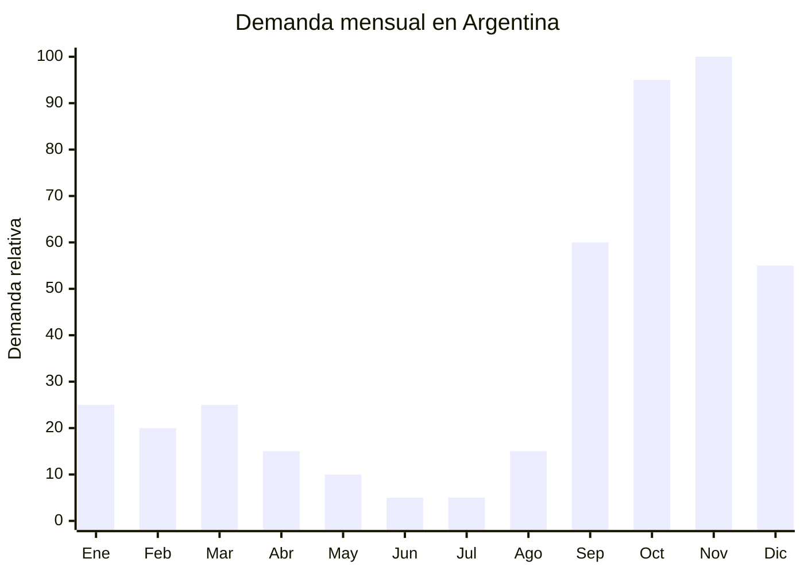

# Canastas de mimbre y ratan decoracion exterior

> **Capitulo NCM 46** — Manufacturas de esparteria o cesteria | **Temporada:** Primavera (Sep-Nov)

## Que es y por que importarlo

Las canastas de mimbre y ratan para exterior abarcan una familia de productos artesanales-decorativos: porta macetas tejidos en ratan natural o sintetico, canastas de picnic con tapa y manija, cestos decorativos para jardin y terraza, y contenedores de plantas colgantes. Estos productos combinan funcionalidad con una estetica calida y natural que esta en tendencia en la decoracion tanto de interiores como de exteriores.

La primavera en Argentina marca el inicio de la temporada de vida al aire libre. Los argentinos renuevan balcones, terrazas y jardines con elementos decorativos que transmitan calidez y naturalidad. Las canastas de mimbre y ratan cumplen este rol perfectamente: como porta macetas elevan una planta comun en un elemento decorativo, como canastas de picnic acompanan las salidas al aire libre que se multiplican con el buen clima, y como cestos decorativos complementan la estetica boho/rustica que domina las tendencias de decoracion.

China (especialmente la provincia de Shandong, Linyi y Guangxi) concentra la produccion mundial de cesteria y productos de mimbre/ratan. Los costos FOB son accesibles (USD 2-8 por pieza), el producto no requiere certificaciones especiales, y los margenes de venta son amplios gracias al alto valor percibido de lo artesanal/natural. El principal desafio logistico es la fragilidad y el volumen, ya que las canastas son productos huecos y delicados que necesitan embalaje cuidadoso.

## Datos clave

| Dato | Valor |
|------|-------|
| **FOB tipico (China)** | USD 2 — 8/unidad |
| **Precio venta Argentina** | ARS 8.000 — 35.000 |
| **Margen estimado** | 200 — 400% |
| **MOQ habitual** | 50 — 300 unidades |
| **Peso/volumen** | 0.3 — 1.5 kg / 0.005 — 0.03 cbm aprox. |
| **Pico de demanda** | Septiembre — Noviembre |
| **Origen principal** | Shandong (Linyi) / Guangxi, China |

## Demanda y mercado en Argentina

- **Volumen de mercado:** Nicho estable con crecimiento moderado. Las canastas de mimbre y ratan tienen presencia solida en MercadoLibre tanto en la categoria de decoracion como en jardineria.
- **Tendencia:** Creciente. La estetica boho, rustica y natural domina las tendencias de decoracion en Argentina. Las canastas de fibra natural son un elemento clave de este estilo.
- **Perfil del comprador:** Mujeres de 25-50 interesadas en decoracion, amantes de lo artesanal y natural. Tambien floristas, organizadores de eventos y comercios de decoracion.
- **Canales de venta principales:** MercadoLibre, tiendas de decoracion, floristerias, venta mayorista a bazares de decoracion.

<Note>
Las canastas de mimbre/ratan tienen un uso dual que potencia las ventas: funcionan como **porta maceta decorativo** (uso permanente) y como **canasta de picnic** (uso estacional primavera-verano). Esto amplía la base de compradores y reduce la estacionalidad del producto.
</Note>

## Variantes y subtipos mas comunes

| Variante | Descripcion | FOB referencia |
|----------|-------------|----------------|
| Porta maceta mimbre (20-25cm) | Canasta tejida para cubrir maceta plastica, con o sin asas | USD 2 — 3 |
| Porta maceta ratan sintetico (PE) | Resistente a intemperie, aspecto natural, varios tamanos | USD 3 — 5 |
| Canasta picnic con tapa (2 personas) | Mimbre con cierre, forro textil interior, manija | USD 5 — 8 |
| Cesto decorativo jardin grande (40cm+) | Para almacenamiento, lena, cojines exterior | USD 4 — 7 |
| Canasta colgante para plantas | Con cadena o cuerda, para colgar macetas | USD 2 — 4 |
| Set canastas decorativas x3 | 3 tamanos diferentes, apilables | USD 4 — 7 |
| Bandeja ratan rectangular | Bandeja decorativa para mesa de jardin | USD 2 — 4 |

## Regulaciones y requisitos

<Tabs>
  <Tab title="Certificaciones">
    | Organismo | Requiere | Detalle | Costo aprox. | Tiempo aprox. |
    |-----------|----------|---------|-------------|--------------|
    | ARCA (Aduana) | Si siempre | Despacho de importacion estandar | — | — |
    | SENASA | **Posible** | Si usa mimbre/ratan natural sin procesar, puede requerir certificado fitosanitario. Ratan sintetico (PE): no aplica | — | — |
    | ANMAT | No | No aplica | — | — |
    | ENACOM | No | No aplica | — | — |
    | INTI | No | No aplica | — | — |

    **Nota sobre SENASA:** El mimbre y ratan natural son materiales vegetales. Si bien los productos terminados (tejidos, barnizados) generalmente no requieren fumigacion, SENASA puede solicitar certificado fitosanitario de origen que acredite que el material fue tratado (secado, desinfectado). Consultar con el despachante de aduanas antes del envio. Los productos de ratan sintetico (PE/PP trenzado tipo ratan) no tienen esta restriccion.
  </Tab>

  <Tab title="Etiquetado">
    | Requisito | Aplica |
    |-----------|--------|
    | Idioma espanol | Recomendado |
    | Datos del importador | Si (razon social, CUIT) |
    | Material / composicion | Si (ratan natural, mimbre, ratan sintetico PE) |
    | Pais de origen | Si |
    | Instrucciones de cuidado | Recomendado (como limpiar, evitar humedad excesiva si es natural) |
  </Tab>

  <Tab title="Restricciones">
    Sin antidumping ni cupos para productos de cesteria de mimbre/ratan.

    **Consideracion:** Algunos paises tienen restricciones de importacion de ratan natural (CITES no lista ratan como especie protegida, pero las politicas de Indonesia y otros paises productores pueden afectar la oferta). China procesa ratan importado del sudeste asiatico, por lo que es importante verificar la trazabilidad del material con el proveedor.
  </Tab>
</Tabs>

## Logistica de importacion

| Aspecto | Detalle |
|---------|---------|
| **Metodo recomendado** | Maritimo LCL (producto voluminoso y liviano) |
| **Tiempo total estimado** | 8 — 12 semanas (maritimo) |
| **Embalaje tipico** | Canastas anidadas (chicas dentro de grandes) + proteccion de papel kraft + caja master |
| **Tip logistico** | Negociar con el proveedor que anide las canastas y use el espacio interior para colocar productos mas chicos. Una canasta grande puede contener 2-3 canastas medianas y varias chicas. Esto reduce el CBM drasticamente |

<Tip>
Las canastas de **ratan sintetico (PE)** son una alternativa superior para uso exterior en Argentina. No se pudren con la lluvia, no se deforman con la humedad, no requieren certificado fitosanitario y tienen un aspecto casi identico al ratan natural. El costo FOB es ligeramente mayor (USD 1-2 mas por pieza) pero eliminan problemas de durabilidad y regulatorios.
</Tip>

## Estacionalidad y timing de compra

| Momento | Accion recomendada |
|---------|-------------------|
| Mayo — Junio | Investigar proveedores en Shandong/Guangxi. Pedir muestras de diferentes tejidos |
| Julio | Confirmar orden. Priorizar canastas anidables para optimizar flete |
| Agosto | Envio maritimo. Preparar fotos con styling de jardin/terraza |
| Septiembre | Inicio temporada. Lanzar publicaciones con fotos lifestyle |
| Octubre — Noviembre | Pico de ventas. Dia de la Madre (canasta + planta = regalo). Picnics de primavera |
| Diciembre | Navidad: canastas como empaque de regalos gourmet artesanales |

## Ventajas y riesgos

<CardGroup cols={2}>
  <Card title="Ventajas" icon="circle-check">
    - Alto valor percibido (artesanal, natural, calido)
    - Margenes amplios (200-400%)
    - Tendencia decoracion boho/natural en crecimiento
    - Multiples usos: porta maceta, picnic, decoracion, almacenamiento
    - Producto anidable para optimizar flete
    - Canasta como packaging de otros productos (sets regalo gourmet)
    - Sin regulacion compleja
  </Card>
  <Card title="Riesgos" icon="triangle-exclamation">
    - Producto fragil: riesgo de deformacion en transporte
    - Mimbre/ratan natural se pudre con humedad excesiva
    - SENASA puede solicitar certificado fitosanitario para material natural
    - Alto CBM en relacion al peso
    - Competencia de productores artesanales locales
    - Moda/tendencia puede cambiar (aunque el estilo natural es bastante atemporal)
  </Card>
</CardGroup>

<Warning>
Las canastas de ratan natural son sensibles a la humedad. Si se almacenan en depositos humedos o se exponen a lluvia directa, se deforman, pierden color y pueden generar moho. **Almacenar siempre en lugar seco y ventilado.** Para uso exterior permanente, recomendar al cliente las versiones de ratan sintetico (PE). Incluir instrucciones de cuidado con el producto para reducir reclamos.
</Warning>

## Palabras clave para buscar en Alibaba

> wicker basket wholesale, rattan planter basket, rattan flower pot cover, picnic basket wicker, garden basket rattan, wicker storage basket outdoor, PE rattan planter, hanging plant basket wicker, rattan basket set wholesale, woven basket garden

## Fuentes

- [MercadoLibre Argentina — Canastas mimbre decoracion](https://listado.mercadolibre.com.ar/canasta-mimbre)
- [Alibaba — Wicker basket wholesale](https://www.alibaba.com/showroom/wicker-basket.html)
- [Alibaba — Rattan planter wholesale](https://www.alibaba.com/showroom/rattan-planter.html)
