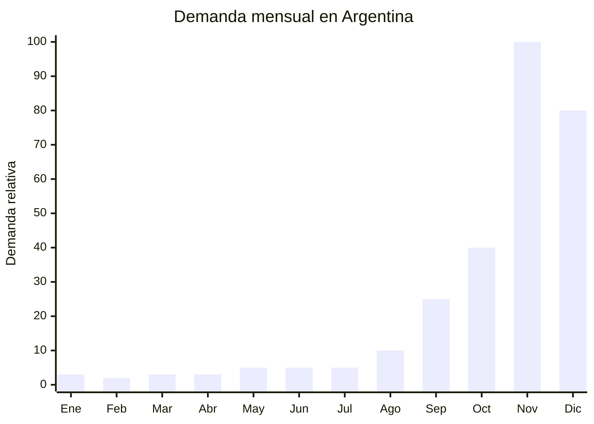

# Packaging y cajas regalo navidenas

> **Capitulo NCM 48** — Papel y carton; manufacturas de pasta de celulosa, de papel o de carton | **Temporada:** Primavera (Sep-Nov)

## Que es y por que importarlo

El packaging navideno abarca todo el material de empaque y presentacion asociado a la temporada de fiestas: cajas de regalo con cierre magnetico (rigid box), cajas plegables de carton con disenos navidenos, papel de regalo tematico en rollos y pliegos, bolsas de regalo de papel con manija, cintas, monos y accesorios decorativos. Estos productos son consumibles de temporada: se usan una vez y se descartan, lo que genera demanda recurrente cada ano.

La Navidad en Argentina mueve un volumen enorme de regalos, y cada regalo necesita empaque. El 80% de los compradores busca packaging especifico de Navidad (rojo, verde, dorado, motivos navidenos) en lugar de packaging generico. El pico de compra de packaging es noviembre (anticipacion a Navidad y CyberMonday), y la demanda se mantiene fuerte hasta la tercera semana de diciembre. Yiwu (Zhejiang) es la capital mundial de packaging y articulos de temporada, con una escala de produccion que permite costos unitarios extremadamente bajos.

La oportunidad de negocio es excepcional por la combinacion de tres factores: costo FOB minimo (desde USD 0.10 por unidad), peso ultraliviano (bajo costo de flete), y margen altisimo (una caja de USD 0.30 se vende a ARS 1.500-3.000). Ademas, el packaging navideno no requiere ninguna certificacion ni regulacion especial en Argentina. Los clientes principales son comercios minoristas, emprendedores que arman boxes navideñas, empresas que hacen regalos corporativos y consumidores finales que compran para envolver sus propios regalos.

## Datos clave

| Dato | Valor |
|------|-------|
| **FOB tipico (China)** | USD 0.10 — 1/unidad |
| **Precio venta Argentina** | ARS 500 — 5.000/unidad (o ARS 3.000 — 15.000 por pack) |
| **Margen estimado** | 300 — 800% |
| **MOQ habitual** | 500 — 5.000 unidades (por diseno) |
| **Peso/volumen** | 0.01 — 0.3 kg/u / ultraliviano |
| **Pico de demanda** | Noviembre (pico) — Diciembre |
| **Origen principal** | Yiwu (Zhejiang), China |

## Demanda y mercado en Argentina

- **Volumen de mercado:** Mercado masivo. Todo regalo necesita empaque, y el 80% de los consumidores prefiere packaging tematico navideno en noviembre-diciembre. La demanda es predecible y recurrente.
- **Tendencia:** Estable con crecimiento. El auge del e-commerce y los emprendimientos de boxes navideñas (cajas con productos gourmet, artesanales, etc.) impulsa la demanda de packaging de calidad.
- **Perfil del comprador:** Comercios minoristas que necesitan stock de temporada, emprendedores de boxes y gift boxes, empresas que arman regalos corporativos, consumidores finales.
- **Canales de venta principales:** MercadoLibre (mayorista y minorista), venta directa B2B a comercios, Instagram, ferias navidenas.

<Note>
El packaging navideno es el **producto complementario perfecto** para otros articulos de esta guia. Si importas sets de maquillaje, perfumes o sets de spa, necesitas cajas de regalo para presentarlos. Comprar packaging y productos en el mismo envio optimiza costos de flete y genera un negocio integrado.
</Note>

## Variantes y subtipos mas comunes

| Variante | Descripcion | FOB referencia |
|----------|-------------|----------------|
| Caja magnetica rigida (rigid box) | Caja premium con cierre iman, acabado laminado mate/brillante | USD 0.50 — 1.00 |
| Caja plegable carton navidena | Armable, diseno navideno impreso, varios tamanos | USD 0.15 — 0.40 |
| Papel regalo navideño rollo (70cm x 3m) | Papel impreso con motivos navidenos, pack de 3-5 rollos | USD 0.10 — 0.30/rollo |
| Bolsa regalo papel con manija | Varios tamanos, estampado navideno, manija de cordon | USD 0.10 — 0.25 |
| Kit packaging navideño | Caja + papel de seda + moño + tarjeta | USD 0.30 — 0.60 |
| Tags y tarjetas navideñas (pack x50) | Tarjetas con cordon para identificar regalos | USD 0.05 — 0.15/pack |
| Cinta decorativa navidena (rollo 25m) | Raso, organza o grosgrain con estampado navideno | USD 0.10 — 0.20/rollo |

## Regulaciones y requisitos

<Tabs>
  <Tab title="Certificaciones">
    | Organismo | Requiere | Detalle | Costo aprox. | Tiempo aprox. |
    |-----------|----------|---------|-------------|--------------|
    | ARCA (Aduana) | Si siempre | Despacho de importacion estandar | — | — |
    | ANMAT | No | No es producto cosmetico ni alimentario | — | — |
    | ENACOM | No | No es electronico | — | — |
    | INTI | No | No aplica | — | — |

    **Sin regulacion especifica.** El packaging de papel y carton no requiere certificaciones adicionales. Es uno de los productos con menor barrera regulatoria existente.
  </Tab>

  <Tab title="Etiquetado">
    | Requisito | Aplica |
    |-----------|--------|
    | Idioma espanol | No obligatorio (es packaging decorativo) |
    | Datos del importador | Si (en caja master o etiqueta de lote) |
    | Material / composicion | Recomendado (papel, carton, indicar si es reciclable) |
    | Pais de origen | Si |

    **Consejo de venta:** Etiquetar como "reciclable" o "papel certificado FSC" agrega valor percibido y justifica un precio premium. Solicitar al proveedor certificado de material reciclable si corresponde.
  </Tab>

  <Tab title="Restricciones">
    Sin restricciones especiales. No hay antidumping, licencias previas ni cupos para productos de papel/carton de empaque decorativo.

    **Nota:** El papel de regalo con acabado metalizado o brillante puede contener laminado plastico que lo hace NO reciclable. Si se quiere posicionar como producto ecologico, verificar la composicion con el proveedor.
  </Tab>
</Tabs>

## Logistica de importacion

| Aspecto | Detalle |
|---------|---------|
| **Metodo recomendado** | Maritimo LCL (ultraliviano, se puede combinar con otros productos para optimizar contenedor) |
| **Tiempo total estimado** | 8 — 12 semanas (maritimo) / 3 — 4 semanas (aereo) |
| **Embalaje tipico** | Cajas flat-pack en paquetes de 50-100 unidades + caja master en pallet |
| **Tip logistico** | El packaging navideno es el producto ideal para "rellenar" espacio en envios maritimos de otros productos mas pesados. Combinar con productos de jardineria, decoracion u otros articulos de esta guia para maximizar el uso del CBM contratado |

<Tip>
Comprar packaging navideno es una oportunidad de **compra anticipada con timing critico**. Si llegas tarde (diciembre), ya no vendes. La ventana de venta es de apenas 6-8 semanas (noviembre a mediados de diciembre). Pero si acertas con los disenos y llegas a tiempo, el margen (300-800%) compensa ampliamente la estacionalidad. Hacer el pedido en junio-julio para envio maritimo.
</Tip>

## Estacionalidad y timing de compra

| Momento | Accion recomendada |
|---------|-------------------|
| Mayo — Junio | Seleccionar disenos navidenos. Definir variedad de tamanos y estilos |
| Junio — Julio | Confirmar orden en Yiwu. Envio maritimo (es critico no retrasarse) |
| Agosto — Septiembre | Recepcion de mercaderia. Armado de packs y kits combinados |
| Octubre | Pre-venta a comercios minoristas y emprendedores (venta mayorista B2B) |
| Noviembre | Pico de ventas. CyberMonday. Venta a consumidor final en ML |
| Diciembre (1ra-3ra semana) | Ultimas ventas. Despues de semana 3 la demanda cae a cero |
| Post-Navidad | Liquidar remanente a precio de costo. No almacenar para el anio siguiente (los disenos cambian) |

## Ventajas y riesgos

<CardGroup cols={2}>
  <Card title="Ventajas" icon="circle-check">
    - Margen extraordinario (300-800%)
    - Costo FOB minimo (desde USD 0.10)
    - Producto ultraliviano (bajo costo de flete)
    - Sin regulacion: importacion directa sin tramites
    - Demanda masiva y predecible (Navidad)
    - Ideal para venta mayorista B2B a comercios
    - Combinable con otros productos como agregado de valor
    - Yiwu ofrece variedad infinita de disenos
  </Card>
  <Card title="Riesgos" icon="triangle-exclamation">
    - Estacionalidad extrema: ventana de venta de 6-8 semanas
    - Timing critico: llegar tarde = stock muerto
    - MOQs altos por diseno (500-5.000 unidades)
    - Disenos no se reusan al anio siguiente (tendencias cambian)
    - Competencia con bazares y mayoristas locales
    - Calidad de impresion variable (colores pueden no coincidir con muestra)
    - Producto sensible a humedad (papel se mancha, se ondula)
  </Card>
</CardGroup>

<Warning>
El timing es TODO en packaging navideno. Un envio que llega despues del 20 de noviembre pone en riesgo la temporada. Un envio que llega despues del 10 de diciembre es un desastre. **Planificar el envio maritimo para que llegue a deposito a mas tardar el 15 de octubre**, dando margen para despacho aduanero, distribucion y armado de publicaciones. Si hay cualquier riesgo de demora, considerar envio aereo para al menos parte del pedido.
</Warning>

## Palabras clave para buscar en Alibaba

> christmas gift box wholesale, magnetic gift box christmas, christmas wrapping paper roll, christmas paper bag wholesale, christmas packaging box, christmas gift bag wholesale, rigid box christmas, christmas tissue paper, christmas ribbon wholesale, gift box set christmas Yiwu

## Fuentes

- [MercadoLibre Argentina — Cajas regalo navidenas](https://listado.mercadolibre.com.ar/cajas-regalo-navidad)
- [Alibaba — Christmas gift box wholesale](https://www.alibaba.com/showroom/christmas-gift-box.html)
- [Yiwu Christmas Market Guide](https://www.alibaba.com/showroom/yiwu-christmas.html)
