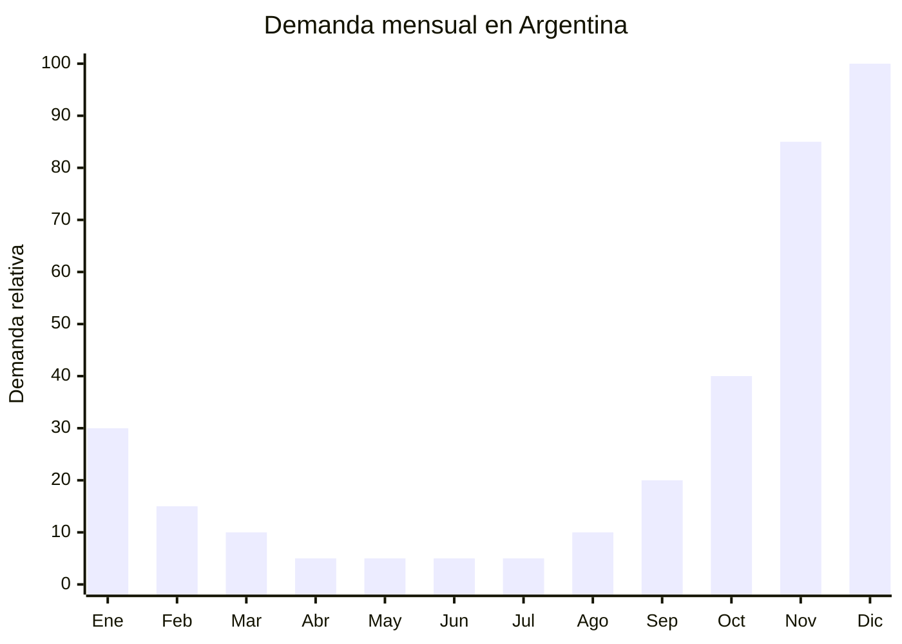

# Planners y agendas 2026 — Venta anticipada noviembre

> **Capítulo NCM 49** — Productos editoriales, de la prensa e industrias gráficas | **Temporada:** Primavera (Sep–Nov)

## Qué es y por qué importarlo

Los planners y agendas 2026 son productos de papelería premium que incluyen planificadores semanales, bullet journals y agendas anuales con tapa dura en formato A5. Se importan durante la primavera para aprovechar la ventana de venta anticipada que comienza en noviembre, cuando los consumidores argentinos empiezan a planificar el año siguiente y buscan regalos para las fiestas de fin de año.

El mercado argentino de planners ha crecido significativamente impulsado por la tendencia del journaling y la planificación personal. Las redes sociales (Instagram, TikTok) han popularizado los bullet journals decorados, creando una comunidad activa de compradores recurrentes. China (especialmente Yiwu y Shenzhen) produce planners de alta calidad con tapa dura, papel de 120g+ y acabados premium a una fracción del costo local.

La ventaja competitiva clave es el **arancel 0%** que aplica a libros e impresos dentro del MERCOSUR, lo que convierte a este producto en uno de los más rentables para importar. La combinación de costo bajo, cero aranceles y alta demanda estacional genera márgenes excepcionales.

## Datos clave

| Dato | Valor |
|------|-------|
| **FOB típico (China)** | USD 1.00 — 5.00/unidad |
| **Precio venta Argentina** | ARS 8.000 — 25.000 |
| **Margen estimado** | 300% — 500% |
| **MOQ habitual** | 200 — 1.000 unidades |
| **Peso/volumen** | 0.30 — 0.50 kg / 0.002 cbm aprox. por unidad |
| **Pico de demanda** | Noviembre — Diciembre |
| **Origen principal** | Yiwu / Shenzhen, China |

## Variantes y subtipos más comunes

| Variante | Descripción | FOB referencia |
|----------|-------------|----------------|
| Planner semanal A5 tapa dura | 52 semanas, espiral o cosido, papel 100-120g | USD 2.00 — 4.00 |
| Bullet journal punteado A5 | 160+ páginas punteadas, tapa PU leather | USD 1.50 — 3.50 |
| Agenda diaria 2026 A5 | Un día por página, tapa dura, cinta marcadora | USD 2.50 — 5.00 |
| Planner mensual compacto A6 | 12 meses, bolsillo, tapa blanda premium | USD 1.00 — 2.00 |
| Set planner + stickers + washi tape | Kit completo para journaling | USD 3.00 — 5.00 |

## Regulaciones y requisitos

<Tabs>
  <Tab title="Certificaciones">
    **Sin certificaciones especiales requeridas.** Los planners y agendas clasifican como productos editoriales/impresos dentro del Capítulo 49 del NCM. No requieren certificación IRAM, ANMAT ni ENACOM.

    | Requisito | Obligatorio | Detalle |
    |-----------|-------------|---------|
    | Certificación IRAM | No | No aplica a productos editoriales |
    | Registro ANMAT | No | No es producto sanitario |
    | Homologación ENACOM | No | No tiene componente electrónico |
  </Tab>
  <Tab title="Etiquetado">
    Etiquetado estándar de importación:
    - Datos del importador (razón social, CUIT)
    - País de origen ("Made in China / Hecho en China")
    - Contenido en español (días de la semana, meses, feriados argentinos)

    <Warning>
    **Contenido en español obligatorio.** Los planners deben tener días, meses y cualquier texto en español rioplatense. Incluir feriados argentinos 2026. Solicitar al proveedor chino el archivo de diseño personalizado antes de producir.
    </Warning>
  </Tab>
  <Tab title="Restricciones">
    **Arancel 0% para libros e impresos** bajo régimen MERCOSUR (partida 4820.10.00 y relacionadas del Cap 49). Esta exención aplica a agendas, planificadores y productos similares clasificados como artículos de papelería impresos.

    - Sin derechos antidumping
    - Sin cuotas de importación
    - Sin restricciones especiales
    - Tasa estadística: 3%
  </Tab>
</Tabs>

## Logística de importación

| Aspecto | Detalle |
|---------|---------|
| **Método recomendado** | Marítimo LCL (pedidos < 500 uds) / FCL 20' (pedidos > 2.000 uds) |
| **Tiempo total estimado** | 50 — 75 días (marítimo) / 20 — 30 días (aéreo) |
| **Embalaje típico** | Cajas de cartón corrugado, 20-50 unidades por caja, shrink wrap individual |
| **Tip logístico** | Producto pesado por volumen. Un pallet cabe ~1.500 agendas A5. Considerar aéreo para pedidos urgentes de noviembre |

<Tip>
Para venta anticipada en noviembre, el pedido debe salir de China **a más tardar en agosto** si es marítimo. Si perdiste esa ventana, el envío aéreo (15-20 días) es viable porque el margen alto del producto lo absorbe. Un planner de USD 3 FOB se vende a ARS 15.000+.
</Tip>

## Estacionalidad y timing de compra

| Momento | Acción recomendada |
|---------|-------------------|
| Junio — Julio | Contactar proveedores, seleccionar diseños, enviar arte en español |
| Agosto | Producción y embarque marítimo |
| Septiembre — Octubre | Recepción, etiquetado, armado de publicaciones |
| Noviembre | **Lanzamiento venta anticipada** — pico de demanda |
| Diciembre | Venta fuerte como regalo de fin de año |
| Enero | Última ventana de venta (inicio de año) |

## Ventajas y riesgos

<CardGroup cols={2}>
  <Card title="Ventajas" icon="circle-check">
    - Arancel 0% en MERCOSUR (margen excepcional)
    - Producto liviano y fácil de almacenar
    - Alta personalización con marca propia
    - Tendencia journaling en crecimiento
    - Compra recurrente anual (cada año se renueva)
  </Card>
  <Card title="Riesgos" icon="triangle-exclamation">
    - Producto perecedero: agenda 2026 no sirve en 2027
    - Requiere contenido 100% en español (feriados, formato fecha)
    - Errores de traducción o feriados incorrectos = producto invendible
    - Ventana de venta corta (nov-ene)
    - Stock sobrante pierde todo valor después de marzo
  </Card>
</CardGroup>

## Palabras clave para buscar en Alibaba

> 2026 planner A5 hardcover, weekly planner journal, bullet journal dotted notebook, PU leather planner, custom planner printing, agenda diary 2026, planner sticker set, spiral bound planner wholesale

## Fuentes

- [MercadoLibre Argentina — Planners y agendas](https://listado.mercadolibre.com.ar/planner-2026)
- [Alibaba — Custom planner printing](https://www.alibaba.com/showroom/custom-planner-printing.html)
- [Nomenclatura Común del MERCOSUR — Capítulo 49](https://www.argentina.gob.ar/tema/comercio-exterior)
