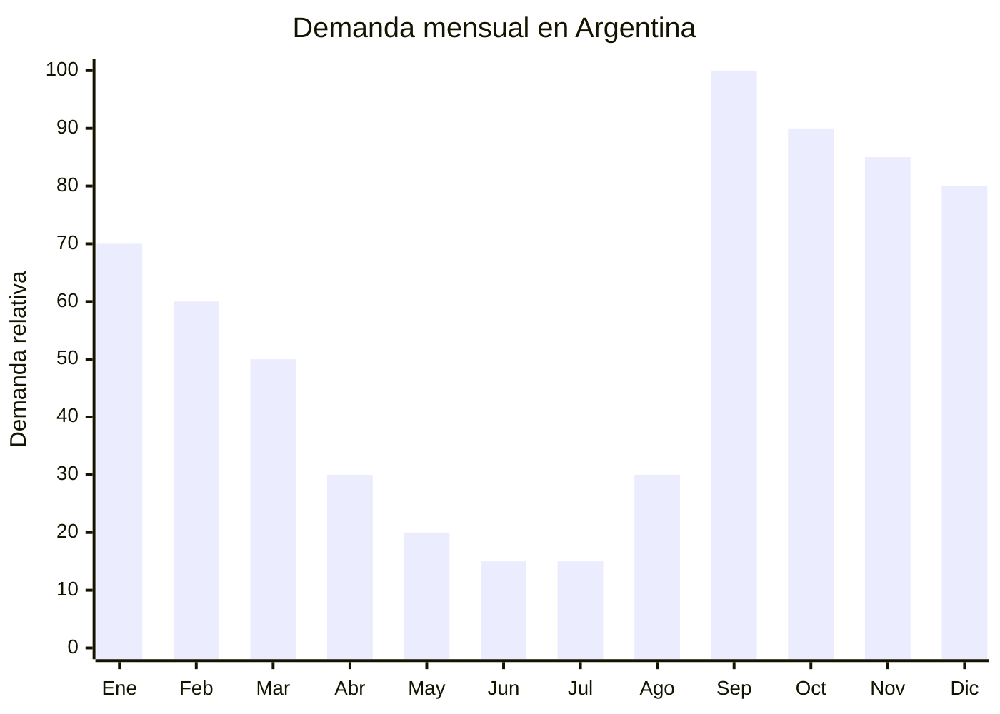

# Packs remeras básicas manga corta hombre/mujer

> **Capítulo NCM 61** — Prendas y complementos de vestir, de punto | **Temporada:** Primavera (Sep–Nov)

<Warning>
**ANTIDUMPING VIGENTE sobre textiles Cap 61 de China.** Los derechos antidumping son **adicionales** al arancel base. El Decreto 236/2025 redujo el arancel base (DIE) de 35% a 20%, pero el antidumping **sigue vigente por separado** y puede sumar entre USD 2 y USD 8 por kg según la posición NCM. Verificar siempre el NCM exacto en la [CNCE](https://www.argentina.gob.ar/cnce/investigaciones/medidasvigentes).
</Warning>

## Qué es y por qué importarlo

Los packs de remeras básicas de algodón son el producto textil más vendido de Argentina en primavera. Según datos de Nubimetrics, las remeras básicas son el **producto #1 en ventas durante septiembre**, coincidiendo con el inicio de la temporada cálida y la renovación de guardarropas.

Se trata de packs de 3 o 5 remeras lisas de algodón 180g (o mezcla algodón/poliéster), manga corta, cuello redondo, en colores básicos (blanco, negro, gris, azul marino). El formato pack ofrece mejor precio por unidad y es el más buscado en MercadoLibre.

China continental (Guangdong, Zhejiang) produce remeras básicas a escala masiva con costos FOB de USD 1.50-3.00 por remera. La demanda en Argentina es enorme y constante, pero el importador debe calcular cuidadosamente el impacto del antidumping en su estructura de costos para no perder margen.

## Datos clave

| Dato | Valor |
|------|-------|
| **FOB típico (China)** | USD 1.50 — 3.00/remera |
| **Precio venta Argentina** | ARS 5.000 — 12.000/remera (ARS 15.000 — 35.000/pack x3) |
| **Margen estimado** | 80% — 180% (variable por antidumping) |
| **MOQ habitual** | 300 — 1.000 unidades por color/talle |
| **Peso/volumen** | 0.18 — 0.22 kg/remera / 0.003 cbm aprox. |
| **Pico de demanda** | Septiembre — Noviembre |
| **Origen principal** | Guangzhou / Shaoxing, China |

## Variantes y subtipos más comunes

| Variante | Descripción | FOB referencia |
|----------|-------------|----------------|
| Pack x3 remeras algodón 180g hombre | Cuello redondo, colores básicos, S-XXL | USD 4.50 — 7.50/pack |
| Pack x5 remeras algodón 180g hombre | Colores surtidos, S-XXL | USD 7.50 — 12.00/pack |
| Pack x3 remeras mujer entalladas | Cuello redondo, corte femenino, S-XL | USD 4.00 — 7.00/pack |
| Remera básica algodón/poliéster 65/35 | Más económica, secado rápido | USD 1.50 — 2.00/unidad |
| Remera premium pima/supima 200g | Algodón premium, tacto superior | USD 2.50 — 3.00/unidad |

## Regulaciones y requisitos

<Tabs>
  <Tab title="Certificaciones">
    | Requisito | Obligatorio | Detalle |
    |-----------|-------------|---------|
    | Etiquetado textil IRAM 12560 | **Sí** | Composición de fibra (%), talle, origen, importador, lavado |
    | Antidumping CNCE | **Verificar NCM** | Derechos adicionales al arancel base |
    | Certificado de origen | Recomendado | Para acreditar origen y calcular antidumping |
  </Tab>
  <Tab title="Etiquetado">
    **Obligatorio (Res. 287/2000):**
    - Composición de fibra con porcentajes exactos (ej: "100% Algodón" o "65% Poliéster, 35% Algodón")
    - Talle en sistema argentino (S, M, L, XL, XXL)
    - Instrucciones de conservación con símbolos internacionales
    - País de origen
    - Razón social e identificación fiscal del importador

    <Warning>
    El incumplimiento del etiquetado textil genera **retención en aduana** y costos de almacenaje. Las etiquetas deben estar cosidas a la prenda ANTES del embarque. No se acepta etiquetado adhesivo.
    </Warning>
  </Tab>
  <Tab title="Restricciones">
    **Antidumping Cap 61 textiles chinos:**
    - Derechos antidumping vigentes sobre prendas de punto de China
    - El monto varía según posición NCM exacta (puede ser ad valorem o específico en USD/kg)
    - **Decreto 236/2025:** Redujo el arancel base (DIE) de 35% a 20%, mejorando competitividad
    - El antidumping es **independiente** de la reducción arancelaria y se suma al DIE
    - Consultar siempre la CNCE antes de importar

    <Note>
    **Estrategia alternativa:** Considerar proveedores en Bangladesh o Vietnam, que no tienen antidumping vigente y producen remeras de algodón a precios competitivos.
    </Note>
  </Tab>
</Tabs>

## Logística de importación

| Aspecto | Detalle |
|---------|---------|
| **Método recomendado** | Marítimo LCL (< 1.000 uds) / FCL 20' (5.000+ uds) |
| **Tiempo total estimado** | 50 — 80 días (marítimo) |
| **Embalaje típico** | Packs en bolsa de polietileno, cajas de 50-100 remeras, palletizado |
| **Tip logístico** | Las remeras se comprimen bien. Un FCL 20' puede cargar 15.000-20.000 remeras. Solicitar embalaje al vacío para optimizar volumen |

<Tip>
Pedí muestras de **al menos 3 proveedores** antes de comprar. Las remeras de algodón 180g de China varían mucho en calidad de tela y terminación. Verificar: que no se deforme después de 3 lavados, que el cuello no se estire, y que el gramaje real sea el declarado (muchos proveedores declaran 180g pero envían 150g).
</Tip>

## Estacionalidad y timing de compra

| Momento | Acción recomendada |
|---------|-------------------|
| Mayo — Junio | Contactar proveedores, solicitar muestras, negociar precios |
| Julio | Confirmar orden, producción (30-45 días) |
| Agosto | Embarque marítimo |
| Septiembre | **Pico #1 de ventas** — inicio temporada cálida |
| Octubre — Noviembre | Ventas sostenidas + CyberMonday |
| Diciembre — Febrero | Temporada alta verano, segunda ola de demanda |

## Ventajas y riesgos

<CardGroup cols={2}>
  <Card title="Ventajas" icon="circle-check">
    - Producto #1 en ventas septiembre (Nubimetrics)
    - Demanda masiva y constante
    - Formato pack genera ticket promedio alto
    - Producto liviano (flete eficiente)
    - Decreto 236/2025 redujo arancel base a 20%
  </Card>
  <Card title="Riesgos" icon="triangle-exclamation">
    - **Antidumping puede destruir el margen**
    - Etiquetado textil obligatorio estricto
    - Problemas de talles (adaptación argentina)
    - Competencia alta (miles de vendedores)
    - Calidad inconsistente entre proveedores chinos
  </Card>
</CardGroup>

## Palabras clave para buscar en Alibaba

> plain cotton t-shirt 180gsm, blank t-shirt wholesale, pack basic t-shirt, cotton crew neck tee, bulk plain tshirt, men basic tee 100% cotton, women fitted t-shirt blank, t-shirt 180g combed cotton

## Fuentes

- [Nubimetrics — Productos más vendidos septiembre](https://www.nubimetrics.com)
- [MercadoLibre Argentina — Pack remeras básicas](https://listado.mercadolibre.com.ar/pack-remeras-basicas)
- [CNCE — Medidas antidumping vigentes](https://www.argentina.gob.ar/cnce/investigaciones/medidasvigentes)
- [Decreto 236/2025 — Reducción arancelaria](https://www.argentina.gob.ar/normativa)
